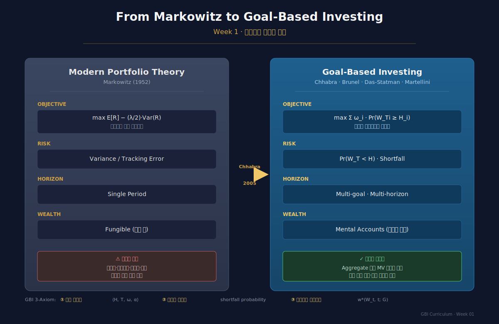
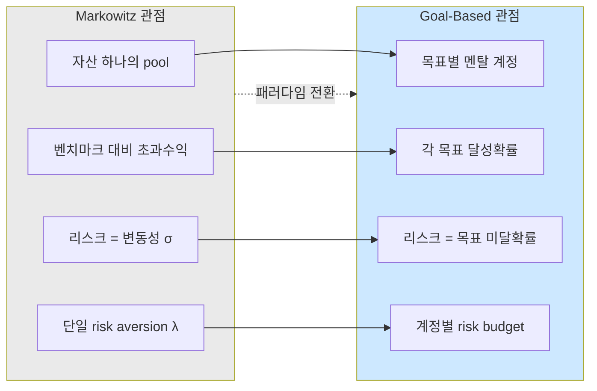
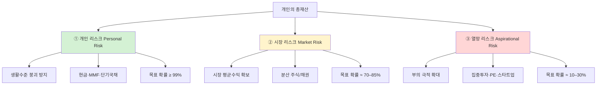
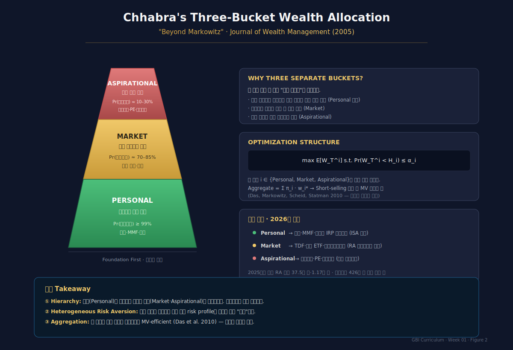
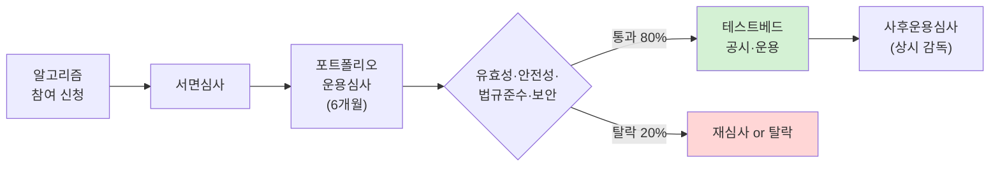

# Week 1 · 왜 GBI인가 — 전통 MPT의 한계와 패러다임 전환

> **핵심 질문**
> (1) 왜 Markowitz의 MPT가 개인·가계 자산운용 현장에서 50년 넘게 "이론적 정답"으로 존재했음에도, 실제 부(wealth)를 관리하는 방식과 괴리되어 있는가?
> (2) GBI는 MPT의 폐기인가, 확장인가, 재해석인가?
> (3) 한국의 연금·퇴직연금·로보어드바이저 생태계는 이 패러다임 전환의 어디쯤 서 있는가?

---

## 0. Overview — 3시간 강의 로드맵

### 이 주차의 인포그래픽
- **Figure 1** (§2 말미): MPT→GBI 패러다임 전환 4축 비교
- **Figure 2** (§3 말미): Chhabra 3-bucket 피라미드와 한국 적용

### 강의 구성

| 구간 | 시간 | 내용 |
|---|---|---|
| §1 | 20분 | Opening vignette: 두 투자자의 이야기 |
| §2 | 30분 | MPT의 철학적 가정과 그 구조적 한계 |
| §3 | 40분 | 전환점 — Chhabra(2005)와 "Beyond Markowitz" |
| §4 | 30분 | GBI의 3대 공리(axiom)와 리스크 재정의 |
| §5 | 30분 | 한국 사례: 코스콤 RA 테스트베드·미래에셋 TDF·KB 케이봇쌤 |
| §6 | 20분 | 케이스 토론: Yale Endowment의 goal-based framing |
| §7 | 10분 | 과제·다음 주 예고 |

---

## §1. Opening — 두 투자자의 이야기 (20 min)

### 1.1 Investor A — "I want to beat the KOSPI"
40대 후반, 연봉 1.2억, 퇴직연금 DC 3억. 증권사 PB의 권유로 "공격형 포트폴리오 (주식 70% / 채권 30%)" 가입. 투자 의사결정 기준은 **매월 KOSPI 대비 수익률**. 2022년 KOSPI가 -24.9%를 기록했을 때 본인 포트폴리오도 -22%. "벤치마크보다 나았다"는 설명에도 불구하고, 본인은 **자녀 대학 등록금 시점이 2년 후**임을 떠올리며 공황 매도.

### 1.2 Investor B — "I want to make sure my son goes to college in 2028"
같은 40대 후반, 동일한 3억 자산. 그러나 계좌를 3개 멘탈 어카운트로 분리: (1) 자녀 대학 등록금 1.5억(4년간 필요) · (2) 본인 은퇴 시점(2040) 목표 5억 · (3) 여유자금 "하고 싶은 것"(해외여행·취미). 각 계정은 **목표 달성 확률**로 모니터링됨. 2022년 같은 하락장에서 자녀 대학자금 계정은 이미 채권·예금 비중이 높아 -6%에 그침. 은퇴계정은 -20%였지만 15년 지평이므로 rebalancing만 수행. 공황 매도 없음.

### 1.3 핵심 질문 — 자산의 금액은 같은데, 왜 행동이 다른가?

자산총액·시장상황은 동일하다. 다른 것은 **"risk"의 정의와 측정 단위**다.

| 구분 | Investor A (MPT형) | Investor B (GBI형) |
|---|---|---|
| 목표 | 벤치마크 대비 초과수익 | 구체적 인생 이벤트 자금 확보 |
| 리스크 | 변동성(σ) / 트래킹에러 | 목표 미달 확률(shortfall prob.) |
| 평가 단위 | 수익률 % | 목표별 funding ratio |
| 감정반응 | 하락장 → 공황 | 하락장 → 긴 호흡 |
| 재조정 | 시장상황 기반 | 목표 달성도(progress) 기반 |

이 한 장의 표가 본 강의 12주 전체의 축소판이다.

*Figure 1 · Markowitz MPT에서 Goal-Based Investing으로의 패러다임 전환. Objective·Risk·Horizon·Wealth 4축에서의 관점 변화와 GBI 3-Axiom.*

---

## §2. MPT의 구조적 한계 (30 min)

### 2.1 Markowitz(1952)의 본래 주장

Markowitz의 기여는 "분산투자가 좋다"가 아니라, **평균-분산 공간에서 효율경계(efficient frontier)를 수학적으로 정의**한 것이다.

$$
\min_w \; \frac{1}{2}\, w^\top \Sigma w \quad \text{s.t. } \mu^\top w = \mu_p,\ w^\top \mathbf{1} = 1
$$

Lagrangian을 풀면 잘 알려진 두-펀드 정리(two-fund separation):
$$
w^* = \Sigma^{-1}\!\left(\lambda_1 \mu + \lambda_2 \mathbf{1}\right)
$$

### 2.2 숨겨진 5대 가정

MPT는 다음 다섯을 "당연하다"고 가정한다. 각 가정이 **개인투자자 현실에서 어떻게 깨지는가**가 GBI의 출발점이다.

#### 가정 A1: 투자자 효용은 **평균·분산만의 함수**
$$
U(W) = \mathbb{E}[W] - \frac{\lambda}{2}\mathrm{Var}(W)
$$

**현실의 균열**: 개인은 "평균보다 낮은 꼬리(lower tail)"를 "평균보다 높은 꼬리"보다 훨씬 크게 평가 (loss aversion, Kahneman-Tversky 1979). 분산은 좌우를 대칭적으로 벌주므로 **상방 불확실성까지 리스크로 취급**한다 — 투자자에겐 "기회"인데 말이다.

#### 가정 A2: 투자자의 **시간지평은 단일**
MPT는 단일기간(single-period) 모델이다.

**현실의 균열**: 가계는 주택(5년) · 교육(10년) · 은퇴(30년) · 상속(무기한)이 **동시에 공존**한다. 위험자산 비중은 각 목표별로 **전혀 달라야** 한다.

#### 가정 A3: 자산은 **완전 대체 가능**(fungible)
1만원은 1만원, 출처와 용도 무관.

**현실의 균열**: Thaler(1985)의 mental accounting — "자녀 교육자금"과 "보너스로 받은 여윳돈"은 심리적으로 다른 돈이다. 나아가 Brunel이 지적한 **두 가지 mental accounting**을 구분해야 한다:
1. **비합리적 편향으로서의 MA**: 신용카드 빚 있는데 저금통에 현금 쌓기
2. **합리적 목표분할로서의 MA**: 목표별 다른 risk profile이 최적이라는 사실

GBI가 이용하는 것은 **후자**이며, 이는 결코 비합리적이지 않다.

#### 가정 A4: **리스크 선호는 상수**
$\lambda$는 하나의 스칼라.

**현실의 균열**: 동일인이 "은퇴계정 99% safety" + "여유자금 로또 삼" 동시에 가진다. 이는 Friedman-Savage(1948)가 이미 지적한 `보험+복권` 퍼즐이다. 계정별로 효용함수 모양이 다르다.

#### 가정 A5: 벤치마크가 **자연스럽게** 정의된다
KOSPI, S&P500, MSCI World 등.

**현실의 균열**: 당신의 "자녀 대학자금 5년 후 1억 5천"의 벤치마크는 KOSPI가 아니다. 그것은 **미래시점의 목표금액 현가(PV of goal)**이며, 이는 할인율·인플레이션·등록금 상승률에 의존하는 **부채형 벤치마크**다.

### 2.3 그림으로 보는 MPT-GBI 관점 전환

---

## §3. 전환점 — Chhabra(2005)와 "Beyond Markowitz" (40 min)

### 3.1 Ashvin Chhabra의 문제의식

Chhabra는 2005년 *Journal of Wealth Management*에 게재한 "Beyond Markowitz: A Comprehensive Wealth Allocation Framework"에서 **개인은 세 종류의 리스크를 동시에 직면**한다고 주장했다:

이 3-bucket 프레임의 혁명성은, **한 사람 안에 세 개의 "다른 투자자"가 공존함을 인정**한 것이다. 한 축에서 Markowitz를 풀어도, 다른 축에서는 전혀 다른 포트폴리오가 최적이 된다.

### 3.2 수학적 재정식화 — Safety-First의 재발견

Telser(1956)의 safety-first 원칙은 이미 MPT와 다른 접근이었다:
$$
\max_w \; \mathbb{E}[R_p] \quad \text{s.t. } \Pr(R_p \le R_L) \le \varepsilon
$$

Chhabra의 프레임은 이를 **다차원화**한다. 목표 $i \in \{P, M, A\}$에 대해:
$$
\max_{w_i} \; \mathbb{E}[W_T^i] \quad \text{s.t. } \Pr(W_T^i < H_i) \le \alpha_i
$$

그리고 aggregate portfolio는:
$$
W^{\text{total}} = \sum_{i} \pi_i W_0\, (1+R^i), \qquad \sum_i \pi_i = 1
$$

여기서 $\pi_i$는 **목표 간 자금할당**(mental accounting layer), 이 자체가 투자자 선호의 표현이다.

### 3.3 왜 이것이 단순 MV의 개량이 아닌가

Markowitz-Sharpe 옹호자는 흔히 "결국 aggregate portfolio는 MV 효율선 위에 있을 것"이라 반박한다. Das-Markowitz-Scheid-Statman(2010)의 핵심 기여는 **이를 수학적으로 증명**했다는 점이다 — 단, short-selling이 허용되면 그렇다.

따라서 GBI는:
- **Aggregate 수준**에서 MV 효율성과 양립 가능 (이론적 정합성)
- **계정 수준**에서 투자자에게 훨씬 해석 가능·행동 가능한 정보 제공 (실무적 우월성)

이 "양립"의 구조가 GBI가 "비이성의 추구"가 아닌 **합리성의 확장**임을 보장한다.

*Figure 2 · Chhabra의 3-bucket 피라미드 구조. Personal(99%) · Market(70–85%) · Aspirational(10–30%)의 계층과 한국 시장 매핑.*

### 3.4 Proof Sketch — Aggregate Mean-Variance Equivalence (Das et al. 2010)

각 mental account $i$의 VaR 제약:
$$
\Pr(W_T^i < H_i) \le \alpha_i
$$

자산수익률이 정규분포 $(\mu_i, \Sigma_i)$를 따른다 가정하면, 이는:
$$
H_i \le W_0^i \left( \mu_i^\top w_i - z_{1-\alpha_i}\sqrt{w_i^\top \Sigma_i w_i} \right)
$$

이 제약은 $(w_i^\top \mu_i,\ w_i^\top \Sigma_i w_i)$ 공간의 선형제약이다. 따라서 각 계정의 최적해는 **MV 효율선 위의 한 점**이 된다. 가중평균 $\sum_i \pi_i w_i^*$ 역시 **$\Sigma_i$가 동일하고 short-selling이 허용되면** MV 효율선 위에 있음이 convex 결합으로부터 따른다. Q.E.D.

실무적 함의: **투자자 언어(목표·확률)** 로 입력하고, **이론가 언어(MV)** 로 출력이 정당화된다.

---

## §4. GBI의 3대 공리와 리스크 재정의 (30 min)

### 4.1 Axiom 1 — 목표의 조작적 정의(operationalization)

목표는 (필요금액 $H$, 시점 $T$, 중요도 $\omega$, 목표확률 $\alpha$)의 4-tuple.

$$
\mathcal{G}_i = \langle H_i, T_i, \omega_i, \alpha_i \rangle
$$

- $H_i$: 해당 시점 실질구매력 기준 필요금액
- $T_i$: 목표 달성 시점
- $\omega_i$: 우선순위 (essential / important / aspirational)
- $\alpha_i$: 달성 필요 확률

**중요 구분 — Cash-flow goal vs Wealth goal**
- Cash-flow goal: 교육비(연간 반복) · 생활비
- Wealth goal: 주택 구매 · 유산

### 4.2 Axiom 2 — 리스크의 재정의

리스크는 분산이 아니라 **목표 미달**이다:
$$
\text{Risk}_{\mathcal{G}_i}(w) = \Pr\!\left( W_{T_i} < H_i \,\big|\, w \right)
$$

일반화된 형태로 **shortfall의 기대값**(expected shortfall):
$$
\mathrm{ES}_{\mathcal{G}_i}(w) = \mathbb{E}\!\left[ \max(H_i - W_{T_i}, 0) \,\big|\, w \right]
$$

### 4.3 Axiom 3 — 자산배분은 **상태-의존적·동적**

정적 buy-and-hold이 아닌 $w^*(W_t, t; \mathcal{G})$ 형태의 상태의존 정책이 최적이다. 이는 §8주차 Das-Ostrov(2020)의 동적계획법에서 엄밀하게 다룬다. 직관:

- 현재 자산이 목표를 **초과 달성 중**이면 → de-risking (lock in)
- 현재 자산이 목표를 **밑돌면** → risk-on (만기까지 시간 남았으면 공격)

이는 TDF의 "나이에 따른 glide path"보다 훨씬 **동적·개인화**된 정책이다.

### 4.4 세 공리의 통합 — "Meta-Objective"

GBI의 메타 목적함수는:
$$
\max_{\{w_i(\cdot)\}}\ \sum_i \omega_i\, \Pr\!\left( W_{T_i}^i \ge H_i \right)
\quad \text{s.t. }
\sum_i \pi_i W_0 = W_0,\
w_i \in \mathcal{W}^{\text{admissible}}
$$

이것이 **이후 11주 전체의 수학적 backbone**이다. 각 주차는 이 식의 특정 부분(목표 구조, 최적화 방법, 동적 rule, 실무 제약)을 파고든다.

---

## §5. 한국 사례 — 패러다임 전환은 어디까지 왔나 (30 min)

### 5.1 로보어드바이저 테스트베드 — GBI의 제도적 인프라

2016년 코스콤이 운영을 시작한 RA 테스트베드는 2025년 말 기준 누적 **145개사·906개 알고리즘이 참여**, 116개사·725개 알고리즘이 통과(약 80% 통과율)한 세계적으로도 드문 공공 알고리즘 검증 인프라다. 2024년 12월 퇴직연금 RA 일임 서비스가 혁신금융서비스로 지정되며, 퇴직연금 시장(2024년말 적립액 426조 원)이 GBI 상품의 주요 운동장으로 떠올랐다.

**2025년 국내 RA 평균 수익률 14.89%** 는 같은 해 KOSPI 약 75.63% · S&P500 16.39% 대비 제한적이지만, 이는 "**국내 위험자산 비중이 낮은 안정적 운용 구조**"에서 비롯된다. GBI 관점에선 **"벤치마크 대비 저조"가 아닌 "정해진 리스크 버짓 내 목표 달성"** 으로 해석해야 한다 — 이것이 §2에서 말한 프레임 전환의 실증이다.

### 5.2 미래에셋 TDF — 생애주기 프레임의 한국형 구현

미래에셋자산운용의 TDF 시리즈(전략배분 TDF / ETF로자산배분 TDF / 우리아이 TDF)는 한국 투자자 관점의 독자적 글라이드패스를 적용한다. 전략배분 TDF는 단순 주식·채권 비중조절이 아닌 **자본수익·멀티인컴·시장중립·기본수익 4전략**으로 분산하는 "전략-수준 분산"을 채택하고 있고, 2025년말 전략배분TDF2025 AUM 약 1조 3,705억 원을 기록했다. 이는 한국에서도 생애주기·목표지향적 자산관리 수요가 확인된 지표다.

**GBI 관점에서 TDF의 한계 (§8주차에서 깊게 다룸)**:
- TDF는 **나이 기반** glide path — Bob과 Alice가 같은 나이면 같은 배분
- GBI는 **자산/목표 비율(funding ratio) 기반** — 같은 나이라도 자산이 목표 대비 앞서면 de-risking, 뒤처지면 risk-on
- Das-Ostrov(2020)에서 **동적 GBWM이 TDF 대비 목표 달성확률을 유의하게 초과**

### 5.3 KB국민은행 — 케이봇쌤과 KB골든라이프

KB는 "케이봇쌤"(펀드·퇴직연금·연금저축펀드 로보어드바이저)과 "KB골든라이프 은퇴설계시스템"을 결합해 **디지털 goal-based 접근**을 제공한다. 특징은:
- **입력단**: 은퇴 희망 시점, 예상 생활비, 자녀 교육 이벤트
- **알고리즘**: 목표 달성 시뮬레이션 (Monte Carlo)
- **출력단**: "은퇴 목표 달성확률 xx%" + 권장 포트폴리오 + 월납입액 조정안

이는 산업이 **벤치마크 초과수익에서 목표 달성확률로 KPI를 교체** 중임을 보여주는 실증이다.

### 5.4 갈 길 — 한국형 GBI의 세 과제

| 과제 | 현 상태 | 필요 |
|---|---|---|
| 다목표 통합 | 대부분 "은퇴 단일목표" | 주택·교육·은퇴·상속의 동시 최적화 엔진 |
| 동적 개인화 | 정적 glide path 위주 | 자산-목표 비율 기반 state-dependent 정책 |
| 세제·연금통합 | 계정별 분리 조언 | IRP·연금저축·ISA·일반 통합 asset location |

→ 이 셋이 각각 7주차(multi-goal) · 8–9주차(동적·RL) · 11주차(tax-aware)에서 재등장한다.

---

## §6. 케이스 스터디 — Yale Endowment의 Goal-Based Framing (20 min)

### 6.1 요약
David Swensen(1985–2021)이 Yale 기금을 운용한 36년간의 핵심 프레임은 **"spending policy 우선, 자산배분은 이에 종속"** 이라는 구조였다. 매년 5.25% 정도의 실질지출 가능성(spending rule)을 최대화하되, 원금의 실질가치를 세대간 보존하는 이중 제약.

### 6.2 이는 왜 goal-based인가

| 요소 | Yale의 경우 | GBI 프레임 대응 |
|---|---|---|
| Essential goal | 매년 5.25% 실질지출 | $H_1$ = 연 운영비, $\alpha_1 = 99\%$ |
| Secondary goal | 원금 실질가치 보존 | $H_2$ = real PV preservation, $\alpha_2 \approx 80\%$ |
| Aspirational goal | 부의 확대 | $H_3$ = growth beyond inflation+spending, $\alpha_3 \approx 40\%$ |
| Risk 정의 | 지출 중단 가능성 | $\Pr(W_T < H_1)$ |

**벤치마크 대비 초과수익이 목적이 아니다.** Swensen은 오히려 S&P500과의 상관을 적극 낮추기 위해 대체투자(PE·VC·부동산·헤지)를 공격적으로 편입했다. 이는 "벤치마크 기준" 운용자라면 **career risk**(벤치마크 언더퍼폼) 때문에 절대 못할 선택이다.

### 6.3 교훈 — 기관 GBI의 교본

- **목표가 먼저, 자산배분은 나중**이 제도화되면 벤치마크 중심 사고의 career risk가 제거된다
- 국내 국부펀드·연금에 이 프레임을 어떻게 적용 가능한가? (11주차 심화)

### 6.4 토론 질문 (소그룹, 15분)
1. 한국의 공적연금이 Yale식 goal-based framing을 채택하지 못하는 제도적·정치적 장벽은?
2. "운영비의 연 5.25% 실질지출"을 개인 가계의 "생활비+의료비"로 치환하면 Swensen의 전략이 개인에게도 유효한가?
3. 2008년 글로벌 금융위기에서 Yale은 -24.6% 손실을 기록. 이것은 GBI의 실패인가, 정상 작동인가?

---

## §7. 과제 및 다음 주 예고 (10 min)

### 7.1 Reading
- Chhabra, A. (2005). "Beyond Markowitz: A Comprehensive Wealth Allocation Framework." *Journal of Wealth Management*, 7(4), 8–34. **[필독]**
- Brunel, J.L.P. (2015). *Goals-Based Wealth Management*. Ch. 1 only. **[권장]**

### 7.2 과제 (개인, 2페이지)
다음 중 하나:

**과제 A (개념)**: 본인(또는 가족) 가계의 **mental accounting map**을 작성하시오. 최소 3개 목표. 각 목표에 대해 $(H_i, T_i, \omega_i, \alpha_i)$ 4-tuple을 명시하고, 현재 자산배분이 각 목표에 적절한지 비판적으로 분석.

**과제 B (실증)**: 2015–2025 월별 KOSPI200·KIS 종합채권지수 데이터로 "4:6 정적 포트폴리오"가 "2028년 1억 원 목표" 달성에 필요한 월 납입액 시뮬레이션. MPT 관점의 결론과 GBI 관점의 결론을 비교.

### 7.3 다음 주 (Week 2): 행동재무학적 기초
Prospect Theory · Mental Accounting · SP/A — 왜 인간 뇌는 mean-variance가 아니라 goal-based로 작동하는가.

---

## 부록 A — 핵심 용어 정의

| 용어 | 영문 | 정의 |
|---|---|---|
| 목표기반투자 | Goal-Based Investing (GBI) | 목표 달성확률 극대화를 목적으로 하는 자산운용 패러다임 |
| 멘탈 어카운팅 | Mental Accounting | 화폐를 심리적으로 분리된 계정으로 관리하는 현상/기법 |
| 플로어 | Floor | 필수목표의 현가. 이 이하로 자산이 내려가면 안 됨 |
| 리스크 버짓 | Risk Budget | 현재자산에서 플로어를 뺀 여유분. 위험자산 투자 한도 |
| 펀딩 비율 | Funding Ratio | 현재자산 / 목표 현가. $\mathrm{FR} > 1$이면 목표 초과달성 중 |
| 글라이드패스 | Glide Path | 시간·상태에 따른 위험자산 비중 경로 |
| PSP | Performance-Seeking Portfolio | 성장형 위험자산 포트폴리오 |
| GHP | Goal-Hedging Portfolio | 목표의 현가를 복제하는 헷지용 포트폴리오 |

## 부록 B — Markowitz MV 문제의 정석 해

제약 $\mu^\top w = \mu_p$, $w^\top \mathbf{1} = 1$ 하에서:
$$
\mathcal{L} = \frac{1}{2} w^\top \Sigma w - \lambda_1 (\mu^\top w - \mu_p) - \lambda_2 (w^\top \mathbf{1} - 1)
$$

$\partial \mathcal{L} / \partial w = 0 \Rightarrow \Sigma w = \lambda_1 \mu + \lambda_2 \mathbf{1}$, 따라서:
$$
w^* = \lambda_1 \Sigma^{-1}\mu + \lambda_2 \Sigma^{-1}\mathbf{1}
$$

$\lambda_1, \lambda_2$는 제약식으로부터 closed-form.

$A = \mathbf{1}^\top\Sigma^{-1}\mu,\ B = \mu^\top\Sigma^{-1}\mu,\ C = \mathbf{1}^\top\Sigma^{-1}\mathbf{1},\ D = BC - A^2$로 두면:
$$
\lambda_1 = \frac{C\mu_p - A}{D}, \quad \lambda_2 = \frac{B - A\mu_p}{D}
$$

**GBI와의 대비 포인트**: 이 해에는 $T$ (시간지평)도 $H$ (목표금액)도 $\alpha$ (성공확률)도 **등장하지 않는다**. 이것이 §2의 모든 비판의 수학적 근원이다.

## 부록 C — 추천 학습 리소스
- **동영상**: CFA Institute — "How Goals-Based Portfolio Theory Came to Be" (Brunel interview)
- **블로그**: Enterprising Investor (CFA Institute) — goal-based investing 시리즈
- **데이터**: 코스콤 RA 테스트베드 (www.ratestbed.kr) — 실제 알고리즘 운용 공시
- **도구**: Python `cvxpy` — §3.4의 MA 최적화를 직접 구현 가능
