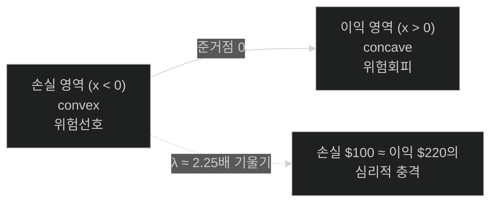
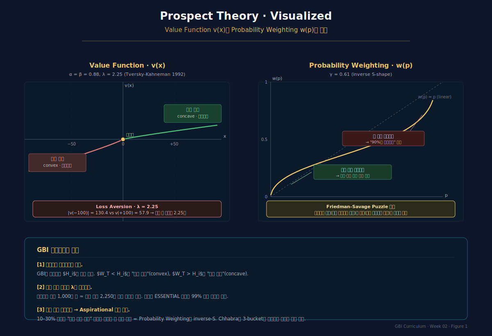
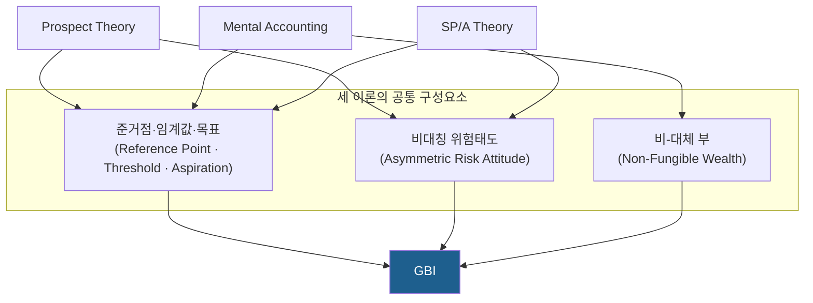
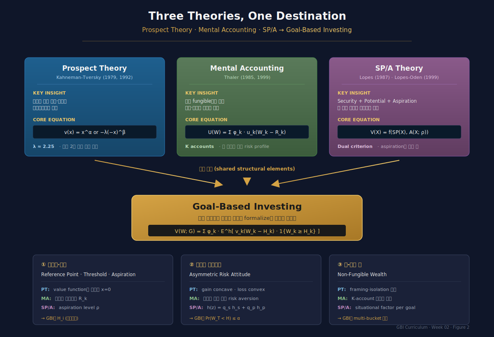
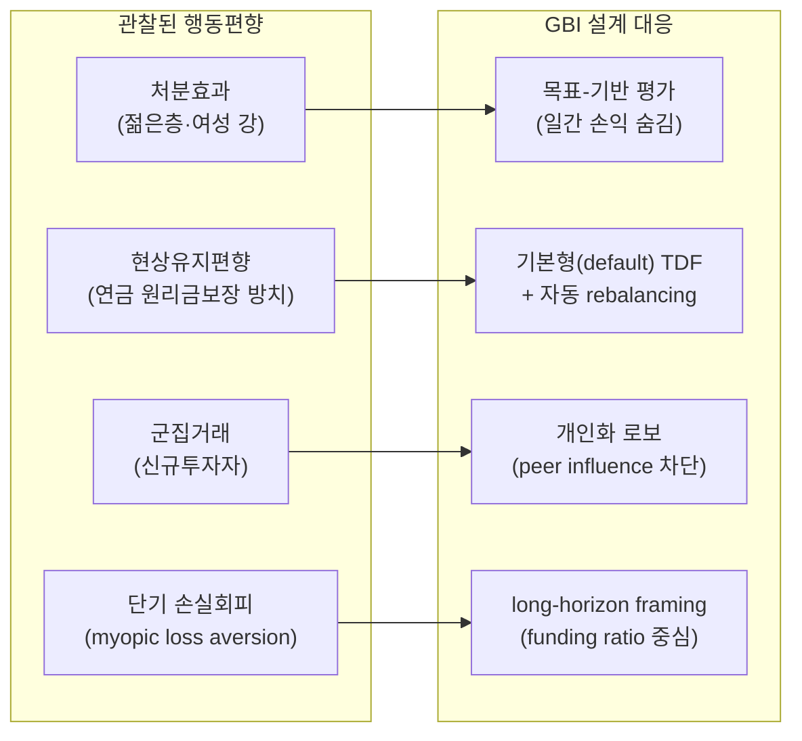

# Week 2 · 행동재무학적 기초 — Prospect Theory · Mental Accounting · SP/A

> **이번 주의 논지**
> 1주차에서 우리는 MPT의 한계를 "관찰"했다. 이번 주에는 인간의 **실제 의사결정 구조**를 들여다본다. 핵심 주장은 이렇다: GBI는 편향을 "교정"하는 장치가 아니라, **인간 의사결정의 구조 그 자체**가 goal-based임을 수용한 프레임이다. Prospect Theory·Mental Accounting·SP/A 세 이론은 서로 다른 각도에서 같은 결론을 향한다 — "인간은 mean-variance가 아니라 목표-기반으로 사고한다."

---

## 0. 강의 로드맵 (3 hours)

### 이 주차의 인포그래픽
- **Figure 1** (§2 말미): Prospect Theory의 Value Function · Probability Weighting 수치 그래프
- **Figure 2** (§5 말미): PT · MA · SP/A 세 이론의 공통 구조와 GBI 수렴 지도

### 강의 구성

| 구간 | 시간 | 내용 |
|---|---|---|
| §1 | 15분 | Opening: 4개의 짧은 선택 문제 — 본인의 편향 체험 |
| §2 | 40분 | Prospect Theory: Kahneman & Tversky (1979, 1992) |
| §3 | 35분 | Mental Accounting: Thaler (1985, 1999) |
| §4 | 40분 | SP/A Theory: Lopes (1987) · Lopes-Oden (1999) |
| §5 | 25분 | 세 이론의 공통분모 — "왜 goal-based로 수렴하는가" |
| §6 | 20분 | 한국 사례: 처분효과·현상유지편향·연금계좌의 심리학 |
| §7 | 15분 | 케이스 스터디 & 과제 |

---

## §1. Opening — 4개의 선택 문제 (15 min)

### 1.1 강의 시작 직후 즉석 설문
종이 한 장씩 나눠주고 각자 선택을 기록 (5분, 다른 사람과 상의 금지).

**문제 Q1**
A: 확실한 +100만원 획득
B: 50% 확률 +220만원 / 50% 확률 0원

**문제 Q2**
A: 확실한 −100만원 손실
B: 50% 확률 −220만원 / 50% 확률 0원

**문제 Q3**
"10만원이 생겼다. 둘 중 하나를 해야 한다면?"
A: 로또 5장 구매 (기대가 +5,000원이지만 분산 큰 로또)
B: 국민연금 추가납입 10만원

**문제 Q4**
"은퇴자금 1억 원을 적립했다. 이 중 2천만 원은 1년 내 꼭 필요한 의료비용."
A: 1억 원 전체를 주식 80% / 채권 20% 포트폴리오에 투자
B: 2천만 원은 MMF·예금, 나머지 8천만 원만 주식 80%로 투자

### 1.2 결과의 교훈 (강의자 해설)

대부분의 수강생은:
- Q1에서 **A**(확실), Q2에서 **B**(도박) — **손실 앞에서는 위험추구**로 반전
- Q3에서 **A와 B 모두 선택**이 있음 — 같은 돈인데 "기회"의 10만원은 로또, "안전"의 10만원은 연금 — **fungibility 위반**
- Q4에서 **B** 압도 — 수학적으로는 동일한 aggregate risk일지라도, **목표별 계정 분리가 심리적으로 편하다**

본 강의 3시간의 과제: 이 세 직관을 수학적으로 형식화한 것이 각각 **Prospect Theory·Mental Accounting·SP/A**이며, 이들이 모두 GBI로 수렴함을 보이는 것.

---

## §2. Prospect Theory — Kahneman & Tversky (40 min)

### 2.1 배경 — 기대효용이론의 실증적 실패

기대효용이론(Expected Utility, von Neumann-Morgenstern 1944)은:
$$
U(L) = \sum_i p_i\, u(x_i)
$$

이 이론은 위험회피·위험중립·위험선호를 utility 함수 $u$의 곡률로 설명한다. 그러나 1960년대 이후 Allais paradox, Ellsberg paradox 등 다수의 실증 위반이 축적. Kahneman과 Tversky는 1979년 *Econometrica* 논문에서 **Prospect Theory**를 제시하며 다음 4가지 현상을 통합 설명했다:

1. **Certainty effect**: 확실한 결과에 과도한 가중
2. **Reflection effect**: gain/loss 도메인에서 위험선호 반전
3. **Isolation effect**: 동일한 최종 결과도 framing에 따라 다르게 평가
4. **Loss aversion**: 손실 $100원이 이익 $100원보다 심리적으로 2–2.5배 크게 느껴짐

### 2.2 Prospect Theory의 두 축

#### 축 1 — Value Function $v(x)$

$$
v(x) = \begin{cases} x^\alpha & x \ge 0 \\ -\lambda(-x)^\beta & x < 0 \end{cases}
$$

- Tversky-Kahneman(1992) 실증 파라미터: $\alpha = \beta \approx 0.88$, $\lambda \approx 2.25$
- $x$는 **준거점(reference point)** 대비 편차 (절대 부(wealth)가 아님 — 이것이 EU와의 근본적 차이)
- Gain 도메인 concave → 위험회피; Loss 도메인 convex → 위험선호
- $\lambda > 1$은 loss aversion

#### 축 2 — Probability Weighting Function $w(p)$

$$
w(p) = \frac{p^\gamma}{\left(p^\gamma + (1-p)^\gamma\right)^{1/\gamma}}, \quad \gamma \approx 0.61 \text{ (gains)}, 0.69 \text{ (losses)}
$$

inverse S자 모양: **작은 확률은 과대평가, 큰 확률은 과소평가**. 로또와 보험이 동시에 존재하는 이유.

#### 전체 가치 — Cumulative Prospect Theory (1992)

누적 버전(CPT)은 rank-dependent utility 프레임을 차용:
$$
V(L) = \sum_{i=1}^n \pi_i^+\, v(x_i^+) + \sum_{j=1}^m \pi_j^-\, v(x_j^-)
$$

여기서 $\pi$는 누적 확률에 $w$를 적용해 얻은 decision weight.

### 2.3 Value Function의 모양 — 핵심 수식 시각화

**실무적 함의 (GBI 관점에서)**:
- 준거점이 "목표금액" $H$로 설정되면, $W_T < H$는 "손실", $W_T > H$는 "이익"
- 목표 $H$를 기준으로 한 효용은 자연스럽게 Kinked(꺾임) → **전통 MV 효용과 양립 불가능**
- 이는 §3의 mental accounting, §4의 SP/A와 같은 논리적 근원

### 2.4 준거점(Reference Point)의 내생성

Kahneman-Tversky는 준거점을 외생적으로 가정했지만, 이후 연구(Köszegi-Rabin 2006, *QJE*)는 **준거점이 기대(expectation)에 의해 내생적으로 결정**됨을 주장. 즉:

$$
R_t = \mathbb{E}_{t-1}[W_t]
$$

GBI 관점에서는 더 단순하다 — **준거점 = 목표금액 $H$**. 투자자 자신이 목표를 세우면서 준거점을 명시적으로 정한다.

### 2.5 실증적 파라미터 한국 데이터

한국 투자자 대상 실증(Cha & Jung 2013; 자본시장연구원 2022)에 따르면:
- **여성 투자자의 손실회피 강도가 남성보다 유의하게 높음** → 처분효과 강화
- **30대 투자자에서 처분효과가 가장 강하고, 60대 이상에서 약함** → 투자경험 효과
- 신규투자자·분산투자 수준 낮을수록 행태편향 심화

이는 GBI 상품 설계 시 **세분화된 페르소나**(age × gender × experience)를 고려해야 함을 시사.

*Figure 1 · Prospect Theory의 Value Function v(x)과 Probability Weighting w(p)의 실제 수치 그래프. λ=2.25 손실 증폭과 inverse-S 확률왜곡이 GBI 설계에 주는 함의.*

---

## §3. Mental Accounting — Thaler (35 min)

### 3.1 Thaler (1985, 1999)의 3가지 구성요소

Richard Thaler는 Mental Accounting을 세 측면으로 정의:

1. **Perception of outcomes** — 결과를 어떻게 인식·평가하는가 (framing)
2. **Assignment of activities to accounts** — 활동을 어떤 계정에 귀속시키는가
3. **Frequency of evaluation** — 얼마나 자주 계정을 평가하는가 (myopic loss aversion)

### 3.2 화폐의 비-대체성 (Non-Fungibility of Money)

고전 경제학: $1 = $1, 어디서 왔든 어디로 가든. 현실은 다르다.

**Thaler-Johnson(1990) "House Money Effect"**
- 카지노에서 먼저 땄던 돈은 "집돈"이 아니라 "하우스 머니"로 취급 → 더 공격적으로 베팅
- 월급과 보너스는 심리적으로 다른 돈

**Prelec-Loewenstein(1998) "Painful Coupling"**
- 현금 결제 vs 신용카드 결제 → 지출의 고통 강도 다름
- 선결제(휴가 미리 결제) → 사용 시점에 "공짜" 심리

### 3.3 Mental Accounting의 수학적 형식화

투자자는 부(wealth)를 $K$개 계정으로 분할:
$$
W = \sum_{k=1}^K W_k, \quad W_k = \pi_k W
$$

각 계정은 **고유의 효용함수**:
$$
U(W) = \sum_{k=1}^K \phi_k \cdot u_k(W_k - R_k)
$$

여기서:
- $u_k$: 계정 $k$의 value function (일반적으로 Prospect Theory 형태)
- $R_k$: 계정 $k$의 준거점 (목표금액)
- $\phi_k$: 계정 $k$의 중요도 가중치

### 3.4 Thaler의 핵심 명제와 GBI로의 연결

**Thaler 명제**: "사람들은 부를 심리적으로 분할할 뿐 아니라, 각 분할에 대해 **서로 다른 risk aversion**을 적용한다."

이것이 바로 GBI의 수학적 출발점이다. Das-Markowitz-Scheid-Statman(2010)은 이 명제를 받아들여:
$$
\max_{w_k} \; \mathbb{E}[W_T^k] \quad \text{s.t. } \Pr(W_T^k < H_k) \le \alpha_k, \quad k=1,\ldots,K
$$
이 문제의 aggregate solution이 MV-efficient임을 보였다 (1주차 §3.4 증명).

### 3.5 Mental Accounting의 두 얼굴 — 편향인가, 기법인가?

Brunel(2015)의 핵심 통찰:

**Account Type A: Cognitive Bias**
- 신용카드 리볼빙 18% 유지하면서 예금 적금 3.5%에 자금 넣기
- 세금환급액을 "공짜돈"으로 인식하고 과소비
- → 이는 명백히 비합리적

**Account Type B: Rational Goal Allocation**
- 자녀 교육비는 안전자산, 은퇴자금은 분산투자, 여유자금은 공격투자
- → 목표별 다른 risk profile이 실제로 최적이라면 이는 **합리적**

GBI는 B형 mental accounting을 **의도적·명시적**으로 설계한다. 즉 편향의 이용이 아니라 **구조의 선택**이다.

### 3.6 한국 사례 — IRP·연금저축·ISA의 멘탈 어카운팅

한국의 세제 적격 계정들은 자연스럽게 mental accounts를 형성한다:

| 계정 | 심리적 라벨 | 자연스런 자산배분 경향 |
|---|---|---|
| IRP·퇴직연금 DC | "은퇴까지 건드리면 안되는 돈" | TDF·안정형 |
| 연금저축펀드 | "노후 보충용" | 중위험 |
| ISA 중개형 | "세제혜택 받으며 굴리는 돈" | 주식·ETF 중심 |
| 일반 위탁계좌 | "자유롭게 굴리는 돈" | 공격적·단타 |

**KB 케이봇쌤·미래에셋 연금자산 분석 화면의 심리 설계**:
- 각 계정별 목표금액을 별도 표시 (fungibility 위반을 시각화)
- "은퇴까지 X%" 진행도를 별도 게이지로 표시 → **계정별 funding ratio의 감정적 거리감** 활용

---

## §4. SP/A Theory — Lopes (1987) · Lopes-Oden (1999) (40 min)

### 4.1 왜 SP/A가 GBI에 결정적인가

Prospect Theory가 "**왜** 목표지향적으로 사고하는가"를 설명한다면, SP/A는 "**어떻게** 목표지향적으로 사고하는가"의 수학적 구조를 제공한다. Shefrin-Statman(2000)의 Behavioral Portfolio Theory는 **SP/A에 직접 기반**한다 → 3주차의 전제.

### 4.2 Lopes의 두 요인(two-factor) 구조

Lopes(1987) "*Between Hope and Fear*": 인간 의사결정은 두 축의 긴장에서 나온다.

- **Dispositional factor** (성향적): 개인의 고유한 성격
  - **Security-mindedness (S)**: 최악을 피하려는 성향 → fear
  - **Potential-mindedness (P)**: 최선을 추구하려는 성향 → hope
- **Situational factor** (상황적): 그 순간의 목표
  - **Aspiration level $\rho$**: 달성하고 싶은 임계값

### 4.3 SP/A의 수학적 정식화

#### 4.3.1 SP 기준 — Decumulatively Weighted Value

결과를 최악→최선 순으로 정렬한 뒤, **누적여(decumulative) 확률**을 비선형 가중:

$$
SP(X) = \int_0^\infty h\!\left(1 - F_X(x)\right) dx - \int_{-\infty}^0 \left[1 - h\!\left(1 - F_X(x)\right)\right] dx
$$

연속형으로는 다음과 같이도 쓸 수 있다 (He-Zhou 2012):
$$
SP(X) = \int x\, d[-h(1 - F_X(x))]
$$

여기서 $h(\cdot)$이 SP/A의 핵심인 **decumulative weighting function**.

#### 4.3.2 두 성향의 혼합 가중함수

Lopes는 security와 potential을 convex combination으로:
$$
h(z) = q_s\, h_s(z) + q_p\, h_p(z), \qquad q_s + q_p = 1
$$

- $h_s$ (security-minded): **convex** — 최악 결과(decumulative 확률 큰 영역)에 더 큰 가중
- $h_p$ (potential-minded): **concave** — 최선 결과(decumulative 확률 작은 영역)에 더 큰 가중

결과적 $h$는 inverse-S자 모양 (CPT의 $w$와 형태 유사하지만 해석이 다르다).

#### 4.3.3 A 기준 — Aspiration

Aspiration은 stochastic control 논리 (Dubins-Savage 1976):
$$
A(X; \rho) = \Pr(X \ge \rho)
$$

즉 **목표 달성확률** 그 자체가 별도의 criterion.

#### 4.3.4 통합 — SP/A 목적함수

Lopes(1987)의 최종 목적함수:
$$
V(X) = f\!\left(\, SP(X),\, A(X; \rho) \,\right)
$$

실무적 구현: aspiration이 제약으로 들어가는 형태:
$$
\max_X \; SP(X) \quad \text{s.t. } A(X; \rho) \ge \bar{A}
$$

### 4.4 SP/A vs Prospect Theory 비교

| 측면 | Prospect Theory | SP/A Theory |
|---|---|---|
| 준거점 | $x = 0$ (기점) | 도메인 전체에 걸친 aspiration $\rho$ |
| 위험태도 | 효용함수 곡률로 | decumulative weighting $h$로 |
| gain/loss 비대칭 | value function에서 분리 | $h$와 $\rho$ 조합으로 생성 |
| 의사결정 축 | 단일 (value·weight) | 이중 (SP · A) |
| 실증 적합도 | — | Lopes-Oden(1999) 실험에서 CPT보다 우수 |
| GBI 함의 | value function 꺾임점 = 목표 | aspiration = 목표 그 자체 |

SP/A의 강점은 **aspiration이 decision criterion의 독립 축**이라는 점이다. GBI 관점에서 이는 결정적이다 — 목표금액 $H$가 bolted-on 제약이 아니라 **의사결정의 핵심 축**이 되어야 한다.

### 4.5 한 문장 요약과 GBI 연결

> **SP/A의 요지**: 투자자는 (1) 최악을 피하고 싶고, (2) 최선을 추구하고 싶으며, (3) **특정 목표를 달성하고 싶다** — 이 세 욕구는 서로 다른 수학적 criterion이며, 독립 가중되어 최종 선택을 결정한다.

GBI는 이를 다음과 같이 받는다:
- **Security → Essential goals** (Personal bucket, 99% 확률)
- **Aspiration → Explicit goals** (Market bucket, 70–85%)
- **Potential → Upside goals** (Aspirational bucket, 20–30%)

즉 Chhabra(2005)의 3-bucket이 SP/A의 3축을 그대로 **제도화**한 것이다.

### 4.6 SP/A 수치 예시

2-outcome gamble $X = (100, 0.5;\ 0, 0.5)$과 aspiration $\rho = 50$:
- $A(X; 50) = \Pr(X \ge 50) = 0.5$
- $SP(X)$는 $h$의 형태에 따라 변동

만약 $h(z) = z^\gamma$ (simplified), $\gamma = 0.6$ (security-minded):
$$
SP(X) = 100 \cdot h(0.5) = 100 \cdot 0.5^{0.6} \approx 65.98
$$

Potential-minded ($\gamma = 1.5$):
$$
SP(X) = 100 \cdot 0.5^{1.5} \approx 35.36
$$

동일한 gamble도 **성향에 따라 2배 가까운 평가 차이**가 발생. 이것이 상품 설계에서 "개인화"가 필요한 이유.

---

## §5. 세 이론의 공통분모 — 왜 goal-based로 수렴하는가 (25 min)

### 5.1 수학적 통합 시각

세 이론은 표면적으로 다르지만 **공통 구조**를 공유한다:

### 5.2 단일 수식으로의 통합 (Behavioral Portfolio Theory의 예고)

일반화된 goal-based value function:
$$
V(W; \mathcal{G}) = \sum_{k=1}^K \phi_k \cdot \mathbb{E}^h\!\left[ v_k(W_k - H_k) \cdot \mathbf{1}\{W_k \ge H_k\} \right]
$$

구성요소:
- $\phi_k$: 목표 $k$의 가중치 (MA의 account weight)
- $v_k$: 목표별 value function (PT의 kinked utility)
- $\mathbb{E}^h$: decumulative weighted expectation (SP/A의 probability distortion)
- $\mathbf{1}\{W_k \ge H_k\}$: aspiration 달성 지시함수

이 식이 Shefrin-Statman(2000) BPT로 이어지고, Das-Statman(2010)의 MA 프레임, Martellini(2015+)의 GBI formalization으로 확장된다 (Week 3–4의 주제).

### 5.3 "GBI는 교정 장치가 아니다" — 철학적 정립

흔한 오해: "GBI는 투자자의 비합리성을 수용해 차선의 해를 주는 것이다."

정확한 관점: GBI는 **인간 의사결정 구조의 원래 형태를 수학적으로 formalize한 최적화 프레임**이다. 편향의 수용이 아니라, 구조의 수용. 그 결과:
- Aggregate 수준에서 여전히 MV-efficient (정합성)
- 계정 수준에서 해석·행동 가능성 (유용성)

### 5.4 실험적 증거의 누적

- Kahneman-Tversky(1979, 1992): prospect theory 실험 — 다수 피험자
- Lopes-Oden(1999): 80명 × 45 lottery pair → SP/A가 CPT보다 적합도 우수
- Barberis(2013): stock market anomaly의 prospect theory 설명
- **Shefrin(2016) *Behavioral Risk Management***: 운영 리스크 관리에서 SP/A 패턴의 실증

*Figure 2 · Prospect Theory · Mental Accounting · SP/A 세 이론의 공통 구조(준거점·비대칭 위험·비-대체성)가 GBI로 수렴하는 지도.*

---

## §6. 한국 사례 — 개인투자자 행동편향의 실증 (20 min)

### 6.1 자본시장연구원(2022) — 한국 개인투자자 처분효과 분석

자본시장연구원 2022년 보고서 "국내 개인투자자의 행태적 편의와 거래행태"에서 2020년 3월–2021년 2월 거래 데이터를 기반으로 다음을 보였다:

**처분효과(Disposition Effect)**
- 개인투자자는 이익 종목을 빨리 팔고, 손실 종목을 오래 보유 → Prospect Theory가 예측하는 패턴과 정확히 일치
- 연령대별: **30대에서 가장 강하고, 60대 이상에서 약함**
- 성별: **여성 > 남성** (손실회피 강도 차이)
- 분산투자 수준이 낮을수록 강함

**군집거래(Herding)**
- 신규투자자·젊은 투자자에서 강하게 관찰
- 군집거래 이후 수익률 반전 → 비합리적 행태로 판단

### 6.2 연금계좌의 현상유지편향(Status Quo Bias)

한국 퇴직연금 DC 가입자 대다수가 "디폴트 원리금보장형"에 장기 방치되는 현상:
- **2024년말 퇴직연금 426조 원**이라는 거대 시장에서도 대부분은 저수익 원리금보장형
- 이것이 바로 TDF·RA 디폴트옵션 도입(2022)의 배경

### 6.3 한국형 GBI가 해결해야 할 행동편향 지형도

### 6.4 실무적 함의 — 로보어드바이저 UX 설계

2025년말 국내 RA 가입자 37.5만 명·1.17조 원 규모에서 확인되는 경향:
- **"목표 달성 확률 %"** 를 메인 KPI로 노출 → 일간 수익률 중독 완화
- **"은퇴까지 자산의 궤적"** 시뮬레이션 → long-horizon framing
- **"멘탈 어카운트별 진행도"** 별도 표시 → non-fungibility 활용

미래에셋 TDF의 "한국인 투자자의 눈으로" 슬로건과 KB 골든라이프의 은퇴설계시스템은 이러한 UX 원칙을 각기 다른 방식으로 구현 중이다.

---

## §7. 케이스 스터디 & 과제 (15 min)

### 7.1 케이스 — "Mr. Kim의 3개 계좌"

45세 직장인 김철수씨는 다음 자산을 보유:

| 계좌 | 잔액 | 용도(본인 인식) |
|---|---|---|
| 주택청약종합저축 | 2,000만 원 | "집 살 때 쓸 돈" |
| 퇴직연금 IRP | 1억 2,000만 원 | "노후 자금" |
| 일반 위탁계좌 | 3,000만 원 | "굴려볼 돈" |
| 신용카드 리볼빙 | -500만 원 | — |

**질문**
1. 김씨의 행동은 `fungibility` 관점에서 비합리적인가? (Thaler의 두 얼굴 논의 적용)
2. 현재 자산배분을 $(H, T, \omega, \alpha)$ 4-tuple로 재구성하라.
3. Prospect Theory와 SP/A 각각의 관점에서 김씨의 의사결정 구조를 설명하라.
4. 이 가계에 GBI 상품을 제안한다면, 김씨의 **심리적 저항을 줄이기 위해** 어떤 UX·프레이밍이 필요한가?

### 7.2 과제 (개인, 3페이지)

**과제 A (필수)**
아래 데이터를 Python으로 구현하고 분석하시오:
- 2015–2025 월간 KOSPI200 수익률·KIS 종합채권지수
- Prospect Theory value function ($\alpha=\beta=0.88$, $\lambda=2.25$)을 적용한 월간 심리적 효용 계산
- "일간 평가" vs "연간 평가" 시뮬레이션 → myopic loss aversion 효과 수치화
- 결론: 평가 빈도가 투자자 행동에 미치는 영향을 GBI 상품 설계 관점에서 논하라

**과제 B (선택, 추가 점수)**
Lopes-Oden(1999) 실험의 45개 lottery pair 중 5쌍을 선택해, 본인의 선택이 (a) EU, (b) CPT, (c) SP/A 중 어느 모델에 가장 잘 부합하는지 분석. 본인의 **실제 선택 패턴**을 수식화.

### 7.3 Reading
- **Kahneman, D., & Tversky, A. (1979)**. "Prospect Theory: An Analysis of Decision under Risk." *Econometrica*, 47(2), 263–291. [필독 제1–4절]
- **Thaler, R. H. (1999)**. "Mental Accounting Matters." *Journal of Behavioral Decision Making*, 12, 183–206. [필독]
- Lopes, L. L. (1987). "Between Hope and Fear: The Psychology of Risk." *Advances in Experimental Social Psychology*, 20, 255–295. [권장]
- 자본시장연구원 (2022). "국내 개인투자자의 행태적 편의와 거래행태" 보고서. [한국 실증 권장]

### 7.4 다음 주 예고 — Week 3: Behavioral Portfolio Theory

Shefrin-Statman(2000)이 SP/A를 어떻게 **포트폴리오 이론**으로 formalize했는가. BPT-SA·BPT-MA·Friedman-Savage puzzle의 해명. MV 효율경계와 BPT 효율경계의 공존 조건.

---

## 부록 A — 핵심 수식 요약

### Prospect Theory (Tversky-Kahneman 1992)
$$
V(L) = \sum_i \pi_i\, v(x_i)
$$
$$
v(x) = \begin{cases} x^\alpha & x \ge 0 \\ -\lambda(-x)^\beta & x<0 \end{cases}, \quad w(p) = \frac{p^\gamma}{(p^\gamma + (1-p)^\gamma)^{1/\gamma}}
$$

### Mental Accounting (Thaler 1985)
$$
U(W) = \sum_{k=1}^K \phi_k\, u_k(W_k - R_k)
$$

### SP/A Theory (Lopes 1987)
$$
SP(X) = \int x\, d[-h(1-F_X(x))], \quad A(X;\rho) = \Pr(X \ge \rho)
$$
$$
V(X) = f(SP(X), A(X;\rho)), \quad h(z) = q_s\, h_s(z) + q_p\, h_p(z)
$$

### 통합 Goal-Based Value Function
$$
V(W; \mathcal{G}) = \sum_{k=1}^K \phi_k\, \mathbb{E}^h[v_k(W_k - H_k)\cdot \mathbf{1}\{W_k \ge H_k\}]
$$

## 부록 B — Prospect Theory vs SP/A 파라미터 비교표

| 파라미터 | PT (TK 1992) | SP/A (Lopes-Oden 1999) |
|---|---|---|
| 준거점/aspiration | $x_0 = 0$ | $\rho$ (외생) |
| 이익 도메인 곡률 | $\alpha = 0.88$ | $h_p$: concave |
| 손실 도메인 곡률 | $\beta = 0.88$ | $h_s$: convex |
| 손실회피 | $\lambda = 2.25$ | $q_s / q_p$ 비율 |
| 확률왜곡 | inverse-S ($\gamma \approx 0.65$) | mixed h function |
| 의사결정 차원 | 1 | 2 (SP, A) |

## 부록 C — 학습 리소스
- 동영상: Daniel Kahneman Nobel Prize Lecture (2002)
- 도서: Thaler *Misbehaving* (2015); Shefrin *Behavioral Risk Management* (2016)
- 강의: MIT OCW 14.13 *Behavioral Economics*
- 데이터: 자본시장연구원 (kcmi.re.kr) 투자자 행동 관련 보고서
