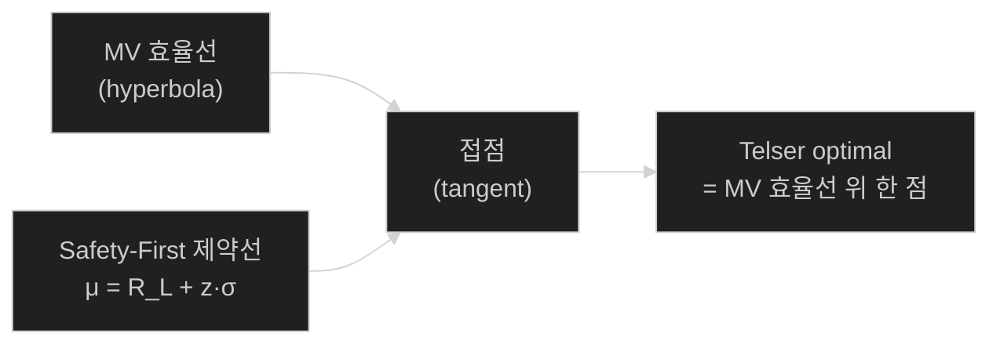
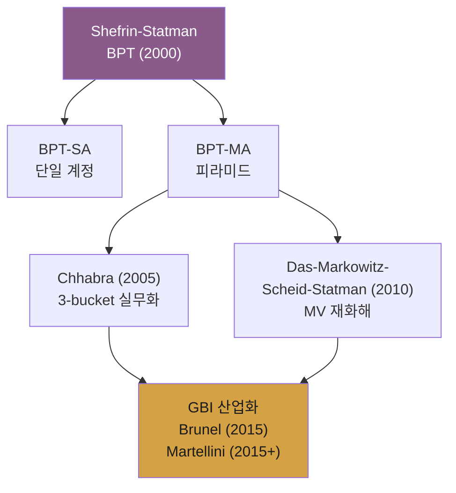

# Week 3 · Behavioral Portfolio Theory — SP/A가 포트폴리오 이론으로 formalize되는 과정

> **이번 주의 논지**
> 2주차에서 우리는 인간 의사결정의 **원자 단위(atomic level)** — 준거점·비대칭 위험·비-대체성 — 를 확립했다. 3주차는 이를 **포트폴리오 수준으로 집계(aggregate)** 하는 이론을 다룬다. Shefrin-Statman(2000)의 Behavioral Portfolio Theory (BPT)는 SP/A의 aspiration을 제약으로, security/potential을 목적함수 구조로 번역해 **"채권 + 복권"** 형태의 피라미드 포트폴리오를 수학적 최적해로 도출한다. 이것이 Chhabra(2005)와 Das-Markowitz-Statman(2010)으로 이어지는 GBI 수학 체계의 **결정적 bridge**다.

---

## 0. 강의 로드맵 (3 hours)

### 이 주차의 인포그래픽
- **Figure 1** (§4 말미): SP/A → BPT → GBI 수학적 계보
- **Figure 2** (§5 말미): BPT-MA 피라미드와 MV 효율선 기하학

### 강의 구성
| 구간 | 시간 | 내용 |
|---|---|---|
| §1 | 15분 | Recap: 2주차 → 3주차 연결, SP/A에서 BPT로 |
| §2 | 30분 | Telser의 Safety-First 재조명 |
| §3 | 45분 | BPT-SA (Single Account) 최적화 |
| §4 | 45분 | BPT-MA (Multiple Account) 피라미드 |
| §5 | 20분 | BPT 효율경계 vs MV 효율경계 — 일치·불일치 조건 |
| §6 | 15분 | 한국 사례: 주가연계파생결합증권(ELS)와 "채권+복권" 구조 |
| §7 | 10분 | 케이스 토론 + 과제 |

---

## §1. Recap — SP/A에서 BPT로 (15 min)

### 1.1 2주차 종착지의 복습

SP/A 목적함수 (Lopes 1987):
$$
V(X) = f\!\left(\, SP(X),\, A(X; \rho) \,\right)
$$

- **SP**: decumulatively weighted value (security-potential 혼합)
- **A**: aspiration 달성확률 $\Pr(X \ge \rho)$

이 두 criterion은 **심리학 실험실에서 검증된 의사결정 모델**이다. 그러나 실제 금융자산을 **어떻게 조합**할 것인가는 별도 문제. 자산 리턴은 연속분포, 제약은 예산·non-negativity·공매도 금지 등 다층적이기 때문이다.

### 1.2 Shefrin-Statman의 기여 — 3가지 공리 번역

Shefrin과 Statman(2000)은 SP/A의 핵심 3요소를 **포트폴리오 최적화의 언어**로 번역했다:

| SP/A 요소 | BPT 번역 |
|---|---|
| Aspiration $\rho$ | 포트폴리오 종료시점 부 $W$에 대한 threshold $A$ |
| $\Pr(X \ge \rho)$ | $\Pr(W \ge A)$ chance constraint |
| $h(\cdot)$ decumulative weighting | Lopes-Oden의 5-parameter 모수화 |
| $SP(X)$ | $E^h[W]$ (decumulatively weighted expected wealth) |

### 1.3 왜 이것이 "positive theory"인가

논문 서두 문장: "We develop a **positive** behavioral portfolio theory..."

- **Normative theory**: "어떻게 투자해야 하는가" (MPT)
- **Positive theory**: "실제로 어떻게 투자하는가를 설명" (BPT)

그런데 역설적이게도, BPT의 최적해가 **실제 관찰되는 투자자 행동**(Friedman-Savage puzzle, 주식·복권·보험 동시 보유)을 정확히 재현한다면, 이 "실제 현상의 설명이론"이 곧 개인의 효용을 극대화하는 **상품설계 지침**이 된다. 이것이 3주차가 GBI로 직접 연결되는 지점이다.

---

## §2. Telser의 Safety-First 재조명 (30 min)

### 2.1 Safety-First의 역사적 뿌리 (Roy 1952; Telser 1956)

Harry Markowitz가 MV를 발표한 바로 같은 해(1952), A.D. Roy는 다른 접근을 제안:

**Roy (1952) Safety-First Rule**:
$$
\min_w \; \Pr(R_p \le d), \quad d = \text{disaster level}
$$

투자자는 "재앙 수준 $d$ 이하 수익률"의 확률을 최소화하는 포트폴리오를 고른다.

**Telser (1956) 변형**:
$$
\max_w \; \mathbb{E}[R_p] \quad \text{s.t. } \Pr(R_p \le R_L) \le \varepsilon
$$

Kataoka(1963) 변형:
$$
\max_w \; R_L \quad \text{s.t. } \Pr(R_p \le R_L) \le \varepsilon
$$

### 2.2 Safety-First가 GBI·BPT의 수학적 조상이 되는 이유

Telser의 형태는 바로 GBI의 원형이다:

| Telser (1956) | GBI (2015+) |
|---|---|
| $\max \mathbb{E}[R_p]$ | $\max \mathbb{E}[W_T]$ |
| $\Pr(R_p \le R_L) \le \varepsilon$ | $\Pr(W_T < H) \le \alpha$ |
| $R_L$: 참담한 수익률 | $H$: 목표 미달 수준 |

즉 GBI의 chance-constrained 형태는 **1956년에 이미 존재했다**. MPT가 교과서를 지배하면서 50년 가까이 변방으로 밀려났을 뿐이다.

### 2.3 정규분포 가정 하 Telser 문제의 기하학

수익률 $R_p \sim \mathcal{N}(\mu_p, \sigma_p^2)$라 하면:
$$
\Pr(R_p \le R_L) = \Phi\!\left( \frac{R_L - \mu_p}{\sigma_p} \right) \le \varepsilon
$$

이를 정리하면:
$$
\mu_p \ge R_L + z_{1-\varepsilon}\, \sigma_p, \quad z_{1-\varepsilon} = \Phi^{-1}(1-\varepsilon)
$$

**이것은 $(\sigma_p, \mu_p)$ 평면의 반선**(half-line) **제약**이다:
- Slope: $z_{1-\varepsilon}$
- Intercept: $R_L$

### 2.4 기하학적 통찰 — MV 효율선과의 접점

MV 효율선은 $(\sigma_p, \mu_p)$ 평면의 **쌍곡선**(hyperbola). Telser의 반선 제약과의 **접점(tangent point)**이 safety-first optimal이다.

**중요한 통찰**: Telser 문제의 해는 여전히 **MV 효율선 위에 있다**. Telser는 효율선을 거부한 것이 아니라, **효율선 위 어느 점을 고를 것인가의 기준**을 "risk aversion $\lambda$"가 아니라 "disaster avoidance $R_L, \varepsilon$"로 바꾼 것이다.

이것이 BPT의 정합성의 기반이기도 하다. BPT는 MV의 적이 아니라 **MV의 선택 규칙 자체를 재해석한 프레임**이다.

### 2.5 Telser의 한계와 BPT가 채우는 틈

Telser는:
- **단일** threshold $R_L$
- **단일** 확률 $\varepsilon$
- 효용은 여전히 $\mathbb{E}[R_p]$ 선형

BPT가 확장하는 것:
- 수직 방향: **비선형 가중**(decumulative weighting $h$) — SP/A의 security·potential 긴장 반영
- 수평 방향: **복수 threshold** (BPT-MA의 피라미드) — SP/A의 multiple aspiration 반영

---

## §3. BPT-SA (Single Mental Account) 최적화 (45 min)

### 3.1 BPT-SA의 정식화

투자자는 하나의 계정에 모든 부를 통합. 목적함수는 SP/A의 포트폴리오 버전:

$$
\max_w \; E^h[W] \quad \text{s.t. } \Pr(W \le A) \le 1 - \alpha,\ w^\top \mathbf{1}=1,\ w_i \ge 0
$$

여기서:
- $E^h[W] = \int_0^\infty [1 - h(F_W(x))]\, dx$ (decumulatively weighted expected wealth)
- $h(\cdot)$: Lopes decumulative weighting — 5-parameter 형태
- $A$: aspiration level (threshold wealth)
- $\alpha$: aspiration 달성 목표 확률

### 3.2 Lopes-Oden의 $h$ 함수 구체 형태

Shefrin-Statman이 채용한 형태:
$$
h(D) = \int_0^D \left[ q_s\, \phi_s(z) + q_p\, \phi_p(z) \right] dz
$$

- $\phi_s(z) = (1 + s_1)(1-z)^{s_1}$: security-minded 성향
- $\phi_p(z) = (1 + s_2) z^{s_2}$: potential-minded 성향
- $q_s + q_p = 1$

파라미터 예시 (Lopes-Oden 1999 실험 중앙값):
- **Security type**: $s_1=2.92,\ s_2=2.25,\ q_s=0.79,\ q_p=0.21$
- **Potential type**: $s_1=0.77,\ s_2=0.23,\ q_s=0.16,\ q_p=0.84$

### 3.3 Continuous-state 이산화와 풀이

유한 state $\omega = 1, \ldots, n$ (각 상태 확률 $p_\omega$, 자산 리턴 벡터 $R_\omega$)에 대해:

**State 순서재배열** (worst → best):
$$
W_{(1)} \le W_{(2)} \le \cdots \le W_{(n)}
$$

**Decumulative 확률**:
$$
D_{(k)} = \sum_{j \ge k} p_{(j)}
$$

**Decumulative weighting 적용**:
$$
\pi_{(k)} = h(D_{(k)}) - h(D_{(k+1)})
$$

**BPT-SA 목적함수**:
$$
\max_w \; \sum_{k=1}^n \pi_{(k)}\, W_{(k)}(w) \quad \text{s.t. } \Pr(W \le A) \le 1 - \alpha
$$

이는 **분수 최적화(fractional / rank-dependent)**이므로 비볼록일 수 있으나, 실무에서는 linear programming 완화로 풀린다.

### 3.4 BPT-SA 최적해의 정성적 특징 — "Bond + Lottery Ticket"

Shefrin-Statman의 핵심 결과(Theorem): **일정 조건 하 BPT-SA 최적 포트폴리오는 `무위험채권 + 복권형 자산`의 조합**으로 표현된다.

직관적 근거:
- 채권은 $\Pr(W \ge A)$ **제약을 만족**시키기 위한 hedge
- 복권형(왜도 큰 자산, 로또)은 **potential-minded 성향**을 충족시키는 upside 자산
- 중간적 자산(분산된 주식 포트폴리오)은 **domination** — 포함되지 않음

**수식적 표현**: 자산이 $n$개 있을 때 최적해는 일반적으로 **corner solution**이며, 대부분의 자산 weight는 0이다. 이는 MV의 "모든 자산 일부씩 보유"와 정반대.

### 3.5 수치 예시 — 3-asset BPT-SA

자산: (1) 무위험채권 $r_f = 0.02$, (2) 주식시장 $r_s \sim \mathcal{N}(0.08, 0.2^2)$, (3) 복권(상태 $\omega_1$에서 100, 그 외 0; $p_{\omega_1} = 0.001$, 매입가 0.1)

투자자: aspiration $A = 1.5$ (초기부 1에서 50% 증가), $\alpha = 0.8$, potential-minded

**Intuition**:
- 80% 확률로 $A=1.5$ 달성 → 주식 + 채권 조합으로는 불가능(수익률 분포가 $\alpha$만큼 우측 꼬리에 도달 못함)
- 복권형을 소액 편입하면 **0.1% 확률로 100배 수익** → 극단적 꼬리를 채움
- 나머지는 채권 → aspiration의 기저를 채움

**결과 (해석용 근사)**: $(w_f, w_s, w_l) \approx (0.85,\ 0.10,\ 0.05)$. MV 최적해 $(0.4,\ 0.6,\ 0.0)$과 **전혀 다른** 모양.

### 3.6 BPT-SA의 2차원 해석 — Shefrin-Statman의 Figure 1

Shefrin-Statman은 $(\mu, \sigma)$ 평면이 아니라 **$(E^h[W], \Pr(W \ge A))$ 평면**에서 BPT 효율경계를 그린다. 여기서:
- x축: aspiration 달성확률
- y축: decumulatively weighted expected wealth
- 효율경계: 주어진 확률 달성 가능한 max expected weighted wealth

이 평면에서의 두-펀드 정리는 **일반적으로 성립하지 않는다** (§5.3에서 논의).

---

## §4. BPT-MA (Multiple Mental Account) — 피라미드 (45 min)

### 4.1 BPT-MA의 동기

BPT-SA만 있어도 bond+lottery 해가 나온다. 그런데 왜 MA(multiple account) 확장이 필요한가?

**관찰**: 실제 투자자는 단순히 bond+lottery를 하나의 계좌에 섞어두지 않는다. 오히려:
- "은퇴계좌"에는 bond 위주
- "여유자금계좌"에는 lottery 위주
- 각 계좌를 **독립적으로 모니터링**

이는 2주차 Thaler mental accounting이 **SP/A의 aspiration을 목표별로 분화**시킨 형태다.

### 4.2 BPT-MA 정식화

$K$개 계정 $k = 1, \ldots, K$, 각각 aspiration $A_k$, 목표 확률 $\alpha_k$, 자금할당 $\pi_k$:

**Step 1 — 자금할당 결정**: $\pi_k > 0$, $\sum_k \pi_k = 1$, 투자자 선호 반영

**Step 2 — 계정별 최적화**:
$$
\max_{w_k} \; E^{h_k}[W_k] \quad \text{s.t. } \Pr(W_k \le A_k) \le 1 - \alpha_k,\ w_k^\top \mathbf{1}=1,\ w_k \ge 0
$$

**Step 3 — 포트폴리오 집계**:
$$
w^{\text{aggregate}} = \sum_{k=1}^K \pi_k\, w_k^*
$$

### 4.3 피라미드 구조의 발생 원리

Shefrin-Statman의 **Figure 4·5 피라미드**가 어떻게 수학적으로 나오는가:

계정 $k$의 $A_k$와 $\alpha_k$가 낮은 것부터 높은 것으로 정렬:
- **Bottom layer** (low $A_k$, high $\alpha_k$ = 99%): "빈곤 회피" — bond 위주
- **Middle layer** (mid $A_k$, mid $\alpha_k$ = 70%): "성장" — diversified equity
- **Top layer** (high $A_k$, low $\alpha_k$ = 20%): "부의 극적 확대" — lottery / 집중투자

각 층의 **$h_k$ 함수**도 다를 수 있다:
- Bottom: security-minded dominant ($q_s \to 1$)
- Top: potential-minded dominant ($q_p \to 1$)

### 4.4 두-펀드 정리가 BPT에서 깨지는 이유

MV/CAPM의 **two-fund separation**: 모든 투자자는 (risk-free + 시장포트폴리오)의 조합만 보유.

BPT에서는 성립하지 않는다. 증명 스케치:
1. 각 계정의 $A_k, \alpha_k, h_k$가 다르다
2. 각 계정 최적해 $w_k^*$는 corner solution (bond + lottery)이며, **포함되는 자산 집합이 다르다**
3. 따라서 aggregate $\sum_k \pi_k w_k^*$는 bond + 여러 종의 lottery의 조합
4. 이는 single-fund (market portfolio)로 수렴하지 않는다

**실증적 함의**: BPT 투자자 세계에서는 "모두 같은 포트폴리오" 가설이 깨지므로 CAPM의 cross-section 가격결정 메커니즘이 다르게 작동한다 (Shefrin-Statman 1994 Behavioral CAPM으로 이어짐).

### 4.5 Chhabra·Das-Statman과의 관계

**Chhabra (2005)** — 3-bucket은 BPT-MA의 **실무적 단순화**:
- Personal = Bottom layer
- Market = Middle layer
- Aspirational = Top layer

**Das-Markowitz-Scheid-Statman (2010)** — BPT-MA를 MV framework와 **수학적으로 화해**:
- 각 계정이 정규분포·MV 효율선 위 → aggregate도 MV 효율선 위 (short-selling 허용 시)
- 즉 BPT-MA의 **실무 버전**이 Das-Statman MA이며, 이는 여전히 MV 효율성을 유지

![[Week03_Infographic_SPA_to_GBI.svg]]
*Figure 1 · SP/A(심리학) + Safety-First(포트폴리오이론) → BPT-SA/BPT-MA → Chhabra·Das-Statman → GBI 산업 패러다임의 수학적 계보.*

### 4.6 BPT-MA 단점과 해결

**문제점 1 — Aggregation 비효율**: 각 계정이 corner solution이면 aggregate도 비효율일 수 있다.

**Das et al. 2010 해결**: 정규분포 가정 + short-selling 허용 시, 각 계정 최적해가 MV 효율선 위 → aggregate도 MV 효율선 위임을 증명.

**문제점 2 — 자금할당 $\pi_k$의 원천**: $\pi_k$ 자체는 어디서 오나?

**Brunel 해결**: 투자자 상담 프로세스(interview-based)에서 4-goal 중요도 순위 도출. 학술적으로는 Das-Statman-Scheid(2018) "Dynamic Lifecycle" 등 시도.

**문제점 3 — 계정 간 rebalancing**: 한 계정이 overfund 상태일 때 다른 계정으로 이전?

**Martellini-Milhau 해결** (Week 6): PSP/GHP 프레임에서 funding ratio 기반 동적 이전 규칙.

---

## §5. BPT 효율경계 vs MV 효율경계 — 일치·불일치 조건 (20 min)

### 5.1 Shefrin-Statman(2000)의 주장

"In general, the two frontiers do not coincide" — 일반적으로 일치하지 않는다.

그러나 **구체적으로 언제 일치하고 언제 불일치하는가**에 대해서는 원 논문에서 완전한 분석이 없었다. 이 공백을 채운 것이 후속 연구들:

### 5.2 Das-Markowitz-Scheid-Statman (2010) — 일치 조건

**Result**: 다음 조건 모두 만족 시 aggregate portfolio는 MV 효율선 위:
1. 자산 수익률이 정규분포
2. Short-selling 허용
3. 각 계정의 제약이 VaR 형태로 표현 가능

**증명의 핵심** (1주차 §3.4에서 스케치):
- Normal 가정 하 $\Pr(W_k < H_k) \le \alpha_k$는 $(\mu_k, \sigma_k)$ 공간의 **선형제약**
- 선형제약 + 볼록영역 → MV 효율선 위 접점

### 5.3 Pfiffelmann-Roger-Bourachnikova (2016) — 실증적 일치율

2016년 *Economic Modelling* 게재 논문에서 CRSP 1995-2011 데이터를 이용해 Shefrin-Statman 최적화를 직접 풀었다:

- **BPT 최적해가 MV 효율선 위에 위치하는 경우: 70% 이상**
- 단, BPT 최적 포트폴리오는 **높은 위험·높은 수익·양(+)의 왜도** 특성
- MV 투자자의 전형적 위험회피 계수로는 **10배 낮은** $\lambda$에 해당하는 공격적 구성

**해석**: BPT와 MV는 "동일한 효율경계"를 공유할 수 있지만, **선택 규칙**이 다르다. BPT는 왜도·꼬리 민감하고, MV는 분산 민감. 따라서:
- 일반적 MV 투자자와 BPT 투자자는 **같은 효율선 위 다른 점**에 위치
- 이는 2주차 PT의 probability weighting이 reward 공간이 아닌 **선호 공간에서 차이**를 만드는 결과

### 5.4 When do frontiers diverge?

BPT·MV 효율선이 **실질적으로 달라지는** 조건:
1. **Skewness 중요**: 자산에 유의한 왜도가 있을 때 (복권형, PE, 옵션)
2. **Tail fat**: 정규분포 가정 깨질 때 (극단적 market event)
3. **Short-selling 금지**: aggregate의 MV 효율성 보장 제약 깨짐
4. **Multiple disconnect goals**: 계정 간 rebalancing 불가 시

이는 GBI가 **특히 효과를 발휘하는 환경**이 무엇인지의 지도이기도 하다.

![[Week03_Infographic_BPT_Geometry.svg]]
*Figure 2 · BPT-MA 3층 피라미드와 (σ, μ) 평면에서의 MV 효율선·Telser 제약선·BPT corner solutions의 기하학적 관계. Pfiffelmann et al.(2016) 실증 포함.*

---

## §6. 한국 사례 — ELS와 "채권 + 복권" 구조 (15 min)

### 6.1 왜 ELS(주가연계증권)가 BPT의 관점에서 흥미로운가

한국에서 2000년대 중반 이후 폭발적으로 성장한 **주가연계증권(ELS)**는 Shefrin-Statman이 예측한 **"bond + lottery ticket" 구조의 상품화 사례**로 해석 가능하다.

대표적 스텝다운형 ELS:
- 원금 대부분 보장 성격 (조기상환 조건 달성 시) → **bond-like 구성요소**
- 극단적 하락 시 knock-in 손실 (확률 낮지만 대형) → **lottery ticket의 역방향, put option 매도**
- 중간 수준의 시장변동 → 연 5-8% 쿠폰 → **aspiration level 충족 장치**

### 6.2 수식 분해

스텝다운 ELS의 payoff 구조 (근사):
$$
W_T \approx
\begin{cases}
W_0 (1 + c T) & \text{조기상환 } (\Pr \approx 80\%) \\
W_0 (1 + c T') & \text{만기 쿠폰수령 } (\Pr \approx 15\%) \\
W_0 (1 - \ell) & \text{knock-in 손실 } (\Pr \approx 5\%),\ \ell \in [0.3, 0.8]
\end{cases}
$$

BPT 프레임으로 해석:
- $A = W_0(1 + cT)$: aspiration (원금 + 약속 쿠폰)
- $\alpha \approx 0.95$: aspiration 달성 기대확률
- 극단 tail의 knock-in = put option 매도로 얻는 프리미엄이 쿠폰 재원

**심리적 매력**: $\alpha=95\%$의 높은 성공확률은 security-minded 성향 충족. 동시에 일반 채권 대비 2-3배 높은 쿠폰은 potential-minded 성향 충족.

### 6.3 그러나... 2024년 H지수 ELS 사태의 교훈

2024년 홍콩 H지수 연계 ELS가 대량 손실을 기록하며 사회적 이슈가 되었다. BPT 프레임이 **정확히 예측하는** 실패 모드:

- 투자자 인식: "원금 거의 보장" ($\alpha=95\%$ aspiration은 실현되리라 기대)
- 실제: 5% tail이 한꺼번에 실현되어 수조 원 규모 손실
- 문제: 투자자가 **저확률 tail을 과소평가**(probability weighting의 반대 실패 모드)

이는 BPT 상품이 **설계되는 것과 이해되는 것의 괴리**가 만들어내는 **불완전판매 리스크**의 교과서적 예시다.

### 6.4 GBI 관점의 처방

BPT 상품 구조 자체는 합리적이나, 판매·UX에서 다음이 필요:
1. **Essential goal 버킷에 ELS 편입 금지**: tail risk가 essential($\alpha=99\%$)과 양립 불가
2. **Aspirational 버킷에만** — tail 실현도 감내 가능한 여유자금
3. **목표 달성확률 명시**: "95% 확률" vs "원금보장"은 전혀 다른 프레임

한국 자본시장의 판매 관행이 여전히 "원금 거의 보장" 마케팅에 기대는 한, BPT의 수학적 정합성은 오히려 **소비자 피해**로 귀결될 수 있다. GBI 교육의 중요성.

### 6.5 TDF·퇴직연금·ISA와 BPT 피라미드

한국 연금 3층 구조가 자연스럽게 BPT-MA 피라미드를 이룬다:

| 층 | 상품 | BPT 대응 |
|---|---|---|
| 1층 | 국민연금·기초연금 | Bottom ($\alpha \approx 99\%$, bond-like) |
| 2층 | 퇴직연금 DC·IRP | Middle ($\alpha \approx 80\%$, TDF·분산) |
| 3층 | 개인연금·ISA·일반계좌 | Top ($\alpha \approx 30-50\%$, 성장·집중) |

미래에셋 TDF가 2층에 자연히 안착하고, KB 골든라이프 은퇴설계시스템이 3개 층을 통합 진단하는 구조는 Chhabra-BPT 프레임의 한국형 구현이라 볼 수 있다.

---

## §7. 케이스 스터디 & 과제 (10 min)

### 7.1 케이스 — "Behavioral Pyramid Builder"

45세 워킹맘 박소영씨는 순자산 6억(주택 3억, 금융자산 3억)을 다음과 같이 분배하고 싶다:
- 노후 안전: "무슨 일이 있어도 생활비는 확보"
- 자녀 교육: "2035년 유학자금 1.5억"
- 본인 창업 자금: "2030년 스타트업 시드 5천만원"
- 버킷리스트: "2040년 세계여행 2천만원"

**질문 (소그룹 토론 20분, 다음 주 제출)**
1. 4개 목표를 $(A_k, \alpha_k, T_k, \pi_k)$로 정식화하라.
2. BPT-MA 프레임으로 각 계정의 구성을 설계. 각 계정의 $h_k$ 성향 (security vs potential)은?
3. Aggregate portfolio는 MV 효율선 위에 있을 것이라 기대하는가? 그렇지 않다면 왜?
4. 박씨가 현실에서 이 구조를 **실행**할 때 한국 제도의 어떤 제약이 있는가? (IRP 납입한도, ISA 한도, 유학자금 신탁 상품 존재 여부 등)

### 7.2 과제 (개인, 4페이지)

**과제 A (수리)**
3-asset 환경(bond, equity, lottery)에서 BPT-SA 최적화를 Python `scipy.optimize`로 구현. 두 투자자 유형:
- Security-minded: $s_1=2.92, s_2=2.25, q_s=0.79$
- Potential-minded: $s_1=0.77, s_2=0.23, q_s=0.16$
비교항목: 최적 weights, aspiration 달성확률, expected wealth, variance.

**과제 B (개념)**
Das-Markowitz-Scheid-Statman(2010)의 "aggregate MV efficiency" 결과와 Pfiffelmann et al.(2016)의 실증 결과(BPT 해가 70%+ MV 위)를 종합해, BPT가 MV를 **대체**하는지 **보완**하는지에 대한 입장을 논하시오 (2페이지).

### 7.3 Reading
- **Shefrin, H., & Statman, M. (2000)**. "Behavioral Portfolio Theory." *JFQA*, 35(2), 127–151. **[전편 필독]**
- Das, S., Markowitz, H., Scheid, J., & Statman, M. (2010). "Portfolio Optimization with Mental Accounts." *JFQA*, 45(2), 311–334. [핵심]
- Pfiffelmann, M., Roger, T., & Bourachnikova, O. (2016). "When Behavioral Portfolio Theory meets Markowitz theory." *Economic Modelling*, 53. [실증 권장]

### 7.4 다음 주 예고 — Week 4: Das-Markowitz Mental Accounts Framework
BPT가 실무적 최적화 프레임으로 진화. VaR-based 제약의 MV 동등성 증명, 다계정 aggregation의 정합성 조건. Chhabra 3-bucket을 실제 계산할 수 있는 엔진.

---

## 부록 A — BPT vs MV 한눈 비교표

| 측면 | MV (Markowitz) | BPT (Shefrin-Statman) |
|---|---|---|
| 위험 정의 | Variance | $\Pr(W < A)$ |
| 선호 구조 | $\mathbb{E}[W] - \frac{\lambda}{2}\text{Var}(W)$ | $E^h[W]$ s.t. chance constraint |
| 계정 수 | 1 | 1 (SA) 또는 $K$ (MA) |
| 최적해 형태 | 내부해 (다수 자산 분산) | corner solution (bond + lottery) |
| Two-fund separation | 성립 | 일반적으로 불성립 |
| 효율경계 | $(\sigma, \mu)$ 평면 쌍곡선 | $(\Pr(W \ge A), E^h[W])$ 평면 |
| 왜도·꼬리 민감도 | 낮음 | 높음 |
| 양립 조건 | — | Normal + short-sales 허용 시 MV와 aggregate 일치 |

## 부록 B — 핵심 수식 정리

### Telser Safety-First
$$
\max_w \; \mathbb{E}[R_p] \quad \text{s.t. } \Pr(R_p \le R_L) \le \varepsilon
$$

### BPT-SA
$$
\max_w \; E^h[W] \quad \text{s.t. } \Pr(W \le A) \le 1-\alpha
$$
$$
E^h[W] = \int_0^\infty [1 - h(F_W(x))]\, dx
$$
$$
h(D) = \int_0^D \left[ q_s(1+s_1)(1-z)^{s_1} + q_p(1+s_2)z^{s_2} \right] dz
$$

### BPT-MA
$$
\max_{w_k} \; E^{h_k}[W_k] \quad \text{s.t. } \Pr(W_k \le A_k) \le 1-\alpha_k,\ k=1,\ldots,K
$$
$$
w^{\text{agg}} = \sum_k \pi_k\, w_k^*
$$

### Das-Markowitz 동등성 (정규분포 가정)
$$
\Pr(W_k < H_k) \le \alpha_k \iff \mu_k^\top w_k - z_{1-\alpha_k}\sqrt{w_k^\top \Sigma w_k} \ge H_k / W_0^k
$$

## 부록 C — Lopes-Oden 중앙값 파라미터 (참고)

| 성향 | $s_1$ (security) | $s_2$ (potential) | $q_s$ | $q_p$ |
|---|---|---|---|---|
| Cautiously hopeful (security dominant) | 2.92 | 2.25 | 0.79 | 0.21 |
| Bold (potential dominant) | 0.77 | 0.23 | 0.16 | 0.84 |
| Mixed | 1.8 | 1.2 | 0.5 | 0.5 |

## 부록 D — 학습 리소스
- 원 논문: Shefrin-Statman (2000) — JFQA 전문 오픈
- 강의: Stanford GSB, Hersh Shefrin 강의 시리즈 (YouTube)
- 책: Shefrin *Beyond Greed and Fear* (2000/2010 개정)
- 실습: `pypfopt`, `scipy.optimize`로 BPT-SA 직접 풀이 가능
