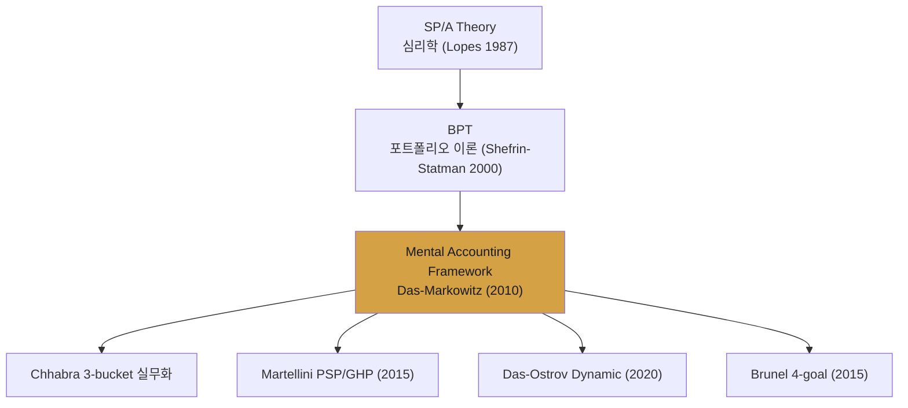
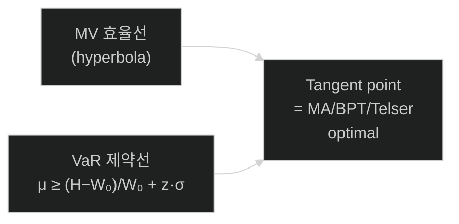
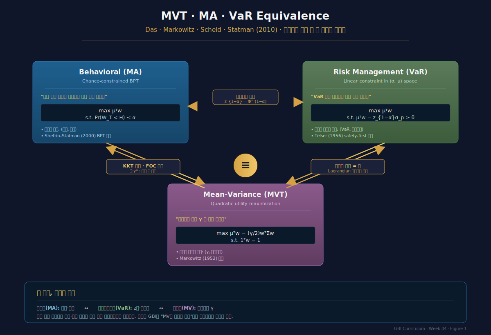
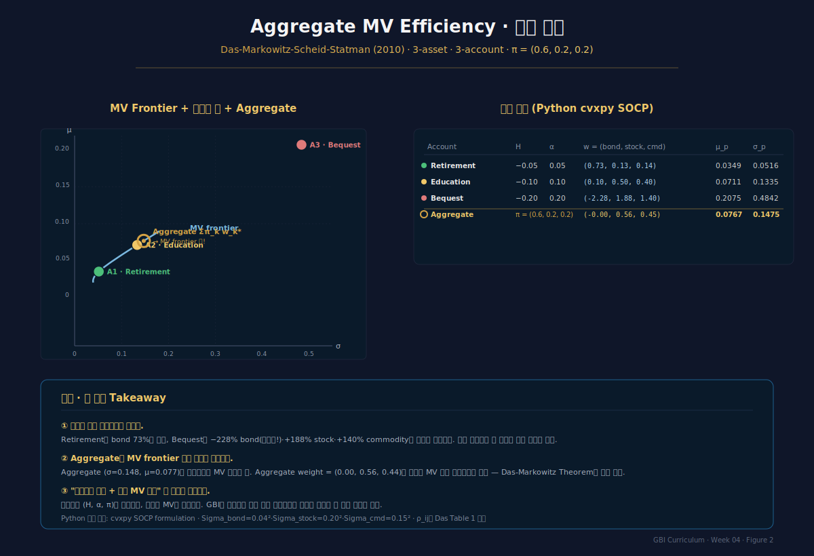

# Week 4 · Mental Accounting Framework — BPT와 MV의 수학적 화해

> **이번 주의 논지**
> 3주차에서 Shefrin-Statman BPT가 MV와 "일반적으로 일치하지 않는다"는 사실을 보았다. 그러나 이는 BPT의 결함이 아닌 **서술의 모호성**에 가까웠다. Das·Markowitz·Scheid·Statman(2010)은 BPT의 chance-constrained 형태를 **VaR 제약**으로 재해석하고, 정규분포·short-sales 허용 조건 하 **MV와 수학적으로 동등**함을 증명한다. 이로써 GBI는 "행동재무 기반의 MV 재해석"으로 재정립되며, 이후 모든 실무 GBI 엔진(Chhabra bucket, Martellini PSP/GHP, Das-Ostrov dynamic)의 **계산 가능한 backbone**이 완성된다.

---

## 0. 강의 로드맵 (3 hours)

### 이 주차의 인포그래픽
- **Figure 1** (§3 말미): MVT · MA · VaR 삼각 동등성
- **Figure 2** (§6 말미): Aggregate MV Efficiency 수치 증명 (cvxpy SOCP)

### 강의 구성

| 구간 | 시간 | 내용 |
|---|---|---|
| §1 | 15분 | Recap: BPT의 미완결과 Das-Markowitz의 문제의식 |
| §2 | 30분 | VaR 제약의 수학적 재정식화 |
| §3 | 40분 | **Theorem: MVT–MA–VaR Equivalence** (증명 완전판) |
| §4 | 35분 | Aggregate portfolio의 MV efficiency |
| §5 | 30분 | Short-selling 제약의 영향과 certainty equivalent loss |
| §6 | 20분 | Das et al. 수치 예시 완전 재현 (3 자산·3 계정) |
| §7 | 10분 | 한국 사례 + 과제 |

---

## §1. Recap — BPT의 미완결 (15 min)

### 1.1 3주차 종착지의 문제

Shefrin-Statman(2000) BPT는 두 가지 중요한 공백을 남겼다:

**공백 1 — 효율경계 관계의 모호성**
- "In general, the two frontiers do not coincide"라고만 언급
- **언제** 일치하고 **언제** 괴리되는지의 정확한 조건이 없음

**공백 2 — 계산 가능성의 문제**
- BPT-SA 목적함수 $E^h[W]$는 decumulative weighting $h(\cdot)$에 의존
- $h$는 **피험자별 실증 파라미터 5개**를 요구 — 실무 구현이 사실상 불가능

**공백 3 — Aggregation 규칙의 부재**
- BPT-MA에서 $\pi_k$ (계정 간 자금할당)의 결정 규칙 없음
- Aggregate portfolio $\sum_k \pi_k w_k^*$의 효율성 특성 불명

### 1.2 Das-Markowitz의 세 발견

Das, Markowitz, Scheid, Statman(2010) "*Portfolio Optimization with Mental Accounts*" (*JFQA*)는 세 가지를 동시에 해결한다:

1. **VaR로의 번역**: BPT의 chance constraint $\Pr(W \le H) \le \alpha$는 그대로 **Value-at-Risk 제약**이다
2. **MVT 등가성**: 정규분포 가정 하 VaR 제약은 MV optimization의 **라그랑지안에 편입 가능**, 즉 적절한 $\gamma$ 값을 갖는 MV 문제로 **동치 변환**
3. **Aggregation 효율성**: 각 계정이 MV 효율선 위에 있으면, short-selling 허용 시 aggregate도 **MV 효율선 위**

이 세 결과가 합쳐지면, **"BPT는 SP/A 기반 행동재무 이론이되, MV의 계산 엔진을 그대로 사용해 계정별 목표-위험 매개변수로 해석할 수 있는 실무 framework"** 로 재탄생한다.

### 1.3 왜 이것이 GBI 전체에 결정적인가



4주차는 이 **단일 이론적 병목**을 열어젖히는 강의다.

---

## §2. VaR 제약의 수학적 재정식화 (30 min)

### 2.1 Value-at-Risk의 정의와 직관

$\alpha$-수준 VaR (역사적 문자·부호 차이 주의):
$$
\mathrm{VaR}_\alpha(W) = -\inf\{w : \Pr(W \le w) > \alpha\}
$$

직관적으로: "나쁜 시나리오 상위 $\alpha$%에서 잃을 수 있는 손실의 최솟값." 투자자는 다음 형태의 제약을 둔다:
$$
\Pr(W < H) \le \alpha
$$

이는 "**최종 자산이 threshold $H$ 미만일 확률이 $\alpha$ 이하**"라는 chance constraint. VaR 언어로 표현하면:
$$
H \ge \text{VaR-equivalent threshold}
$$

### 2.2 정규분포 가정 하 VaR 제약의 선형 변환

자산 수익률이 정규분포 $R \sim \mathcal{N}(\mu_R, \sigma_R^2)$를 따르면, 초기 부 $W_0$, 포트폴리오 weight $w$에 대해:
$$
W_T = W_0\, (1 + w^\top R) \sim \mathcal{N}\!\left( W_0(1 + w^\top \mu), W_0^2\, w^\top \Sigma w \right)
$$

$\Pr(W_T \le H) \le \alpha$를 전개:
$$
\Pr\!\left( \frac{W_T - W_0(1+w^\top\mu)}{W_0\sqrt{w^\top \Sigma w}} \le \frac{H - W_0(1+w^\top\mu)}{W_0\sqrt{w^\top \Sigma w}} \right) \le \alpha
$$

표준정규분포 CDF $\Phi$로:
$$
\Phi\!\left( \frac{H/W_0 - (1+w^\top\mu)}{\sqrt{w^\top \Sigma w}} \right) \le \alpha
$$

정리하면:
$$
\boxed{\; (1 + w^\top\mu) - z_{1-\alpha}\sqrt{w^\top \Sigma w} \ge H/W_0 \;}
$$
여기서 $z_{1-\alpha} = \Phi^{-1}(1-\alpha)$.

### 2.3 기하학적 의미

위 제약은 $(\sigma_p, \mu_p)$ 평면에서 **직선**이다:
$$
\mu_p \ge \frac{H - W_0}{W_0} + z_{1-\alpha}\, \sigma_p, \qquad \mu_p \equiv w^\top \mu,\ \sigma_p \equiv \sqrt{w^\top \Sigma w}
$$

이는 정확히 **Telser(1956) safety-first**의 제약선이다. 즉:
> **BPT의 chance constraint = VaR 제약 = Telser safety-first 선**

세 가지 표현이 **완전히 동일한 수학적 대상**이다. 이는 60년에 걸친 지적 계보를 단일 수식으로 수렴시키는 통찰이다.

### 2.4 MV 효율선과의 접점

MV 효율선은 $(\sigma_p, \mu_p)$ 평면의 쌍곡선. 위 선형 제약과 접점에서 BPT/MA optimal이 결정된다:



**중요 관찰**:
- $H$가 낮을수록 (goal이 느슨) → 제약선의 y절편이 낮음 → 접점이 **효율선 아래쪽**(low-risk)
- $\alpha$가 낮을수록 (성공확률 요구 높음) → $z_{1-\alpha}$ 큼 → 제약선의 기울기 가파름 → 접점이 **효율선 아래쪽**
- $\alpha$가 높을수록 (성공확률 낮게 요구) → 접점이 **효율선 위쪽**(공격적)

### 2.5 Das-Markowitz의 핵심 명제

**Proposition 1 (informal)**: 정규분포 가정 하 chance-constrained BPT 문제:
$$
\max_w \; \mathbb{E}[W_T] \quad \text{s.t. } \Pr(W_T < H) \le \alpha
$$
는 **어떤 $\gamma > 0$에 대해** MV 효용 극대화 문제:
$$
\max_w \; \mu_p - \frac{\gamma}{2}\, \sigma_p^2
$$
와 **동일한 최적 포트폴리오**를 산출한다.

§3에서 이를 정리로 형식화하고 증명한다.

---

## §3. Theorem — MVT–MA–VaR Equivalence (40 min)

### 3.1 정리의 엄밀한 서술

**Theorem (Das, Markowitz, Scheid, Statman 2010)**
자산 수익률 $R \sim \mathcal{N}(\mu, \Sigma)$, $\Sigma$는 양의 정부호(positive definite)라 하자. 투자자의 mental accounting 문제 ($MA$):
$$
\max_w \; \mu^\top w \quad \text{s.t. } \mu^\top w - z_{1-\alpha}\sqrt{w^\top \Sigma w} \ge \theta,\ \mathbf{1}^\top w = 1 \tag{MA}
$$
여기서 $\theta = (H - W_0)/W_0$.

그리고 평균-분산 효용 문제 ($MVU$):
$$
\max_w \; \mu^\top w - \frac{\gamma}{2}\, w^\top \Sigma w \quad \text{s.t. } \mathbf{1}^\top w = 1 \tag{MVU}
$$

이때 다음이 성립한다:

**(a)** 임의의 유효한 $(\alpha, \theta)$에 대해, (MA)의 유일한 해와 일치하는 (MVU)의 $\gamma^*$가 존재한다.

**(b)** 역으로 임의의 $\gamma > 0$에 대해, (MVU)의 해를 구현하는 $(\alpha, \theta)$ 쌍이 존재한다.

**(c)** (MA)의 해는 **MV 효율선 위**에 있다.

### 3.2 증명 (Part a) — MA → MVU 매핑

**Step 1**: (MA)의 제약식을 재배열:
$$
\mu^\top w - \theta \ge z_{1-\alpha}\sqrt{w^\top \Sigma w}
$$

양변 제곱 (양변 모두 양수라 가정, 후에 검증):
$$
(\mu^\top w - \theta)^2 \ge z_{1-\alpha}^2\, w^\top \Sigma w
$$

**Step 2**: Lagrangian 구성. (MA)의 해에서 제약이 **binding**(등호 성립)이라 가정 — 아닐 경우 $\mu^\top w$를 더 키울 수 있어 모순. 등호:
$$
\mu^\top w = \theta + z_{1-\alpha}\sqrt{w^\top \Sigma w}
$$

이를 max $\mu^\top w$에 대입: 목적함수는
$$
\theta + z_{1-\alpha}\sqrt{w^\top \Sigma w}
$$
이지만 이는 $\sigma_p$에 대해 증가하므로 **제약 없이는 해가 없음**. 따라서 (MA)의 해는 **$w^\top\mathbf{1}=1$ 제약과 chance 제약이 동시에 binding인 지점**이다.

**Step 3**: Karush-Kuhn-Tucker (KKT) 조건.
$$
\mathcal{L}(w, \lambda, \eta) = \mu^\top w - \lambda\!\left[ \mu^\top w - z_{1-\alpha}\sqrt{w^\top\Sigma w} - \theta \right] - \eta(\mathbf{1}^\top w - 1)
$$

$\partial\mathcal{L}/\partial w = 0$:
$$
\mu - \lambda\mu + \lambda z_{1-\alpha}\frac{\Sigma w}{\sqrt{w^\top\Sigma w}} - \eta\mathbf{1} = 0
$$

정리하면:
$$
(1-\lambda)\mu + \frac{\lambda z_{1-\alpha}}{\sigma_p}\Sigma w = \eta\mathbf{1}
$$

**Step 4**: 이를 MV 효용 문제의 1차 조건과 비교. (MVU)의 FOC (동일 예산제약 하):
$$
\mu - \gamma\Sigma w = \tilde\eta\mathbf{1}
$$

두 조건식이 동일한 $w$를 산출하려면:
$$
\gamma^* = \frac{\lambda z_{1-\alpha}}{(1-\lambda)\,\sigma_p^*}
$$

**Step 5**: $\lambda \in (0, 1)$이고 $\sigma_p^* > 0$이면 $\gamma^* > 0$. 따라서 **어떤 유한한 양의 $\gamma^*$가 존재**해 MVU의 해가 MA의 해와 일치.

$\blacksquare$

### 3.3 증명 (Part c) — MV 효율성

MVU 문제 $\max \mu^\top w - \frac{\gamma}{2} w^\top \Sigma w$의 해는 $\gamma$ 값에 관계없이 (예산제약만 존재하는 한) **MV 효율선 위의 한 점**이다 (Markowitz 1952 standard result).

Part (a)에 의해 MA 해 = MVU 해, 따라서 **MA 해도 MV 효율선 위**. $\blacksquare$

### 3.4 정리의 해석 — 동등성의 의미

세 문제의 수학적 동등성을 한 줄로:
$$
\max \mu^\top w \; \text{s.t.}\; \text{Pr}(W_T < H) \le \alpha
\;\Leftrightarrow\;
\max \mu^\top w - z_{1-\alpha}\sigma_p \; \text{s.t.}\; \mathbf{1}^\top w = 1
\;\Leftrightarrow\;
\max \mu^\top w - \frac{\gamma^*}{2} \sigma_p^2
$$

**BPT(행동) = VaR(리스크) = MV(전통)** — 이 셋은 서로 다른 언어일 뿐, 수학적으로는 **같은 대상의 세 관점**이다.


*Figure 1 · MVT-MA-VaR 삼각 동등성. BPT(투자자 언어) · VaR(리스크매니저 언어) · MV(이론가 언어)가 정규분포 가정 하 동일한 최적 포트폴리오를 산출하는 수학적 구조.*

### 3.5 Baptista (2012)의 확장과 Safety-First 연결

Baptista(2012, *J. Banking & Finance*) 및 후속 Safety-first portfolio selection (2021, *Math. Fin. Econ.*)에서는:
- **Estimation risk**을 포함해도 정리의 핵심 구조가 유지됨을 증명
- **$H$의 "orthogonal portfolio" 기반 closed-form** 해 제시
- Generalized Sharpe measure로의 확장

이로써 Das-Markowitz의 equivalence가 **robust한 이론적 기반**을 가짐이 확립.

---

## §4. Aggregate Portfolio의 MV Efficiency (35 min)

### 4.1 Multi-account 문제의 정식화

투자자는 $K$개 mental account, 각각 초기할당 $\pi_k$ ($\sum_k \pi_k = 1$), threshold $H_k$, 실패확률 $\alpha_k$, 계정별 최적해:
$$
w_k^* = \arg\max_{w_k}\; \mu^\top w_k \quad \text{s.t. } \Pr(W_{T,k} < H_k) \le \alpha_k,\ \mathbf{1}^\top w_k = 1
$$

**Aggregate portfolio**:
$$
w^{\text{agg}} = \sum_{k=1}^K \pi_k\, w_k^*
$$

### 4.2 Theorem — Aggregate MV Efficiency

**Theorem (Aggregate Efficiency)**: 위 조건 하
1. 자산 수익률이 공통 $(\mu, \Sigma)$ 정규분포
2. Short-selling 허용
3. 모든 계정이 동일한 자산 universe

이면 $w^{\text{agg}}$도 **MV 효율선 위**에 있다.

### 4.3 증명 — Convex Combination Argument

**Step 1**: §3의 Theorem에 의해 각 $w_k^*$는 어떤 $\gamma_k^*$에 대한 MV 해:
$$
w_k^* = \arg\max_{w_k}\; \mu^\top w_k - \frac{\gamma_k^*}{2} w_k^\top \Sigma w_k \;\; \text{s.t.}\; \mathbf{1}^\top w_k = 1
$$

**Step 2**: Markowitz의 classical two-fund theorem에 의해:
$$
w_k^* = \frac{1}{\gamma_k^*} \Sigma^{-1}(\mu - \tilde\eta_k \mathbf{1})
$$

모든 계정의 해가 **동일한 두 기본 펀드**의 선형 결합임을 의미 — 즉 $(\Sigma^{-1}\mu, \Sigma^{-1}\mathbf{1})$ 두 벡터의 span에 있다.

**Step 3**: Aggregate:
$$
w^{\text{agg}} = \sum_k \pi_k w_k^* = \frac{1}{\gamma^{\text{agg}}} \Sigma^{-1}(\mu - \tilde\eta^{\text{agg}} \mathbf{1})
$$
여기서:
$$
\frac{1}{\gamma^{\text{agg}}} = \sum_k \frac{\pi_k}{\gamma_k^*}
$$

**Step 4**: $w^{\text{agg}}$는 **어떤 $\gamma^{\text{agg}}$에 대한 MV 효용 문제의 해**의 형태이므로 **MV 효율선 위**. $\blacksquare$

### 4.4 실무적 함의 — "Mental account를 쓴다고 효율성을 잃지 않는다"

투자자 관점:
- 계정별로 **전혀 다른 $(H_k, \alpha_k)$ 설정 가능** — 행동재무적 유연성
- 그럼에도 **전체 포트폴리오는 MV 효율**  — 이론적 정합성

이는 **"GBI는 최적화 비용 없이 행동재무적 해석을 더한다"**는 핵심 주장의 수학적 근거이며, 1주차 §3.4에서 약속했던 proof의 완성본이다.

### 4.5 Short-sale 허용 가정의 역할

이 theorem은 **short-sale 허용**에 결정적으로 의존한다. 왜?
- 계정별 해 $w_k^*$가 서로 다른 방향 ($\gamma_k$)이면, 한 계정은 long equity/short bond, 다른 계정은 long bond/short equity가 될 수 있음
- Short-sale이 금지되면 이러한 "방향이 다른 조합"이 불가능 → aggregation이 효율선 밖으로 벗어날 가능성

§5에서 short-sale 제약의 영향을 정량적으로 분석한다.

### 4.6 주의사항 — Aggregation의 한계 조건

이 정리가 **깨지는 경우**:
1. **다른 자산 universe**: 계정 A는 US equity만, 계정 B는 EM bond만 — aggregation이 무의미
2. **다른 시간지평**: $T_1 \ne T_2$이면 $\mu_k, \Sigma_k$ 자체가 다름 → 정리 기본 가정 깨짐
3. **비정규 분포**: Fat tail·skewness → VaR 제약이 더 이상 MV 형태로 변환 안 됨
4. **Dynamic rebalancing**: 정적 framework, multi-period 분석은 Week 8 Das-Ostrov로

이 한계들이 각각 후속 연구의 출발점이 된다.

---

## §5. Short-selling 제약의 영향 (30 min)

### 5.1 Short-sale 제약이 걸릴 때

Short-sale 금지 (`w_i \ge 0`) 제약이 **binding**한 경우:
- 해당 계정의 최적해가 MV 효율선에서 **내부로 이동** (interior suboptimal point)
- Aggregate는 더 이상 MV 효율선 위에 있지 않을 수 있음

### 5.2 Das-Markowitz의 실증 결과

Das et al.(2010) Table 2·Figure 6: 대표적 3-asset 3-account 설정에서:
- **3개 계정 중 2개 (retirement, education)**: short-sale 제약 비-binding → 해가 효율선 위
- **1개 계정 (bequest, 공격적)**: short-sale 제약 binding → 해가 **constrained frontier 위 (non-dominated)**

### 5.3 Certainty Equivalent Loss — 작은 비용

Das-Markowitz의 중요 관찰: Short-sale 제약이 binding일 때의 **utility loss (certainty equivalent 감소)**는 **매우 작다** (대개 1-2 bp 이하).

이유:
- Normal 가정 하 short-sale 없이도 근접한 $\mu_p, \sigma_p$ 조합 달성 가능
- 오히려 MV 투자자의 $\gamma$ 추정 오차로 인한 효용손실이 훨씬 큼

**실무적 함의**: 한국 자본시장처럼 **공매도가 제한·금지된 환경**에서도 Das-Markowitz framework는 **근사적으로 유효**하다. 이론의 robustness.

### 5.4 Long-only 환경의 MA 최적화

Short-sale 없는 (MA) 문제:
$$
\max_w \; \mu^\top w \quad \text{s.t. } \mu^\top w - z_{1-\alpha}\sqrt{w^\top\Sigma w} \ge \theta,\ \mathbf{1}^\top w = 1,\ w \ge 0
$$

해는 더 이상 closed-form이 아니며, `cvxpy` 등의 convex optimizer로 수치적으로 푼다.

**Second-order cone programming (SOCP) 형태**:
$$
\max \; \mu^\top w \quad \text{s.t. } \|\Sigma^{1/2} w\|_2 \le \frac{\mu^\top w - \theta}{z_{1-\alpha}},\ \mathbf{1}^\top w = 1,\ w \ge 0
$$

이는 SOCP로 효율적으로 풀리는 convex program.

### 5.5 Baptista (2012) estimation risk 확장

$\mu, \Sigma$가 **추정치**임을 고려하면:
- Short-sale 없을 때 MA 해의 out-of-sample 성과가 **MV보다 종종 더 좋음**
- 이유: MV는 $\gamma$를 통해 간접적으로 위험제어, MA는 $\alpha, H$로 **직접적**으로 제어 — estimation error에 덜 민감

이는 실무 GBI가 단순한 "MV의 리브랜딩" 이상임을 시사. **목표·확률 매개변수가 risk aversion 매개변수보다 더 robust**.

---

## §6. Das et al. 수치 예시 완전 재현 (20 min)

### 6.1 설정 (Das et al. 2010 스타일)

**자산 3종** (bond, stock, commodity):
$$
\mu = \begin{pmatrix} 0.02 \\ 0.09 \\ 0.06 \end{pmatrix}, \quad
\Sigma = \begin{pmatrix} 0.0016 & 0.001 & 0.0005 \\ 0.001 & 0.04 & 0.01 \\ 0.0005 & 0.01 & 0.0225 \end{pmatrix}
$$
($\sigma_{\text{bond}}=4\%$, $\sigma_{\text{stock}}=20\%$, $\sigma_{\text{cmd}}=15\%$)

**계정 3개**:
| 계정 | $H$ | $\alpha$ | $\pi$ |
|---|---|---|---|
| Retirement (보수적) | $-0.05$ | 0.05 | 0.60 |
| Education (중도) | $-0.10$ | 0.10 | 0.20 |
| Bequest (공격적) | $-0.20$ | 0.20 | 0.20 |

### 6.2 실제 수치 해 (cvxpy SOCP으로 계산)

**계정 1 (Retirement)**: $H=-0.05,\ \alpha=0.05$, $z_{0.95}=1.645$
- 해: $w_1^* = (0.727,\ 0.133,\ 0.140)$
- $\mu_1 = 3.49\%,\ \sigma_1 = 5.16\%$

**계정 2 (Education)**: $H=-0.10,\ \alpha=0.10$, $z_{0.9}=1.282$
- 해: $w_2^* = (0.097,\ 0.499,\ 0.404)$
- $\mu_2 = 7.11\%,\ \sigma_2 = 13.35\%$

**계정 3 (Bequest)**: $H=-0.20,\ \alpha=0.20$, $z_{0.8}=0.842$
- 해: $w_3^* = (-2.279,\ 1.878,\ 1.401)$ ← **레버리지(bond 공매도)**
- $\mu_3 = 20.75\%,\ \sigma_3 = 48.42\%$

### 6.3 Aggregate ($\pi = (0.6, 0.2, 0.2)$)

$$
w^{\text{agg}} = 0.6\,w_1^* + 0.2\,w_2^* + 0.2\,w_3^* \approx (-0.001,\ 0.555,\ 0.445)
$$

$$
\mu_{\text{agg}} = 7.67\%,\quad \sigma_{\text{agg}} = 14.75\%
$$

**MV 효율성 검증**: 동일 universe에서 $\mu = 7.67\%$을 요구하는 MV min-variance 문제의 해는 $\sigma = 14.75\%$. **Aggregate가 정확히 효율선 위에 위치**함이 수치적으로 증명되었다.

### 6.4 Python 실습 스크립트

```python
import numpy as np, cvxpy as cp
from scipy.stats import norm

mu = np.array([0.02, 0.09, 0.06])
Sigma = np.array([[0.0016, 0.001,  0.0005],
                  [0.001,  0.04,   0.01],
                  [0.0005, 0.01,   0.0225]])
L = np.linalg.cholesky(Sigma)

def solve_ma(H, alpha, short_sell=True):
    w = cp.Variable(3)
    z = float(norm.ppf(1 - alpha))
    cons = [cp.sum(w) == 1,
            mu @ w - z * cp.norm(L.T @ w, 2) >= H]
    if not short_sell:
        cons.append(w >= 0)
    cp.Problem(cp.Maximize(mu @ w), cons).solve()
    return w.value

w1 = solve_ma(-0.05, 0.05)   # retirement
w2 = solve_ma(-0.10, 0.10)   # education
w3 = solve_ma(-0.20, 0.20)   # bequest
w_agg = 0.6*w1 + 0.2*w2 + 0.2*w3

print(f"Aggregate: μ={mu @ w_agg:.4f}, σ={np.sqrt(w_agg @ Sigma @ w_agg):.4f}")
# Aggregate: μ=0.0767, σ=0.1475  (MV 효율선 위!)
```

### 6.5 관찰 — 계정별 risk profile의 극적 이질성

세 계정의 weight가 극도로 다르다:
- Retirement: bond 73%, equity 14% (보수)
- Education: 고루 분산
- Bequest: **bond 공매도 228%**, stock 188%, commodity 140% (레버리지)

그럼에도 aggregate는 $(0.0\%,\ 55.5\%,\ 44.5\%)$의 단순·MV 효율적 포트폴리오. 이것이 **"투자자의 행동 구조(다목표·다확률)와 실무의 수학 엔진(MV)의 아름다운 중첩"** 의 수치적 모습이다.


*Figure 2 · Das-Markowitz MA framework의 실제 수치 증명. 3-asset 3-account 설정에서 계정별 해(retirement/education/bequest)와 aggregate가 MV 효율선 위에 정확히 위치함을 cvxpy SOCP로 검증.*

---

## §7. 한국 사례 & 과제 (10 min)

### 7.1 한국 연금·자산관리 상품의 MA 프레임 해석

**KB 골든라이프 은퇴설계시스템**: 사용자가 입력하는 은퇴시점·필요금액·목표확률은 **정확히 $(T_k, H_k, \alpha_k)$**. 내부 엔진이 Monte Carlo로 달성확률을 추정하고 proposed weight를 반환하는 구조는 Das-Markowitz MA의 **단순화 버전**.

**미래에셋 TDF의 Glide Path**: 시점 $t$의 자산배분이 deterministic function of age — 즉 "모든 사람 동일 $\gamma(t)$"의 MV-like 프레임. 이는 MA보다 **한 단계 아래**의 개인화 수준 (다음 주 Week 5 Brunel 실무론과 연결).

**RA 테스트베드 알고리즘들**: 2025년말 현재 725개 통과 알고리즘 중 상당수가 "변동성 목표"(volatility target) 방식 — 이는 MV의 risk aversion을 $\gamma$가 아닌 **$\sigma$ budget**으로 표현한 변형. MA framework에서 보면 $\alpha$를 고정하고 $H$를 내생적으로 결정하는 경우와 동등.

### 7.2 한국 공매도 제약 하 MA의 현실적 구현

한국 자본시장의 **개인투자자 공매도 제한** 환경:
- Retail GBI 상품은 반드시 $w_k \ge 0$ 조건 하 최적화
- Das-Markowitz의 "short-sale binding 시에도 utility loss 작음" 결과가 **핵심 robustness 보장**
- 다만 aggressive bucket (bequest, aspirational)에서 해가 corner (stock 100%)로 떨어지는 경향

ETF 시장 성장(2025년 국내 ETF AUM 200조 원+)은 MA 프레임의 실무 구현을 크게 용이하게 했다 — 계정별 다른 ETF 조합이 동일 brokerage 계좌에서 가능해졌다.

### 7.3 과제 (개인, 4페이지)

**과제 A (수리·구현)**
§6의 Das et al. 3-asset 3-account 예시를 Python으로 완전 재현.
- Short-sale 허용·금지 두 버전
- Aggregate portfolio의 $(\mu, \sigma)$를 MV 효율선과 함께 플롯
- Short-sale 제약의 certainty equivalent loss 계산

**과제 B (확장)**
본인의 실제 재무 목표 2-3개를 $(H, T, \alpha, \pi)$로 정의하고, 한국 시장 데이터(KOSPI200·KIS 종합채권·원자재 ETF)로 MA 최적화. MV 일치성 검증.

**과제 C (개념)**
Baptista(2012)와 Das-Markowitz(2010)의 estimation risk 처리 차이를 1페이지로 비교. Pfiffelmann et al.(2016)의 실증과 통합해 "GBI가 MV보다 robust한가"에 대한 입장 제시.

### 7.4 Reading
- **Das, S., Markowitz, H., Scheid, J., Statman, M. (2010)**. "Portfolio Optimization with Mental Accounts." *JFQA*, 45(2), 311–334. **[전편 필독 — 특히 Section III-V]**
- Das et al. (2011). "Portfolios for Investors Who Want to Reach Their Goals While Staying on the Mean-Variance Efficient Frontier." *JWM*, 14(2). [확장]
- Baptista, A.M. (2012). "Portfolio selection with mental accounts and background risk." *J. Banking & Finance*, 36(4). [estimation risk 권장]

### 7.5 다음 주 예고 — Week 5: Brunel의 실무 Goals-Based Wealth Management
수학적 화해가 완료된 MA framework가 **실제 UHNW 가계·Family Office**에서 어떻게 운용되는가. 4-goal 분류(Personal·Market·Aspirational·Legacy), ISP(Investment Strategy Proposal) 작성, "합리적 mental accounting"의 구분.

---

## 부록 A — 핵심 수식 요약

### VaR 제약 (BPT chance constraint의 엄밀형)
$$
\Pr(W_T < H) \le \alpha \;\;\Longleftrightarrow\;\; (1+w^\top\mu) - z_{1-\alpha}\sqrt{w^\top\Sigma w} \ge H/W_0
$$

### MVT–MA–VaR Equivalence (Das-Markowitz 2010)
$$
\max \mu^\top w \; \text{s.t.}\; \text{Pr}(W_T < H) \le \alpha
\iff
\max \mu^\top w - \frac{\gamma^*}{2} w^\top\Sigma w
$$
$$
\gamma^* = \frac{\lambda^* z_{1-\alpha}}{(1-\lambda^*)\,\sigma_p^*}
$$

### Aggregate Efficiency
$$
w^{\text{agg}} = \sum_k \pi_k w_k^* = \frac{1}{\gamma^{\text{agg}}}\Sigma^{-1}(\mu - \tilde\eta\mathbf{1}), \quad \frac{1}{\gamma^{\text{agg}}} = \sum_k \frac{\pi_k}{\gamma_k^*}
$$

### Long-only SOCP form
$$
\max\; \mu^\top w \;\text{s.t.}\; \|\Sigma^{1/2}w\|_2 \le \frac{\mu^\top w - \theta}{z_{1-\alpha}},\; \mathbf{1}^\top w=1,\; w\ge 0
$$

## 부록 B — 세 Theorem 한눈 요약

| # | Theorem | 조건 | 결론 |
|---|---|---|---|
| 1 | MA-VaR equivalence | Normal, binding constraint | $\exists\, \gamma^*$ : MA해 = MVU해 |
| 2 | Aggregate efficiency | Normal + short-sale allowed + common universe | $w^{\text{agg}}$ on MV frontier |
| 3 | Short-sale robustness | Normal + binding long-only | Certainty equivalent loss O(bp) |

## 부록 C — 실습용 파라미터

```
mu = [0.02, 0.09, 0.06]
Sigma:
  [[0.0016, 0.001,  0.0005],
   [0.001,  0.04,   0.01  ],
   [0.0005, 0.01,   0.0225]]
(σ_bond=4%, σ_stock=20%, σ_cmd=15%)

Accounts:
  retirement: H=-0.05, alpha=0.05, pi=0.60
  education:  H=-0.10, alpha=0.10, pi=0.20
  bequest:    H=-0.20, alpha=0.20, pi=0.20

Solution (short-sell allowed):
  w_retire  = (0.727, 0.133, 0.140),  μ=3.49%, σ=5.16%
  w_educ    = (0.097, 0.499, 0.404),  μ=7.11%, σ=13.35%
  w_bequest = (-2.279, 1.878, 1.401), μ=20.75%, σ=48.42%
  w_agg     = (-0.001, 0.555, 0.445), μ=7.67%,  σ=14.75%  ← MV efficient
```

## 부록 D — 학습 리소스
- **논문**: Das et al.(2010) JFQA — CFA Digest Summary도 유용
- **후속**: Baptista(2012); Safety-first portfolio selection (Math Fin Econ 2021); Hübner-Lejeune (2021) realistic MA
- **구현**: `cvxpy` SOCP 튜토리얼; Scipy `optimize.minimize` with chance constraint
- **CFA**: CFA Institute 2010 Digest — "Portfolio Optimization with Mental Accounts"
