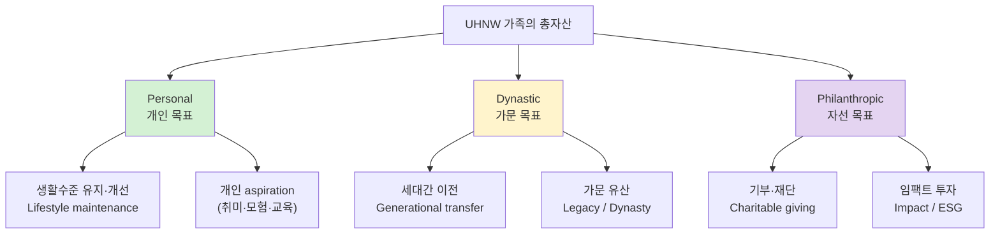
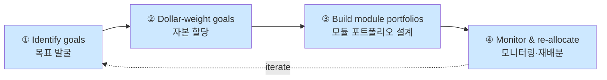
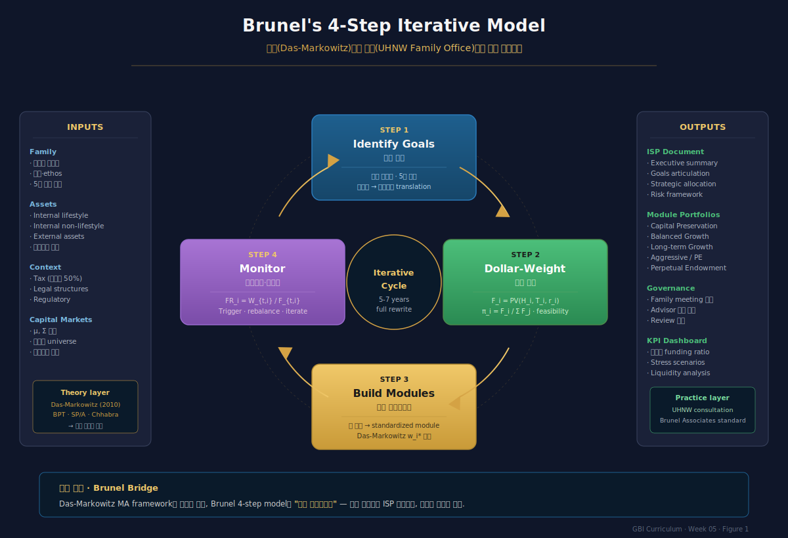
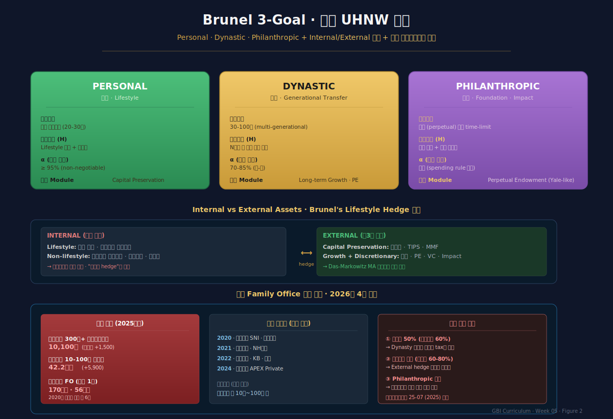

# Week 5 · Brunel의 실무 Goals-Based Wealth Management

> **이번 주의 논지**
> 1~4주차에서 우리는 GBI의 **이론적 backbone**을 구축했다 — Markowitz 한계, Prospect/MA/SP/A 심리학, BPT 포트폴리오이론, Das-Markowitz 수학적 동등성. 그러나 이 모든 수식은 **한 명의 실제 UHNW 고객 앞에서 작동해야** 의미가 있다. Jean L.P. Brunel (전 JP Morgan private bank CIO, 현 Brunel Associates 대표)는 2002년 이래 **"이론을 실무 UHNW·가족 단위 자산관리로 운영 가능하게 만든" 표준 프레임**을 정립했다. 본 주차는 Brunel의 (1) 3-goal 분류, (2) Internal/External asset 구조, (3) 4-step iterative model, (4) ISP(Investment Strategy Proposal) 작성 프로토콜을 다루며, 한국 패밀리오피스 산업(2025년 말 삼성증권 170가문·56조 원 등)의 현실에 연결한다.

---

## 0. 강의 로드맵 (3 hours)

### 이 주차의 인포그래픽
- **Figure 1** (§4 말미): Brunel 4-Step Iterative Model 전체 워크플로우
- **Figure 2** (§6 말미): Brunel 3-Goal + Internal/External + 한국 Family Office 지형

### 강의 구성
| 구간 | 시간 | 내용 |
|---|---|---|
| §1 | 15분 | Recap: 이론에서 실무로, Brunel의 문제의식 |
| §2 | 30분 | 3대 목표 범주 — Personal · Dynastic · Philanthropic |
| §3 | 30분 | Internal vs External Assets — Lifestyle Hedge |
| §4 | 40분 | 4-Step Iterative Model |
| §5 | 35분 | ISP (Investment Strategy Proposal) 작성 프로토콜 |
| §6 | 20분 | 한국 Family Office 산업 지형 (삼성증권·미래에셋·KB) |
| §7 | 20분 | 케이스 스터디: 가상 UHNW 가계의 ISP |
| §8 | 10분 | 과제 및 다음 주 예고 |

---

## §1. Recap — 이론에서 실무로 (15 min)

### 1.1 "수학적으로 정답, 실무에서 침묵"의 역설

4주차까지 우리는 다음을 확립했다:
- GBI는 MV와 수학적으로 양립 가능
- chance-constrained 문제 = VaR 제약 = MVU with 특정 $\gamma$
- Aggregate portfolio는 MV 효율선 위

그러나 현실에서 JP Morgan Private Bank, UBS Global Wealth Management, Citi Private Bank 등의 UHNW 담당자가 Das-Markowitz 수식을 가지고 **고객 미팅에 들어가지는 않는다**. 왜?

### 1.2 실무가 직면하는 3가지 추가 문제

**Problem A — Goal articulation**
고객은 "$H_i = 1.5$억, $\alpha_i = 0.95$, $T_i = 2035$"로 말하지 않는다. 고객은 "자녀 결혼할 때 집 한 채는 사줘야지"로 말한다. 이 자연어를 (투자자 본인이 인지하지 못한 채로) 4-tuple로 **번역(translate)** 하는 것이 어드바이저의 일.

**Problem B — Multi-generational structure**
Das-Markowitz의 단일 투자자 가정은 **가족 단위에서 깨진다**. 부모 세대의 위험선호, 자녀 세대의 위험선호, 손주 세대의 위험선호가 모두 다르고, 자산의 **귀속도 layered**다.

**Problem C — Beyond financial assets**
부의 상당 부분이 **비금융자산**: 기업 지분, 부동산, 예술품, 인적자본. Das-Markowitz는 금융자산 $n$개 universe를 가정하지만, UHNW의 실무에서는 **non-fungible illiquid asset이 자산의 60-80%** 를 차지할 수 있다.

### 1.3 Brunel의 기여 — "이론의 산업 언어로의 번역"

Jean Brunel은 이 세 공백을 30여 년의 실무(JP Morgan CIO, GenSpring Family Offices CIO, Brunel Associates 창업)와 저술(*Journal of Wealth Management* 창립 편집장 1998~, *Integrated Wealth Management* 2002, *Goals-Based Wealth Management* 2015)로 메웠다. Das-Markowitz(2010)의 수학이 Brunel의 **실무 프레임으로 옮겨갈 때**, 비로소 GBI는 **산업 표준**이 된다.

이 번역의 4가지 축:
1. **3-goal taxonomy** (Personal · Dynastic · Philanthropic)
2. **Internal/External asset structure** (Lifestyle hedge)
3. **4-step iterative model** (identify → dollar-weight → translate → monitor)
4. **ISP document** (고객이 읽고 서명하는 프로포절 양식)

---

## §2. Brunel의 3대 목표 범주 (30 min)

### 2.1 Personal · Dynastic · Philanthropic

Brunel(2011, *JWM* "*Goal-Based Wealth Management in Practice*")에서 제시된 3-goal taxonomy:



### 2.2 각 범주의 특성

**Personal Goals (개인)**
- 시간지평: 투자자 본인의 **잔여 기대수명**
- 필요자본: 현재 lifestyle 현가 + 인플레이션 조정
- 리스크 허용: 상대적으로 **낮음** (lifestyle 붕괴 회피가 우선)
- 대표 자산: 현금·단기채·균형 포트폴리오·소량 성장주

**Dynastic Goals (가문)**
- 시간지평: **multi-generational** (30-100년)
- 필요자본: "N세대 이후에 원하는 가족 부의 규모"
- 리스크 허용: 장기 지평 덕에 **중-고**
- 대표 자산: 분산 주식·PE·부동산·family trust

**Philanthropic Goals (자선)**
- 시간지평: **영구적** (perpetual endowment) 또는 time-limited
- 필요자본: 기부 규모 + 재단 운영비
- 리스크 허용: **가변적** (endowment spending rule에 의존, Yale 사례)
- 대표 자산: 재단형 분산 포트폴리오, 임팩트 투자

### 2.3 "Needs come before Goals" — 기저 생활필요

Brunel(2011): "personal goals에 앞서 food and shelter 같은 기본 필요가 있다. 그러나 UHNW 고객에게는 이것이 일반적으로 문제되지 않으며, 해결된 이후 personal goals부터 시작한다."

이는 1주차 Chhabra의 3-bucket과 **호응**한다:
- Chhabra Personal ≈ Brunel Needs + Personal
- Chhabra Market ≈ Brunel Personal (Lifestyle 유지)
- Chhabra Aspirational ≈ Brunel Dynastic + Philanthropic

차이:
- Chhabra는 **모든 개인투자자**에게 통용되는 프레임 (리테일부터 UHNW까지)
- Brunel은 **UHNW 가족** 중심 — Needs가 trivial하다고 가정하고 세대·자선을 세분화

### 2.4 목표 간 우선순위와 trade-off

**원칙 1 — Lifestyle은 "반드시 충족" (non-negotiable)**
Personal goal 미달은 "fail"이다. 다른 목표를 희생해서라도 우선 충족.

**원칙 2 — Dynastic은 "discretionary wealth"에서**
CFA Level III 자료: *"Goals not related to lifestyle form part of the family's discretionary wealth, and excess assets should be allocated to a long-term growth portfolio."*

즉 Lifestyle 확보 이후 **잉여분(excess wealth)** 만 Dynastic/Philanthropic에 배분.

**원칙 3 — Philanthropic은 tax-advantaged**
자선 목표는 많은 국가에서 세제 혜택(기부금 공제·재단형 면세)이 있어, **세후 수익률 관점**에서 효율적 자본투입이 가능. 한국도 기부금 세액공제·공익법인 관련 제도 존재.

### 2.5 Brunel 5대 질문 (Brunel 2011)

고객 인터뷰에서 묻는 핵심 5개 질문:

1. **Purchasing power 유지 기대**: 세대 후에도 같은 실질 lifestyle을 유지?
2. **Family 성장 수용**: 가족 수가 증가할 때의 대응?
3. **인플레이션 우려**: 특정 경제적 충격 시나리오에 대한 민감도
4. **Wealth equitable 분배**: 세대간 형평성 (equitable distribution)의 중요도
5. **Scoring(평가) 방식**: 투자성과를 "어떤 언어로" 측정?

5번이 특히 중요하다. "벤치마크 대비" vs "목표 달성확률" vs "실질 구매력 보존" 중 고객이 어떤 기준으로 성공·실패를 판단하는지에 따라 **운용 전략이 근본적으로 달라진다**. 이것이 GBI 본질.

---

## §3. Internal vs External Assets — Lifestyle Hedge (30 min)

### 3.1 Brunel의 핵심 구분

Brunel 2011 후반부에 도입된 중요 개념: 가족 자산을 **internal / external**로 나눔.

| 구분 | 정의 | 예시 | GBI 역할 |
|---|---|---|---|
| **Internal assets** | 가족이 직접 운영·통제 | 가족기업 지분, 주택, 예술품 | Lifestyle 충족에 직접 기여 |
| **External assets** | 제3자가 운영, 시장성 있음 | 증권·펀드·외부 관리 PE | Lifestyle hedge + 성장 |

### 3.2 Lifestyle Asset의 개념

Internal asset 중 **lifestyle 유지를 목적으로 보유하는 것** (주거 주택·가족기업 운영자본·가족 재단 운영지분 등) 은 **투자 포트폴리오 최적화에서 제외**한다.

이유:
- 이들은 "매각 불가" (psychologically non-fungible)
- 수익률 상관관계 추정 무의미
- 가족 정체성의 일부 — financial optimization의 대상 아님

### 3.3 External Non-Lifestyle Assets의 3가지 용도

Lifestyle에서 분리된 external 자산은 세 용도로 배분:

**Capital Preservation**
- 인플레이션 보존 + 원금 안정
- Internal lifestyle의 **hedge**: 가족기업이 악화되면 외부 자산으로 보완
- 자산군: 단기채·TIPS·분산 투자등급 채권

**Wealth Growth (Dynastic)**
- 장기 실질 성장
- 자산군: 분산 주식·PE·부동산

**Discretionary (Aspirational·Philanthropic)**
- 기회 포착 + 자선
- 자산군: 집중 equity·hedge fund·VC·impact investments

### 3.4 수식적 표현

$$
W^{\text{total}}_{\text{family}} = W^{\text{internal}}_{\text{lifestyle}} + W^{\text{external}}_{\text{non-lifestyle}}
$$

$$
W^{\text{external}}_{\text{non-lifestyle}} = \pi_P W^{\text{ext}} + \pi_D W^{\text{ext}} + \pi_F W^{\text{ext}}
$$

여기서 $\pi_P, \pi_D, \pi_F$는 각각 Personal·Dynastic·Philanthropic에 대한 external 자산의 할당 비중 ($\sum = 1$).

**핵심 통찰**: 최적화는 **$W^{\text{external}}_{\text{non-lifestyle}}$ 만을 대상으로** 수행한다. Internal lifestyle 자산은 "주어진 hedge"로 treat.

### 3.5 가족기업(Family Business)의 이중 역할

가족기업이 가장 중요한 internal asset이며 동시에 **가장 큰 집중위험**:
- 가족 수입의 50-80% 의존
- 주식 자산 portfolio의 비공개·비유동 구성요소
- 2세·3세 승계 시 liquidity crunch

**Brunel의 처방**:
1. 가족기업 **잠재 매각가치를 추정**
2. 외부 포트폴리오는 "if 가족기업 = 0이 되면 남는 자산으로 살 수 있는 lifestyle 수준"을 만들도록 **over-hedge**
3. 가족기업 출구 시나리오(IPO·M&A)의 개연성에 따른 **dynamic asset allocation**

한국 맥락: 한국 대기업 지배가족의 주된 이슈 — 지주회사·상속세 이슈와 결합하면 **external hedge의 중요도 극단적으로 상승**.

---

## §4. Brunel's 4-Step Iterative Model (40 min)

### 4.1 전체 개요

Brunel(2011)의 4-step iterative model — **CFA Institute 2012 publication의 핵심 알고리즘**:



### 4.2 Step 1 — Identify Goals (목표 발굴)

**과정**:
- 가족 구성원 인터뷰 (통상 30-60분 × 3-5회)
- 세대별 priority 표명 (부모 vs 자녀 vs 손주)
- 가족 가치·이상(ethos) 공식화

**출력**: 목표 목록 (보통 5-15개)
- Ex: "65세 은퇴 후 월 3천만 원 lifestyle", "2035년 자녀 유학자금 5억", "2045년 재단 설립 100억", "Dynasty 2차 3대 후 50억 실질"

**핵심 도구**: Brunel 5대 질문 (§2.5)

### 4.3 Step 2 — Dollar-Weight Goals (자본 할당)

각 목표에 **필요 자본**의 현가 계산:
$$
F_i = \text{PV}_0(H_i,\, T_i,\, r_i^{\text{real}})
$$

여기서 $r_i^{\text{real}}$은 해당 목표의 **실질 할인율** (인플레이션 조정).

**할당 비중**:
$$
\pi_i = \frac{F_i}{\sum_j F_j}
$$

**중요한 점**: $\sum_j F_j \le W^{\text{external}}_{\text{non-lifestyle}}$이 아니라면 — 즉 **목표의 필요 자본 합이 external 자산보다 크다면** — 일부 목표를 포기·축소·시간이동 해야 한다. Brunel이 "의사는 말기환자에게 비싼 수술을 권하지 않는다"는 비유로 **feasibility check**를 강조하는 지점.

### 4.4 Step 3 — Build Module Portfolios (모듈 포트폴리오)

각 목표마다 **독립적 sub-portfolio** $w_i^*$를 구성 — Das-Markowitz MA framework 적용:

$$
w_i^* = \arg\max_{w}\; \mu^\top w \quad \text{s.t. } \Pr(W_T^i < H_i) \le \alpha_i,\; \mathbf{1}^\top w = 1
$$

**"Module" 개념의 실무적 의미**: 금융기관이 **표준화된 sub-portfolio 메뉴**를 미리 구축해두고, 각 목표에 맞는 것을 조합. 예:
- Module A: "Capital Preservation" (bond 80%)
- Module B: "Balanced Growth" (equity 50%)
- Module C: "Long-term Growth" (equity 80%)
- Module D: "Aggressive Growth" (PE 50%)
- Module E: "Perpetual Endowment" (Yale-like)

각 모듈의 $(\mu, \sigma, Pr(W_T < H))$가 문서화되어 있어, Step 2의 $(H_i, T_i, \alpha_i)$ 입력만으로 자동 매칭.

### 4.5 Step 4 — Monitor & Re-allocate (모니터링·재배분)

**Monitoring KPIs**:
- 목표별 **funding ratio**: $\mathrm{FR}_i = W_{t,i} / F_{t,i}$
- $\mathrm{FR}_i > 1.2$: overfunded — de-risking 또는 타 목표 이전 고려
- $\mathrm{FR}_i < 0.8$: underfunded — 추가 납입 또는 목표 조정

**재배분 trigger**:
1. 시장 대폭 movement (MA 가정 위반)
2. 목표 시점 접근 (duration 감소)
3. 목표 자체의 변경 (신생아·결혼·이혼 등)
4. External asset 대비 internal asset 비율 급변 (가족기업 가치 변동)

**Iterative의 의미**: Step 4의 결과가 Step 1로 feedback. 목표가 이동·재정의되고 다시 사이클.

### 4.6 Das-Markowitz (2010) 대비 Brunel의 추가 기여

| 요소 | Das-Markowitz (2010) | Brunel (2011, 2015) |
|---|---|---|
| 목표 정의 | 외생적 $(H, T, \alpha)$ | 인터뷰·translation 프로세스 |
| $\pi_i$ 결정 | 외생적 | Dollar-weighting via PV |
| Portfolio 구축 | Analytical | Module library |
| 동적 업데이트 | 정적 framework | 4-step iterative cycle |
| 대상 | 단일 투자자 | 가족·multi-generational |
| Internal asset | 고려 안 함 | Explicit lifestyle hedge |
| Implementation | 학술·알고리즘 | ISP 문서·고객 서명 |


*Figure 1 · Brunel의 4-Step Iterative Model(Identify → Dollar-Weight → Build Modules → Monitor). Das-Markowitz 수학 엔진과 UHNW 실무 워크플로우의 bridge.*

---

## §5. ISP — Investment Strategy Proposal 작성 프로토콜 (35 min)

### 5.1 ISP의 정의와 역할

**ISP (Investment Strategy Proposal)**: UHNW 가족이 어드바이저와 체결하는 **종합 투자전략 제안서**. 법적 구속력은 IPS(Investment Policy Statement)보다 약하지만, **실무 작동의 기초 문서**.

ISP의 기능:
1. **Translation record**: 가족 언어(자연어 목표) → 4-tuple 재무언어
2. **Commitment device**: 시장 변동에서 행동편향을 억제하는 장치
3. **Delegation protocol**: 어드바이저의 의사결정 권한 범위 규정
4. **Monitoring baseline**: 향후 KPI 평가의 기준선

### 5.2 ISP의 표준 구성 (Brunel 2015 기반)

```
[섹션 1] Executive Summary
  - 가족 현황 요약 (2-3 세대)
  - 주요 external asset 규모
  - 3-goal 구조 요약

[섹션 2] Family Profile
  - 구성원 프로파일 (나이·직업·소득)
  - Internal lifestyle assets 목록
  - 가족기업 지분·기업구조 개요

[섹션 3] Goals Articulation
  - Personal goals (각 세대별)
  - Dynastic goals (명시적 세대간 이전 계획)
  - Philanthropic goals (재단·기부·impact 계획)
  - 각 목표의 (H, T, α, π)

[섹션 4] Strategic Asset Allocation
  - External asset total allocation
  - Module mapping: 목표 → module portfolio
  - Illiquidity budget (PE·부동산·VC 비중)
  - Tax-efficient asset location (계정별 배치)

[섹션 5] Risk Framework
  - 목표별 shortfall probability
  - Stress scenarios (가족기업 실패·상속 이벤트)
  - Liquidity stress (5년 / 10년 / 20년 cashflow)

[섹션 6] Governance
  - 가족 의사결정 구조
  - Advisor 권한 범위
  - Family meeting 주기

[섹션 7] Monitoring & Review
  - KPI (funding ratio 기반)
  - 분기·반기·연간 review 일정
  - Rebalancing trigger

[부록] Policy Exceptions, Tax Considerations, Legal Structures
```

### 5.3 ISP 작성 실무의 6대 원칙

**원칙 1 — 고객 언어 우선**
수식은 부록으로. 본문은 "자녀가 30세 되었을 때 X", "2050년 가족 재단이 Y" 등의 자연어.

**원칙 2 — 가족 정체성 통합**
단순 재무 문서가 아닌 **가족 미션 선언문** 성격. Brunel: ISP는 가족 가치의 공식 기록.

**원칙 3 — Feasibility 명시**
목표 달성 불가능한 경우를 **숨기지 않고** 명시. 우선순위 재조정 옵션 제시.

**원칙 4 — Scenario 표현**
단일 포트폴리오 수익률이 아닌 **Monte Carlo 시나리오** ("90% 확률로 달성, 중위값 시점은 2038년").

**원칙 5 — 세대간 확장성**
후세대가 **상속·승계** 시점에서 이해·수정 가능한 문서 구조.

**원칙 6 — 정기 재작성**
ISP는 **살아있는 문서**. 5-7년 주기로 전면 재작성, 연간 minor update.

### 5.4 ISP의 모니터링 KPI — Funding Ratio Dashboard

```
─────────────────────────────────────────────────
Goal            Target PV   Current   FR    Status
─────────────────────────────────────────────────
Lifestyle 1세대 30억         33억     110%  ● OK
Lifestyle 2세대 40억         38억      95%  ◐ Watch
Education 유학  8억          9.5억    119%  ● Ahead
Dynasty 3세대   80억         72억      90%  ◐ Watch
Foundation 2045 100억        95억      95%  ◐ Watch
─────────────────────────────────────────────────
Aggregate external 258억     247.5억  96%
```

이 대시보드가 **Brunel iterative model의 Step 4 핵심 도구**. 각 셀이 trigger일 수 있음.

### 5.5 학술 연계 — ISP가 Das-Markowitz를 어떻게 구현하는가

각 Goal 행은 4주차 MA sub-portfolio의 구현:
- Target PV $F_i$ = `solve_ma(H_i, alpha_i)`의 입력
- Current $W_{t,i}$ = 해당 sub-portfolio의 현재 가치
- FR $= W_{t,i}/F_{t,i}$ = "goal achievement probability"의 직관적 대체 지표

Aggregate 행이 **"MV 효율성을 유지하며 다목표 개인화"** 를 시각화.

---

## §6. 한국 Family Office 산업 지형 (20 min)

### 6.1 시장 규모 — 2025년말 기준 최신 데이터

- **KB 2024 한국 부자 보고서**: 금융자산 300억 원 이상 **초고액 자산가 1만 100명** (전년비 +1,500명)
- 10억~100억 자산가: **42만 1,800명** (+5,900)
- **삼성증권 패밀리오피스**: 2024년 5월 100가문·30조 원 → 2026년 초 **170가문·56조 원** 돌파
- 자본시장연구원(2025): 8대 증권사(삼성·한국·신영·NH·신한·KB·하나·미래에셋) 모두 패밀리오피스 서비스 런칭 완료 (2020–2024)

### 6.2 국내 증권사 패밀리오피스의 Brunel 적용도

한국 증권사의 PB 서비스가 Brunel framework에 얼마나 근접한지 진단:

| Brunel 요소 | 국내 현황 (2026년) |
|---|---|
| 3-goal taxonomy | 부분적 — Personal/Dynastic은 도입, Philanthropic은 초기 단계 |
| Internal/External 구분 | **국내 특수성**: 가족기업·상장주식 지배주주 이슈로 미흡 |
| 4-step iterative | 연간 review는 있으나 체계적 Monte Carlo 부족 |
| Module portfolios | ETF·펀드 바스켓 수준, "Module" 이라기엔 단순 |
| ISP 문서 | Investment Proposal은 있으나 Brunel ISP의 기능성(scenario·feasibility)에 미달 |
| Monte Carlo 기반 KPI | **케이봇쌤·KB골든라이프 등에서 초기 구현** |

### 6.3 한국 패밀리오피스의 고유 과제

**과제 1 — 상속세·증여세의 극단적 부담**
한국의 상속세 최고세율 50%(최대주주 할증 시 60%) → **Dynasty goal 설계에서 tax가 goal의 거의 절반**을 잠식. 미국·싱가포르 대비 압도적으로 높음.

**과제 2 — 가족기업 지배구조 연동**
국내 UHNW의 자산 집중 구조는 가족기업 지분에 극도로 집중. **외부 자산으로 내부 자산의 concentration risk를 hedge하는 Brunel 프레임**이 특히 중요.

**과제 3 — Philanthropic의 저조**
미국·유럽 대비 한국 UHNW의 philanthropic allocation 절대적 저조. 세제 혜택·공익법인 신뢰 이슈 복합. 앞으로 세대 교체와 함께 **가장 빠르게 성장할 여지**가 있는 영역.

**과제 4 — Non-lifestyle external asset의 다양성 부족**
해외 PE·VC·부동산·private credit 접근성이 리테일 UHNW에게 여전히 제약적. 규제·환전·세제 복합 장벽.

### 6.4 변화의 방향

자본시장연구원(2025) 보고서의 처방:
1. PE·VC 관련 내부 딜 소싱 확대 (IB-WM 연계)
2. 해외 오프쇼어 family office와의 제휴
3. 세무·법무·가업승계 전문가 통합 팀 구성
4. **Brunel의 4-step iterative model**을 standard로 채택

한국 GBI의 미래는 이러한 패밀리오피스·UHNW 시장에서 **먼저** 진화한 뒤, 그 모델이 매스 리테일로 **다운스트림**될 가능성이 높다 (미국 사례와 동일한 경로).

### 6.5 미래에셋·KB·하나의 접근 차별화

- **삼성증권 (SNI 프리미엄)**: UHNW 단일 컨설턴트 중심, 가족기업 M&A·상속 자문
- **미래에셋 (APEX Private Club)**: 글로벌 자산배분 강점, TDF에서 UHNW까지 일관된 goal-based 언어
- **KB (Gold&Wise the FIRST)**: 디지털 골든라이프 + 오프라인 PB 결합, 은퇴설계 시스템 표준화
- **신영·한국투자**: 전통적 PB 강점 계승, 가문별 맞춤 portfolio
- **NH·신한**: 농지·IPO 등 특수 asset class 접근 강점

각 하우스의 차이가 **Brunel의 framework를 어느 부분에 특화해 적용하는가**의 전략적 선택.


*Figure 2 · Brunel 3-Goal Taxonomy(Personal·Dynastic·Philanthropic) + Internal/External Asset 구조 + 한국 Family Office 지형(삼성증권 170가문·56조, 초고액자산가 1.01만 명, 한국 특수 과제).*

---

## §7. 케이스 스터디 — 가상 UHNW 가계의 ISP (20 min)

### 7.1 케이스: 이정호 회장 가족

**프로파일**
- 이정호(68세, 회장), 배우자 박미경(65세)
- 자녀 2명: 이성민(42세, CEO 승계 예정), 이지원(39세, 미국 거주)
- 손주 4명 (8–15세)

**자산 현황 (추정, 단위: 억원)**
- 가족기업 지분 (비상장): 1,200억 (estimated)
- 상장주식 (기업 지분): 600억
- 국내 부동산 (주거·빌딩): 400억
- 해외 금융자산: 250억
- 국내 금융자산: 150억
- **총자산: 약 2,600억**

**Lifestyle / Non-lifestyle 분리**
- Internal lifestyle: 주거 100억
- Internal non-lifestyle: 가족기업 1,200억 + 상장지분 600억 + 빌딩 300억 + 해외사업 100억 = **2,200억** (집중)
- External non-lifestyle: 250 + 150 = **400억**

### 7.2 3-Goal Articulation

**Personal Goals**
- 부부 여생 lifestyle: 연 20억 × 20년 = **현가 약 300억** (세후)
- 자녀 가족 생활지원: 연 5억 × 30년 × 2 = 300억
- **Sub-total: 약 600억**

**Dynastic Goals**
- 2세 승계 자본: 가족기업 100% + 추가 300억 = 1,500억 대상
  - 상속세 50% 가정 시 → **순자산 전달 = 750억 목표**
  - 필요 유동자금(상속세 납부 준비): **약 750억 cash liquidity**
- 3세(손주) 신탁: 장기 50년, 목표 현가 200억

**Philanthropic Goals**
- 교육재단 설립: 2035년 300억 목표
- 연간 기부: 연 10억 × perpetual

### 7.3 Feasibility Check

External asset 400억 vs 목표:
- 상속세 준비 금액만 750억 필요 (2-3세 승계 시점)
- External 400억으로는 **압도적 부족**

→ **반드시** internal asset 일부 monetization 필요:
1. 부동산 일부 매각 → 200-300억 유동화
2. 가족기업 IPO → 500-1,000억 유동화
3. 보험 활용 (종신보험 leverage) → 상속세 재원 확보

### 7.4 Module Portfolio Mapping

External 400억 + liquidity 확보분 (500억 가정) = **운용 대상 900억**

| 목표 | 배분 | Module | 특성 |
|---|---|---|---|
| Personal (부부 lifestyle) | 300억 | Capital Preservation | bond 70%·equity 30% |
| Personal (자녀 지원) | 200억 | Balanced Growth | equity 50%·bond 50% |
| Dynasty (손주 50년) | 200억 | Long-term Growth | equity 75%·PE 25% |
| Foundation (2035) | 150억 | Perpetual Endowment | Yale-like 분산 |
| Liquidity Buffer (상속세) | 50억 | Cash/단기채 | MMF |

### 7.5 학생 토론 질문

1. 이 가족의 **실제 bottleneck**은 자산배분이 아니라 상속세 재원. Brunel framework가 이 이슈에 충분히 대응하는가?
2. 가족기업 IPO 시점의 **optionality**를 어떻게 ISP에 반영할 것인가?
3. 한국 특수성(상속세·지배주주 할증)을 고려할 때 Philanthropic 비중을 얼마나 늘리는 것이 현실적·효율적인가?
4. 이지원(39세, 미국 거주)의 **해외 goals**를 ISP에 별도 module로 포함할지, 통합할지?
5. 손주 세대(8-15세)가 **아직 goals를 표명할 수 없는** 상황에서 3세 신탁 설계는 어떻게 할 것인가?

---

## §8. 과제 및 다음 주 예고 (10 min)

### 8.1 과제 (팀 프로젝트, 팀당 4-5명, 10페이지)

**Comprehensive ISP Drafting**
가상 UHNW 가족을 설정(본인 실제 지인 x 참고 금지)하여 **full ISP를 작성**:

1. **Family Profile** (2p): 3세대 가족 구성·자산 현황·가족기업 개요
2. **Goals Articulation** (2p): Personal·Dynastic·Philanthropic 각 목표의 $(H, T, \alpha, \pi)$
3. **Feasibility Analysis** (1p): 목표 자본 합계 vs external asset
4. **Strategic Asset Allocation** (2p): 각 목표 → Module 매핑, total portfolio 구성
5. **Risk & Monitoring** (1p): Funding ratio dashboard 설계, stress scenarios
6. **한국 특수성 반영** (2p): 상속세·지배주주·규제 대응

**평가 기준**:
- Brunel 4-step의 체계적 적용
- 수학적 내용(Das-Markowitz 수식)과 실무 언어의 균형
- 한국 맥락의 현실성
- Feasibility 이슈의 명시적 논의

### 8.2 Reading
- **Brunel, J.L.P. (2011)**. "Goal-Based Wealth Management in Practice." *Journal of Wealth Management*, 14(3), 17–26. **[필독]**
- **Brunel, J.L.P. (2012)**. "Goals-Based Wealth Management" *CFA Institute*. [CFA publication 요약]
- Brunel, J.L.P. (2015). *Goals-Based Wealth Management: An Integrated and Practical Approach to Changing the Structure of Wealth Advisory Practices*. Wiley. Ch. 1–5 권장.
- 자본시장연구원 최순영 (2025). "국내 증권사의 초고액자산가 자산관리 전략: 패밀리 오피스 서비스." 이슈보고서 25-07. **[한국 현황 권장]**
- KB 2024 한국 부자 보고서 (KB 경영연구소) [권장]

### 8.3 다음 주 예고 — Week 6: Martellini PSP/GHP Framework
기관의 LDI(Liability-Driven Investing)가 어떻게 개인 은퇴문제로 확장되는가. **Performance-Seeking Portfolio (PSP) + Goal-Hedging Portfolio (GHP)** 이중분해, risk budget 동적배분, EDHEC Retirement Goal-Based Investing Index.

---

## 부록 A — Brunel 3-Goal Taxonomy와 Chhabra 3-Bucket의 대응

| Brunel (2011, UHNW) | Chhabra (2005, Universal) | 공통 특징 |
|---|---|---|
| Needs (기저) | Personal | 99% 필수·bond |
| Personal | (Personal의 일부) | 생활수준 |
| Dynastic | Market | 장기성장·분산 |
| Philanthropic | Aspirational | 장기·부의 확대 |

Brunel의 프레임은 Chhabra보다 **UHNW 맥락에 더 풍부**하지만, 수학적 구조는 동일한 Das-Markowitz MA framework로 통합 가능.

## 부록 B — Brunel 4-Step 상세 체크리스트

```
STEP 1 — Identify Goals
  [ ] 각 세대 구성원 인터뷰 완료
  [ ] Brunel 5대 질문 응답 문서화
  [ ] 가족 ethos·미션 공식화
  [ ] 목표 리스트 5-15개 도출

STEP 2 — Dollar-Weight Goals
  [ ] 각 목표 H_i 현가 계산 (인플레이션 조정)
  [ ] 실질 할인율 r_i 결정
  [ ] π_i = F_i / Σ F_j 산출
  [ ] Feasibility check: Σ F_j ≤ W^ext?

STEP 3 — Build Module Portfolios
  [ ] 각 목표 → module 매핑
  [ ] Module별 expected (μ, σ, shortfall prob)
  [ ] Illiquidity budget 통합
  [ ] Asset location (tax account) 결정

STEP 4 — Monitor & Re-allocate
  [ ] Funding ratio dashboard 구축
  [ ] Trigger rule 문서화 (FR > 1.2 or < 0.8)
  [ ] Rebalancing 주기 결정
  [ ] Annual review 일정 수립
  [ ] Re-iterate to Step 1
```

## 부록 C — ISP 샘플 Table of Contents

```
1. Executive Summary
2. Family Profile
   2.1 Family Members
   2.2 Internal Assets (Lifestyle)
   2.3 Family Business Overview
3. Goals Articulation
   3.1 Personal Goals
   3.2 Dynastic Goals
   3.3 Philanthropic Goals
   3.4 Goals Hierarchy & Trade-offs
4. Strategic Asset Allocation
   4.1 External Asset Total
   4.2 Module Mapping
   4.3 Illiquidity Budget
   4.4 Tax-Efficient Asset Location
5. Risk Framework
   5.1 Goal-Level Shortfall Probabilities
   5.2 Stress Scenarios
   5.3 Liquidity Analysis
6. Governance
7. Monitoring & Review
Appendices
   A. Quantitative Methodology
   B. Tax & Legal Considerations
   C. Module Portfolio Specs
```

## 부록 D — 학습 리소스
- **저서**: Brunel *Goals-Based Wealth Management* (2015, Wiley)
- **논문**: JWM 14(3) 2011 original paper
- **비디오**: CFA Society Los Angeles 2014 Brunel lecture
- **산업보고서**: CCFS Global Family Office Report (annual)
- **한국자료**: KB 한국 부자 보고서 (annual), 자본시장연구원 UHNW 이슈보고서
