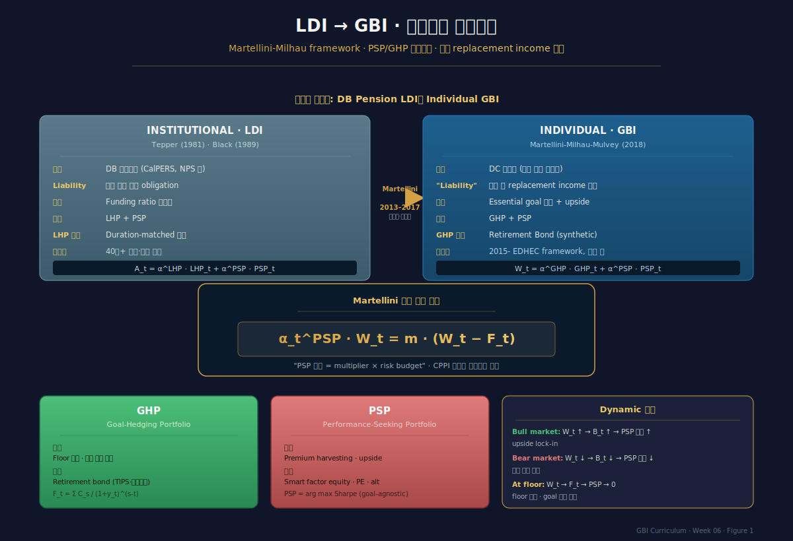
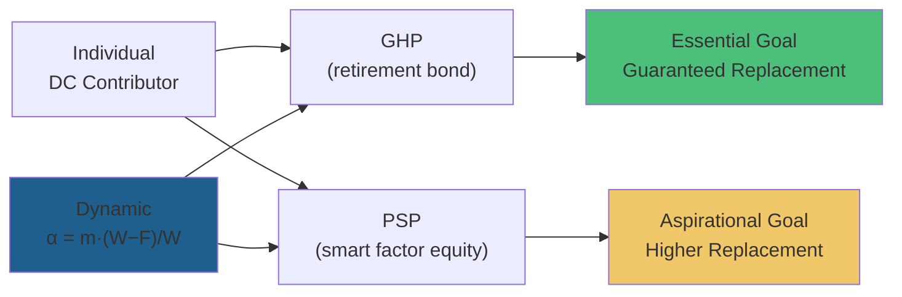

# Week 6 · Martellini PSP/GHP — LDI에서 개인 은퇴문제로

> **이번 주의 논지**
> 5주차 Brunel이 **UHNW 가족**을 위한 실무 GBI였다면, 6주차는 **은퇴를 앞둔 평범한 DC 가입자**(수억 명 규모)의 GBI다. Lionel Martellini (EDHEC Risk Institute 소장)와 Vincent Milhau의 연구 프로그램은 기관의 LDI(Liability-Driven Investing)에서 출발해 **개인 은퇴문제로 확장된 두 축(PSP/GHP) 분해**를 통해 GBI를 **동적 정책**으로 진화시켰다. 이 프레임은 Das-Markowitz의 정적 MA framework를 넘어, **시간에 따라 상태(W_t)에 반응하는 투자 정책** $w^*(W_t, t)$을 도출한다. 핵심 아이디어: **PSP allocation = multiplier × risk budget** — 동적 core-satellite. 한국에서 이 프레임의 현실적 의의는, 국민연금 2055년 고갈·DC 디폴트옵션 도입·퇴직연금 400조 원 규모라는 거대한 실무 맥락에서 결정적이다.

---

## 0. 강의 로드맵 (3 hours)

### 이 주차의 인포그래픽
- **Figure 1** (§2 말미): 기관 LDI와 개인 GBI의 구조적 병렬
- **Figure 2** (§5 말미): Martellini PSP/GHP CPPI 동적 배분 Python 시뮬레이션

### 강의 구성
| 구간 | 시간 | 내용 |
|---|---|---|
| §1 | 15분 | Recap: 정적 MA에서 동적 LDI-GBI로 |
| §2 | 25분 | LDI의 기원 — 기관연금의 자산-부채 매칭 |
| §3 | 30분 | Goal-Hedging Portfolio (GHP) — "Retirement Bond" |
| §4 | 30분 | Performance-Seeking Portfolio (PSP) — factor investing |
| §5 | 40분 | 동적 배분 규칙 — PSP = m × (W_t − F_t) |
| §6 | 20분 | EDHEC Flexicure Retirement Solution |
| §7 | 20분 | 한국 연금시장 적용: 2055년 고갈 + 디폴트옵션 |
| §8 | 10분 | 케이스 + 과제 |

---

## §1. Recap — 정적 MA에서 동적 LDI-GBI로 (15 min)

### 1.1 4-5주차의 결과

- 4주차 Das-Markowitz MA: 계정별 목표·확률 $\to$ MV 동등 해
- 5주차 Brunel: UHNW iterative model + ISP 문서화

그러나 이 둘은 모두 **정적(single-period) 프레임**이다. 실제 은퇴 준비는:
- **30–40년 장기 투자**
- **목표 시점이 고정** (예: 65세 은퇴)
- **자산 운용 중 시장 상황이 극단적으로 변화**
- **적절한 시점에 risk-on/risk-off 전환 필요**

정적 MA는 이 동적 요구에 답하지 못한다.

### 1.2 질문 — 45세 직장인의 문제

45세 DC 가입자, 현재 자산 1억, 65세 은퇴 시점 목표 **월 200만원 replacement income** (30년간 총 현가 약 4억).

- 2025년 지금 시장이 급등하면 어떻게? (자산이 앞서 달성하면)
- 2030년 위기로 자산이 반토막 나면? (목표 미달 임박)
- 2055년(국민연금 고갈 시점) 전후 어떤 전환 필요?

이 질문에 답하려면 **시간-상태에 반응하는 정책** $w^*(W_t, t)$ 이 필요.

### 1.3 Martellini의 2-축 대답

Lionel Martellini (EDHEC-Risk Institute 소장, 전 Marshall·Berkeley·Princeton)는 2015년경 다음 핵심 주장을 담은 연구 프로그램을 출범:

> "은퇴 문제는 단일 자산배분 문제가 아니라 **세 가지 risk management 형태의 조합**이다 — 다변화(diversification), 헷지(hedging), 보험(insurance). 개인 투자자도 이 셋을 활용할 수 있으며, 이는 **PSP/GHP 이중 분해**와 **risk budget 기반 동적 배분**으로 구현된다."

이 주장의 수학적 구현이 6주차의 핵심이다.

### 1.4 왜 "LDI"에서 출발하는가

Martellini의 통찰: **기관연금의 LDI와 개인 은퇴의 문제는 구조적으로 동일**하다.
- 기관: 미래 연금 지급 obligation을 현재 자산으로 충족
- 개인: 은퇴 후 생활비 obligation을 현재 자산으로 충족

차이는 거시/미시일 뿐. 따라서 40년 넘게 진화한 LDI 도구(duration matching, cashflow matching, glide path)를 **개인 차원으로 down-scale**하면 된다.

---

## §2. LDI의 기원 — 기관연금의 자산-부채 매칭 (25 min)

### 2.1 DB 연금의 경제학

DB(Defined Benefit) 연금기금은 미래 연금 지급 의무(liability) $L_T$를 보유:
$$
L_T = \sum_{t} \text{payment}_t = \text{PV of future pension cashflows}
$$

이 liability는 **금리·인플레이션·longevity에 민감**. 기금의 문제:
$$
\max_{w_t} \; U(A_T - L_T) \quad \text{s.t. funding rule}
$$

여기서 $A_T$는 자산, $A_T - L_T$는 **surplus** 또는 funding ratio $A_T/L_T$.

### 2.2 Traditional Asset-Only vs LDI

**Asset-Only 전통적 접근**:
- 목표: asset의 기대수익 극대화
- 리스크: asset 변동성
- 실패 모드: liability가 급증해도 (예: 금리 하락) asset은 변함없이 운용 → funding gap 확대

**LDI 접근**:
- 목표: **funding ratio** $A_T/L_T$의 안정
- 리스크: **surplus risk** (자산·부채 수익률 차이)
- 성공 조건: asset의 sensitivity를 liability sensitivity에 매칭

### 2.3 Liability-Hedging Portfolio의 구성

Liability를 **금리에 민감한 부채**로 모델링하면:
$$
\frac{dL_t}{L_t} = -D_L\, dr_t + \epsilon_t
$$
여기서 $D_L$은 liability duration.

**LHP (Liability-Hedging Portfolio)** 는 동일한 duration을 가진 채권 포트폴리오:
$$
\frac{dA^{\text{LHP}}_t}{A^{\text{LHP}}_t} = -D_A\, dr_t + \epsilon_t^A, \quad D_A = D_L
$$

이로써 금리 변동에 의한 liability 변동이 asset으로 **hedged**.

### 2.4 Fund Separation — "Two Funds of LDI"

Tepper(1981), Black(1989) 이래 LDI의 표준은 **two-fund separation**:
1. **LHP (Liability-Hedging Portfolio)**: liability 복제. 안전자산 (듀레이션·인플레이션 매치 채권)
2. **PSP (Performance-Seeking Portfolio)**: surplus 성장. 위험자산 (주식·대체)

연금기금의 자산:
$$
A_t = \alpha_t^{\text{LHP}} \cdot LHP_t + \alpha_t^{\text{PSP}} \cdot PSP_t
$$

**정태적 분해**: 목표 funding ratio에 따라 $\alpha^{\text{LHP}}, \alpha^{\text{PSP}}$ 결정.

### 2.5 개인 은퇴문제로의 번역

Martellini(2013, 2017)의 핵심 주장: **개인 은퇴문제에서도 동일 구조**가 성립한다.

- 개인의 "liability" = 은퇴 후 **replacement income** 현가
- 개인의 "LHP" = 이 replacement income을 보장하는 **개인형 안전 포트폴리오**
- 개인의 "PSP" = 추가 성장을 위한 위험자산

다만 **용어 재명명**:
- LHP → **GHP** (Goal-Hedging Portfolio) — "liability"는 기관 용어, "goal"로 재프레임

이 용어 전환은 사소해 보이지만 중요하다. 개인에게 "부채"는 부정적 감정을, "목표"는 긍정적 감정을 유발 — behavioral 이점. §3-4에서 GHP/PSP를 상세화한다.


*Figure 1 · 기관 LDI(DB 연금)와 개인 GBI(DC 가입자)의 구조적 병렬. LHP→GHP, 동일한 PSP, Martellini 동적 배분 규칙 $\alpha_t^{PSP} W_t = m(W_t - F_t)$.*

---

## §3. Goal-Hedging Portfolio (GHP) — "Retirement Bond" (30 min)

### 3.1 GHP의 개념

**GHP (Goal-Hedging Portfolio)** 는 **투자자의 목표 현가를 복제하는 포트폴리오**. 개념적으로:
- 만약 목표가 $T$ 시점에 $H$라면, GHP는 $T$에 $H$를 거의 확실히 제공하는 자산
- 이상적으로: $T$-만기 zero-coupon bond의 face value $H$

### 3.2 구체 — Retirement Bond

은퇴 replacement income 목표의 경우:
- 은퇴 시점 $T$부터 $T+20$ (또는 $T+30$) 년간 매년 $C$의 실질 income 지급
- GHP는 이 cashflow stream을 replicate하는 **forward-start bond ladder**

수식:
$$
\text{GHP 가치}_t = \sum_{s=T}^{T+20} \frac{C \cdot \text{CPI}_s}{(1+y_t^{(s-t)})^{s-t}}
$$

여기서 $y_t^{(s-t)}$는 만기 $s-t$의 실질수익률 곡선.

### 3.3 Synthetic Retirement Bond

미국을 제외한 대부분의 국가에서는 **실제 retirement bond가 거래되지 않는다**. 따라서 GHP는 **합성(synthetic)** 으로 구성:

**Cashflow matching**: 각 미래 cashflow에 매치되는 zero-coupon bond ladder
**Duration matching**: liability duration을 복제
**Factor matching**: 인플레이션·금리·longevity factor exposure 매칭

Martellini(2018)의 "retirement bond" 개념: `$1 face value = $1 replacement income 20년간 보장`의 합성 증권을 만들 수 있다면, 개인이 "내가 원하는 replacement income의 FV를 구매"하는 직관적 구조가 가능.

### 3.4 왜 단순 현금·단기채가 GHP가 아닌가

한국 맥락에서 흔한 오해: "은퇴 준비 = 안전하게 예금·MMF".

**잘못된 이유**: MMF나 단기국채는 **nominal value만 보존**. 20년 후 인플레이션에 의해 실질 구매력이 대폭 삭감될 수 있다.
- 2005년 월 200만원의 실질가치 vs 2025년 월 200만원 → 한국 CPI 누적 약 50% 상승
- 은퇴 **replacement income**을 목표로 하면 GHP는 반드시 **인플레이션 hedged**되어야 함

**올바른 GHP 구성**:
- TIPS (미국 Treasury Inflation-Protected Securities)
- 한국 물가연동국고채
- Duration-matched inflation-linked bond portfolio

### 3.5 GHP의 수학적 정의 (generalized)

목표 cashflow $\{C_s\}_{s=T}^{T+H}$에 대해:
$$
\text{GHP}_t = \mathbb{E}_t^Q\!\left[ \sum_{s=T}^{T+H} e^{-\int_t^s r_u\, du}\, C_s \right]
$$

실질 cashflow + real rate discounting (risk-neutral measure Q).

**GHP의 핵심 특성**:
- $t = T$ 접근 시 GHP 가치 = 목표 cashflow 현가와 정확히 일치
- GHP만 보유 시 목표 달성 확률 100% (금리 변동에도 robust)
- 단점: 기대수익 낮음 — upside 없음

### 3.6 GHP와 Floor의 연결

**Floor** $F_t$: "현 시점 투자자가 목표를 달성하기 위해 필요한 최소 자산"

$$
F_t = \text{PV}_t(\text{goal cashflow}) = \text{GHP}_t
$$

따라서:
- $W_t < F_t$ $\iff$ 현재 자산으로 GHP만 사도 목표 달성 불가 — **risk-off 필요**
- $W_t > F_t$ $\iff$ GHP보다 많은 자산 — **risk budget** = $W_t - F_t$ 확보

이 **risk budget 개념**이 §5 동적 정책의 핵심 재료.

---

## §4. Performance-Seeking Portfolio (PSP) — factor investing (30 min)

### 4.1 PSP의 역할

PSP는 **risk premia harvesting**을 담당하는 위험 포트폴리오. GHP가 "floor 확보"라면 PSP는 "upside 추구":
- 주식 equity premium
- Credit premium
- Factor premia (value, momentum, quality, low-vol)
- 대체투자 premia (PE, real estate, commodity)

### 4.2 PSP 설계의 자율성

Martellini-Milhau 2017의 핵심 주장: **PSP는 goal-specific일 필요 없다**. 이유:
- PSP는 premium harvesting이 목적
- GHP가 goal을 hedge하는 역할
- 따라서 PSP는 **"순수하게 risk-reward가 가장 좋은"** 형태로 설계하면 됨

이는 투자자별 PSP를 새로 만들 필요가 없음을 의미 — **mass production**에 유리. Martellini가 "scalability of PSP"를 강조하는 이유.

### 4.3 Factor-based PSP

단순 market-cap weighted equity 대신 **smart factor indexes**를 PSP로 활용:
$$
\text{PSP} = w_1 \cdot F_{\text{value}} + w_2 \cdot F_{\text{momentum}} + w_3 \cdot F_{\text{quality}} + w_4 \cdot F_{\text{low-vol}} + \ldots
$$

**이점**:
- 분산된 factor exposure → 더 높은 risk-adjusted return
- 저비용 (factor ETF 기반)
- Explainability (각 factor의 경제적 근거 명확)

이는 Martellini의 다른 연구 축인 **factor investing**과 결합되는 지점 (EDHEC Scientific Beta 프로그램).

### 4.4 PSP의 수학적 정식화

PSP는 효율경계 접근 방식으로 설계:
$$
\text{PSP} = \arg\max_w \; \frac{\mu^\top w - r_f}{\sqrt{w^\top \Sigma w}} \quad \text{(Sharpe 극대화)}
$$

또는 **max diversification** 방식:
$$
\text{PSP} = \arg\max_w \; \frac{w^\top \sigma}{\sqrt{w^\top \Sigma w}}
$$

또는 risk-parity:
$$
w_i \cdot \text{MRC}_i = w_j \cdot \text{MRC}_j \quad \forall i,j
$$

어떤 접근이든 **goal-agnostic**. 일단 만들어지면 모든 GBI 고객이 공유 가능.

### 4.5 PSP vs GHP — 역할 분담 요약

| 속성 | GHP | PSP |
|---|---|---|
| 역할 | Goal 현가 복제 · floor | Premium harvesting · upside |
| 자산 | Inflation-linked bond ladder | Diversified equity · factor · alt |
| 고객별 개인화 | **필요** (목표별 duration·cashflow) | 불필요 (mass production) |
| 기대수익 | 낮음 (실질 r_f) | 높음 (risk premia) |
| 위험 | Goal-tracking error 낮음 | High volatility |
| 동적 allocation | 고정 (목표 변경 전까지) | 동적 (risk budget에 따라) |

### 4.6 Fund Separation Theorem의 현대적 확장

Markowitz의 classical two-fund theorem은 (risk-free + 시장 포트폴리오). Martellini의 **three-fund theorem**:
$$
W_t = \alpha_t^{\text{cash}} \cdot M_t + \alpha_t^{\text{GHP}} \cdot GHP_t + \alpha_t^{\text{PSP}} \cdot PSP_t
$$

현대 개인 은퇴 투자자에게 필요한 펀드는 **3종** — 현금(유동성), GHP(목표헷지), PSP(성장). $\alpha$ 동적 배분이 §5.

---

## §5. 동적 배분 규칙 — PSP = m × (W_t − F_t) (40 min)

### 5.1 Risk Budget의 정의

**Risk budget** $B_t$: "목표 달성에 문제없이 위험자산에 배분할 수 있는 여유분"
$$
B_t = W_t - F_t
$$

- $W_t$: 현재 총자산
- $F_t$: floor (= GHP 가치 = 목표 현가)

**Funding ratio**:
$$
\mathrm{FR}_t = \frac{W_t}{F_t}, \quad B_t = F_t(\mathrm{FR}_t - 1)
$$

### 5.2 Martellini의 동적 배분 규칙

Deguest-Martellini-Milhau-Suri-Wang (2015, EDHEC) 및 후속 연구:
$$
\boxed{\; \alpha_t^{\text{PSP}} \cdot W_t = m \cdot B_t = m \cdot (W_t - F_t) \;}
$$

해석: **PSP에 투입하는 달러 금액은 risk budget의 $m$배**. 여기서 $m$은 **multiplier** (상수 또는 상태의존).

나머지는 GHP:
$$
\alpha_t^{\text{GHP}} \cdot W_t = W_t - \alpha_t^{\text{PSP}} \cdot W_t = W_t - m(W_t - F_t)
$$

### 5.3 왜 이 형태인가 — CPPI와의 연결

이 공식은 **CPPI (Constant Proportion Portfolio Insurance)** 의 구조와 동일하다. CPPI는 Perold(1986)·Black-Jones(1987)의 portfolio insurance 기법:

**CPPI 작동 원리**:
- Floor $F_t$ 설정
- Risk budget $= W_t - F_t$
- Risky asset allocation $= m \times$ risk budget
- 자산 증가 시: risk budget 증가 → risky allocation 증가 (공격적 전환)
- 자산 감소 시: risk budget 감소 → risky allocation 감소 (방어적 전환)
- $W_t \to F_t$ 근접 시: risky allocation → 0 (floor 보호)

### 5.4 CPPI의 자연스런 행동 — 상태-의존 glide path

CPPI 동역학:
- **Bull market**: 자산 $W_t$ 증가 → risk budget 증가 → PSP 비중 증가 → lock in upside
- **Bear market**: 자산 감소 → risk budget 감소 → PSP 비중 자동 축소 → floor 근접 시 GHP only

이것이 Target-Date Fund의 **deterministic glide path** 대비 **동적·상태의존** 경로의 우월성.

### 5.5 Multiplier $m$ 결정

$m$의 선택은 trade-off:
- **큰 $m$** (e.g., $m=5$): upside participation 크나 gap risk 큼 (단일 충격에 floor 돌파 가능)
- **작은 $m$** (e.g., $m=2$): 안전하나 upside 제한

이론: Grossman-Villa(1989), Bertrand-Prigent(2003):
$$
m \le \frac{1}{k}, \quad k = \max\text{ loss in one period (e.g., stress scenario)}
$$

실무: $m \in [2, 5]$이 일반적.

### 5.6 Extended CPPI with Cap (Cap vs Gap)

**Gap risk**: multiplier × single-period loss > 1 이면 floor 돌파. 방지:
- Dynamic proportion adjustment
- Put option overlay
- Volatility-adjusted multiplier

**Cap mechanism**: funding ratio가 충분히 높아지면 (e.g., $\mathrm{FR} > 1.5$) PSP 상한 설정. 이는 "이미 목표 달성 임박 시 추가 risk taking 억제".

### 5.7 수치 예시

45세 DC 가입자, 자산 $W_0 = 1$억, 목표 floor $F_0 = 0.7$억 (20년 후 실질 4억의 현가), multiplier $m=3$.

$t=0$:
- Risk budget $B_0 = 1 - 0.7 = 0.3$억
- PSP allocation $= 3 \times 0.3 = 0.9$억 (90%)
- GHP $= 0.1$억 (10%)

$t=5$: 시장 상승으로 $W_5 = 1.5$억, $F_5 = 0.8$억 (금리·인플레이션 반영)
- $B_5 = 0.7$억
- PSP $= 2.1$억 … 잠깐, $W_5 = 1.5$억인데? → **Cap: $\alpha^{\text{PSP}} \le 1$** (borrowing 제약) → PSP $= 1.5$억 × ratio
- Cap 반영: PSP $= \min(3 \times 0.7, 1.5) = 1.5$억 전부… 실무에서 cap = 80-90%

$t=10$: 시장 폭락, $W_{10} = 0.95$억, $F_{10} = 0.9$억
- $B_{10} = 0.05$억
- PSP $= 0.15$억 (15%)
- GHP $= 0.8$억 (85%) ← **자동 방어 전환**

$t=20$ (은퇴): GHP가 4억 cashflow 지급 확보 → goal 달성.

### 5.8 Optimal dynamic allocation — 이론적 배경

Merton(1969, 1971)의 dynamic portfolio choice에 Martellini가 추가한 것:
- Deguest et al. (2015): **"risk budget 기반 multiplier 전략"이 probability-maximizing strategy를 근사**
- 장점: observable parameter만 의존 ($W_t, F_t$만 필요)
- 경쟁 전략: VaR-target, CPPI variants, stochastic control optimal

이 "simple, robust, observable" 구조가 **실무 적용성**의 핵심이다.


*Figure 2 · Martellini PSP/GHP 동적 배분의 실제 Python Monte Carlo 시뮬레이션(W₀=1.0, F₀=0.7, m=3, T=20년). Bull/Normal/Bear 세 시나리오에서 CPPI의 세 가지 특성(upside lock-in · aspirational 초과 · floor 정확 보호) 검증.*

---

## §6. EDHEC "Flexicure" Retirement Solution (20 min)

### 6.1 Flexicure 개념

EDHEC가 제안한 **Flexicure Retirement Solution** = Flexible + Secure의 합성어.
- **Secure**: 최소 replacement income (essential goal) **보장**
- **Flexible**: 더 높은 replacement income (aspirational goal) **확률적 달성**



### 6.2 수식 요약 (Flexicure 3가지 요소)

**Element 1 — GHP**:
$$
\text{GHP}_t = \sum_{s=T}^{T+H} \frac{C^{\text{essential}}_s}{(1+y_t^{(s-t)})^{s-t}}
$$

**Element 2 — PSP**:
$$
\text{PSP} = \text{smart factor equity} + \text{credit} + \text{alt} \quad (\text{goal-agnostic, mass produced})
$$

**Element 3 — Dynamic allocation**:
$$
\alpha_t^{\text{PSP}} = m \cdot \frac{W_t - F_t}{W_t}, \quad \alpha_t^{\text{GHP}} = 1 - \alpha_t^{\text{PSP}}
$$

### 6.3 Essential vs Aspirational goals의 분화

Flexicure는 한 투자자에게 **2개의 replacement income 수준**을 제공:
- **Essential ($L^{\text{min}}$)**: 절대 달성해야 할 최소 생활 수준 (예: 월 150만원)
- **Aspirational ($L^{\text{target}}$)**: 이상적 생활 수준 (예: 월 300만원)

GHP는 essential을 보장, PSP는 aspirational의 확률적 달성.

결과: **P(essential) = 100%, P(aspirational) = 60-80%** 형태의 outcome distribution.

### 6.4 EDHEC-Princeton Retirement GBI Index

Martellini-Mulvey-Milhau-Suri가 2019-2020년경 발표한 **EDHEC-Princeton Retirement Goal-Based Investing Index Series**는 이 프레임의 benchmark 구현:
- 대상: 35, 40, 45, 50, 55, 60세 가입자
- Essential replacement income 70% 수준
- Aspirational: 100-150%
- 공개 methodology + 시장 데이터로 성과 추적 가능

이는 연구 결과를 **실제 거래 가능한 index**로 제도화한 사례로, 한국에서도 유사한 index 개발 가능성.

### 6.5 TDF와 Flexicure의 비교

| 측면 | TDF (생애주기) | Flexicure |
|---|---|---|
| Glide path | 나이 기반 deterministic | $W_t, F_t$ 기반 state-dependent |
| 개인화 | 출생연도만 | Essential goal, risk budget, multiplier |
| Goal definition | 암묵적 (나이) | 명시적 (replacement income) |
| Downside protection | 없음 | Floor 기반 CPPI 구조 |
| 재조정 | 정기 | Continuous state-responsive |
| 국내 구현 | 미래에셋·삼성 등 | 거의 없음 (2026년 현재) |

한국 TDF 시장이 11조 원(2025년)으로 성장했지만, 여전히 deterministic glide path 중심 — **Flexicure가 다음 진화 단계**로 제시되는 여지.

---

## §7. 한국 연금시장 적용 — 2055년 고갈과 디폴트옵션 (20 min)

### 7.1 한국 연금 3층의 현실

2026년 4월 현재 한국 연금 구조:

**1층 — 국민연금 (NPS)**
- 2024년말 적립금 1,100조 원 내외
- **2055년 고갈 예상** (제5차 재정추계, 기존 2057년에서 2년 앞당겨짐)
- 2025년 3월 통과된 개혁안(보험료율 9%→13%, 소득대체율 41.5%→43%)으로 기금 소진 2057→2065년으로 8년 연기, 그러나 미래 세대 부담 증가
- **경고**: 장기적으로 1층의 replacement income 보장성이 약화 — 2, 3층의 중요성 극단적 증가

**2층 — 퇴직연금 (DC·DB·IRP)**
- 2024년말 적립금 **426조 원**
- 2023년 7월부터 **디폴트옵션(사전지정운용제도) 의무화**
- DC 가입자가 별도 운용지시 없으면 사전 지정한 옵션으로 자동 운용
- 4주 + 2주 rule: 상품 만기 4주 후 통지, 2주 후 디폴트옵션 적용

**3층 — 개인연금 (연금저축·ISA 등)**
- 성장세는 있으나 2층 대비 작음
- 세제 혜택 활용도 낮음

### 7.2 디폴트옵션의 4단계 위험등급

KB·미래에셋·토스뱅크 등이 제공하는 디폴트옵션 상품 구조:

| 위험등급 | 포트폴리오 구성 | Martellini 대응 |
|---|---|---|
| **초저위험** | 원리금보장형 100% (예금·이율보증보험) | GHP only + floor 고정 |
| **저위험** | 원리금보장 80% + TDF/BF 20% | Low-m CPPI |
| **중위험** | 원리금보장 50% + TDF 50% | Moderate-m |
| **고위험** | TDF 100% | High-m, near-PSP |

### 7.3 PSP/GHP framework의 한국 적용 과제

**과제 1 — Retirement Bond의 부재**
한국은 물가연동국고채(KTIB)가 존재하지만 유동성 낮고 forward-start 구조 없음. 따라서 GHP를 synthetic으로 구성해야 함:
- 국고채 ladder + 물가연동채 + 회사채 AA+
- Duration matching을 통한 근사 hedge

**과제 2 — PSP의 goal-agnostic 설계**
현재 한국 TDF들은 "나이 기반" deterministic glide path. Martellini의 **state-dependent 구조**로 진화 필요:
- 기존 TDF → "Dynamic GBI TDF" (funding ratio 기반 multiplier)
- 코스콤 RA 테스트베드의 차세대 알고리즘 방향

**과제 4 — 국민연금의 replacement income 보장성 불확실**
Martellini framework의 핵심 가정: essential goal이 clear. 한국은 국민연금의 장기 신뢰성에 대한 불확실로 **essential floor 자체가 moving target**.

해결: individual 차원에서 **3-layer hedge**:
- 1층 국민연금 기대치를 할인
- 2층 퇴직연금에서 retirement bond GHP 구축 (main defense)
- 3층 개인연금에서 inflation hedge 강화

### 7.4 한국형 Flexicure의 가능성

2026년 기준 주요 운용사의 혁신 방향:
- **미래에셋자산운용**: 전략배분 TDF의 멀티 전략 접근 — PSP side의 factor 분산에 근접
- **코스콤 RA 테스트베드**: 727개 통과 알고리즘 중 일부가 target volatility → 원시적 dynamic allocation
- **KB·하나의 디지털 은퇴설계**: Monte Carlo 기반 달성확률 시뮬레이션 — Flexicure의 UX 레이어 구현

필요한 정책 지원:
1. **한국형 Retirement Bond** 발행 (정부 또는 KTB 기반)
2. **DC 디폴트옵션의 진화**: 현재 4단계 위험등급 → funding ratio 기반 동적 전환
3. **Goal-tracking 지표 공시**: 수익률 대신 "essential income 달성확률"

### 7.5 한국 맞춤형 수식 예시

45세 한국인, 현재 2층+3층 자산 2억, 국민연금 월 80만원 예상 (할인), 목표 월 300만원 replacement (부족분 월 220만원, 20년간 현가 약 4억)

- GHP = 4억 synthetic retirement bond (물가연동 + duration matched)
- 현재 $W_0 = 2$억
- $F_0 = 0.7 \times 4 = 2.8$억 (현가 할인)
- Risk budget $B_0 = 2 - 2.8 = -0.8$억 → **negative budget!**

Negative budget의 의미: 현재 자산만으로는 목표 달성 불가. 처방:
1. 추가 월 납입 증가
2. 목표 조정 (replacement 축소 또는 은퇴 시점 지연)
3. 1층 국민연금 가정 재점검

이 "negative risk budget scenario"가 한국 중위 가계의 **가장 흔한 실제 상황**.

---

## §8. 케이스 스터디 & 과제 (10 min)

### 8.1 케이스 — "최은영씨의 은퇴 설계"

최은영(50세, IT회사 과장, 연봉 9천만 원), DC·IRP 자산 현황:
- 퇴직연금 DC: 1.2억 (원리금보장형 디폴트)
- IRP: 5천만 원
- 개인연금저축: 3천만 원
- 총 사적연금 자산: 2억

목표:
- 65세 은퇴
- 은퇴 후 월 350만원 실질 구매력 유지 (국민연금 120만원 예상 포함 → 사적연금에서 월 230만원 필요, 25년간)

**토론 질문**
1. $F_0$ (현재 필요한 GHP 가치)을 추정하라. 실질 할인율 2.5% 가정.
2. Risk budget $B_0$는 양인가 음인가?
3. 만약 negative라면, (a) 추가 납입 (b) 목표 축소 (c) PSP 비중 확대 중 Martellini framework가 어떤 조합을 권고하는가?
4. 디폴트옵션 "원리금보장형"은 최씨의 문제에 왜 적합하지 않은가 (§7.3 문제)? 어떤 옵션으로 전환?
5. 국민연금 월 120만원 가정이 2055년 고갈 후 변경된다면, ISP는 어떻게 대응하는가?

### 8.2 과제 (개인, 5페이지)

**과제 A (수리·시뮬레이션)**
45세, 현재 자산 1억, 20년 후 목표 4억 (실질), multiplier m=3 CPPI를 Python Monte Carlo로 시뮬레이션 (10,000 경로):
- TDF (deterministic glide path) 대비
- 목표 달성확률 비교
- Drawdown 비교
- Essential income 100% 달성 확률

**과제 B (개념·정책)**
한국의 Retirement Bond 부재 문제에 대해, (1) 정부 발행 가능성, (2) 민간 synthetic 구축 방법, (3) 규제 장벽을 3페이지로 분석. 자본시장연구원·EDHEC 자료 참조.

### 8.3 Reading
- **Martellini, L., Milhau, V. (2017)**. *Mass Customisation vs. Mass Production in Retirement Investment Management*. EDHEC-Risk Institute Publication. **[필독]**
- **Giron, K., Martellini, L., Milhau, V., Mulvey, J., Suri, A. (2018)**. *Applying Goal-Based Investing Principles to the Retirement Problem*. EDHEC-Risk. **[필독]**
- Deguest, R., Martellini, L., Milhau, V., Suri, A., Wang, H. (2015). *Introducing a Comprehensive Investment Framework for Goals-Based Wealth Management*. EDHEC. [권장]
- Merton, R. (1971). "Optimum consumption and portfolio rules in a continuous-time model." *J. Economic Theory*. [고전]
- 정원석 (2025). 퇴직연금 및 연금계좌 적립 확대를 위한 정책 제언. KIRI 연구보고서. [한국 현황 권장]

### 8.4 다음 주 예고 — Week 7: Multi-Goal Optimization
여러 목표를 동시에 최적화. Multi-goal allocation rule, 목표간 rebalancing, funding ratio dynamics. 3rd-eyes Analytics·Ortec OPAL 등 상용 엔진의 알고리즘 구조.

---

## 부록 A — 핵심 수식 요약

### LDI Liability (기관)
$$
L_T = \sum_t \text{pension payment}_t, \quad A_T - L_T = \text{surplus}
$$

### GHP 구성 (개인)
$$
\text{GHP}_t = F_t = \sum_{s=T}^{T+H} \frac{C_s}{(1+y_t^{(s-t)})^{s-t}}
$$

### PSP (goal-agnostic)
$$
\text{PSP} = \arg\max \; \text{Sharpe} \quad \text{or} \quad \text{max diversification}
$$

### Martellini 동적 배분 rule
$$
\boxed{\;\alpha_t^{\text{PSP}} W_t = m \cdot (W_t - F_t),\; \alpha_t^{\text{GHP}} W_t = W_t - \alpha_t^{\text{PSP}} W_t \;}
$$

### Funding Ratio·Risk Budget
$$
\mathrm{FR}_t = \frac{W_t}{F_t}, \quad B_t = W_t - F_t
$$

## 부록 B — PSP/GHP와 다른 프레임워크의 비교

| 측면 | Das-Markowitz MA | Brunel 4-step | Martellini PSP/GHP |
|---|---|---|---|
| 투자자 단위 | 개인 (multi-account) | UHNW 가족 | 개인 DC 가입자 |
| 시간 구조 | 정적 (single period) | 정적 + iterative review | 연속시간 동적 |
| 목표 표현 | $(H, \alpha)$ | 자연어 + 4-tuple | Replacement income |
| 최적화 방법 | MV/VaR 해석 | Module library | CPPI + 동적 |
| 개인화 | 계정별 | 가족별 | $m, F$ 설정 |
| 대표 구현 | MA framework | ISP | Flexicure |

## 부록 C — 한국 연금 타임라인

```
2023.07 — 퇴직연금 디폴트옵션 의무화
2024.01 — 연금개혁 사회적 합의기구
2024.12 — 퇴직연금 로보어드바이저 일임 혁신금융서비스 지정
2025.03 — 국민연금법 개정안 국회 통과 (요율 9→13%, 대체율 41.5→43%)
2025.12 — 퇴직연금 적립금 450조 원 돌파 (추정)
2055 — 기존 추계 기금 고갈 시점
2065 — 2025년 개혁안 적용 시 기금 소진 연기 시점
```

## 부록 D — 학습 리소스
- **EDHEC Publications**: Martellini-Milhau 시리즈 (climateinstitute.edhec.edu / risk.edhec.edu)
- **Books**: Martellini-Priaulet *Fixed Income Securities* (2002); Martellini-Priaulet *Risk Management and LDI*
- **Videos**: Lionel Martellini TEDx & EDHEC lectures (YouTube)
- **한국자료**: KIRI 연구보고서 (kiri.or.kr) · KDI Focus 연금개혁 · 코스콤 RA 테스트베드
- **데이터**: 국민연금 재정추계 공표 자료 · 퇴직연금 통계 (금감원)
