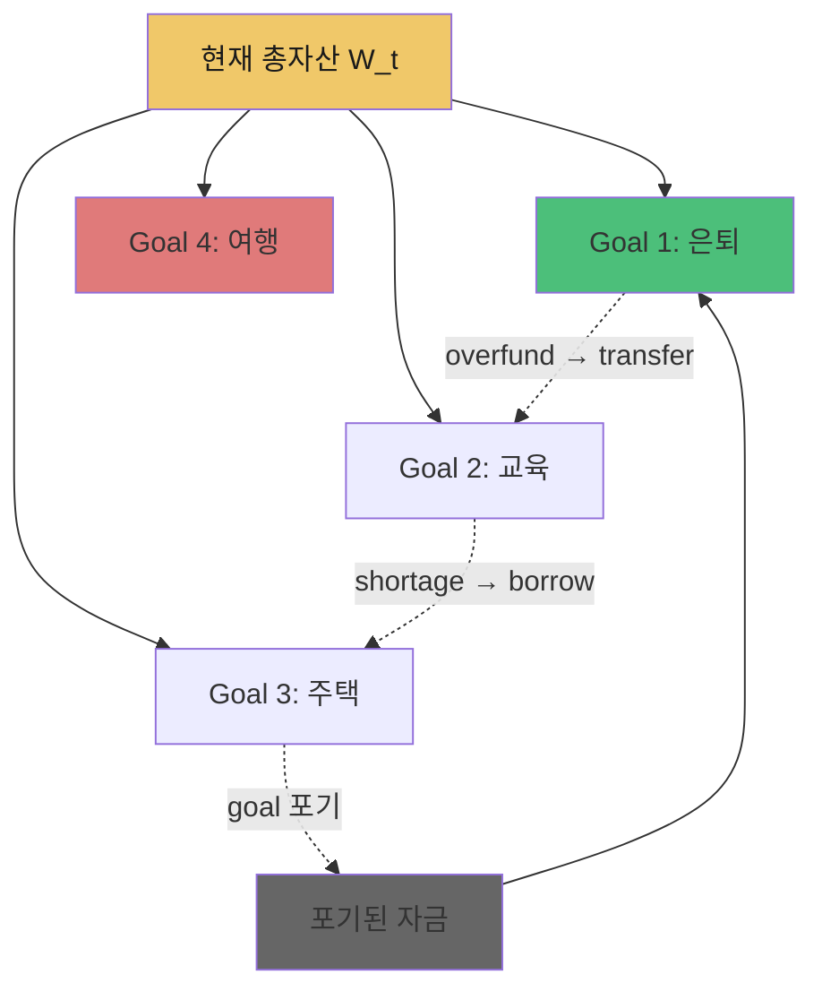
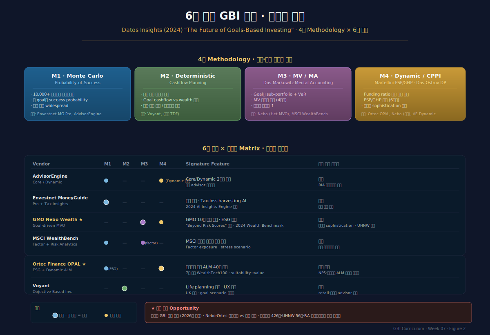

# Week 7 · Multi-Goal Optimization — 여러 목표의 동시 최적화

> **이번 주의 논지**
> 지금까지 우리는 각 목표를 **독립적으로** 최적화했다. Das-Markowitz(4주차)는 각 계정의 정적 해를 합쳤고, Martellini(6주차)는 단일 essential goal에 대한 동적 PSP/GHP를 구성했다. 그러나 실제 가계는 주택·교육·은퇴·유산 **4-6개 목표를 동시에** 보유하며, 이들은 **자원(자산)을 공유**하고 **시간 축에서 충돌**한다. 한 목표의 overfunding이 다른 목표에 transferred될 수 있고, 자원이 부족하면 어떤 목표를 포기해야 한다. 7주차는 (1) **multi-goal optimization의 수학적 정식화**, (2) **funding ratio 기반 동적 rebalancing rule**, (3) **목표 우선순위·포기 결정**, (4) **6대 상용 엔진(AdvisorEngine·Envestnet·Nebo·MSCI·Ortec·Voyant)의 알고리즘 비교**를 다룬다. Das-Ostrov-Radhakrishnan-Srivastav(2022) *JBF*의 multi-goal DP가 8주차(동적계획법) 심화의 직접 전조다.

---

## 0. 강의 로드맵 (3 hours)

### 이 주차의 인포그래픽
- **Figure 1** (§3 말미): Funding Ratio Dynamics와 다목표 상태 공간
- **Figure 2** (§6 말미): 6대 상용 엔진의 알고리즘 구조 비교 지도

### 강의 구성

| 구간 | 시간 | 내용 |
|---|---|---|
| §1 | 15분 | Recap: 단일 목표에서 다중 목표로 |
| §2 | 30분 | Multi-Goal 문제의 수학적 정식화 |
| §3 | 35분 | Funding Ratio Dynamics & 상태 공간 |
| §4 | 40분 | 목표 간 Rebalancing Rules |
| §5 | 25분 | Priority & Forgo — 포기 가능 목표의 결정 |
| §6 | 30분 | 6대 상용 GBI 엔진의 방법론 비교 |
| §7 | 15분 | 한국 맥락 + 케이스 |
| §8 | 10분 | 과제 + 다음 주 예고 |

---

## §1. Recap — 단일 목표에서 다중 목표로 (15 min)

### 1.1 지금까지의 한계

**Das-Markowitz MA (4주차)**
- $K$개 계정의 **독립** 최적화
- 각 계정이 $w_k^* = f(H_k, \alpha_k, \mu, \Sigma)$
- Aggregate는 MV-efficient (수학적 화해)
- **그러나**: 계정 간 상호작용 없음, 자원 공유 없음

**Martellini PSP/GHP (6주차)**
- 단일 essential goal + single aspirational
- Floor $F_t$ = replacement income 현가
- Dynamic allocation $\alpha_t^{PSP} = m(W_t - F_t)/W_t$
- **그러나**: 여러 목표 간 동시 고려 없음

### 1.2 실제 가계의 다목표 현실

한 40대 가계의 전형적 목표 집합:
- **Retirement**: 65세 은퇴 후 월 400만원 (현가 약 6억)
- **College**: 2035년 자녀 교육비 2억
- **Home upgrade**: 2030년 주택 이사 비용 3억
- **Aspirational**: 2040년 세계여행 · 사업 기회

이들은:
- **Compete for limited wealth**: 한 목표가 더 받으면 다른 목표가 덜 받음
- **Different time horizons**: 5년(주택) vs 15년(교육) vs 25년(은퇴)
- **Different priority**: 은퇴는 essential, 세계여행은 aspirational
- **Time-conflict**: 2035년 교육비 지출 시점이 은퇴 적립에 영향

### 1.3 Das-Ostrov-Radhakrishnan-Srivastav (2022) 핵심 논지

*Journal of Banking and Finance* 게재 논문 "*Dynamic optimization for multi-goals wealth management*" (Das, Ostrov, Radhakrishnan, Srivastav)의 주장:

> "When an investor has limited means, they must choose whether or not to fulfill or forgo each of their goals as they progress through time... Our approach uses investor preferences to dynamically make the optimal determination for fulfilling or not fulfilling each goal AND for selecting the investor's investment portfolio. This approach vastly outperforms static portfolio strategies and target-date funds."

핵심: (a) **goal 포기 여부**도 최적화 변수, (b) **portfolio 선택**과 결합, (c) 정적 전략·TDF 대비 우월.

### 1.4 Multi-goal이 왜 어려운가



난점:
1. **Combinatorial explosion**: 4개 목표 × 3개 funding 상태 × 5개 시점 = 매우 큰 상태 공간
2. **시간 비일관성**: 오늘의 최적해가 내일의 최적해와 충돌 가능
3. **행동적 저항**: 투자자는 "목표 포기" 의사결정을 감정적으로 거부
4. **관찰 가능성**: 실무는 observable parameter (funding ratio)에 의존해야

이 난점들에 대한 answer가 §2-§5에서 전개된다.

---

## §2. Multi-Goal 문제의 수학적 정식화 (30 min)

### 2.1 기본 객체 정의

**목표 집합** $\mathcal{G} = \{G_1, G_2, \ldots, G_K\}$:
- 각 목표 $G_k = (H_k, T_k, \omega_k, \alpha_k, \chi_k)$
  - $H_k$: 목표 자금
  - $T_k$: 목표 시점
  - $\omega_k$: 중요도 (utility weight)
  - $\alpha_k$: 실패확률 상한
  - $\chi_k \in \{\text{essential, important, aspirational}\}$: 포기 가능성

### 2.2 통합 효용함수

투자자의 **메타 효용**:
$$
V(\mathcal{G}) = \sum_{k=1}^K \omega_k \cdot \mathbb{1}\{G_k \text{ 달성}\} \cdot U_k(\text{excess over } H_k)
$$

여기서:
- $\mathbb{1}\{G_k \text{ 달성}\}$: goal $k$ 달성 여부 (binary)
- $U_k(\cdot)$: goal $k$ 초과 달성 시 추가 효용 (일반적으로 concave)

### 2.3 자원 제약

**Fungibility 가정**: 계정 간 자산 이전 가능
$$
\sum_{k=1}^K \pi_{k,t} \cdot W_t = W_t, \quad \pi_{k,t} \ge 0,\ \sum \pi_{k,t} = 1
$$

**Non-fungibility 가정** (법적·세제 제약 고려): 일부 자산은 특정 목표에만 배분 가능
- 예: IRP는 은퇴 목표 전용
- 예: 자녀 신탁은 교육·상속 목표 전용

### 2.4 Multi-Goal Optimization 전체 문제

$$
\max_{\{w_k(\cdot), \pi_k(\cdot)\}}\; \sum_{k=1}^K \omega_k \cdot \Pr(W_{T_k}^k \ge H_k) + \sum_k \omega_k^{\text{up}} \cdot \mathbb{E}[U_k(W_{T_k}^k - H_k)^+]
$$

제약:
- $\sum_k \pi_{k,t} W_t = W_t$ (자원 제약)
- $w_{k,t} \in \Delta$ (각 계정의 portfolio 제약)
- $W_{t+1}^k = W_t^k (1 + w_k^\top r_{t+1})$ (동역학)
- Target-date 지출 제약: $W_{T_k}^k \ge H_k$ 일 때 $H_k$ 지출

### 2.5 두 해결 전략 — 분해(Decomposition) vs 통합(Integrated)

**전략 A — 분해 (Das-Markowitz MA 전통)**
1. $\pi_{k,0}$ 외생 결정 (goal dollar-weighting)
2. 각 계정 $k$에 대해 독립적으로 $w_k^*$ 계산
3. 주기적 $\pi_k$ 재조정 (funding ratio 기반)

장점: 단순·확장 가능, 실무 적용 용이.
단점: 계정 간 상호작용의 전역 최적화 없음.

**전략 B — 통합 DP (Das-Ostrov 2022)**
1. $(W_t, \text{goals achieved so far})$를 상태 변수로
2. 각 시점에서 **both** 포트폴리오와 **goal 달성/포기** 결정을 동시 최적화
3. 역방향 dynamic programming

장점: 전역 최적, 목표 포기 결정 내재화.
단점: 차원의 저주, 구현 복잡.

상용 엔진은 **대부분 전략 A의 변형**. 학술은 **전략 B로 진화 중**. 8주차에서 전략 B를 깊이 다룬다.

---

## §3. Funding Ratio Dynamics & 상태 공간 (35 min)

### 3.1 Funding Ratio의 재정의

각 목표 $k$에 대해:
$$
\mathrm{FR}_{k,t} = \frac{W_{k,t}}{F_{k,t}}
$$

- $W_{k,t}$: 목표 $k$에 현재 할당된 자산
- $F_{k,t}$: 목표 $k$의 현재 floor = PV of target cashflow

**해석**:
- $\mathrm{FR}_{k,t} = 1$: 목표 달성에 필요한 자금과 정확히 일치
- $\mathrm{FR}_{k,t} > 1$: overfunded (초과 달성 예상)
- $\mathrm{FR}_{k,t} < 1$: underfunded (미달 예상)

### 3.2 Multi-Goal State Vector

투자자의 전체 상태:
$$
\mathbf{s}_t = (W_t, \mathrm{FR}_{1,t}, \mathrm{FR}_{2,t}, \ldots, \mathrm{FR}_{K,t}, t)
$$

또는 정규화된 형태:
$$
\mathbf{s}_t = (\mathrm{FR}_{1,t}, \ldots, \mathrm{FR}_{K,t}, T-t)
$$

(총자산은 $\sum_k W_{k,t}$로 계산 가능하므로 FR vector + remaining time이 충분)

### 3.3 Funding Ratio 동역학

Goal $k$의 funding ratio 변화:
$$
\mathrm{FR}_{k,t+1} = \mathrm{FR}_{k,t} \cdot \frac{1 + w_{k,t}^\top r_{t+1}}{1 + r_{k,t+1}^F}
$$

여기서 $r_{k,t+1}^F$는 **floor의 성장률** (실질금리·인플레이션 변동에 의해 결정).

**핵심 관찰**: FR의 drift는 두 요소의 경쟁
1. Asset return $w_{k,t}^\top r_{t+1}$ — portfolio 선택에 의존
2. Floor growth $r_{k,t+1}^F$ — 시장 금리에 의존 (통제 불가)

### 3.4 Surplus/Deficit Dynamics

**Aggregate surplus**:
$$
S_t = W_t - \sum_{k=1}^K F_{k,t}
$$

- $S_t > 0$: 전체 목표 집합에 대해 self-sufficient
- $S_t < 0$: 모든 목표 달성 불가능 — **일부 목표 포기 필요**

**Aggregate funding ratio**:
$$
\overline{\mathrm{FR}}_t = \frac{W_t}{\sum_k F_{k,t}}
$$

### 3.5 상태 공간 시각화

2-goal 간단 버전:
- 횡축 $\mathrm{FR}_1$, 종축 $\mathrm{FR}_2$
- $(1, 1)$ 점: 두 목표 모두 정확히 funded
- $(1.2, 0.8)$: Goal 1 over-, Goal 2 under-funded → **transfer candidate**
- $(0.5, 0.5)$: 둘 다 underfunded, $\overline{\mathrm{FR}} < 1$ → **goal 포기 검토**

### 3.6 $K$개 목표의 상태 공간 차원

$\mathbb{R}^K$의 positive orthant. 각 cell은 유일한 **rebalancing action**에 대응.

예시 action regions (3-goal):
- Region 1: 모든 $\mathrm{FR}_k > 1$ → de-risking 및 잉여 분배
- Region 2: 어떤 $\mathrm{FR}_j > 1$, 다른 $\mathrm{FR}_k < 1$ → transfer from $j$ to $k$
- Region 3: 모든 $\mathrm{FR}_k < 1$ → triage (포기·축소)


*Figure 1 · Multi-Goal Funding Ratio 동역학과 상태 공간. 2-goal 예시에서 (FR₁, FR₂) 평면의 rebalancing action regions, Das-Ostrov의 goal 포기 결정 경계.*

---

## §4. 목표 간 Rebalancing Rules (40 min)

### 4.1 3가지 기본 rebalancing 형태

**Type A — 정기 (Scheduled)**
- 고정 주기 (분기·반기·연간)
- 각 목표의 $\pi_k$를 target allocation으로 복귀
- 장점: 예측 가능, 단순
- 단점: 최적 아님, 불필요한 거래비용

**Type B — Threshold-based**
- $|\mathrm{FR}_k - \mathrm{FR}_k^{\text{target}}| > \epsilon$이면 재조정
- 장점: 불필요한 거래 최소화
- 단점: threshold 설정에 arbitrary

**Type C — Continuous optimal (Martellini-style dynamic)**
- 매 시점 $w_{k,t}^*(\mathrm{FR}_{k,t})$ 상태의존 정책
- CPPI 유형: PSP allocation = $m \cdot (W - F)$
- 장점: 이론적 최적, smooth
- 단점: 거래비용 고려 시 real-world 구현 어려움

### 4.2 Surplus Transfer Rules

목표 $j$가 overfunded, 목표 $k$가 underfunded 시 transfer:

**Rule R1 — Lock & Transfer**
$\mathrm{FR}_j > 1.2$이면 초과분을 lock하고 잉여를 최소 FR 목표로 이전:
$$
\text{if } \mathrm{FR}_{j,t} > 1.2, \quad \Delta = (\mathrm{FR}_{j,t} - 1.1) \cdot F_{j,t}
$$
$$
W_{k^*,t}^{\text{new}} = W_{k^*,t} + \Delta, \quad k^* = \arg\min_k \mathrm{FR}_{k,t}
$$

**Rule R2 — Proportional Redistribution**
모든 goal 간 FR을 균등화 방향으로 지속 이전.

**Rule R3 — Priority-Weighted**
높은 priority ($\omega_k$ 큰) 목표로 우선 이전.

### 4.3 Rebalancing Frequency와 거래비용

실무적 trade-off:
$$
\max_{\text{policy}} \; \text{goal achievement probability} - \text{total transaction costs}
$$

Das et al. (2022) 분석:
- 연 1회 rebalance: 정적 전략 대비 +3-5% 목표 달성확률
- 분기 rebalance: 추가 +1-2%, 거래비용 증가
- 월별 rebalance: marginal benefit 거의 없음

**권장**: 분기-반기 rebalance + threshold trigger.

### 4.4 Multi-Goal CPPI 확장

Martellini의 single-goal CPPI를 multi-goal로 확장:
$$
\alpha_{k,t}^{\text{PSP}} = m_k \cdot \frac{W_{k,t} - F_{k,t}}{W_{k,t}}
$$

각 목표마다 **고유 multiplier** $m_k$:
- Essential goals: 작은 $m_k$ (2-3)
- Aspirational goals: 큰 $m_k$ (4-6)

이는 Chhabra 3-bucket의 동적 버전으로 이해 가능.

### 4.5 Goal-Integrated PSP의 옵션

Martellini-Milhau 2017의 통찰: **모든 goal이 동일한 PSP를 공유**해도 OK.
- PSP는 goal-agnostic (§6주차 §4)
- 각 goal은 고유 GHP + 공통 PSP의 dynamic mix

이 구조가 **mass customization** — 수백만 DC 가입자에게 확장 가능한 핵심 설계.

### 4.6 Tax-Aware Rebalancing

실제 rebalancing은 세제 결과를 고려해야:
- 자본이득세 실현 비용
- Asset location (taxable vs tax-deferred)
- Tax-loss harvesting 기회

Envestnet·Ortec 등 상용 엔진의 핵심 차별화 지점. 11주차에서 tax-aware GBI 심화.

---

## §5. Priority & Forgo — 포기 가능 목표의 결정 (25 min)

### 5.1 Feasibility Triage

**Feasibility test**:
$$
\text{Feasible all goals} \iff W_0 + \text{expected inflows} \ge \sum_{k=1}^K F_{k,0}
$$

Infeasible이면 **일부 목표 포기 필요**.

### 5.2 Triage Priorities

세 티어의 우선순위:

**Tier 1 — Essential** ($\chi = \text{essential}$)
- 필수 생활비·의료비
- 포기 불가능
- 모든 다른 목표보다 우선
- 대표: Personal Lifestyle (Brunel), Retirement minimum (Martellini)

**Tier 2 — Important** ($\chi = \text{important}$)
- 교육·주택
- 포기 가능하나 고통스러움
- 시점 이동·규모 축소로 대체 가능

**Tier 3 — Aspirational** ($\chi = \text{aspirational}$)
- 여행·사업·유산
- 자원 부족 시 **적극적 포기**
- Chhabra의 Aspirational bucket

### 5.3 Das-Ostrov Goal Forgo Decision

Das-Ostrov-Radhakrishnan-Srivastav(2022)의 핵심 혁신:

**Decision variable** $\delta_{k,t} \in \{0, 1\}$: goal $k$를 시점 $t$에서 포기할지 여부.

**Augmented objective**:
$$
V(\mathbf{s}_t) = \max_{\{w_t, \delta_t\}}\; \sum_k \omega_k [\delta_{k,t} \cdot U_k + (1-\delta_{k,t}) \cdot 0]
$$

- $\delta_{k,t} = 1$: 목표 $k$ 추구
- $\delta_{k,t} = 0$: 목표 $k$ 포기 → 그 자금을 다른 목표로

### 5.4 최적 포기 결정의 수학

Bellman equation for multi-goal with forgo:
$$
V(\mathbf{s}_t) = \max_{w, \delta}\; \sum_k \omega_k \delta_k + \mathbb{E}\!\left[ V(\mathbf{s}_{t+1}) \mid \mathbf{s}_t, w, \delta \right]
$$

Optimal forgo rule (informal):
$$
\delta_k^* = 1 \iff \frac{\partial V}{\partial W_{k,t}} > \frac{\partial V}{\partial W_{j,t}} \cdot \text{transfer ratio}, \quad \forall j
$$

즉 "해당 goal의 marginal utility가 transfer 기회비용보다 클 때만 유지".

### 5.5 Behavioral Challenge

수학적으로 포기가 최적이어도 투자자는 감정적으로 거부:
- "5년 일한 가족여행이 이제 포기?"
- "자녀 교육을 축소?"

**실무 처방**:
1. ISP 문서에 feasibility 가정과 포기 우선순위 **미리 명시**
2. Annual review에서 feasibility test를 **정기 검증**
3. 위기 시 감정적 결정보다 사전 서약 rule 준수

### 5.6 Forgo의 동적 timing

Optimal forgo는 **한 번에** 이루어지지 않는다:
- 일찍 포기: 자원 여유 확보, 다른 목표 확률↑
- 늦게 포기: 시장 회복 기대, 전부 달성 희망

Das-Ostrov 분석: **"fuzzy threshold"** — FR 특정 임계값 아래로 떨어질 때 단계적 포기.

### 5.7 Korean 사례의 Forgo Challenge

한국 중산층 가계의 전형적 상황:
- 주택 (이미 구매, 부채 포함)
- 자녀 교육 (국내 대학 vs 해외 유학)
- 은퇴 (국민연금 + 퇴직연금 + 개인연금)
- 부모 봉양 (증가하는 요양비)

Feasibility 측면에서 4개 모두 충족 어려움 다수. **실무 advisor의 역할**:
1. 4개 목표의 PV 계산
2. Total W + 기대 inflow와 비교
3. Infeasibility 확인 시 **구체적 포기/축소 시나리오** 제시
4. 투자자 가족 간 합의 형성 지원

이것이 5주차 Brunel ISP가 담아야 할 내용의 핵심.

---

## §6. 6대 상용 GBI 엔진의 방법론 비교 (30 min)

### 6.1 Datos Insights (2024)의 6대 벤더

Datos Insights 2024 "*Future of Goals-Based Investing*" 보고서가 profile한 6대 상용 GBI 엔진:

1. **AdvisorEngine** Goals-Based Planning (Core / Dynamic)
2. **Envestnet** MoneyGuide Pro
3. **GMO** Nebo Wealth
4. **MSCI** WealthBench
5. **Ortec Finance** OPAL Wealth
6. **Voyant** Objective-Based Investing

각각 **4가지 methodology** 중 하나(또는 혼합)를 채택.

### 6.2 4대 방법론 분류

**Methodology 1 — Monte Carlo Probability-of-Success**
- 다수 시나리오 시뮬레이션
- 각 goal의 "success probability" 보고
- 가장 널리 쓰임 (Envestnet, AdvisorEngine 등)

**Methodology 2 — Deterministic Cashflow Planning**
- 가정된 수익률 단일 경로
- Goal cashflow vs wealth trajectory 매칭
- 장점: 단순·이해 쉬움. 단점: 불확실성 표현 부족

**Methodology 3 — Mean-Variance / Das-Markowitz MA**
- 각 goal을 sub-portfolio로
- VaR constraint + MV 최적화
- 학술적 정합성

**Methodology 4 — Dynamic Optimization / CPPI**
- Funding ratio 기반 동적 rebalancing
- PSP/GHP 분해 (Nebo, Ortec이 일부 구현)
- 가장 수학적으로 sophisticated

### 6.3 6대 벤더의 차별화 (2024 기준)

| 벤더 | 주된 Methodology | 차별화 | 주 고객 |
|---|---|---|---|
| **AdvisorEngine** | Monte Carlo | Core/Dynamic 2버전, 통합 대시보드 | RIA 중심 |
| **Envestnet MoneyGuide** | Monte Carlo + tax | 최대 규모, tax-aware 통합 | Wirehouse, large RIA |
| **GMO Nebo Wealth** | **Goal-driven optimization** (Het MVO) | GMO 자체 엔진, 2024년 Wealth Benchmark 출시 | 상위 RIA |
| **MSCI WealthBench** | Factor + risk analytics | MSCI 리스크 모델 통합 | 기관·자산운용사 |
| **Ortec Finance OPAL** | **Economic Scenario Generator + dynamic** | 네덜란드 연금 기원, ALM 강점 | UK·유럽·캐나다 |
| **Voyant** | Deterministic + scenario | Life planning 중심, UI 강점 | UK 중심 |

### 6.4 Nebo Wealth (GMO) 심층

GMO(Grantham, Mayo & Van Otterloo, 약 $600억 운용)가 10년 내부 개발 후 2022년 출시:

**철학**: "Risk score는 goals-based의 적" — 기존 risk tolerance questionnaire 대체
**핵심 알고리즘** (추정, 공개 자료 종합):
- Goal-driven MVO: 각 goal이 lifetime 소득·지출 패턴을 갖는 **cash-flow goal**
- 자체 ESG(Economic Scenario Generator) 사용
- Heterogeneous MVO: goal별 효용함수가 달라도 통합 최적화

**성장**: 2025년 기준 다수 award, Wealth Benchmark 제품 출시로 확장.

### 6.5 Ortec Finance OPAL — 유럽 연금 기원

Ortec은 1981년 설립, **네덜란드 연금기금의 ALM** 40년 경험.

**핵심**: Economic Scenario Generator (ESG) 기반 수천 시나리오
- Multi-goal tracking: portfolio가 여러 goal을 동시 추적
- Suitability → Value 전환
- 7년 연속 WealthTech100 선정

**한국 적용 가능성**: 연금기금 ALM 전통이 한국 NPS·사학연금과 친화적. KB·삼성에서 도입 여지.

### 6.6 비교 Matrix — Engine 선택 기준

| 차원 | 고려사항 |
|---|---|
| 고객 규모 | Retail: Envestnet / UHNW: AdvisorEngine Dynamic or Nebo |
| 지역 | 미국: Envestnet·AdvisorEngine / UK·유럽: Voyant·Ortec |
| Tax 통합 | Envestnet이 가장 강함 |
| Risk 모델 | MSCI가 factor·stress 강점 |
| ALM 연결 | Ortec이 연금기금에 최적 |
| 수학적 sophistication | Nebo·Ortec 최상위 |

### 6.7 한국 시장의 GBI 엔진 현황

2026년 기준 한국에서는 **자체 GBI 엔진**이 거의 없고, 대부분 **단순화된 버전**:
- KB 케이봇쌤·KB 골든라이프: Monte Carlo 기반 간이 프로브
- 미래에셋 TDF: Glide path 중심, multi-goal 미지원
- 삼성증권 Family Office: ISP는 있으나 정량 엔진 제한적
- RA 테스트베드 알고리즘: 단일 portfolio 최적화 중심

**기회 영역**:
1. **한국형 Monte Carlo 엔진**: 국내 자산 universe + 퇴직연금 세제
2. **한국 가계 multi-goal**: 주택·교육·은퇴·부모봉양 4목표 표준 템플릿
3. **국민연금 가정 내장**: NPS replacement 가정을 floor에 동적 반영
4. **상속세 아웃풋**: Dynasty goal의 한국형 설계


*Figure 2 · 6대 상용 GBI 엔진의 방법론 비교(Datos Insights 2024 기반). 4대 methodology 분류, 각 벤더의 차별화와 한국 적용 가능성.*

---

## §7. 한국 맥락 & 케이스 (15 min)

### 7.1 한국 중산층 multi-goal의 전형

40대 맞벌이 가계:
- 세전 소득 합산 1.5억/년
- 순자산 6억 (주택 4억 포함)
- 자녀 2명

**4-Goal 집합**:
| Goal | H (현가) | T | α | 우선순위 |
|---|---|---|---|---|
| Retirement (부부 65세 후) | 8억 | 2045 | 0.85 | Essential |
| 자녀 1 대학 | 1.2억 | 2033 | 0.90 | Important |
| 자녀 2 대학 | 1.2억 | 2036 | 0.90 | Important |
| 주택 upgrade | 3억 | 2030 | 0.60 | Aspirational |
| **합계 필요 PV** | **13.4억** | | | |
| **가용 W_0 (주택 제외)** | **2억** + 월 200만원 납입 | | | |

**Feasibility 문제**: Total PV 13.4억 vs 가용 2억 + 미래 납입. 40세에서 65세까지 월 200만 납입 × 25년 = 6억 (단순합). 명백히 infeasible.

### 7.2 Triage 시나리오

**Option 1 — 주택 upgrade 포기**
- Essential + Important만 추구
- Total PV 10.4억, feasibility 개선
- 투자자 심리적 수용: 어려움

**Option 2 — 자녀 교육 규모 축소**
- 국내 대학 중심, 유학 옵션 포기
- H 1.2억 → 0.8억 per child
- Total PV 12.6억

**Option 3 — 은퇴 시점 연기**
- 70세 은퇴로 연기
- 필요 자금 감소 + 추가 5년 납입
- Total PV 감소, feasibility 확보

**Option 4 — 은퇴 replacement 축소**
- 현재 생활비 150%에서 120%로
- Retirement H 8억 → 5.5억
- Total PV 10.9억

### 7.3 상용 엔진이 한국 가계에 답할 수 있는 것

Nebo/Ortec 류 엔진이 이 가계에 제공하는 output:

```
[Monte Carlo 10,000 paths, current trajectory]
─────────────────────────────────────────────
Goal              Success Prob   Shortfall (P50)
Retirement        62%            -2.1억
College 1         85%            -0.15억
College 2         75%            -0.3억
House upgrade     45%            -1.5억
─────────────────────────────────────────────

[Recommended action]
Option: Delay retirement 5 years + reduce house budget 30%
New success probabilities:
Retirement        88%
College 1         92%
College 2         88%
House (reduced)   68%
```

### 7.4 케이스 토론 (소그룹 20분)

박지훈·이수진 부부 가계 (위 예시):

1. 4-goal을 $(H, T, \alpha, \omega, \chi)$ 5-tuple로 정식화.
2. §2.4의 objective function에서 $\omega_k$를 어떻게 설정? (부부 간 동의 필요성)
3. §4의 rebalancing rule 중 이 가계에 어떤 rule이 적합한가? 거래비용 고려.
4. 2030년 주택 시점에 시장이 20% 하락 시나리오. §5.4의 Das-Ostrov forgo rule이 어떤 decision을 권고?
5. Ortec OPAL과 Nebo Wealth 중 이 가계에 더 적합한 것은? 비용 대비 효용.

---

## §8. 과제 및 다음 주 예고 (10 min)

### 8.1 과제 (개인, 5페이지)

**과제 A — Multi-Goal Simulator 구현 (수리)**
Python으로 3-goal multi-goal simulator 구축:
- Goal 1: Retirement (T=25, H=5억, α=0.85)
- Goal 2: Education (T=12, H=1억, α=0.9)
- Goal 3: House (T=8, H=2억, α=0.6)
- 2-asset (equity, bond), Monte Carlo 10,000 경로
- Rebalancing rules R1, R2, R3 (§4.2) 비교
- 각 goal의 success probability + aggregate FR trajectory

**과제 B — 상용 엔진 평가 (정성)**
6대 엔진 중 하나를 선택하여 (공개 자료 기반) 상세 방법론 분석:
- 명시된 algorithm과 추정 algorithm
- 차별화 기능
- 약점 및 개선 여지
- 한국 시장 도입 시 issue

### 8.2 Reading
- **Das, S., Ostrov, D., Radhakrishnan, A., Srivastav, D. (2022)**. "Dynamic optimization for multi-goals wealth management." *Journal of Banking and Finance*, 140. **[필독]**
- **Datos Insights (2024)**. *The Future of Goals-Based Investing*. 보고서 (클라이언트 접근). [권장]
- Brunel, J.L.P. (2011). "Goal-Based Wealth Management in Practice." *JWM*, 14(3). [복습]
- Nebo Wealth (2024). *Beyond Risk Scores: The Key to Unlocking Personalized, Goals-Based Investing*. White paper. [권장]

### 8.3 다음 주 예고 — Week 8: Dynamic Programming (Das-Ostrov)
**전략 B의 완성판**. 상태 공간 설계, Bellman equation, backward induction, wealth-dependent 정책. TDF 대비 성능 실증. Multi-goal DP의 computational challenge와 해결책. RL로의 전환점.

---

## 부록 A — Multi-Goal 핵심 수식 요약

### Goal Set
$$
\mathcal{G} = \{G_k = (H_k, T_k, \omega_k, \alpha_k, \chi_k)\}_{k=1}^K
$$

### Funding Ratio
$$
\mathrm{FR}_{k,t} = \frac{W_{k,t}}{F_{k,t}}, \quad F_{k,t} = \text{PV}_t(H_k, T_k)
$$

### Multi-Goal Objective
$$
\max_{\{w, \pi, \delta\}}\; \sum_k \omega_k \delta_k \cdot \Pr(W_{T_k}^k \ge H_k)
$$

### Surplus / Aggregate FR
$$
S_t = W_t - \sum_k F_{k,t}, \quad \overline{\mathrm{FR}}_t = \frac{W_t}{\sum_k F_{k,t}}
$$

### Multi-Goal CPPI
$$
\alpha_{k,t}^{\text{PSP}} = m_k \cdot \frac{W_{k,t} - F_{k,t}}{W_{k,t}}
$$

## 부록 B — 6대 엔진 방법론 Cross-Reference

| 벤더 | MC | Deterministic | MV/MA | Dynamic/CPPI |
|---|---|---|---|---|
| AdvisorEngine | ✓ | | | ✓ (Dynamic ver.) |
| Envestnet MG Pro | ✓✓ | | | |
| GMO Nebo | | | ✓ | ✓✓ |
| MSCI WealthBench | ✓ | | ✓ (factor) | |
| Ortec OPAL | ✓ (ESG) | | | ✓✓ |
| Voyant | | ✓✓ | | |

## 부록 C — Das-Ostrov-Radhakrishnan-Srivastav (2022) 주요 결과

- Multi-goal DP가 정적 전략 대비 goal achievement 10-25% 개선
- Target-date fund 대비 꾸준히 우월
- Goal 포기 결정이 특히 low-wealth 가계에서 중요
- "Fuzzy threshold"로 인한 단계적 포기
- Computational cost: $K$ goals × $T$ years × $|W|$ states → 차원의 저주

## 부록 D — 학습 리소스

- **논문**: Das-Ostrov-Radhakrishnan-Srivastav (2022) JBF
- **업계**: Datos Insights, Nebo Wealth white papers, Ortec Finance webinars
- **실습**: Python `gymnasium` environment로 multi-goal DP 구현 가능
- **경쟁**: CFA Institute Research Foundation GBI publications
