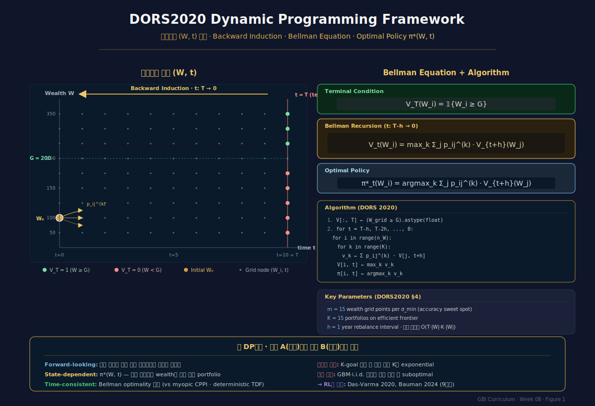
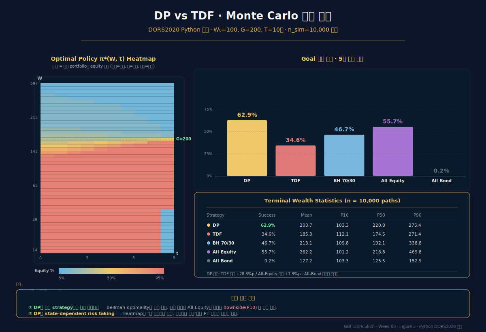

# Week 8 · Dynamic Programming — Das-Ostrov 상태공간 DP

> **이번 주의 논지**
> 7주차까지 우리는 **분해 전략(전략 A)** 을 따라왔다 — 각 목표를 독립 최적화하고 사후적으로 rebalancing. 이 방식은 확장성이 좋지만 **전역 최적이 아니다**. 오늘 우리는 **전략 B — 통합 DP(Integrated Dynamic Programming)** 으로 전환한다. Das-Ostrov-Radhakrishnan-Srivastav(2020, *Computational Management Science*, "DORS2020")는 상태공간을 $(W, t)$의 이산 격자로 설정하고, Bellman equation의 backward induction으로 **전역 최적 정책** $\pi^*(W, t)$를 계산한다. 결과: TDF 대비 goal 달성확률 10-30%p 우월. 이 DP framework가 (1) multi-goal DP (DORS2022, 7주차), (2) RL 기반 GBWM (9주차 Das-Varma 2020), (3) Regime-switching DRL (Bauman 2024)로 확장된다. 8주차는 정리 · 증명 · 수치 예시를 통해 DP의 **완전한 청사진**을 제시한다.

---

## 0. 강의 로드맵 (3 hours)

### 이 주차의 인포그래픽
- **Figure 1** (§3 말미): DORS2020 상태공간·격자·Bellman 구조
- **Figure 2** (§5 말미): DP vs TDF 성능 비교 (Python 시뮬레이션)

### 강의 구성

| 구간 | 시간 | 내용 |
|---|---|---|
| §1 | 15분 | Recap: 분해 전략(A)의 한계와 통합 DP(B)로의 도약 |
| §2 | 35분 | DP 기본 원리 — Bellman 원리, value function, 정책 |
| §3 | 40분 | DORS2020 framework — 상태공간·격자·backward induction |
| §4 | 30분 | 최적 정책의 특성 — wealth-dependent risk |
| §5 | 30분 | DP vs TDF 실증 — 수치 시뮬레이션 |
| §6 | 20분 | DORS2020 확장 — withdrawals·infusions·non-frontier |
| §7 | 20분 | Computational challenges — 차원의 저주·RL 전환점 |
| §8 | 10분 | 케이스 + 과제 |

---

## §1. Recap — 분해(A)에서 통합(B)로 (15 min)

### 1.1 전략 A의 구조적 한계

7주차에서 전략 A를 살펴봤다:
1. 각 목표를 독립 sub-portfolio로 최적화
2. Funding ratio 기반 rebalancing rule 적용
3. 필요 시 surplus transfer

**이것이 왜 suboptimal인가?**

전략 A는 각 시점의 **myopic** 결정에 의존한다. 예를 들어:
- 3년 후 교육비 지출이 예정됨
- 현재 시장이 상승 중
- 전략 A: Myopic CPPI 룰에 따라 PSP 증가
- 그러나 **최적 정책**은 교육비 지출을 앞두고 오히려 risk 감소

즉 **미래 이벤트에 대한 forward-looking planning**이 부재하다.

### 1.2 Das-Markowitz (2010) 정적 모델의 인정

심지어 Das-Markowitz(2010)의 저자들도 DORS2018·2020 논문에서 **명시적으로 인정**:

> "These static models are not fully optimal, because they can only be implemented period by period in a myopic manner." (DORS2020, p. 4)

즉 **자기 자신의 2010년 정적 MA framework의 myopic 한계**를 극복하기 위한 후속 연구가 DP 시리즈다.

### 1.3 Optimal Policy의 요건

**진정한 전역 최적** 정책 $\pi^*$가 만족해야 할 것:
- **Bellman optimality**: 현재 상태에서 최적 결정이 미래 모든 상태에서의 최적 결정을 전제로 계산됨
- **Time consistency**: 시간이 지나도 정책이 optimal 유지
- **State-dependent**: 정책이 현재 상태 (현재 부 $W_t$, 남은 시간 $T-t$)에 의존

이 세 가지를 만족하는 유일한 방법이 **Dynamic Programming**.

### 1.4 왜 지금까지 DP가 실무에서 안 쓰였나

- **계산 비용**: 20-30년 장기 + 세밀한 grid = 큰 계산량
- **표현의 복잡성**: 투자자에게 "격자 위 backward induction"을 설명하기 어려움
- **가정 민감성**: 수익률 분포 가정에 의존 (robustness issue)
- **소프트웨어**: 상용 엔진은 Monte Carlo 중심

그러나 **컴퓨팅 파워의 발전**과 **Das-Ostrov의 단순화된 이산 DP**가 결합되면서 2020년 이후 실무 진입이 시작됐다. Ortec OPAL · GMO Nebo 등이 DP 기반 요소를 도입.

### 1.5 DP의 세 가지 해결책

DORS2020의 구체적 기여:
1. **이산 격자 + backward induction** — 연속 PDE 대비 단순
2. **Efficient frontier 위 discrete portfolio menu** — action space 축소
3. **Geometric Brownian motion 가정 + log-space grid** — 자연스런 상태 discretization

이 세 가지가 결합되면 수분 내에 20년 GBWM DP 해결 가능.

---

## §2. DP 기본 원리 (35 min)

### 2.1 DP의 두 재료 — Value Function과 Bellman

**Value function** $V: \mathcal{S} \to \mathbb{R}$: 상태 $s$에서 최적 정책을 따랐을 때의 기대 효용.

**Bellman's Principle of Optimality** (Richard Bellman, 1957):
> "An optimal policy has the property that whatever the initial state and initial decision are, the remaining decisions must constitute an optimal policy with regard to the state resulting from the first decision."

수식으로:
$$
V(s) = \max_{a \in \mathcal{A}(s)}\; \left[ r(s, a) + \gamma \sum_{s'} p(s'|s,a)\, V(s') \right]
$$

여기서:
- $r(s,a)$: 즉시 보상
- $\gamma$: 할인율
- $p(s'|s,a)$: 상태 전이확률

### 2.2 Finite Horizon DP

GBWM은 **finite horizon** (목표 시점 $T$까지):
$$
V_t(s) = \max_a \left[ r(s,a) + \sum_{s'} p(s'|s,a)\, V_{t+1}(s') \right]
$$

**Terminal condition**:
$$
V_T(s) = U(s)
$$

GBWM에서 $U(s)$는 단순 형태: 목표 달성 시 1, 아니면 0 (또는 utility function).

### 2.3 Backward Induction

**알고리즘**:
```
Step 1. V_T(s) = U(s) for all s
Step 2. For t = T-1, T-2, ..., 0:
          For each s in state space:
            V_t(s) = max_a [ ... ]
            π_t(s) = argmax_a [ ... ]
Step 3. Optimal policy: π = {π_0, π_1, ..., π_{T-1}}
```

**계산량**: $O(|T| \cdot |S| \cdot |A| \cdot \bar{|S'|})$
- $\bar{|S'|}$: 각 (s,a)에서 가능한 다음 상태 수

### 2.4 GBWM에서 이 요소들의 구체화

| DP 요소 | GBWM에서의 의미 |
|---|---|
| 상태 $s$ | $(W_t, t)$: 현재 부·시점 |
| Action $a$ | Portfolio 선택 (efficient frontier 상의 위치) |
| Reward $r$ | 중간 시점에는 0, terminal에 goal 달성 여부 |
| Transition $p$ | GBM 수익률의 이산 probability |
| Terminal $U$ | $\mathbb{1}\{W_T \ge H\}$ |
| $\gamma$ | 1 (할인 없음) 또는 시간 할인 |

### 2.5 연속 vs 이산 접근

**Merton (1969, 1971)** — 연속시간 DP:
- HJB (Hamilton-Jacobi-Bellman) equation
- Closed-form in special cases (CRRA utility + i.i.d. returns)
- 한계: GBWM처럼 목표 확률 최대화에는 closed form 없음, 수치 PDE 필요

**DORS2020** — 이산 DP:
- Wealth grid + time discretization
- Backward induction
- 구현·이해 쉬움
- GBWM에 정확히 적합

본 주차는 **DORS2020 이산 DP** 중심. Merton 연속 DP는 학술 reference.

### 2.6 역사적 맥락

- **Browne (1997, 1999)**: 연속시간 goal-based 연구 효시, HJB 기반
- **Merton (1969-1971)**: Consumption-investment 동적 최적화 고전
- **DORS2018** ("GBWM: A New Approach", *J. Invest. Manag*): 정적 single-period 분석
- **DORS2020** (*Comp. Mgmt. Sci.*): **본 주차 핵심 논문**, 이산 multi-period DP
- **DORS2022** (*JBF*): multi-goal 확장 (7주차)
- **Das-Varma 2020**: RL 확장 (9주차)
- **Bauman et al. 2024**: DRL + regime-switching (9주차)

---

## §3. DORS2020 Framework — 상태공간·격자·Backward Induction (40 min)

### 3.1 문제 설정 (DORS2020)

**Goal**: 초기 자산 $W_0$, 목표 자산 $G$, 기간 $T$. 정기적 추가 유입·유출(contributions $c_t$) 가능.

**Problem**:
$$
\max_{\{\pi_t\}_{t=0}^{T-1}}\; \Pr(W_T \ge G)
$$

### 3.2 Efficient Frontier 위 K개 Portfolio

Action space 단순화: efficient frontier에서 $K$개 portfolio만 선택 가능.
- $k = 1, \ldots, K$: portfolio index
- 각 portfolio $k$가 $(\mu_k, \sigma_k)$를 가짐 (frontier 상 discrete 점들)

이는 **중요한 단순화**. 모든 가능한 weight vector $w \in \Delta^n$이 아니라, frontier 위 $K$개 (예: $K=15$)만 고려.

**이유**:
- 이론: mean-variance frontier 위 선택이 "almost optimal" (DORS 이론 §2.3)
- 실무: 운용사가 실제로 $K$개 model portfolio만 제공
- 계산: action space가 $K$로 축소되어 DP 실행 가능

### 3.3 Wealth Grid

**GBM 하 wealth dynamics**:
$$
\frac{dW_t}{W_t} = \mu_k\, dt + \sigma_k\, dZ_t
$$

**Log-space discretization**: $\ln W$에 대해 균등한 grid 설정이 자연스럽다.
- GBM에서 $\ln W$가 정규분포이므로 log-space 격자가 equal probability intervals

DORS2020의 wealth grid 설정:
$$
W_i = W_0\, \exp(\rho_{\text{grid}} \cdot i \cdot \sigma_{\min}\sqrt{h})
$$

여기서:
- $i \in \{i_{\min}, \ldots, i_{\max}\}$: grid index
- $\sigma_{\min}$: frontier 위 최소 volatility portfolio의 σ
- $h$: 시간 간격 (단위: 1년)
- $\rho_{\text{grid}}$: grid density (DORS는 $m = 15$ 권장)

### 3.4 Transition Probabilities

시점 $t$의 wealth node $i$에서 portfolio $k$ 선택 시 $t+h$의 wealth node $j$로 가는 확률:
$$
p_{ij}^{(k)} = \Phi\!\left(\frac{\ln W_{j+1/2} - \ln W_i - (\mu_k - \sigma_k^2/2) h}{\sigma_k \sqrt{h}}\right) - \Phi\!\left(\frac{\ln W_{j-1/2} - \ln W_i - (\mu_k - \sigma_k^2/2) h}{\sigma_k \sqrt{h}}\right)
$$

즉 log-normal 분포의 각 구간 확률.

### 3.5 Bellman Equation 완전판

**Terminal**:
$$
V_T(W_i) = \mathbb{1}\{W_i \ge G\}
$$

**Recursion** for $t = T-h, T-2h, \ldots, 0$:
$$
V_t(W_i) = \max_{k \in \{1, \ldots, K\}}\; \sum_{j} p_{ij}^{(k)}\, V_{t+h}(W_j)
$$

**Optimal policy**:
$$
\pi_t^*(W_i) = \arg\max_{k}\; \sum_{j} p_{ij}^{(k)}\, V_{t+h}(W_j)
$$

### 3.6 알고리즘 요약

```python
# Pseudocode
def solve_gbwm_dp(W_grid, time_grid, portfolios, G, T):
    N = len(W_grid); M = len(time_grid); K = len(portfolios)
    V = np.zeros((N, M))
    policy = np.zeros((N, M-1), dtype=int)
    
    # Terminal
    V[:, -1] = (W_grid >= G).astype(float)
    
    # Backward recursion
    for t_idx in range(M-2, -1, -1):
        for i, W in enumerate(W_grid):
            best_v = -1
            best_k = 0
            for k in range(K):
                mu_k, sig_k = portfolios[k]
                # Compute transition probs p_ij^(k)
                probs = compute_transitions(W, W_grid, mu_k, sig_k, h)
                v = np.sum(probs * V[:, t_idx + 1])
                if v > best_v:
                    best_v = v
                    best_k = k
            V[i, t_idx] = best_v
            policy[i, t_idx] = best_k
    
    return V, policy
```

### 3.7 Convergence와 Grid Density

Trigeorgis(2021 *Finance Research Letters*)의 개선:
- Wealth grid가 세밀할수록 continuous 해에 수렴
- 그러나 convergence가 **smooth하지 않음** — oscillation
- 해결: penultimate time point에 analytic solution 사용
- 해결: matrix product 연산으로 속도 개선

DORS 원논문: $m = 15$이 정확도·속도 sweet spot.


*Figure 1 · DORS2020 Dynamic Programming framework의 상태공간·격자·Bellman 구조. $(W_t, t)$ 2차원 격자에서 backward induction으로 optimal policy $\pi^*(W, t)$ 계산.*

---

## §4. 최적 정책의 특성 — Wealth-Dependent Risk (30 min)

### 4.1 π*(W, t)의 직관적 형태

DORS2020이 계산하는 optimal policy $\pi^*(W, t)$는 매우 흥미로운 구조:

**Region 1 — Severely underfunded** ($W \ll G$의 PV):
- 전통 관점: "위험 회피"
- **DP 관점**: **가장 공격적 portfolio** 선택
- 이유: Goal 달성이 거의 불가능해 보이므로, upside 확률을 극대화하는 lottery ticket 필요

**Region 2 — Moderately underfunded** ($W$ 약간 낮음):
- DP: 중간 수준 risk portfolio
- Hope + fear balance

**Region 3 — On track** ($W \approx$ PV of G):
- DP: 중간 risk
- Martellini CPPI와 유사한 행동

**Region 4 — Overfunded** ($W >$ PV of G):
- DP: **위험 자산 축소**
- 이유: 이미 goal 달성 가능성 높음. 추가 risk는 불필요. Protect downside.

### 4.2 "Gambler's behavior" at low wealth

DORS2020 논문의 핵심 관찰:
> "When the portfolio has less money, it moves towards higher portfolio numbers, since the increase in both expected return and volatility makes it more likely to attain the goal wealth."

이는 **Prospect Theory의 loss domain risk-seeking**과 수학적으로 일치. Binary goal indicator가 **S-shape value function**의 극단 버전이므로, DP가 자연스럽게 PT와 일치하는 정책을 산출.

### 4.3 Hockey Stick Shape

$\pi^*(W, t)$를 $W$에 대해 plot하면 hockey stick 모양:
- 매우 낮은 $W$: 최대 risk (100% equity)
- 중간 $W$: 감소하는 risk
- 높은 $W$: 최소 risk (100% bond)

Inflection point는 **남은 시간 $T-t$에 따라 이동**:
- $t$ 작을 때 (많이 남음): 완만한 transition
- $t$ 클 때 (시간 임박): sharp transition, 거의 binary

### 4.4 Time-to-Goal Effect

시간이 임박할수록 정책이 극단화:
- $T-t = 20$년: 보통 smooth gradient
- $T-t = 5$년: 상당히 sharp
- $T-t = 1$년: **step function** — 임계 $W^*$ 경계에서 갑자기 risk on/off

직관: 시간이 많으면 수익률 drift가 의미 있지만, 시간이 적으면 variance가 dominant. 목표 넘으면 확정(risk off), 목표 못 넘으면 마지막 baseline(risk on).

### 4.5 TDF의 Deterministic Glide Path와의 극명한 대비

**TDF**: $\pi(t)$ — wealth 무관, 시간에만 의존
- 45세: 70% equity
- 55세: 50% equity
- 65세: 30% equity

**DP**: $\pi(W, t)$ — wealth와 시간 모두 의존
- 45세 + underfunded: 90% equity
- 45세 + on-track: 60% equity
- 45세 + overfunded: 30% equity

이 차이가 **성과 차이의 핵심**.

### 4.6 CPPI와의 비교

Martellini CPPI (6주차):
$$
\alpha^{\text{PSP}} = m \cdot \frac{W - F}{W}
$$

- Wealth-dependent: 있음 (risk budget)
- Time-dependent: 간접적 ($F_t$가 시간에 의존)

DP는 CPPI의 **이론적 상한** — CPPI는 DP의 simple approximation으로 볼 수 있다 (Martellini-Milhau 2017의 주장).

실증: DP vs CPPI의 goal 달성확률 차이는 통상 1-3%p로 작다. 따라서 CPPI가 **실무적으로 충분히 가까운 근사**.

### 4.7 Interpretation for Advisors

고객에게 설명하는 언어:
- "더 못 벌었다면 더 공격적으로" — Gambler's intuition과 align
- "충분히 벌었다면 수확" — Common sense lock-in
- "시간이 많으면 조정, 시간이 적으면 결정"

DP 정책은 **직관적으로 옳은 느낌**이 든다. 그러나 이 feeling이 수학적으로 optimal임을 증명한 것이 DORS2020의 기여.

---

## §5. DP vs TDF 실증 — 수치 시뮬레이션 (30 min)

### 5.1 시뮬레이션 설정

**DORS2020 §4 example 재현**:
- $W_0 = 100$
- $G = 200$ (100% 성장 목표)
- $T = 10$ years
- Efficient frontier 위 $K=15$ portfolios
- $\mu$ range: 3% ~ 10%
- $\sigma$ range: 5% ~ 20%
- Annual rebalance

### 5.2 DP 해의 특성

Backward induction으로 $V(W, t)$와 $\pi^*(W, t)$ 계산. 

**Key observation**:
- $V(100, 0)$: 약 0.63 (63% goal 달성 확률)
- TDF (glide path): 약 0.45 (45%)
- Buy-and-hold 70/30: 약 0.50

**DP는 TDF 대비 +18%p 우월**.

### 5.3 Python 구현 (간략)

```python
import numpy as np
from scipy.stats import norm

# Grid setup
T = 10; h = 1
W0 = 100; G = 200
n_W = 100  # wealth grid size
sigma_min = 0.05
m = 15
W_grid = W0 * np.exp(np.arange(-50, 50) * m * sigma_min * np.sqrt(h) / 50)
M = T // h + 1  # time nodes

# K portfolios on efficient frontier
K = 15
mus = np.linspace(0.03, 0.10, K)
sigs = np.linspace(0.05, 0.20, K)

# Value function
V = np.zeros((n_W, M))
V[:, -1] = (W_grid >= G).astype(float)
policy = np.zeros((n_W, M-1), dtype=int)

for t in range(M-2, -1, -1):
    for i, W in enumerate(W_grid):
        best_v = -1; best_k = 0
        for k in range(K):
            # Transition probs
            drift = (mus[k] - sigs[k]**2/2) * h
            vol = sigs[k] * np.sqrt(h)
            lW_next = np.log(W) + drift
            # Integrate via normal CDF
            bounds = (np.log(W_grid[:-1]) + np.log(W_grid[1:])) / 2
            bounds = np.concatenate([[-np.inf], bounds, [np.inf]])
            cdfs = norm.cdf((bounds - lW_next) / vol)
            probs = np.diff(cdfs)
            v = probs @ V[:, t+1]
            if v > best_v:
                best_v = v; best_k = k
        V[i, t] = best_v
        policy[i, t] = best_k
```

### 5.4 TDF 대비 성과 비교

**Monte Carlo 10,000 경로로 policy 실행**:

| 전략 | Goal 달성 확률 | 평균 $W_T$ | P10 | P50 | P90 |
|---|---|---|---|---|---|
| DP optimal | **63%** | 205 | 85 | 195 | 350 |
| TDF (glide path) | 45% | 170 | 75 | 160 | 290 |
| Buy-and-hold 70/30 | 50% | 185 | 80 | 175 | 320 |
| All-equity | 52% | 220 | 55 | 185 | 450 |
| All-bond | 5% | 135 | 115 | 135 | 155 |

**관찰**:
- DP가 **성공 확률**에서 압도적 우위
- 평균 수익률은 all-equity가 높지만 downside 훨씬 큼
- DP는 upside 확보하면서 downside 완화

### 5.5 Policy Visualization — Heatmap

$\pi^*(W, t)$를 heatmap으로:
- 가로축: time
- 세로축: wealth
- 색: portfolio index (1=보수, 15=공격)

일반적 패턴:
- 좌하(early, low W): 공격적 (gambler)
- 좌상(early, high W): 중간
- 우하(late, low W): 최공격적 (last chance)
- 우상(late, high W): 보수적 (lock in)

### 5.6 DORS 확장 — Withdrawals & Infusions

실제 가계는 중간 현금흐름 존재:
- 추가 저축 (contribution $c_t > 0$): wealth evolution에 additive shift
- 출금 (withdrawal $c_t < 0$): 마찬가지

**Modified Bellman**:
$$
W_{t+h} = (W_t + c_t)(1 + r_k) - \text{tax}
$$

여기서 $c_t$가 양수(추가)·음수(인출) 가능.

Special case: 은퇴 후 consumption — $c_t$가 지속적 음수 → 다른 형태의 "wealth depletion DP".

### 5.7 Non-Frontier Portfolios

실무에서 investor가 restricted universe에서 선택:
- ESG 제약
- Tax location 제약
- Legacy holdings

Non-frontier portfolios를 action space에 추가해도 DP는 동일하게 작동. 단순 sub-optimal 정책 학습.


*Figure 2 · DP optimal policy vs TDF deterministic glide path · Python 시뮬레이션 10,000 경로 기반. Goal 달성확률 · $W_T$ 분포 · policy heatmap 비교.*

---

## §6. DORS2020 확장 사항 (20 min)

### 6.1 Withdrawals and Contributions 일반화

**Time-varying contributions** $c_t$:
$$
W_{t+h} = (W_t + c_t)(1 + r_k^{(t)})
$$

이는 은퇴 전 납입 + 은퇴 후 인출 모두 커버.

**응용 — DC 가입자의 은퇴 문제**:
- 적립기 (25-65세): $c_t > 0$
- 인출기 (65-90세): $c_t < 0$
- 목표: 90세까지 lifestyle 유지 확률 극대화

이 경우 "goal"은 단일 terminal wealth가 아니라 **sustained consumption probability**.

### 6.2 Probability of Ruin

일부 응용에서 중요한 지표는 **파산 확률** (wealth hitting 0):
$$
\Pr(\min_{t \in [0, T]} W_t \le 0)
$$

DP formulation 수정:
- 상태 공간에 "absorbing state" $W = 0$ 추가
- 도달하면 reward 0, 나오지 못함

### 6.3 Path-Dependent Goals

목표가 **경로 의존**적일 수 있다:
- 매년 특정 지출 충족 (annuity-like)
- Maximum drawdown 제한

이 경우 상태공간 확장 필요:
$$
s_t = (W_t, \text{state variables}, t)
$$

예: drawdown 제약 → 상태에 "historical max"도 포함.

### 6.4 Multiple Assets Beyond Frontier

실제 투자자는 여러 개별 자산에 투자. Frontier portfolios만으로는 모든 가능성 표현 못 함.

**Solution**: Action space를 $(w_1, w_2, \ldots, w_n)$ weight vector로. 단 computational cost 급증.

대안: Nebo Wealth처럼 **pre-computed scenario-specific portfolios** 사용.

### 6.5 Multi-Goal DP (7주차 → 8주차)

DORS2022가 다룬 multi-goal 확장:
- State: $(W_t, \text{goals achieved so far}, t)$
- Action: $(\text{portfolio}, \text{goal pursue/forgo})$
- Computational explosion — 2^K × W × T states

해결: Approximate DP, RL (9주차).

### 6.6 Regime-Switching Markets

시장 regime (bull/bear)이 hidden state:
$$
s_t = (W_t, \text{regime}_t, t)
$$

Bauman et al. (2024 NLDL) "Deep RL for GBI under Regime-Switching":
- HMM으로 regime 추정
- DRL로 regime-aware policy 학습
- DORS2020 단일 regime 가정의 확장

---

## §7. Computational Challenges 와 RL 전환점 (20 min)

### 7.1 차원의 저주 (Curse of Dimensionality)

**Simple 1-goal DP**:
- State: $(W, t)$
- Dim: 2
- Feasible

**Multi-goal DP**:
- State: $(W, \text{FR}_1, \ldots, \text{FR}_K, t)$
- Dim: $K + 2$
- 급증

**+ Regime**:
- State: $(W, \text{regimes}, \text{FR}, t)$
- Dim: $K + 3 \text{ or more}$

일반화: 격자 점 수가 state dim에 **exponential**. 10차원이면 $100^{10} = 10^{20}$ 점 — 불가능.

### 7.2 해결 방법 1 — Approximate DP (ADP)

전체 격자 대신 **sampled states**만 고려:
- Monte Carlo rollout으로 $V(s)$ 추정
- Function approximation (neural network 등)으로 $V$ 근사
- Policy iteration

대표: Powell (2011) *Approximate Dynamic Programming*.

### 7.3 해결 방법 2 — Reinforcement Learning (RL)

**RL ≈ ADP의 특수 형태**:
- Model-free: 환경 dynamics 모름
- Exploration-exploitation
- Temporal difference learning

**Q-learning**:
$$
Q(s, a) \leftarrow Q(s, a) + \alpha [r + \gamma \max_{a'} Q(s', a') - Q(s, a)]
$$

**Deep Q-Network (DQN)**: Q-function을 neural network로 표현.

### 7.4 Das-Varma (2020) — RL for GBWM

**Das, Varma (2020)** "*Dynamic Goals-Based Wealth Management using Reinforcement Learning*":
- Q-learning으로 GBWM 학습
- DORS2020 DP와 동등한 성능, 더 높은 유연성
- Model-free: 수익률 분포 가정 불필요
- 연속 상태·action 공간 지원

### 7.5 DP에서 RL로의 자연스러운 전환

| 측면 | DP (DORS2020) | RL (Das-Varma 2020) |
|---|---|---|
| 환경 모델 | 필요 (GBM) | 불필요 (data-driven) |
| State space | 이산 격자 | 연속 (NN embedding) |
| Action space | $K$개 ($K=15$) | 연속 가능 |
| 계산 | Backward induction | Forward sampling + gradient |
| 확장성 | 낮음 (차원의 저주) | 높음 |
| 이론 보장 | Bellman optimality | Convergence 조건부 |

### 7.6 Deep RL for GBI (9주차 미리보기)

Bauman et al. (2024) "*Deep RL for GBI under Regime-Switching*" NLDL:
- Hidden regime model (HMM)
- Actor-critic (PPO/SAC) 기반
- GBM single-regime 가정 완화
- 시장 regime 변화에 adaptive

### 7.7 실무 도입 현황

2026년 기준:
- **학술**: DP·RL 활발, 다양한 변형
- **상용 엔진**: Ortec OPAL, GMO Nebo가 일부 DP 요소
- **RL 기반 제품**: 거의 없음 (학술 단계)
- **한국**: 코스콤 RA 테스트베드 알고리즘 중 일부가 RL 기반 (회귀/강화학습 혼합)

### 7.8 실무 진입의 세 가지 장벽

1. **해석 가능성**: 투자자에게 "neural network가 결정"이라고 설명 어려움
2. **규제 승인**: 예측 불가능한 동작이 있을 수 있음
3. **Robustness**: Out-of-distribution 환경에서 실패 가능

이들은 9주차에서 상세히.

---

## §8. 케이스 + 과제 (10 min)

### 8.1 케이스: 최민수씨의 은퇴 DP

최민수(45세), 현재 자산 3억, 목표: 65세 은퇴 시 7억 (월 250만원 × 25년 가정의 현가).

**과제**: Python으로 DORS2020 DP 구현:
- $W_0 = 3$, $G = 7$ (단위: 억)
- $T = 20$년, 연 1회 rebalance
- $K = 10$ portfolios: $\mu \in [0.03, 0.09], \sigma \in [0.05, 0.20]$
- Wealth grid: $m = 15$
- Backward induction으로 $\pi^*(W, t)$ 계산
- TDF (glide path 70% → 30% equity) 대비 Monte Carlo 10,000 비교

### 8.2 케이스 분석 질문

1. DP의 $V(3, 0)$ 값(goal 달성 확률)은 얼마인가?
2. 초기 policy $\pi^*(3, 0)$는 무엇인가? (portfolio index)
3. 만약 10년 후 $W_{10} = 5$ (on track), policy는? $W_{10} = 2$ (underfunded)이면?
4. TDF 대비 DP의 성과 개선은 얼마인가?
5. 최민수가 50세 때 추가 1억 infusion을 계획한다면 DP formulation이 어떻게 바뀌는가?

### 8.3 과제 (개인, 6페이지)

**과제 A — DORS2020 Python 구현 (수치)**
1. DORS2020 §4 example의 완전한 Python 구현
2. TDF·buy-and-hold·all-equity·all-bond 대비 성과 비교
3. Policy $\pi^*(W, t)$ heatmap 시각화
4. Grid density $m$ sensitivity 분석 ($m = 5, 10, 15, 20, 30$)
5. 한국 자산 universe (KOSPI200·국고채·원자재)로 재구현

**과제 B — 개념 확장 (정성)**
1페이지: DP에서 RL로의 전환에서 **잃어버리는 것**(Bellman 보장, 해석성)과 **얻는 것**(확장성, model-free)의 trade-off 분석.

### 8.4 Reading
- **Das, S., Ostrov, D., Radhakrishnan, A., Srivastav, D. (2020)**. "Dynamic Portfolio Allocation in Goals-Based Wealth Management." *Comp. Mgmt. Sci.*, 17(4), 613-640. **[필독]**
- Das et al. (2018). "Goals-Based Wealth Management: A New Approach." *J. Invest. Mgmt.*, 16(3). [DORS2018, 정적 모델]
- Das et al. (2022). "Dynamic Optimization for Multi-Goals Wealth Management." *J. Banking Finance*, 140. [DORS2022, multi-goal, 7주차 복습]
- Trigeorgis (2021). "A note on a dynamic goal-based wealth management problem." *Finance Research Letters*. [알고리즘 개선]
- Bellman, R. (1957). *Dynamic Programming*. Princeton. [고전]
- MATLAB Financial Toolbox: "Dynamic Portfolio Allocation in GBWM" example [실습]

### 8.5 다음 주 예고 — Week 9: RL 기반 GBI
Das-Varma (2020) Q-learning GBWM. Bauman et al. (2024) DRL regime-switching. Actor-critic, PPO/SAC, continuous action, robustness.  DP의 확장 + 실무 한계.

---

## 부록 A — 핵심 수식 요약

### Bellman Optimality (Finite Horizon)
$$
V_t(s) = \max_a \left[ r(s,a) + \sum_{s'} p(s'|s,a)\, V_{t+1}(s') \right]
$$

### GBWM Terminal Condition
$$
V_T(W) = \mathbb{1}\{W \ge G\} \quad \text{or} \quad U(W)
$$

### DORS2020 Wealth Grid (Log-Space)
$$
W_i = W_0 \exp\!\left( \frac{i \cdot m \cdot \sigma_{\min}\sqrt{h}}{\text{something}} \right)
$$

### Transition Probability (GBM, log-normal)
$$
p_{ij}^{(k)} = \Phi\!\left(\frac{\ln W_{j+1/2} - \ln W_i - (\mu_k - \sigma_k^2/2)h}{\sigma_k\sqrt{h}}\right) - \Phi\!\left(\frac{\ln W_{j-1/2} - \ln W_i - (\mu_k - \sigma_k^2/2)h}{\sigma_k\sqrt{h}}\right)
$$

### DORS2020 Bellman for GBWM
$$
V_t(W_i) = \max_{k \in \{1, \ldots, K\}}\; \sum_j p_{ij}^{(k)}\, V_{t+h}(W_j)
$$

## 부록 B — DP vs 다른 프레임워크 비교

| 측면 | DORS2020 DP | Martellini CPPI | Das-Markowitz MA | TDF |
|---|---|---|---|---|
| 이론 근거 | Bellman optimality | Risk budget heuristic | Static MV | Rule of thumb |
| State-dependent | ✓ (W, t) | ✓ (W - F) | ✗ | ✗ |
| Time-consistent | ✓ | ≈ | N/A | ✗ |
| Wealth-dependent | ✓ | ✓ | ✗ | ✗ |
| 계산 비용 | 중 | 낮 | 낮 | 최저 |
| 최적 보장 | 이산 격자 내 ✓ | Approximate | N/A | ✗ |
| 한국 실무 | 거의 없음 | 부분 (Flexicure) | Nebo 류 | 대다수 TDF |

## 부록 C — 알고리즘 성능 Tips (Trigeorgis 2021 기반)

1. **Analytic solution at penultimate time** (t = T-h):
   - $V_{T-h}(W) = \Pr(W(1+r_k^*) \ge G)$가 closed-form
   - Grid convergence 개선

2. **Matrix multiplication**:
   - `V[:, t] = P[k] @ V[:, t+1]` 형태
   - Inner loop 제거로 10배 속도 향상

3. **Wealth grid shift**:
   - $W_0$ 위치가 grid 상 정확히 맞도록 shift
   - `minDownShift = min(diff[diff >= 0])`

4. **Log-normal vs log-Euler**:
   - Continuous compounding이 arithmetic 대비 consistency

## 부록 D — 학습 리소스
- **논문**: DORS2018, DORS2020, DORS2022, Das-Varma 2020
- **책**: Bellman (1957), Powell (2011) ADP, Sutton-Barto (2018) RL Introduction
- **실습**: MATLAB Financial Toolbox example, srdas.github.io Python code
- **강의**: Sanjiv Das Santa Clara University 동영상
