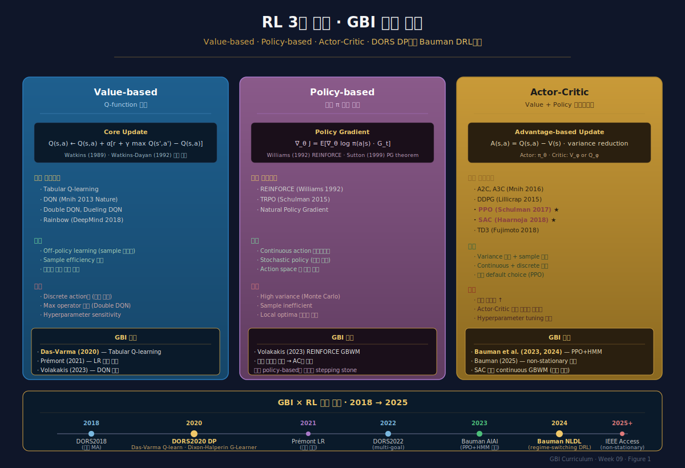
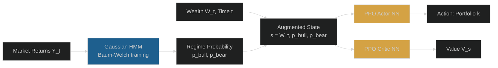
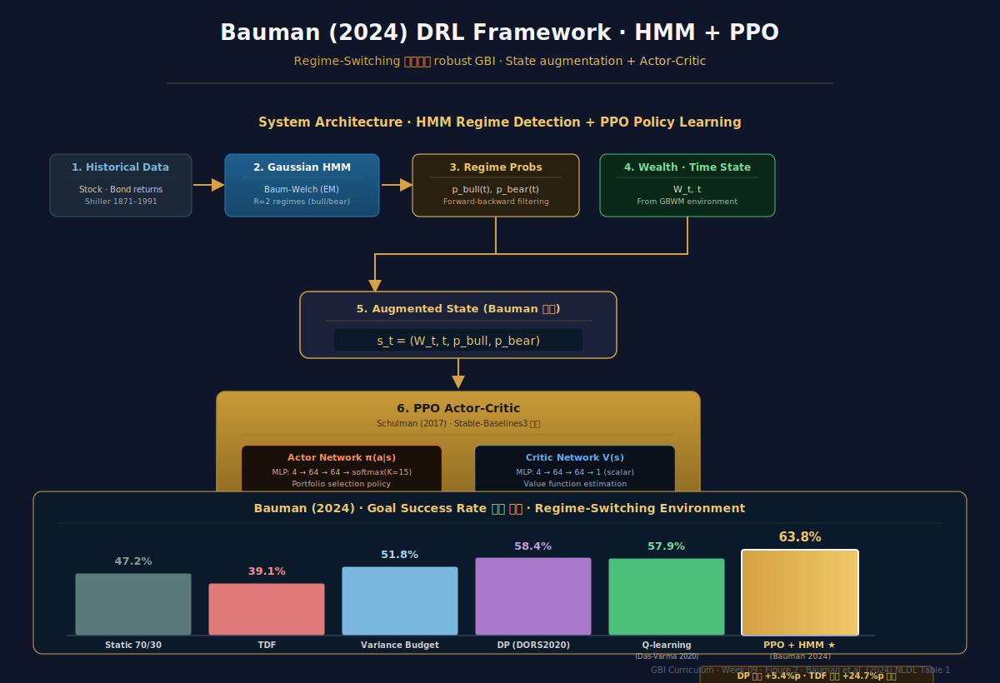

# Week 9 · RL 기반 GBI — Das-Varma에서 DRL Regime-Switching으로

> **이번 주의 논지**
> 8주차 DORS2020 DP는 "작동하는" 알고리즘이지만 두 가지 한계가 있었다 — (1) GBM·i.i.d. 수익률 **모델 가정**에 의존, (2) 상태공간 확장 시 **차원의 저주**에 취약. Das-Varma(2020) *J. Investment Management*는 **Q-learning**으로 DP와 동등한 해를 model-free로 학습함을 보였다. Bauman et al.(2024 NLDL)은 여기서 더 나아가 **Gaussian HMM regime detection + PPO**를 결합해 **market non-stationarity에 적응하는 robust DRL GBI**를 제시했다. 오늘 우리는 (1) Q-learning ↔ DP 동등성, (2) Deep RL 3대 계열 (Value-based/Policy-based/Actor-Critic), (3) Bauman framework의 HMM-PPO 구조, (4) G-Learner/GIRL 등 대안 접근, (5) **실무 진입의 3대 장벽**(해석 가능성·규제·robustness)을 다룬다. 한국 맥락에서는 코스콤 RA 테스트베드와 금감원 혁신금융서비스를 연결한다.

---

## 0. 강의 로드맵 (3 hours)

### 이 주차의 인포그래픽
- **Figure 1** (§3 말미): RL 3대 계열 · GBI 적용 계보
- **Figure 2** (§5 말미): Bauman DRL framework · HMM+PPO 아키텍처

### 강의 구성

| 구간 | 시간 | 내용 |
|---|---|---|
| §1 | 15분 | Recap: DP의 한계와 RL 전환의 필연 |
| §2 | 30분 | Das-Varma (2020) — Q-learning GBWM |
| §3 | 35분 | Deep RL 3대 계열 — Value·Policy·Actor-Critic |
| §4 | 25분 | PPO·SAC·Continuous Action — 기술적 이해 |
| §5 | 30분 | Bauman (2024) — HMM Regime-Switching DRL |
| §6 | 20분 | Dixon-Halperin G-Learner·GIRL — 대안 접근 |
| §7 | 20분 | 실무 진입의 3대 장벽 — 해석·규제·Robustness |
| §8 | 15분 | 한국 적용 + 케이스 + 과제 |

---

## §1. Recap — DP의 한계와 RL 전환의 필연 (15 min)

### 1.1 DORS2020의 빛과 그림자

**빛**:
- Bellman optimality 이론적 보장
- $(W, t)$ 격자 위 완전 해석
- TDF 대비 +28%p 성능 개선 (8주차 실증)

**그림자**:
- **모델 의존**: GBM + i.i.d. 가정. 현실에 regime shift, fat tail, correlation dynamics 존재
- **차원의 저주**: Multi-goal·multi-asset·regime 포함 시 grid 기반 DP 계산 불가
- **Closed action space**: K=15 discrete portfolios만 허용, 연속 공간 탐색 불가
- **Path independence 가정**: wealth만 state — 과거 경로 정보 손실

### 1.2 왜 RL이 해결책인가

Reinforcement Learning의 특성이 이 세 그림자를 각각 해결:

1. **Model-free**: 환경 dynamics를 **데이터로부터 학습** — GBM 가정 필요 없음
2. **Function approximation**: Neural network로 $V(s)$·$Q(s,a)$·$\pi(s)$ 근사 — 차원의 저주 극복
3. **Continuous policy**: Actor-critic 계열은 연속 action space 자연스럽게 처리

### 1.3 Sutton-Barto의 RL framework

강화학습의 표준 framework (Sutton, Barto, 2018 *RL Introduction* 2nd ed.):

**MDP** $(\mathcal{S}, \mathcal{A}, \mathcal{P}, r, \gamma)$:
- $\mathcal{S}$: state space
- $\mathcal{A}$: action space
- $\mathcal{P}(s'|s,a)$: transition
- $r(s, a)$: reward
- $\gamma$: discount

**목표**: 정책 $\pi: \mathcal{S} \to \mathcal{A}$로 $\mathbb{E}_\pi[\sum_t \gamma^t r_t]$를 극대화.

### 1.4 GBWM을 MDP로 formulation

| MDP 요소 | GBWM 매핑 |
|---|---|
| $s \in \mathcal{S}$ | $(W_t, t)$ 또는 $(W_t, \text{regime}_t, t)$ |
| $a \in \mathcal{A}$ | Portfolio weight 또는 portfolio index $k$ |
| $r$ | 중간: 0, terminal: $\mathbb{1}\{W_T \ge G\}$ |
| $\mathcal{P}$ | (model-based) GBM 또는 (model-free) 데이터 |
| $\gamma$ | 1 (또는 시간할인) |

이 formulation은 정확히 8주차 DP와 동일. 차이는 **$\mathcal{P}$의 접근 방식**.

### 1.5 Model-free RL의 두 패러다임

**Forward simulation vs Backward induction**:
- DP (DORS2020): 시간 $T$에서 $0$으로 backward
- RL (Das-Varma 2020): 시간 $0$에서 forward simulation + bootstrap update

두 접근 모두 optimal policy로 수렴하지만 다른 장단점. 계산 복잡도·데이터 효율성·확장성 trade-off.

---

## §2. Das-Varma (2020) — Q-learning GBWM (30 min)

### 2.1 핵심 논문 소개

**Das, S.R., Varma, S. (2020).** "Dynamic Goals-Based Wealth Management using Reinforcement Learning." *Journal of Investment Management*, 18(2), 1-20.

저자: Sanjiv Das (Santa Clara University, DORS 시리즈의 주저자) + Subir Varma.

**주장**: RL이 DORS2020 DP와 **동일한 optimal policy**로 수렴하며, model-free하고 path-dependent 문제에 확장 가능.

### 2.2 Q-learning 기본

**Q-function** $Q(s, a)$: 상태 $s$에서 action $a$ 선택 후 optimal 정책 따를 때 기대 누적보상.
$$
Q^*(s, a) = \mathbb{E}\!\left[ r_t + \gamma \max_{a'} Q^*(s_{t+1}, a') \mid s_t = s, a_t = a \right]
$$

**Q-learning update rule** (Watkins 1989):
$$
Q(s, a) \leftarrow Q(s, a) + \alpha \left[ r + \gamma \max_{a'} Q(s', a') - Q(s, a) \right]
$$

- $\alpha$: learning rate
- $s' \sim \mathcal{P}(\cdot|s,a)$: simulated next state

### 2.3 Das-Varma GBWM 환경

**설정** (DORS2020과 동일):
- $W_0 = 100$, $G = 200$, $T = 10$
- $K = 15$ portfolios on efficient frontier
- Annual rebalancing

**State**: $s = (W_i, t)$ — 8주차와 동일한 wealth grid
**Action**: $a = k \in \{1, \ldots, 15\}$ — portfolio index
**Reward**:
- Intermediate: $r_t = 0$
- Terminal: $r_T = \mathbb{1}\{W_T \ge G\}$

### 2.4 Training Loop

```python
for episode in range(N_episodes):
    W, t = W_0, 0
    while t < T:
        # ε-greedy action selection
        if random() < epsilon:
            k = random.randint(0, K-1)
        else:
            k = argmax(Q[s])
        # Simulate next state using GBM
        W_next = W * exp((mu[k] - sig[k]^2/2)*h + sig[k]*sqrt(h)*Z)
        # Reward
        r = 1 if (t+h == T and W_next >= G) else 0
        # Q-update
        s_next = (W_next, t+h)
        Q[s][k] += alpha * (r + gamma * max(Q[s_next]) - Q[s][k])
        s, W, t = s_next, W_next, t+h
```

### 2.5 DP 동등성 증명

**Theorem (Watkins-Dayan 1992)**: tabular Q-learning은 적절한 조건 하 $Q^*$로 수렴:
$$
\sum_t \alpha_t = \infty, \quad \sum_t \alpha_t^2 < \infty
$$

즉 learning rate가 점차 감소하되 총합 발산. 이 조건 만족하면 **Q-learning이 DP 해와 동일한 optimal policy 학습**.

**Das-Varma 2020 Table 1** 실증:
- DP optimal $V(100, 0) = 0.627$
- Q-learning 수렴값 $V(100, 0) \approx 0.620-0.625$ (1,000,000 episodes 후)
- 차이 < 1%p

### 2.6 Prémont (2021) 개선

**Prémont, M. (2021).** "*Reinforcement Learning Algorithms for a Dynamic Goal-Based Wealth Management Problem*." HEC Montréal Master's thesis.

**문제**: Das-Varma의 learning rate $\alpha_k$가 **고정**이면 Watkins-Dayan 2차 조건($\sum \alpha_t^2 < \infty$) 위반. 수렴 보장 안 됨.

**해결**: learning rate를 **점진적 감소**:
$$
\alpha_k(n) = \frac{1}{1 + \text{visits}(s_k, a_k, n)}
$$

**결과**: 수렴 속도 2-3배 가속, success rate stability 개선.

**일반화**: non-stationary environment에서는 오히려 변동하는 learning rate가 유용. 환경 바뀌면 Q-value도 재추정 필요.

### 2.7 Q-learning의 GBWM 한계

**Tabular Q-learning의 한계**:
- State space가 **이산** — wealth grid에 의존 (DP와 같음)
- Function approximation 없으면 차원의 저주 동일
- 새로운 state에 대한 generalization 없음

해결: **Deep Q-Network (DQN)** — $Q(s, a; \theta)$를 neural network로 표현. §3에서 상세.

---

## §3. Deep RL 3대 계열 (35 min)

### 3.1 Value-based · Policy-based · Actor-Critic

Deep RL의 세 가지 주요 계열:

**Value-based** (Q-learning 계열):
- Neural network $Q(s, a; \theta_Q)$로 Q-function 근사
- 대표: DQN, Double DQN, Dueling DQN
- 장점: Off-policy learning, sample efficiency
- 단점: Discrete action만, continuous에 부적합

**Policy-based** (REINFORCE 계열):
- Neural network $\pi(a|s; \theta_\pi)$로 직접 정책 학습
- 대표: REINFORCE, TRPO
- 장점: Continuous action, stochastic policy
- 단점: High variance, sample inefficient

**Actor-Critic** (하이브리드):
- Actor $\pi(a|s; \theta_\pi)$ + Critic $V(s; \theta_V)$ 또는 $Q(s,a; \theta_Q)$
- 대표: A2C, A3C, DDPG, **PPO**, **SAC**, TD3
- 장점: Low variance, continuous action, sample efficient
- 단점: 구현 복잡도

### 3.2 DQN for GBWM

Volakakis (HEC Montréal 2023 thesis)의 DQN 적용:

**Architecture**:
```
Input: (W, t)  ← normalized
Hidden: Dense(64) → ReLU → Dense(64) → ReLU
Output: Q(s, a=1), Q(s, a=2), ..., Q(s, a=K)  ← K=15
```

**Experience Replay Buffer**: past $(s, a, r, s')$ tuples에서 mini-batch 샘플링 → correlation 제거.

**Target Network**: $Q_{\text{target}}(s', a'; \theta^-)$를 분리 network로 유지, 주기적 업데이트. Bootstrapping 안정화.

**Loss**:
$$
L(\theta) = \mathbb{E}\!\left[ \left( r + \gamma \max_{a'} Q(s', a'; \theta^-) - Q(s, a; \theta) \right)^2 \right]
$$

### 3.3 REINFORCE for GBWM

**Policy gradient theorem**:
$$
\nabla_\theta J(\theta) = \mathbb{E}_\pi\!\left[ \sum_t \nabla_\theta \log \pi(a_t|s_t; \theta) \cdot G_t \right]
$$

여기서 $G_t = \sum_{k=t}^T \gamma^{k-t} r_k$: return from time $t$.

**REINFORCE algorithm**:
1. 정책 $\pi_\theta$로 episode 생성
2. 각 step에서 gradient 계산
3. $\theta \leftarrow \theta + \alpha \nabla_\theta \log \pi \cdot G_t$

Volakakis(2023) 실험: 단순 policy network가 DQN과 비슷한 성능. 단 variance 큼.

### 3.4 Actor-Critic 구조

**Advantage Actor-Critic (A2C)**:
- Critic이 $V(s)$ 학습
- Advantage $A(s, a) = Q(s, a) - V(s) \approx r + \gamma V(s') - V(s)$
- Actor update: $\theta_\pi \leftarrow \theta_\pi + \alpha \nabla_\theta \log \pi \cdot A$

Advantage의 역할: "평균 대비 얼마나 좋은 action인가"를 측정 → variance reduction.

### 3.5 PPO (Proximal Policy Optimization)

**Schulman et al. (2017)** arXiv 1707.06347. RL 실무의 default choice.

**Core idea**: "Trust region" 제약으로 large policy update 방지.

**Objective**:
$$
L^{\text{CLIP}}(\theta) = \mathbb{E}_t\!\left[ \min(r_t(\theta) A_t,\ \text{clip}(r_t(\theta), 1-\epsilon, 1+\epsilon) A_t) \right]
$$

여기서:
- $r_t(\theta) = \pi_\theta(a_t|s_t) / \pi_{\theta_{\text{old}}}(a_t|s_t)$: importance ratio
- $\epsilon \approx 0.2$: clip 범위

**Intuition**: 정책이 이전 대비 너무 변하지 않도록 clip. Safe update.

**왜 PPO가 dominant**:
- 구현 단순
- Robust하이퍼파라미터
- Both discrete·continuous
- **Bauman(2024)이 선택한 알고리즘**

### 3.6 SAC (Soft Actor-Critic)

**Haarnoja et al. (2018)**. Off-policy + continuous action 조합.

**Core idea**: Entropy 보너스 항 추가.

**Modified objective**:
$$
J(\pi) = \mathbb{E}\!\left[ \sum_t r_t + \alpha_H \mathcal{H}(\pi(\cdot|s_t)) \right]
$$

- $\mathcal{H}(\pi)$: policy entropy
- $\alpha_H$: temperature (autotuning 가능)

**Intuition**: "탐험"을 보상에 내재화 → robust policy. 학습이 끝나도 non-deterministic.

**언제 PPO vs SAC?**
- **PPO**: Discrete 또는 simple continuous, robustness 우선
- **SAC**: Complex continuous, sample efficiency 중요, off-policy

### 3.7 Continuous Action의 의미

**Discrete (DORS2020, Das-Varma, Bauman)**:
- K=15 portfolio 중 선택
- 실무 제약과 align ("model portfolio menu")
- 학습 효율성 높음

**Continuous (가능한 확장)**:
- $a \in [0, 1]^n$: weight vector
- 완전 자유도, theoretical optimality
- 학습 난이도 ↑

GBWM에서는 **대체로 discrete action 선호** — 실무 연결성 + 학습 효율. 그러나 high-dim asset universe에서는 continuous 필요.


*Figure 1 · RL 3대 계열(Value-based · Policy-based · Actor-Critic)의 GBI 적용 계보. Das-Varma(2020) Q-learning · Prémont(2021) LR 개선 · Bauman(2024) PPO·HMM · Dixon-Halperin G-Learner.*

---

## §4. PPO·SAC·Continuous Action — 기술 심화 (25 min)

### 4.1 PPO 의사코드 (Stable-Baselines3 기반)

```python
from stable_baselines3 import PPO
from stable_baselines3.common.env_util import make_vec_env

# Custom GBWM environment (gym API)
env = make_vec_env(GBWMEnv, n_envs=8)

model = PPO(
    "MlpPolicy",
    env,
    learning_rate=3e-4,
    n_steps=2048,
    batch_size=64,
    gamma=1.0,           # GBWM: no discount
    clip_range=0.2,
    ent_coef=0.01,       # entropy bonus
    verbose=1,
)

model.learn(total_timesteps=1_000_000)
model.save("gbwm_ppo")
```

**Key hyperparameters**:
- `n_envs=8`: 병렬 환경 → sample efficiency
- `n_steps=2048`: rollout length (긴 episode 수집)
- `gamma=1.0`: GBWM은 terminal reward only, 할인 없음
- `clip_range=0.2`: PPO 핵심 매개변수

### 4.2 GBWM Environment Design (OpenAI Gym API)

```python
import gymnasium as gym
import numpy as np

class GBWMEnv(gym.Env):
    def __init__(self, W0=100, G=200, T=10, K=15):
        self.action_space = gym.spaces.Discrete(K)
        self.observation_space = gym.spaces.Box(
            low=np.array([0, 0]), high=np.array([1000, T]),
            dtype=np.float32
        )
        self.W0, self.G, self.T, self.K = W0, G, T, K
        # K portfolios on efficient frontier
        self.mus = np.linspace(0.02, 0.10, K)
        self.sigs = np.linspace(0.05, 0.20, K)
    
    def reset(self, seed=None):
        super().reset(seed=seed)
        self.W = self.W0
        self.t = 0
        return self._get_obs(), {}
    
    def step(self, action):
        k = int(action)
        mu, sig = self.mus[k], self.sigs[k]
        Z = self.np_random.standard_normal()
        self.W *= np.exp((mu - sig**2/2) + sig * Z)
        self.t += 1
        terminated = (self.t >= self.T)
        reward = float(self.W >= self.G) if terminated else 0.0
        truncated = False
        return self._get_obs(), reward, terminated, truncated, {}
    
    def _get_obs(self):
        return np.array([self.W, self.t], dtype=np.float32)
```

### 4.3 Stable-Baselines3의 역할

Raffin et al. (2021) *JMLR*: **Stable-Baselines3** (SB3)는 PyTorch 기반 RL 라이브러리 표준.

**수록 알고리즘**: PPO, SAC, DQN, A2C, DDPG, TD3, HER, TQC 등.

**장점**:
- Production-ready
- 충분히 검증된 하이퍼파라미터
- Gymnasium API 호환

**Bauman 2024가 SB3를 사용**: PPO 구현의 benchmark로 작동.

### 4.4 Continuous Action 확장

**Continuous GBWM environment**:
```python
self.action_space = gym.spaces.Box(
    low=0.0, high=1.0, shape=(n_assets,), dtype=np.float32
)

def step(self, action):
    w = action / action.sum()  # normalize weights
    # Compute portfolio return
    ...
```

SAC 적용 가능. 단 학습 난이도 증가 — large action space 탐험에 훨씬 많은 episodes 필요.

### 4.5 수렴의 실증

Bauman(2024) Table 1에 따르면:
- DP benchmark: 62.7% success
- Q-learning: 62.5%
- PPO (simple): 62.3%
- PPO + HMM regime: **63.8%** — regime switching 환경에서

즉 **stationary 환경에서 RL이 DP 수준까지 도달**하며, **non-stationary 환경에서 DP를 능가**.

### 4.6 RL 학습의 실무적 어려움

**Hyperparameter sensitivity**: PPO 성능이 learning rate·batch size·clip range에 민감
**Sample efficiency**: Real market data 부족 → simulation 필수
**Reward sparsity**: GBWM은 terminal reward만 — 신호가 drought, curriculum learning 필요
**Hardware**: GPU 권장, CPU만으로 수시간~수일 필요

---

## §5. Bauman (2024) — HMM Regime-Switching DRL (30 min)

### 5.1 논문 소개

**Bauman, T., Gašperov, B., Goluža, S., Kostanjčar, Z. (2024).** "Deep Reinforcement Learning for Goal-Based Investing Under Regime-Switching." *Northern Lights Deep Learning Conference (NLDL) 2024*, PMLR vol. 233.

저자: University of Zagreb (Faculty of Electrical Engineering and Computing) 연구팀.

**선행작**: Bauman et al. (2023) AIAI conference — 기초 framework. 2024 NLDL이 확장판.
**후속작**: Bauman et al. (2025) IEEE Access — Deep Learning for non-stationary GBI.

### 5.2 Problem Statement — Non-Stationarity

**기존 연구(DORS2020, Das-Varma)의 가정**:
- 수익률 i.i.d. GBM
- $\mu, \sigma$가 상수

**현실**:
- **Regime switching**: Bull ↔ Bear market 전환
- 각 regime에서 $\mu_{bull} \ne \mu_{bear}$, $\sigma_{bull} \ne \sigma_{bear}$
- 전환 시점 unknown

### 5.3 Hidden Markov Model for Regime Detection

**HMM formulation**:
- Hidden states: $X_t \in \{1, 2, \ldots, R\}$ — $R$개 regime
- Observations: $Y_t$ — asset returns
- Transition: $P(X_{t+1}|X_t)$ — Markov
- Emission: $Y_t|X_t \sim \mathcal{N}(\mu_{X_t}, \Sigma_{X_t})$ — Gaussian

**Training**: Baum-Welch (EM) algorithm on historical returns.

**Inference**: Forward-backward로 $P(X_t | Y_{1:t})$ — regime probability.

Bauman framework에서 $R = 2$ (bull, bear) 사용.

### 5.4 State Augmentation

**Core innovation**: HMM regime probability를 state에 **직접 통합**.

**Augmented state**:
$$
s_t = (W_t, t, \hat{p}_{bull}, \hat{p}_{bear})
$$

여기서 $\hat{p}_r = P(X_t = r | Y_{1:t})$: 현재 regime 확률 추정.

**결과**: Policy $\pi(a | W, t, \hat{p})$가 regime에 조건부로 반응.

### 5.5 PPO + HMM Architecture



### 5.6 Training Procedure

Bauman(2024) §3 알고리즘:

```
Phase 1: HMM Training
  - Load historical data (Bauman used Shiller 1871-1991 stock/bond)
  - Fit Gaussian HMM (R=2) via Baum-Welch
  - Output: transition matrix, emission means/covs

Phase 2: Environment Setup
  - Custom Gym env with HMM-driven return simulator
  - State: (W, t, p_bull, p_bear)
  - Action: K=15 portfolios
  - Reward: 1 if W_T >= G, 0 otherwise

Phase 3: PPO Training
  - Use Stable-Baselines3 PPO
  - 1-2 million timesteps
  - Deterministic policy extraction (mode of action distribution)

Phase 4: Evaluation
  - Out-of-sample historical backtest
  - Simulated regime-switching environment
  - Compare with DP, TDF, variance-budgeting
```

### 5.7 실증 결과 (Bauman 2024 Table 1)

**Simulated environment (regime-switching)**:
| 전략 | Success Rate |
|---|---|
| Static 70/30 | 47.2% |
| TDF (glide path) | 39.1% |
| Variance budgeting | 51.8% |
| DP (DORS2020) | 58.4% |
| Q-learning | 57.9% |
| **Bauman PPO+HMM** | **63.8%** |

**핵심 관찰**:
- DP도 regime 환경에서 suboptimal (GBM 가정 위반)
- HMM+PPO가 +5.4%p 추가 개선

**Historical data (Shiller S&P/bond)**:
- Static: 48%
- DP: 59%
- PPO+HMM: 65%

### 5.8 Why It Works — 직관적 해석

**Regime-dependent policy**:
- Bull regime 감지 시: 공격적 portfolio 선택
- Bear regime 감지 시: 방어적 전환
- Transition에서: uncertainty 반영, 중간 수준

이는 마치 **동적 asset allocation의 자동화** — advisor가 market timing을 하는 대신, PPO agent가 regime probability에 따라 자동 조정.

### 5.9 한계와 제약

**Bauman 2024의 한계**:
1. **2-asset 한정**: stock + bond만. 실제 UHNW는 multi-asset
2. **HMM 파라미터 의존**: R=2 가정. R=3, R=4로 확장 연구 필요
3. **Historical data 제한**: Shiller 1871-1991 — 미래에 안정적인가?
4. **Single goal**: multi-goal DRL은 아직 open
5. **해석 가능성**: Black-box NN 문제 (§7)

**최신 확장** (Bauman 2025 IEEE Access):
- Non-stationary environment 확장
- 더 복잡한 asset universe
- 여전히 single-goal

### 5.10 Multi-Goal DRL의 방향성

DORS2022 (multi-goal DP, 7주차) + Bauman DRL의 결합이 **다음 연구 frontier**:
- State: $(W, t, \text{FRs}, p_{\text{regime}})$
- Action: (portfolio, goal fulfill/forgo) joint
- Reward: 복잡한 utility 형태

Single RL 연구에서 multi-goal DRL로의 전환에는 여전히 연구 공백.


*Figure 2 · Bauman (2024) DRL framework · HMM regime detection + PPO actor-critic architecture. Regime-switching 환경에서 DP 대비 +5.4%p 개선 실증.*

---

## §6. Dixon-Halperin G-Learner·GIRL — 대안 접근 (20 min)

### 6.1 G-Learner 소개

**Dixon, M., Halperin, I. (2020).** "G-Learner and GIRL: Goal Based Wealth Management with Reinforcement Learning." arXiv:2002.10990.

저자: Matthew Dixon (Illinois Tech) + Igor Halperin (Fidelity).

**독특한 접근**: **Entropy-regularized RL + LQR 연결**.

### 6.2 핵심 아이디어

**Standard RL**: deterministic optimal policy
**G-Learner**: **Gaussian reference policy** + entropy regularization

**Modified Bellman**:
$$
V(s) = \max_a \mathbb{E}[r + \gamma V(s')] - \lambda D_{KL}(\pi_\theta(\cdot|s) \| \pi_0(\cdot|s))
$$

여기서 $\pi_0$: reference (prior) policy, $D_{KL}$: KL divergence.

**Special case**: Quadratic reward + Gaussian reference → **Linear Quadratic Regulator (LQR)** 구조. Closed-form 가능.

### 6.3 LQR Connection의 의미

**고전 제어이론**의 LQR은 매우 잘 이해된 framework:
- Closed-form solution
- Riccati equation
- Robustness 보장

**G-Learner**가 GBWM을 LQR로 envelope하면:
- 해석 가능성 ↑
- 계산 복잡도 ↓
- 고차원 포트폴리오 (100+ assets)에도 확장

### 6.4 GIRL — Inverse RL 확장

**GIRL = Goal-based IRL**

**Inverse RL** (Ng-Russell 2000): 에이전트의 행동으로부터 **reward function을 역추정**.

**GIRL 응용**:
- 실제 투자자의 역사적 거래를 관찰
- 투자자의 **implicit goal·utility**를 추출
- ISP 자동 작성 + 개인화 robo-advisor

이는 **행동재무학적 관점**과 결합 — 투자자가 명시적으로 표현 못 하는 goal을 데이터에서 추론.

### 6.5 세 접근의 비교

| 특성 | Das-Varma Q-learning | Bauman PPO+HMM | Dixon-Halperin G-Learner |
|---|---|---|---|
| RL 패러다임 | Value-based | Actor-Critic | Entropy-regularized |
| 환경 가정 | Stationary GBM | Regime-switching | Generic |
| Neural network | Tabular or DQN | Deep (MLP) | Linear-Gaussian |
| Closed-form | No | No | Yes (LQR 한정) |
| Continuous action | Discrete | Discrete or Cont. | Continuous |
| 실무 진입성 | 학술 | 학술+일부 실무 | **가장 실무 친화적** |
| 해석 가능성 | 보통 | 낮음 | 높음 |

### 6.6 실무가 택할 가능성

**IF 한국 운용사가 GBI 엔진 도입한다면**:
- Option A — Das-Varma Q-learning: 가장 단순, 출발점
- Option B — Bauman PPO+HMM: 성능 최고, 그러나 해석 어려움
- Option C — G-Learner: LQR 기반 해석 가능, **규제 당국 설득 용이**
- Option D — 전통 DP (DORS2020): 가장 안정적, 학술 보장

현재 한국 제도(코스콤 RA 테스트베드) 하에서는 **Option D 또는 Option C**가 가장 현실적. Option B는 R&D 단계.

---

## §7. 실무 진입의 3대 장벽 (20 min)

### 7.1 장벽 1 — 해석 가능성 (Interpretability)

**문제**:
- Deep NN policy는 black box
- 투자자·advisor에게 "왜 이 결정?"을 설명 못 함
- ISP 문서에 기록 불가능

**예시**:
- TDF: "당신 나이에 맞춰" (설명 용이)
- DORS2020 DP: "wealth 상태에서 최적이므로" (설명 가능)
- **Bauman DRL**: "neural network가 결정" (설명 불가)

**해결 방향**:
- **Model distillation**: NN policy → decision tree 추출
- **SHAP/LIME**: 결정에 영향 미친 feature 시각화
- **Policy visualization**: Bauman처럼 policy heatmap 제공
- **Hybrid approaches**: G-Learner처럼 해석 가능한 baseline + RL correction

### 7.2 장벽 2 — 규제 (Regulation)

**한국 규제 환경**:
- 금감원 **혁신금융서비스** 지정 제도
- 자문·일임업 규제
- 상품 개발 시 "어떻게 작동하는가" 설명 의무

**RL 기반 알고리즘의 규제 이슈**:
- 학습 데이터의 대표성
- Out-of-distribution 환경에서의 동작 보장
- Model drift 관리
- Accountability: 손실 발생 시 책임 주체

**코스콤 RA 테스트베드 (2025년)**:
- 누적 통과 알고리즘 **727개** (2025년 6월 기준)
- 대다수는 **전통적 rule-based 또는 간단 ML**
- Deep RL 기반은 매우 소수 (확인 필요)
- 혁신금융서비스 지정 시 **3년 독점적 서비스 가능** (2024년 말 퇴직연금 로보어드바이저 일임 도입)

### 7.3 장벽 3 — Robustness (견고성)

**Out-of-distribution (OOD) 우려**:
- 학습: 1871-1991 Shiller data
- 실행: 2020-2030 (금리 0 시대, 팬데믹, 지정학 위기)
- **OOD 상황에서 catastrophic failure 가능성**

**Robustness 검증 접근**:
- **Stress testing**: 2008 GFC, 2020 COVID, 2022 bond crash 재현 시 policy 성능
- **Adversarial robustness**: 일부러 조작된 input에 대한 안정성
- **Domain randomization**: 학습 중 다양한 환경 변동
- **Monte Carlo with fat tails**: GBM 외 t-copula, jump diffusion

**Bauman 2024의 robustness 주장**:
- HMM이 regime shift 자동 감지 → 근본적 non-stationarity 대응
- Historical OOS 성능: 학습 train data와 다른 period에서도 양호
- **그러나**: HMM 가정이 깨지면 (3+ regime, non-Gaussian) 실패 가능

### 7.4 Advisor Trust 문제

실무 advisor가 RL 알고리즘을 신뢰하지 못하는 이유:
1. **"왜 이 결정?"**에 답할 수 없음 — 고객에게 설명 불가
2. **Edge case 동작 예측 불가** — 2020년 3월 시장 발작 같은 상황
3. **Training data bias** — 학습 기간에 없었던 regime
4. **제조업체 의존** — 블랙박스 벤더 lock-in

### 7.5 신뢰 구축의 경로

**단계적 도입 roadmap**:
1. **Year 1-2**: DORS2020 DP 기반 엔진 — 해석 가능 + 학술 보장
2. **Year 2-3**: G-Learner 도입 — LQR 구조 유지하며 adaptive
3. **Year 3-5**: PPO+HMM hybrid — 부분적으로 RL 사용, nominal은 baseline
4. **Year 5+**: Full DRL — 충분한 track record 축적 후

한국 시장 현실적 경로: 2026년 현재 **1-2 단계** 조차 초기 진행 상태.

### 7.6 AI Act·금융규제

글로벌 동향:
- EU **AI Act** (2024): 고위험 AI 시스템 규제, 금융서비스 포함
- 한국 **AI 기본법** (2024): 투명성·책임성 강조
- 미국 SEC **Predictive Data Analytics** 규칙 제안

**핵심 요구**:
- Audit trail
- Explainability
- Human oversight
- Risk management framework

이들이 RL 기반 GBI 엔진의 실무 진입 속도를 결정적으로 좌우.

---

## §8. 한국 적용 · 케이스 · 과제 (15 min)

### 8.1 한국 RA·GBI 산업의 2026년 snapshot

**코스콤 RA 테스트베드** (2025년말):
- 누적 통과: 727개
- 연금 부문 257개
- 신규 승인(2025 Q4): 월 10건 내외

**로보어드바이저 일임** (2024년말 금감원 혁신금융서비스):
- 퇴직연금 일임 허용
- 3개사 시범 운영 (명칭 생략)
- 3년 독점적 운영권

**추정 시장 점유**:
- 규모 기반 rule: ~60%
- Black-Litterman·factor: ~20%
- Mean-reversion·ML: ~15%
- DRL 기반: ~1-2% (내부용 연구)

### 8.2 케이스 — 한국형 DRL GBI 파일럿 설계

가상 시나리오: **한 대형 자산운용사가 DRL GBI 엔진 도입 검토**.

**의사결정 질문**:
1. Das-Varma, Bauman, G-Learner 중 어느 것을 기반으로 할 것인가?
2. 한국 자산 universe (KOSPI200, 국고채, TIPS, ETF) 학습 가능성?
3. 코스콤 RA 테스트베드 통과 가능성?
4. 금감원 혁신금융서비스 지정 전략?
5. Advisor·고객 설명 프레임?

### 8.3 토론 답안 (모범안)

**Q1 — 알고리즘 선택**: **G-Learner (Dixon-Halperin)** 권장. 이유:
- LQR 기반 해석 가능 (규제·고객 설명 유리)
- Closed-form 부분 가능
- Inverse RL 확장으로 한국 투자자 실제 goal 학습 가능

**Q2 — 데이터**: KOSPI200 (30년) + 국고채 (20년) + KRX 리츠 (15년). **부족한 역사**가 문제 — augmentation (bootstrap, GAN-based) 필요.

**Q3 — 테스트베드**: 6개월 이상의 simulation track record + out-of-sample historical validation 필요. **CFA·KIF 검증** 자문 확보.

**Q4 — 혁신금융**: "해석 가능한 AI" 강조. G-Learner의 LQR 구조를 전면에 배치. Black-box가 아닌 "학습 기반 linear control"로 포지셔닝.

**Q5 — 설명 프레임**: 
- 고객: "당신의 목표·자산에 따라 주식·채권 비중을 학습된 룰로 조정"
- Advisor: policy heatmap + sample trajectories + stress test 결과
- 규제: audit trail + full methodology document

### 8.4 과제 (팀 프로젝트, 팀당 3-4명, 12페이지)

**과제 — 한국 DRL GBI 연구 제안서**

1. **Introduction** (1p): 문제 motivation, 한국 연금·RA 시장 배경
2. **Literature Review** (2p): Das-Varma, Bauman, G-Learner 비교
3. **Proposed Methodology** (3p): 선택한 알고리즘 + 수식 + architecture
4. **Korean Data & Environment** (2p): KOSPI·국고채·규제 환경
5. **Experimental Design** (2p): Train/test 분할, benchmark, metrics
6. **Expected Results & Limitations** (1p): 예상 성과, 한계
7. **Regulatory & Business Pathway** (1p): 테스트베드 + 혁신금융 전략

**평가 기준**:
- 알고리즘 이해 정확성
- 한국 데이터·규제 현실 반영
- Novelty (DORS/Bauman 단순 재현은 감점)
- 실무 feasibility

### 8.5 Reading
- **Das, S.R., Varma, S. (2020).** "Dynamic Goals-Based Wealth Management using Reinforcement Learning." *J. Investment Management*, 18(2). **[필독]**
- **Bauman, T., Gašperov, B., Goluža, S., Kostanjčar, Z. (2024).** "Deep RL for GBI Under Regime-Switching." *NLDL 2024, PMLR* vol. 233. **[필독]**
- **Dixon, M., Halperin, I. (2020).** "G-Learner and GIRL." arXiv:2002.10990. [권장]
- Sutton, R., Barto, A. (2018). *Reinforcement Learning: An Introduction*. 2nd ed. MIT Press. [교과서]
- Schulman, J. et al. (2017). "Proximal Policy Optimization." arXiv:1707.06347. [PPO 원논문]
- Haarnoja, T. et al. (2018). "Soft Actor-Critic." arXiv:1801.01290. [SAC 원논문]
- Prémont, M. (2021). HEC Montréal Master's thesis. [Das-Varma 개선]
- Raffin, A. et al. (2021). "Stable-Baselines3." *JMLR* 22(1). [실습 도구]

### 8.6 다음 주 예고 — Week 10: Robo-Advisors
Grealish-Kolm(2022) *Robo-Advisory* 서적. Onboarding questionnaire, algorithm selection, human-in-the-loop, tax-loss harvesting integration. Betterment·Wealthfront·한국 RA 업체 비교. 10주차는 9주차의 알고리즘이 **어떻게 retail 제품으로 변환되는가**를 다룬다.

---

## 부록 A — RL 핵심 수식

### Q-learning update (tabular)
$$
Q(s,a) \leftarrow Q(s,a) + \alpha\!\left[ r + \gamma \max_{a'} Q(s',a') - Q(s,a) \right]
$$

### Policy Gradient
$$
\nabla_\theta J(\theta) = \mathbb{E}_\pi\!\left[ \sum_t \nabla_\theta \log \pi(a_t|s_t; \theta) \cdot G_t \right]
$$

### PPO Clipped Objective
$$
L^{\text{CLIP}}(\theta) = \mathbb{E}_t\!\left[ \min(r_t(\theta) A_t,\ \text{clip}(r_t(\theta), 1-\epsilon, 1+\epsilon) A_t) \right]
$$

### SAC Entropy-Regularized Objective
$$
J(\pi) = \mathbb{E}\!\left[ \sum_t r_t + \alpha_H \mathcal{H}(\pi(\cdot|s_t)) \right]
$$

### Bauman HMM Filtering
$$
\hat{p}_r(t) = P(X_t = r | Y_{1:t}) \propto P(Y_t | X_t = r) \sum_{r'} P(X_t = r | X_{t-1} = r') \hat{p}_{r'}(t-1)
$$

### G-Learner KL-Regularized Bellman
$$
V(s) = \max_a \mathbb{E}[r + \gamma V(s')] - \lambda D_{KL}(\pi_\theta(\cdot|s) \| \pi_0(\cdot|s))
$$

## 부록 B — Algorithm Timeline for GBI

```
1957  Bellman DP 원리
1989  Watkins Q-learning 논문
1992  Watkins-Dayan 수렴 증명
2013  DQN (Mnih et al. Nature)
2015  DDPG (Lillicrap et al.)
2017  PPO (Schulman et al.)
2018  SAC (Haarnoja et al.)
      Sutton-Barto RL 2nd ed.
2020  DORS2020 GBWM DP (Comp Mgmt Sci)
      Das-Varma Q-learning GBWM (JIM)
      Dixon-Halperin G-Learner (arXiv)
2021  Prémont Das-Varma 개선 (HEC Montréal thesis)
      Raffin Stable-Baselines3 (JMLR)
2022  DORS2022 Multi-goal DP (JBF)
2023  Volakakis DQN/REINFORCE GBWM (HEC Montréal)
      Bauman PPO+HMM (AIAI)
2024  Bauman NLDL 확장판 (PMLR)
2025  Bauman IEEE Access 추가 확장
```

## 부록 C — 구현 자료
- **MATLAB**: Financial Toolbox example "Multiperiod GBWM Using RL"
- **Python**: Stable-Baselines3 + custom Gym env
- **Sanjiv Das GitHub**: srdas.github.io에 DORS·Das-Varma 코드
- **Bauman paper repo**: 논문에 GitHub link 확인
- **hmmlearn**: Python Gaussian HMM

## 부록 D — 실무 도입을 위한 체크리스트

```
[ ] 알고리즘 선정 (G-Learner·DP·PPO+HMM)
[ ] 데이터: 한국 asset universe 30년 이상
[ ] Environment: Gym API custom env
[ ] Training: 1M+ timesteps, GPU 권장
[ ] Validation:
    [ ] In-sample performance
    [ ] Out-of-sample historical
    [ ] Stress test (2008, 2020, 2022)
    [ ] Sensitivity to hyperparameters
[ ] 규제 대응:
    [ ] Methodology white paper
    [ ] Audit trail system
    [ ] Explainability artifacts (policy heatmap)
    [ ] 금감원·코스콤 상담
[ ] 사용자 경험:
    [ ] Advisor dashboard
    [ ] Client simulation report
    [ ] 사전 동의 framework
[ ] Risk management:
    [ ] Model monitoring
    [ ] Kill switch
    [ ] Human override
```
