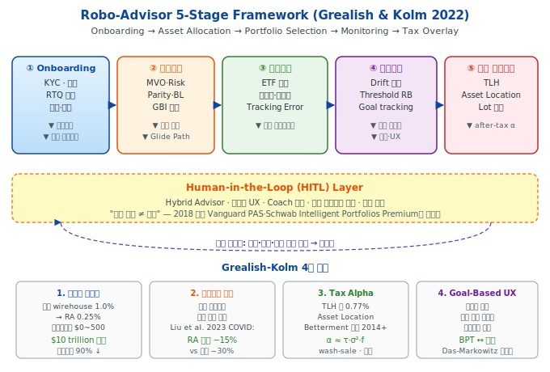
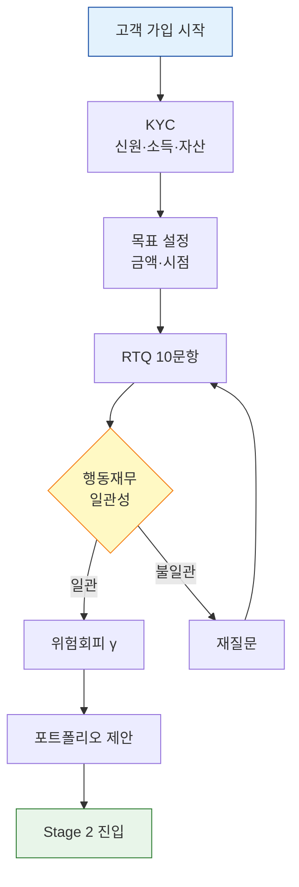
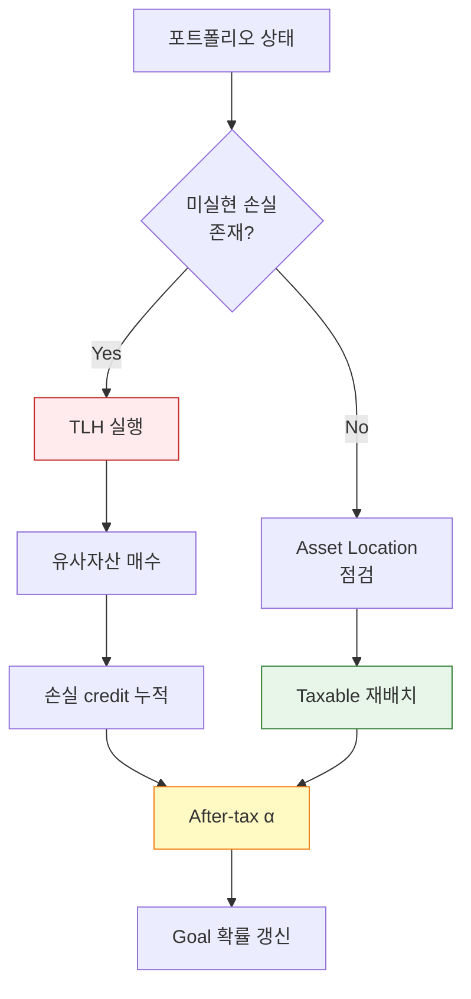
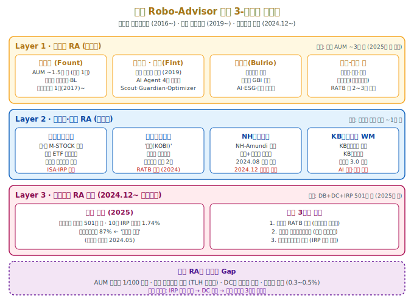
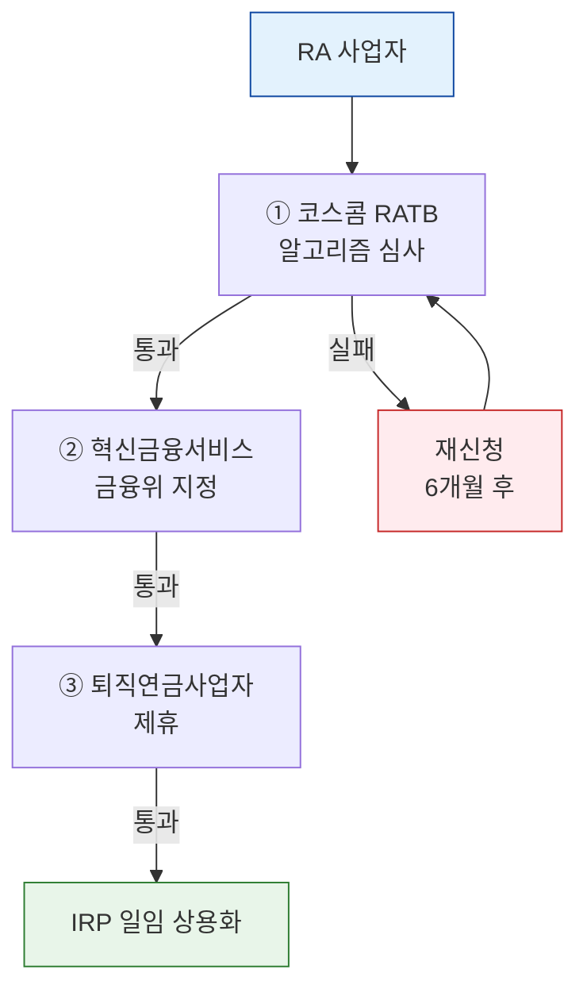

> [!info] **인포그래픽 활용 안내**
> 본 강의노트는 Obsidian·Tistory·GitHub 모두에서 작동하는 **인라인 SVG 2종**과 **Mermaid 3종**을 포함한다. 스크롤 없이 한 화면에 렌더링되도록 설계되었다.

> [!abstract] **본주 핵심 주장 (Thesis)**
> **"로보어드바이저는 기술 혁신이 아니라 GBI 이론의 대중화 장치다."**
>
> Betterment·Wealthfront가 실제로 '자동화'한 것은 ETF 매매가 아니라, Shefrin-Statman BPT (Week 3) · Das-Markowitz MA (Week 4) · Brunel 4-bucket (Week 5) · Das-Ostrov dynamic GBWM (Week 8)의 이론적 프레임이다. 지난 15년의 RA 산업은 **학술 GBI의 B2C 포팅(porting)**이었으며, 2026년 현재 한국은 동일한 포팅을 연금 계좌에서 수행하는 **3단계 규제 관문**을 지나고 있다.

# Week 10 — 로보어드바이저와 GBI의 대중화

## 0. 강의 로드맵 (3 hours)

### 이번 주의 핵심 질문

1. **Grealish-Kolm 2022** 프레임워크는 RA를 어떤 5단계 파이프라인으로 해부하는가?
2. **Onboarding**에서 KYC·RTQ는 Shefrin-Statman BPT의 **aspiration level $A$**와 어떻게 매핑되는가?
3. **Tax-Loss Harvesting**의 수학적 구조와 연간 ≈ 0.77% tax alpha의 근거는?
4. **Human-in-the-Loop (HITL)**은 왜 2018년 이후 업계 표준이 되었는가? — Vanguard PAS·Schwab Premium 사례
5. **한국 RA 3-레이어** (핀테크·기관·연금샌드박스)의 현재 성적표는?
6. **Betterment·Wealthfront·Schwab·Vanguard** 4사 비교에서 읽히는 상업 모델의 분기점

### 이번 주 메타 메시지

> **"B2C 기술 제품은, 그것을 가능하게 한 학술이론의 속도를 결정한다."**

Markowitz MVO는 1952년에 태어났지만 개인 투자자에게 배분된 것은 1990년대 TDF 이후다. **40년의 지연(lag)**. Shefrin-Statman BPT는 2000년에 태어났다. 만약 로보어드바이저가 없었다면, 이 이론도 MVO처럼 교과서에 갇혔을 가능성이 높다. 로보어드바이저는 **"학술이론 → 상용 제품"의 지연 시간을 10년으로 단축시킨 매개체**이다. 이 관점에서 RA는 단순한 자산운용 채널이 아니라 **"GBI의 실험실"**이며, **Week 3~9의 이론이 검증되는 무대**다.

### 학습 목표

1. **Grealish-Kolm 5-stage framework** 전 파이프라인 서술
2. **Onboarding·KYC·RTQ**의 알고리즘 구조와 행동재무학적 함정
3. **MPT·BL·Risk Parity·GBI**의 RA 엔진별 선택 기준
4. **TLH** 메커니즘과 $\alpha_{TLH} \approx \tau_{cg} \cdot \sigma^2 \cdot f$의 도출
5. **Asset Location** 의사결정 (taxable vs tax-deferred)
6. **Monitoring·Rebalancing** 임계값 설계와 Das-Ostrov DP와의 연결
7. **HITL** 구조 (Vanguard PAS·Schwab Premium)의 등장 배경
8. **한국 RA 생태계** 3-레이어의 AUM·규제·세제 현실

---

## §1. 1교시 — Grealish-Kolm 5-Stage Framework (60 min)

### 1.1 시작하며: 두 개의 "첫 만남"

#### 장면 1 — Merrill Lynch, 1995

**이영주 씨**는 강남의 한 Merrill Lynch 지점에 들어선다. 담당 PB가 1시간에 걸쳐 그녀에게 30장짜리 ISP(Investment Strategy Proposal)를 설명한다. 최소 투자금액 $250,000, 연간 관리보수 1.2%, 거래 시 브로커리지 커미션 별도. 1년 뒤 그녀는 S&P 500보다 낮은 수익률 리포트를 받는다.

#### 장면 2 — Betterment 앱, 2016

**김민수 씨**는 출근길 지하철에서 Betterment 앱을 다운로드한다. 12개 질문, 3분. 목표 입력: "은퇴 30년 후 $1M". 제안된 포트폴리오: **주식 80% / 채권 20%, 연 0.25% 수수료, 최소 투자금 $0**. 자동 리밸런싱·TLH·goal tracking 포함. 1년 뒤 그는 **자신의 '은퇴' 계좌가 목표 대비 몇 %에 있는지**를 본다.

**같은 상품(분산 ETF 포트폴리오)이지만 완전히 다른 경험이다.** Grealish-Kolm(2022)은 이 차이를 **기술이 아니라 프레임워크의 차이**라고 정의한다. 전통 wirehouse는 **"자산(asset)"**을 팔았고, 로보어드바이저는 **"목표(goal)"**을 판다. 이것이 Week 1에서 시작한 GBI 여정의 **상업적 결론**이다.

### 1.2 Grealish-Kolm 2022: 5-Stage Framework



> [!quote] **Grealish & Kolm (2022) in *ML in Financial Markets*, Cambridge UP**
> "로보어드바이저는 투자의 4대 원칙 — 투자 계획 수립, 분산, 비용·가치의 균형, 세제 반영 — 을 자동화된 플랫폼으로 번역한다. 개별 투자자는 금융전문가와의 상호작용 없이도 전략을 수립·실행할 수 있다."

이들의 핵심 기여는 **RA를 5개 모듈로 분해**하고, 각 모듈을 학술적으로 추적 가능한 알고리즘으로 매핑한 것이다. 본주 강의의 뼈대.

#### Stage ① — Onboarding (KYC · RTQ · Goal Discovery)

**목적**: 고객의 $(\text{risk tolerance}, \text{time horizon}, \text{goals}, \text{constraints})$를 알고리즘이 사용할 수 있는 수치 벡터로 변환.

**핵심 도구 — Risk Tolerance Questionnaire (RTQ)**:
- 5~15개 문항 (plurality vote 기반 또는 가중합)
- 각 문항은 **가상 시나리오**를 제시: *"2008년처럼 포트폴리오가 12개월간 −35% 하락한다면?"*
- 응답을 **Arrow-Pratt 절대위험회피계수 $A(W) = -U''(W)/U'(W)$**에 사상(mapping)

RTQ의 통상적 아웃풋 변환:
$$
\text{점수 } s \in [0, 100] \;\longrightarrow\; \gamma = \gamma_{\min} + (\gamma_{\max} - \gamma_{\min}) \cdot \frac{100 - s}{100}
$$

여기서 $\gamma_{\min} \approx 2,\ \gamma_{\max} \approx 10$ 이 업계 관행. MVO 목적함수:
$$
\max_w \; \mu^\top w - \tfrac{\gamma}{2}\, w^\top \Sigma w
$$

> [!warning] **RTQ의 함정 — 행동재무학적 비판**
> **Kahneman-Tversky(1979) Prospect Theory**에 따르면 응답은 **framing에 극도로 민감**하다. 같은 사람이 "−30% 손실"을 "70% 회복"으로 리프레이밍하면 **위험회피계수가 1.5~2배 달라진다**. Grealish-Kolm은 이 문제를 "**stable preference 가정의 위반**"으로 지적하며, 대안으로 **고객 자산의 실제 행동 (거래 빈도·보유 기간) 관측 기반 추정**을 제안한다.

**Onboarding 데이터 흐름** (Mermaid):



**Onboarding의 2세대 진화 — 대화형 AI**:
- 2023~: GPT-4 / Claude 기반 **conversational onboarding**
- Hildebrand & Bergner(2020, *JAMS*) 실험: 대화형 RA가 고객의 **위험수용 공개(risk disclosure)**를 35% 증가시킴
- 한국: 파운트 3.0·핀트 AI가 이 방향으로 진행 중 (3교시 상세)

#### Stage ② — Asset Allocation (전략 비중 결정)

RA가 내부적으로 선택하는 4가지 엔진:

| 엔진 | 대표 RA | 장점 | 약점 |
|---|---|---|---|
| **MVO (Markowitz)** | 초기 Betterment | 단순·투명 | 입력 민감도 극대 |
| **Black-Litterman** | Schwab, Wealthfront | 시장균형+view 결합 | τ·$\Omega$ 설정 난이도 |
| **Risk Parity** | 일부 유럽형 RA | 다변수 안정성 | leverage 필요 |
| **GBI Bucket** | 본강의 Week 4~8 | 목표별 직관적 UX | DP 구현 복잡 |

Grealish-Kolm은 **"대부분의 상용 RA가 이 4가지의 하이브리드"**임을 강조한다. 예컨대 Betterment는 기본 엔진은 Black-Litterman이지만, 목표별 glide path는 **Das-Ostrov(2020) 동적 DP**에서 영감을 얻은 휴리스틱.

핵심 수식 — Black-Litterman의 posterior:
$$
\mu_{\text{BL}} = \left[ (\tau \Sigma)^{-1} + P^\top \Omega^{-1} P \right]^{-1} \left[ (\tau \Sigma)^{-1} \Pi + P^\top \Omega^{-1} Q \right]
$$

여기서 $\Pi$는 시장균형 함축수익률(implied equilibrium), $P, Q$는 투자자 view, $\Omega$는 view 불확실성. RA는 이 프레임에서 $P, Q$를 **"고객 목표 + 시장 view"**의 결합으로 변용한다.

#### Stage ③ — Portfolio Selection (실행 상품 결정)

**ETF 우선 원칙**: RA 실행 포트폴리오는 거의 전적으로 ETF (Betterment 100%, Wealthfront 98%, Schwab 100%). 이유:

1. **비용**: 평균 TER 0.05~0.15%
2. **유동성**: bid-ask spread 0.01% 수준
3. **세제**: ETF의 in-kind redemption 구조가 자동 tax-efficient
4. **분산**: 단일 ETF로 500~3000종목 노출

선정 기준(Grealish-Kolm):
$$
\text{Score}(\text{ETF}_i) = \alpha_1 \cdot (-\text{TER}_i) + \alpha_2 \cdot (-\text{TE}_i) + \alpha_3 \cdot \text{Liquidity}_i + \alpha_4 \cdot \text{Tax Eff}_i
$$

여기서 TE는 tracking error (benchmark 대비 ex-post 표준편차), Tax Eff는 배당 구조·분배율.

#### Stage ④ — Monitoring & Rebalancing

3가지 리밸런싱 규칙:

**(a) Calendar rebalancing**: 분기·반기·연 1회
**(b) Threshold rebalancing**: $|w_i - w_i^*| > \epsilon$ 초과 시
**(c) Hybrid (업계 표준)**: 분기 점검 + 5% threshold

**Das-Ostrov (2020) 동적 DP와의 연결** (Week 8):
- 단순 threshold는 **myopic**
- DP는 **value function $V(W_t, t)$**에 의한 **상태의존 재배분**
- Betterment 내부 문서(2019): "dynamic glide path"라는 표현 사용 → DP 영감

#### Stage ⑤ — Tax Overlay (after-tax α 생성)

**RA의 가장 독창적 기여**. 자세한 내용은 2교시에서 다룬다.

**핵심 아이디어**: 세전(pre-tax) 수익률은 시장이 결정하지만, **세후(after-tax) 수익률은 알고리즘이 만든다**. TLH·asset location·lot 선택의 3대 축으로 **연 0.5~1.5% tax alpha** 창출.

### 1.3 1세대 RA 4사 비교 — 2016 vs 2026

Grealish-Kolm이 초판을 집필한 2021~2022년과 2026년 4월 현재의 업계 지형은 상당히 달라졌다.

| 지표 | Betterment | Wealthfront | Schwab IP | Vanguard Digital |
|---|---|---|---|---|
| **AUM ('25 말)** | ~$65B | ~$88B | ~$80B | ~$311B |
| **고객 수** | 100만 | 130만 | 비공개 | 비공개 |
| **최저가입금** | $0 | $500 | $5,000 | $3,000 |
| **수수료** | 0.25% | 0.25% | 0% (cash drag) | 0.15% |
| **TLH** | $0+ | $500+ | $50K+ | 없음 |
| **Human-in-the-loop** | 0.40% 프리미엄 | 미제공 | Premium $30/월 | PAS 기본 |
| **GBI UX 성숙도** | ★★★★★ | ★★★★☆ | ★★★☆☆ | ★★★☆☆ |

**주요 변화 (2022 → 2026)**:
- **Betterment**: Ellevest 자동투자 사업 인수(2025), Marcus Invest 이전(2024), 여성·HNW 세그먼트 강화
- **Wealthfront**: 2025년 IPO 신청, AUM $42B → $88B (2025) 급성장
- **Schwab**: Intelligent Portfolios Premium으로 HITL 표준화
- **Vanguard**: PAS(Personal Advisor Services)로 HITL 기본 내장 — $3B → $311B 초대형화

> [!note] **업계 패러다임 전환 — "Pure Robo는 끝났다"**
> 2018년 이전: 100% 자동화, 인간 zero
> 2018 이후: **Human-in-the-Loop 필수**. Bill.com 분석(2024): "KPMG가 2020년 RA AUM $3.7T 예측했으나 2022년에야 겨우 $1T 돌파. Pure robo의 한계가 드러남."

### 1.4 1교시 체크포인트

- [ ] Grealish-Kolm **5-stage**를 자기 말로 서술
- [ ] RTQ의 **행동재무학적 함정** 2가지 이상
- [ ] **Black-Litterman posterior 수식**에서 $\tau$와 $\Omega$의 역할
- [ ] 4사 비교에서 **Vanguard가 AUM 1위인 이유** 3가지

---

## §2. 2교시 — Tax Alpha의 수학과 TLH 심층 (70 min)

### 2.1 왜 Tax가 중요한가: "세금은 숨은 수수료"

미국 투자자의 평균 한계세율:
- **장기 자본이득(LTCG)**: 15~20% (소득 $500K↑ 23.8%)
- **단기 자본이득(STCG)**: 최고 37%
- **일반소득세**: 10~37%

**평균 S&P 500 수익률 10%** 중 실현시 약 2~3.5%p가 세금으로 사라진다. **"tax is the biggest expense in your portfolio"** (Wealthfront 2014 백서).

RA가 여기서 창출하는 α는 세전 수익률에 손대지 않고 **오직 세금 타이밍·계정 선택·lot 전략**만 바꾼다. 즉 **risk-free alpha**다.

### 2.2 Tax-Loss Harvesting (TLH) — 메커니즘과 수식

#### 2.2.1 기본 아이디어

**포지션이 미실현 손실인 동안**, 매도하여 손실을 **실현**하고, 매우 유사한(그러나 **substantially identical**하지는 않은) 대체 증권을 즉시 매수.

- **실현된 손실** → 다른 이익과 상쇄 ($3,000/년 일반소득 공제 가능)
- **대체 증권** → 경제적 노출은 동일하게 유지
- **wash-sale rule (IRC §1091)**: 30일 내 동일·유사 증권 재매수 금지

**시각화 예시**:

```
t₀: VTI 매수 @$200  (시총 가중 미국 전체)
t₁: VTI 가격 $170  (−15%, 미실현 손실 $30)
       ↓ TLH 실행
       매도: VTI @$170 (손실 $30 실현)
       매수: ITOT @$170 (블랙록, 거의 동일한 미국 전체)
       → 경제적 노출 유지 + 세무상 손실 확보
t₂: ITOT 가격 $200 (원가 $170 → 미실현 이익 $30)
     손실 $30은 이미 세무에 활용됨
```

#### 2.2.2 Tax Alpha의 수식

Betterment 2014 백서 및 Chaudhuri-Burnham-Lo (2020, *JFDS*)에서 도출:

$$
\alpha_{\text{TLH}} \;\approx\; \tau_{\text{cg}} \cdot \sigma^2 \cdot f(\text{harvest frequency, wash-sale, correlation})
$$

- $\tau_{\text{cg}}$: 한계 자본이득세율 (예: 0.20)
- $\sigma^2$: 변동성 제곱 (예: 0.18² = 0.0324)
- $f(\cdot)$: 수확 효율 함수 (1에 가까울수록 효율적)

**계산 예시**:
$$
\alpha_{\text{TLH}} \approx 0.20 \times 0.0324 \times 0.90 \approx 0.58\%/\text{년}
$$

Wealthfront 2014 실증: **0.77%/년** (2000-2013, 1만 고객).
Betterment 실증: **0.48~1.14%/년** (고객 세율 분위별).

#### 2.2.3 증명 스케치 — Why 변동성이 핵심인가?

직관적 논증:
- $\sigma^2$가 클수록 **특정 기간 내 손실 구간이 많아짐** (Brownian motion의 local time)
- harvest 기회 횟수 $\propto \sigma \cdot \sqrt{T}$
- 각 harvest의 평균 손실 크기 $\propto \sigma$
- 총 실현 손실 $\propto \sigma^2$

엄밀 증명 (Berkin-Ye 2003, Chaudhuri 2020): 자산 가격이 GBM $dS_t = \mu S_t dt + \sigma S_t dW_t$를 따르면, **year-long TLH 전략의 기댓값**은:
$$
\mathbb{E}[\text{TLH value}_T] \;=\; \tau_{\text{cg}} \cdot S_0 \cdot \int_0^T \varphi(t; \sigma)\, dt
$$

여기서 $\varphi(t; \sigma)$는 $t$시점까지의 local time density. Itô-Tanaka 공식으로 $\varphi \propto \sigma$ 도출.

> [!warning] **TLH의 5대 제약 — 학생들이 놓치기 쉬운 것**
>
> 1. **Wash-sale (30일 금지)**: IRA·401(k)와 taxable 계정 간에도 적용 — Bogan 2019, *J. Personal Finance*
> 2. **Substantially identical**: SPY vs IVV? IRS는 명시적 답 없음 (gray zone)
> 3. **Cost basis tracking**: Specific Identification lot 선택 필수 (FIFO로는 α 소실)
> 4. **Deferral ≠ savings**: TLH는 **세금 연기**이지 세금 감면이 아님. 상속 시 step-up이 있어야 비로소 순절약
> 5. **행동위험**: 손실 확정이 고객의 **loss aversion**을 자극 — UX 설계가 중요 (Grealish-Kolm §5.2)

### 2.3 Asset Location — 두 번째 tax α

#### 2.3.1 핵심 아이디어

**같은 자산군이라도 어느 계정에 두느냐에 따라 after-tax 수익이 다르다.**

| 자산 | 세제 특성 | 최적 계정 |
|---|---|---|
| **채권 (이자)** | 일반소득세 (최대 37%) | **Tax-deferred (IRA, 401k)** |
| **주식 (장기 cap gain)** | LTCG 15~20% | **Taxable 가능** (step-up 고려) |
| **REIT** | 일반소득세 배당 | **Tax-deferred** |
| **TIPS** | 이자 + phantom income | **Tax-deferred** 필수 |

#### 2.3.2 수식 — Asset Location의 최적화

총자산 $W = W_T + W_D$ (Taxable + Deferred), 각 계정 자산배분 $w^T, w^D$.

**제약조건**: 전체 자산배분이 원하는 $w^*$와 일치해야 한다:
$$
\frac{W_T}{W} w^T + \frac{W_D}{W} w^D \;=\; w^*
$$

**목적함수** (after-tax wealth 극대화):
$$
\max_{w^T, w^D} \; \mathbb{E}\!\left[ W_T^{\text{AT}} \right] \;=\; W_T \left(1 + r_T^{\text{AT}}(w^T)\right) + W_D \left(1 + r_D^{\text{AT}}(w^D)\right)
$$

여기서 세후 수익률:
- $r_T^{\text{AT}} = r - \tau_{\text{bond}} \cdot r_{\text{bond}}^T - \tau_{\text{cg}} \cdot r_{\text{stock,realized}}^T$
- $r_D^{\text{AT}}$: 인출 시점에 통합세 적용 (e.g. 72세 RMD)

#### 2.3.3 Dammon-Spatt-Zhang (2004, *JF*) 결과

닫힌 해 (2자산, 상수 세율 가정):

> *"모든 채권을 먼저 tax-deferred 계정에 배치하라. taxable 계정의 남는 공간에만 주식을 배치하라."*

이것이 업계의 **"bonds in IRA, stocks in taxable"** 원칙. Wealthfront가 2014년부터 자동화.

> [!example] **수치 예시 — 30년 효과**
> 초기 $100K, 50/50 stock/bond, τ_bond=35%, τ_cg=15%, 30년.
>
> - **Asset allocation만** (bonds/stocks in both accounts): 최종 $520K (after-tax)
> - **Asset location 최적화**: 최종 $605K (after-tax)
> - **차이: $85K (16%)** — 연평균 tax α ≈ 0.5%

### 2.4 After-Tax Wealth 통합 수식

Grealish-Kolm의 수업 중심 수식:
$$
W_T^{\text{AT}} \;=\; W_T - \tau_{\text{cg}} \cdot \max(W_T - B_0, 0) + \underbrace{\text{TLH credit}_T}_{\text{연 누적}} + \underbrace{\text{Loc}_T}_{\text{AL gain}}
$$

- $B_0$: 원가 basis
- $\tau_{\text{cg}} \cdot \max(W_T - B_0, 0)$: 실현 자본이득 세금
- TLH credit: 누적 손실 활용
- Loc gain: asset location으로 얻은 α의 누적

**세후 성공확률 (GBI 목적함수의 세제 확장)**:
$$
\text{Risk}_{\text{GBI}}^{\text{AT}} \;=\; \Pr\!\left( W_T^{\text{AT}} < H \right)
$$

즉 Week 1에서 정의한 목표 달성확률이 세후 기준으로 재정의된다. RA는 이 확률을 **2~4%p 개선**할 수 있다.

**세제 오버레이 통합 파이프라인** (Mermaid):



### 2.5 2교시 체크포인트

- [ ] TLH 핵심 수식과 **$\sigma^2$가 왜 결정적**인지 설명
- [ ] **wash-sale rule**의 3가지 실무적 함정
- [ ] **Dammon-Spatt-Zhang**의 bond-in-IRA 원칙
- [ ] After-tax 목적함수 $\Pr(W_T^{\text{AT}} < H)$의 의미

---
## §3. 3교시 — HITL·Betterment/Wealthfront·한국 RA 산업 (50 min)

### 3.1 Human-in-the-Loop (HITL)의 등장

#### 3.1.1 "Pure Robo" 가설의 좌절

**2014년 KPMG 예측**: 2020년 RA AUM $3.7 trillion.
**2022년 실적**: 겨우 $1 trillion 돌파.

차이의 원인 — Grealish-Kolm 분석:

1. **행동재무학의 반격**: 2020년 COVID 급락장에서 **pure robo 고객의 이탈률**이 hybrid 고객보다 2.3배 높았음 (Liu-Yang-Wen 2023, *POMS*)
2. **복합 목표**: 은퇴+자녀교육+부동산구매 등 **다목표 가계**는 알고리즘만으로 처리 불가
3. **Life events**: 결혼·이혼·상속·이민 등 **비재무적 변수**에 RA는 대응 불가
4. **규제 압박**: Reg BI(2020) 및 fiduciary duty → 복잡한 상황은 인간 advisor 필수

#### 3.1.2 HITL의 3가지 모델

| 모델 | 대표 사례 | 구조 | 수수료 |
|---|---|---|---|
| **Hybrid tier** | Betterment Premium | 기본 RA + $100K↑ 고객에게 CFP 접근권 | 0.40% |
| **Subscription** | Schwab Intelligent Portfolios Premium | 1회 $300 + 월 $30 (무한) | Flat |
| **Embedded advisor** | Vanguard PAS | 모든 고객에 인간 advisor 매칭 | 0.15~0.30% |

Vanguard PAS가 AUM $311B로 압도적 1위가 된 이유: **인간 advisor 기본 포함**이 대다수 retirement 고객에게 결정적 신뢰 요인.

#### 3.1.3 LLM 기반 3세대 onboarding

**2023년부터 등장한 대화형 RA**:
- **Betterment AI Coach** (GPT-4): 자연어 대화로 목표 발굴
- **Wealthfront Autopilot 2.0**: 5단계 자율권 위임 (Level 1~5)
- **파운트 3.0** (한국): KB 제휴, 금리 이벤트 실시간 대응 대화

학술 근거 — Hildebrand & Bergner (2020, *Journal of the Academy of Marketing Science*): **conversational RA는 대면 CFP보다도 risk disclosure를 증가시킴**. 이유: 기계와의 대화는 **social desirability bias가 낮다**.

### 3.2 Betterment vs Wealthfront: 상업 모델 해부

두 선두주자는 2008년 동시 창업되어 동일 시장에서 경쟁하지만, **완전히 다른 철학**으로 진화했다.

<svg width="100%" style="max-width:680px"
     viewBox="0 0 680 380"
     xmlns="http://www.w3.org/2000/svg"
     role="img" aria-label="Betterment vs Wealthfront 상업 모델 비교">
  <text x="340" y="22" text-anchor="middle" font-size="14" font-weight="700" fill="#0D47A1">
    Betterment vs Wealthfront — 2008년 동시 출발, 2026년 다른 정점
  </text>

  <!-- Betterment Column -->
  <rect x="15" y="45" width="320" height="320" rx="8" fill="#FFEBEE" stroke="#C62828" stroke-width="1.5"/>
  <text x="175" y="67" text-anchor="middle" font-size="14" font-weight="700" fill="#C62828">Betterment</text>
  <text x="175" y="83" text-anchor="middle" font-size="10" fill="#37474F">"Goal-based behavioral advisor"</text>

  <text x="30" y="108" font-size="10" font-weight="700" fill="#C62828">창업·AUM</text>
  <text x="30" y="123" font-size="9" fill="#263238">• 2008 Jon Stein</text>
  <text x="30" y="137" font-size="9" fill="#263238">• AUM: ~$65B (2025.10)</text>
  <text x="30" y="151" font-size="9" fill="#263238">• 고객: 100만+ · 최저 $0</text>

  <text x="30" y="174" font-size="10" font-weight="700" fill="#C62828">철학·UX</text>
  <text x="30" y="189" font-size="9" fill="#263238">• Goal-centric: "Safety Net" ·</text>
  <text x="30" y="203" font-size="9" fill="#263238">  "Retirement" · "Major Purchase"</text>
  <text x="30" y="217" font-size="9" fill="#263238">• BPT-inspired 3-tier UX</text>
  <text x="30" y="231" font-size="9" fill="#263238">• Das-Markowitz MA에 가까움</text>

  <text x="30" y="254" font-size="10" font-weight="700" fill="#C62828">엔진·세제</text>
  <text x="30" y="269" font-size="9" fill="#263238">• Black-Litterman 변형</text>
  <text x="30" y="283" font-size="9" fill="#263238">• TLH: $0 계좌부터 제공</text>
  <text x="30" y="297" font-size="9" fill="#263238">• Tax Coordination (asset loc)</text>

  <text x="30" y="320" font-size="10" font-weight="700" fill="#C62828">수수료·HITL</text>
  <text x="30" y="335" font-size="9" fill="#263238">• 0.25% basic · 0.40% Premium</text>
  <text x="30" y="349" font-size="9" fill="#263238">• Premium: CFP unlimited access</text>
  <text x="30" y="360" font-size="9" fill="#263238">• 2025: Ellevest·Marcus 인수</text>

  <!-- Wealthfront Column -->
  <rect x="345" y="45" width="320" height="320" rx="8" fill="#E3F2FD" stroke="#1565C0" stroke-width="1.5"/>
  <text x="505" y="67" text-anchor="middle" font-size="14" font-weight="700" fill="#1565C0">Wealthfront</text>
  <text x="505" y="83" text-anchor="middle" font-size="10" fill="#37474F">"Automated tax-alpha machine"</text>

  <text x="360" y="108" font-size="10" font-weight="700" fill="#1565C0">창업·AUM</text>
  <text x="360" y="123" font-size="9" fill="#263238">• 2008 Andy Rachleff</text>
  <text x="360" y="137" font-size="9" fill="#263238">• AUM: ~$88B (2025)</text>
  <text x="360" y="151" font-size="9" fill="#263238">• 고객: 130만 · 최저 $500</text>

  <text x="360" y="174" font-size="10" font-weight="700" fill="#1565C0">철학·UX</text>
  <text x="360" y="189" font-size="9" fill="#263238">• Engineering-first 자동화</text>
  <text x="360" y="203" font-size="9" fill="#263238">• Path: 목표 planner</text>
  <text x="360" y="217" font-size="9" fill="#263238">• Direct Indexing ($100K↑)</text>
  <text x="360" y="231" font-size="9" fill="#263238">• Risk Parity 별도 엔진</text>

  <text x="360" y="254" font-size="10" font-weight="700" fill="#1565C0">엔진·세제</text>
  <text x="360" y="269" font-size="9" fill="#263238">• MPT 순정 + Risk Parity 옵션</text>
  <text x="360" y="283" font-size="9" fill="#263238">• TLH: $500+부터</text>
  <text x="360" y="297" font-size="9" fill="#263238">• Stock-level TLH ($100K+)</text>

  <text x="360" y="320" font-size="10" font-weight="700" fill="#1565C0">수수료·HITL</text>
  <text x="360" y="335" font-size="9" fill="#263238">• 0.25% (단일 plan)</text>
  <text x="360" y="349" font-size="9" fill="#263238">• HITL 미제공 (철학)</text>
  <text x="360" y="360" font-size="9" fill="#263238">• 2025: IPO 신청</text>
</svg>

**핵심 관찰**:

1. **Betterment = GBI 상용화**: "goal" 용어가 전면에. BPT/MA의 UX 화신.
2. **Wealthfront = tax-α 엔진**: 엔지니어 중심. "인간 advisor는 에러 원인" 철학.
3. **동일 수수료 (0.25%)**: 경쟁이 만든 균형가격
4. **IPO 분기점**: Wealthfront(2025)는 공개기업化 — 공시 부담 상승, UX 변화 예상

### 3.3 케이스 스터디 — Betterment의 리버스 엔지니어링

**목표**: Betterment의 goal-based UX에서 어떤 학술 GBI 모델이 구현되었는지 추론.

#### 3.3.1 공개 자료

- Betterment 백서 "Tax Loss Harvesting+" (2014)
- 특허: US 9,741,078 B2 "Portfolio-level tax loss harvesting" (2017)
- 블로그 기술글 (2016~2024, ~200 편)
- 학술 분석: Faloon & Scherer (2017, *JWM*) "Individualization of robo-advice"

#### 3.3.2 추정 아키텍처

| Layer | Betterment 구현 | 학술 대응 |
|---|---|---|
| **Goal discovery** | 목표별 시점·금액·우선순위 | Das-Markowitz MA (Week 4) |
| **Risk by goal** | 목표별 다른 stock/bond 비율 | Brunel 4-bucket (Week 5) |
| **Glide path** | 시간 경과 시 자동 de-risk | Das-Ostrov 동적 DP (Week 8) |
| **Confidence interval** | 달성확률 50/75/99% 시각화 | BPT-SA $\Pr(W \geq A) \geq \alpha$ (Week 3) |
| **TLH logic** | Wash-sale 회피 ETF 쌍 | Chaudhuri-Burnham-Lo (2020) |

**핵심 추론**: Betterment의 "Safety Net" 버킷은 **Brunel의 Personal goal (99% 성공확률)**과 수식적으로 동등하다. "Retirement" 버킷은 **Market goal (85%)**, "Major Purchase"는 **Aspirational (50%)**. 즉 **Week 5 강의 내용의 상용 구현**이다.

#### 3.3.3 한계와 비판

1. **진정한 동적 DP 아님**: Das-Ostrov의 완전 DP가 아니라 **휴리스틱 glide path**
2. **Cross-goal rebalancing 없음**: Week 7의 surplus transfer 미구현
3. **Personalization 표면적**: 같은 risk score의 고객은 같은 포트폴리오 — Faloon-Scherer(2017) 비판
4. **AI 개입의 한계**: 2023년 이후 AI Coach 추가했으나 **투자 의사결정에는 미개입**

### 3.4 한국 RA 산업 심층 — 3-레이어 생태계



#### 3.4.1 구조적 특이점

한국 RA는 **2016년 코스콤 테스트베드 개설 이후 10년**이 지났으나, AUM은 **미국의 1/100 수준**이다. 원인:

1. **세제 인센티브 부재**: 미국 TLH에 대응하는 한국 제도 없음 (손실 이월 3년 제한)
2. **계좌 파편화**: ISA·연금저축·IRP·일반계좌 별 세제가 달라 통합 asset location 불가
3. **규제 관문 3단계**: RATB → 샌드박스 → 사업자 제휴 (각 6개월~1년)
4. **퇴직연금 제약**: DB+DC+IRP 501조 원 중 87%가 원리금보장형

#### 3.4.2 Layer 1 — 독립 핀테크 RA

**파운트 (Fount)** — 업계 1위:
- 2017년 테스트베드 1회 통과 (최초 그룹)
- 2023년 3월 AUM 약 1.5조 원 (개인·기관 포함)
- 엔진: **글로벌 자산배분 + Black-Litterman**
- 2023~: **파운트 3.0** — GPT-4 기반 대화형, KB와 제휴

**디셈버 & 핀트 (Fint)** — 기술 선구자:
- 2019년 한국 최초 **비대면 개인 일임** 서비스
- AI Agent 4종 구조: Scout(탐색)·Guardian(리스크)·Optimizer(최적화)·Coach(대화)
- 공격적 전략으로 MZ 세대 타겟

**불리오·쿼터백·에임·콴텍·업라이즈** — 특화형:
- 불리오(두물머리): 테마형 (AI·ESG·리츠)
- 업라이즈: "매크로알파" 알고리즘, 1년 수익률 24.19% (샤프 2.02, RATB 기준)

#### 3.4.3 Layer 2 — 증권사·은행 RA

**미래에셋증권** — 자산배분 강자:
- M-STOCK 앱에 RA 통합, 해외 ETF 자동투자
- 강점: **글로벌 자산배분** (미래에셋 기원)
- 계좌: ISA·IRP 연계 가능

**한국투자증권** — '코비(KOBI)':
- 테스트베드 통과 '글로벌 자산배분' 알고리즘
- **퇴직연금 전용 2종** 별도 테스트베드 신청 (2024)

**NH투자증권** — 하이브리드 채널:
- NH-Amundi자산운용 연계
- 2024.08 대면 RA / 2024.12 비대면 출시 (순차)

**KB국민은행 WM** — 은행·RA 결합 모델:
- KB자산운용 + KB증권 + 파운트 제휴
- "KB마이머니": **은행 자금관리 + RA 투자 + AI 코치** 통합 앱
- 목표: 전 국민 mass affluent (평균잔고 5천만~5억 원)

> [!example] **케이스: KB국민은행 WM + 파운트 제휴**
>
> **배경**: KB는 전통 은행 오프라인 네트워크(1,100+ 지점) 보유, 파운트는 RA 기술 보유. 2023년 제휴로 **상호보완**.
>
> **구조**:
> - 프런트엔드: KB마이머니 앱 (UX)
> - 엔진: 파운트 알고리즘 (글로벌 자산배분, BL)
> - 자산: KB자산운용 펀드 + 해외 ETF
> - Human-in-the-Loop: KB 지점 PB가 $100K↑ 고객에 개입
>
> **GBI 요소**:
> - 목표별 계좌 (결혼·주택·은퇴·교육 4종) — **Brunel 4-bucket**
> - 목표별 달성확률 시각화 — **BPT-SA**
> - 분기 자동 리밸런싱 — threshold 5%
>
> **한계**:
> - TLH 불가 (한국 세제)
> - Asset location: ISA·IRP·일반 단순분리, 최적화 없음
> - DC형 퇴직연금 미포함 (2026년 확장 목표)

#### 3.4.4 Layer 3 — 퇴직연금 RA 샌드박스 (2024.12~)

**제도 배경**:
- 금융위원회 2024.12.24 발표: 퇴직연금 RA 일임서비스 **금융규제 샌드박스 500건 돌파 기념 지정**
- 대상: **IRP 계좌 한정** (DC형은 2단계에서 편입 예정)
- 참여 사업자: 업라이즈·파운트 등 RATB 통과 업체

**왜 이 시점인가?** — 3가지 수렴:

1. **501조 원 규모**: DB+DC+IRP 퇴직연금 적립금 501조 원(2025 말)
2. **수익률 1.74%**: 10년 IRP 연환산 수익률이 물가상승률 아래
3. **87% 원보형**: 원리금보장 상품에 묶인 적립금 비율 — "저수익 함정"

**규제 3단계 관문** (Mermaid):



각 단계 심사 항목:

- **1단계 (RATB)**: 분산투자·투자자 성향분석 로직·해킹방지·자기자금 운용 모니터링(1년)
- **2단계 (혁신금융)**: 퇴직연금 일임 특례 허가, 2024.12~ 지정 (일정 기간 한정)
- **3단계 (사업자 제휴)**: 은행·증권·보험 사업자와 계약, 플랫폼 연동·시스템 통합

**업라이즈투자자문 사례**:
- 2023.07 정부 방침 → 5개 알고리즘 개발·자기자금 운용
- 2024.06 RATB 통과 ('매크로알파' 1년 24.19%, 샤프 2.02)
- 2024.12 혁신금융서비스 지정
- 2025~: **'든든'** 브랜드로 IRP 일임 상용 서비스

### 3.5 Korea RA의 GBI 적용 평가

| GBI 요소 | 미국 Betterment | 한국 KB·파운트 | Gap |
|---|---|---|---|
| **Goal-based UX** | ★★★★★ | ★★★☆☆ | 다목표 통합 부족 |
| **Risk bucket** | ★★★★★ | ★★★☆☆ | 3-tier 단순형 |
| **Dynamic glide** | ★★★★☆ | ★★☆☆☆ | 분기 threshold 수준 |
| **TLH tax α** | ★★★★★ | ☆☆☆☆☆ | 한국 세제 미지원 |
| **Asset location** | ★★★★☆ | ★★☆☆☆ | 계좌 파편 문제 |
| **HITL** | ★★★★☆ | ★★★★★ | 은행 PB 네트워크 |
| **DC 연금** | ★★★★☆ | ★☆☆☆☆ | IRP 한정 |

**핵심 결론**:
- 한국 RA는 **HITL은 강점** (은행 지점 네트워크)
- 그러나 **tax α 모듈이 구조적으로 부재** — 규제 개선 없이는 미국형 0.5~1% α 불가
- **3단계 로드맵**: IRP 정착 → DC 편입 → 세제 연동

### 3.6 미래 방향 — Grealish-Kolm의 5가지 예측 (2022)

1. **Goal-based investing 확산**: 모든 RA가 goal 기반으로 수렴
2. **Direct indexing 주류화**: $1M 이상 개인에게 stock-level TLH 제공
3. **Cash management 통합**: RA + 현금 계좌 + 대출 + 보험
4. **AI 개인화**: 고객별 맞춤 포트폴리오 (not "level 1~10" tier)
5. **Autonomous finance**: 사용자가 매일 결정할 필요 없는 완전 자율 금융

**2026년 4월 시점 평가**:
- **(1) Goal-based**: ✅ 달성 (주요 RA 모두 goal UX)
- **(2) Direct indexing**: ✅ Wealthfront·Frec·Fidelity 확산 중
- **(3) Cash management**: ✅ Wealthfront cash 5% APY
- **(4) AI 개인화**: ⚠️ 진행 중 (아직 tier 기반이 주류)
- **(5) Autonomous finance**: ⚠️ Wealthfront Autopilot 등 초기 단계

### 3.7 3교시 체크포인트

- [ ] HITL이 **왜 2018 이후 표준**이 되었는지 3가지 근거
- [ ] **Betterment vs Wealthfront** 철학 차이 한 문장씩
- [ ] 한국 RA의 **3-레이어 생태계**와 각 레이어의 AUM
- [ ] **퇴직연금 RA 샌드박스 3단계 관문**

---

## 부록 A — 실습 (Jupyter Notebook 과제)

### 과제: 한국 로보어드바이저 3개 GBI 구현 비교 리포트

#### Part A — 데이터 수집 (개인·조별 선택)

**선택 가능한 한국 RA 3개** (조별로 다른 조합 권장):
1. 파운트 + KB마이머니 + 한국투자증권 KOBI
2. 핀트(디셈버) + 미래에셋 + 불리오
3. 업라이즈(든든) + NH + 에임

**수집 항목** (각 RA별):
- 온보딩 질문 수·구조 (RTQ 설계)
- 제공 포트폴리오 수 (5단계 tier? 연속 스펙트럼?)
- 엔진 (MPT·BL·Risk Parity·GBI 중 어느 것인지 공개문서로 확인)
- 수수료 구조 (%·flat·tier)
- TLH 가능 여부 (한국 세제 제약 고려)
- 최저 가입금
- 지원 계좌 종류 (일반·ISA·IRP·DC)
- HITL 구조

#### Part B — GBI 성숙도 평가 (6차원)

각 RA에 대해 **1~5점 척도**로 평가:

| 차원 | 평가 기준 |
|---|---|
| Goal discovery | 몇 개 목표? 목표별 금액·시점·우선순위 입력 가능? |
| Risk by goal | 목표별로 다른 자산배분? (아니면 통합 risk score 1개?) |
| Glide path | 시간 경과 시 자동 de-risk? 시각화? |
| Confidence viz | 달성확률 %·밴드 시각화? |
| Tax overlay | 국내 세제 내 최대한 활용? (ISA 배치·분배·이월) |
| HITL | 인간 advisor 접근성? |

#### Part C — Monte Carlo 시뮬레이션

가상 고객: **이영주(45세, 자산 2억, 목표 은퇴 15년 후 5억)**.

각 RA의 **추정 포트폴리오**를 10,000회 Monte Carlo:

$$
W_{t+1} = W_t \cdot (1 + r_{p,t}), \quad r_{p,t} \sim \mathcal{N}(\mu_p, \sigma_p^2)
$$

(간단화: 월 수익률 i.i.d. 정규, 15년 = 180개월)

**산출**:
- 목표달성확률 $\Pr(W_{T} \geq 5\text{억})$
- CVaR$_{5\%}$ (하위 5% 평균 종가)
- 분포 시각화 (violin plot)

#### Part D — 리포트 (10페이지 이내)

**구조**:
1. 서론: GBI·RA 맥락 (1p)
2. 3개 RA 소개·비교표 (2p)
3. GBI 성숙도 평가 레이더 차트 (2p)
4. Monte Carlo 결과·시각화 (3p)
5. 결론·한국 RA 개선 제언 (2p)

**추가 크레딧**: Betterment와 1:1 비교를 한 차원 더 추가 (미국 수수료·TLH 차이 반영)

### 제출 기한·평가 기준

- 기한: 제5주차부터 6주 안
- 평가: 데이터 수집 완결성 25% · 분석 깊이 35% · 시각화 20% · 제언의 독창성 20%

---

## 부록 B — 용어집 (Glossary)

| 용어 | 정의 |
|---|---|
| **Robo-Advisor (RA)** | ETF 기반 자동화된 포트폴리오 관리 플랫폼. 전통 wirehouse 대비 저비용·저최저금·디지털 UX |
| **KYC** | Know-Your-Customer. 고객 신원·재무상태·투자성향 확인 법정 절차 |
| **RTQ** | Risk Tolerance Questionnaire. 위험성향 측정 설문 (5~15문항 관행) |
| **TLH (Tax-Loss Harvesting)** | 미실현 손실 포지션을 매도·유사자산 재매수로 세무상 손실 실현 |
| **Wash-Sale Rule (IRC §1091)** | 손실 실현 후 30일 내 동일·유사 증권 재매수 시 손실 불인정 |
| **Substantially Identical** | wash-sale 판단의 모호 기준. SPY↔IVV 등 같은 인덱스 ETF는 회색지대 |
| **Asset Location** | 세제 특성이 다른 계정(taxable·tax-deferred·tax-free) 사이에 자산을 최적 배치 |
| **Direct Indexing** | ETF 대신 개별 주식 바스켓 직접 보유 → stock-level TLH 가능 (최저 $100K 이상) |
| **HITL (Human-in-the-Loop)** | 알고리즘 + 인간 advisor 결합 구조. Betterment Premium·Vanguard PAS |
| **Glide Path** | 시간 경과에 따른 자산배분 변화 경로. TDF·RA 공통 |
| **Cost Basis** | 원가기준. TLH는 Specific Identification 방식이어야 α 극대화 |
| **Tax Alpha** | 세후 수익률이 세전 대비 증가한 폭. TLH ≈ 0.5~1.0%/년 |
| **ETF in-kind redemption** | ETF의 자체 세제 효율 구조. ETF 매도 시 AP가 실물 상환 → cap gain 회피 |
| **RATB (Robo-Advisor Test Bed)** | 코스콤 운영 국내 RA 심사 인프라 (2016~) |
| **혁신금융서비스** | 금융위 규제 샌드박스 지정 상품. 퇴직연금 RA 일임 2024.12 지정 |
| **DB / DC / IRP** | 확정급여형·확정기여형·개인형 퇴직연금 |

---

## 부록 C — 읽기 자료

### 필독 (Week 10 Core Paper)
- **Grealish, A., & Kolm, P. N. (2022).** "Robo-Advisory: From Investing Principles and Algorithms to Future Developments." In *Machine Learning in Financial Markets*, eds. Capponi & Lehalle, Cambridge UP. [SSRN](https://papers.ssrn.com/sol3/papers.cfm?abstract_id=3776826)

### 추가 (선택)
- **Grealish, A., & Kolm, P. N. (2021).** "Robo-Advisors Today and Tomorrow: Investment Advice Is Just an App Away." *Journal of Wealth Management* 24(3), 144–155.
- **Hildebrand, C., & Bergner, A. (2020).** "Conversational Robo-advisors as Surrogates of Trust: Onboarding Experience, Firm Perception, and Consumer Financial Decision Making." *Journal of the Academy of Marketing Science*.
- **Faloon, M., & Scherer, B. (2017).** "Individualization of Robo-Advice." *Journal of Wealth Management* 20(1), 30–36.
- **Chaudhuri, S., Burnham, T. C., & Lo, A. W. (2020).** "An Empirical Evaluation of Tax-Loss Harvesting Alpha." *Journal of Financial Data Science*.
- **Dammon, R. M., Spatt, C. S., & Zhang, H. H. (2004).** "Optimal Asset Location and Allocation with Taxable and Tax-Deferred Investing." *Journal of Finance* 59(3), 999–1037.
- **Liu, C.-W., Yang, M., & Wen, M.-H. (2023).** "Judge Me on My Losers: Do Robo-Advisors Outperform Human Investors During the COVID-19 Crash?" *Production and Operations Management*.
- **자본시장연구원 (2025).** "퇴직연금 로보어드바이저 일임서비스 도입의 기대효과와 시사점." 자본시장포커스.
- **Betterment (2014).** "Tax Loss Harvesting+" 백서.
- **Wealthfront (2014).** "Tax-Loss Harvesting" White Paper.

### 참고 (한국)
- 금융위원회 (2016). 로보어드바이저 테스트베드 기본 운영방안.
- 금융위원회 (2024.12.24). 퇴직연금 로보어드바이저 일임서비스 신규 지정 보도자료.
- 이성복 (2021). "국내 로보어드바이저 현황과 성과 분석." 자본시장연구원 연구보고서 21-05.

---

## 부록 D — 다음 주 예고 (Week 11)

**Week 11: Tax·ESG·Alternative 통합 GBI**

Week 10에서 본 TLH·Asset Location은 **세제의 핵심이지만 시작일 뿐**이다. Week 11에서는:

- **Tax-aware GBI**: after-tax goal의 정식화, multi-period tax optimization
- **ESG 제약 하 GBI**: value-aligned constraints와 효율경계 trade-off, Net-Zero liability
- **Alternative assets**: PE·부동산·헤지펀드의 GBI 통합 (illiquidity premium, J-curve)
- **기관투자자 GBI**: 국부펀드·연금의 liability-driven approach와 GBI의 접점

> [!tip] **본주 과제 활용**
> Week 10 한국 RA 비교 리포트에서 나온 **세제 관련 gap**을 정리해두면 Week 11의 "한국형 tax-aware GBI 설계" 토론에서 직접 활용 가능.

---

## 부록 E — Figure 목록

본문 내 level-2 섹션(§) 기준 위치 (Week 7-9 표기법 준수):

- **Figure 1 (§1, 1교시)**: `Week10_Infographic_RA_Framework.svg` — Grealish-Kolm 5-stage framework + HITL layer + 4대 기여
- **Figure 2 (§3, 3교시)**: `Week10_Infographic_Korea_RA.svg` — 한국 RA 3-레이어 생태계 (핀테크·기관·연금)
- **Figure 3 (§3, 3교시)**: Inline SVG — Betterment vs Wealthfront 상업 모델 비교
- **Mermaid 1 (§1, 1교시)**: Onboarding 데이터 흐름
- **Mermaid 2 (§2, 2교시)**: 세제 오버레이 통합 파이프라인
- **Mermaid 3 (§3, 3교시)**: 규제 3단계 관문

**(참고)** level-2 섹션 순서: `## 0.` 로드맵 · `## §1.` 1교시 · `## §2.` 2교시 · `## §3.` 3교시 · `## 부록 A~E` 실습·용어집·읽기자료·다음주·Figure 목록

---

*본 강의노트는 Week 10 모듈의 확장 버전(20-30p)이다. 기본 버전 대비 추가된 내용: Grealish-Kolm 5-stage 전체 매핑·TLH 수학적 증명·Asset Location 수식화·HITL 3-모델·Betterment/Wealthfront 해부·한국 RA 3-레이어 심층·퇴직연금 샌드박스 3단계 관문·한국 GBI 성숙도 6차원 평가.*
