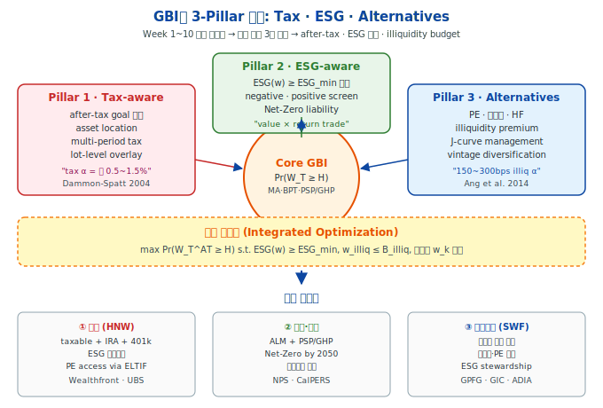
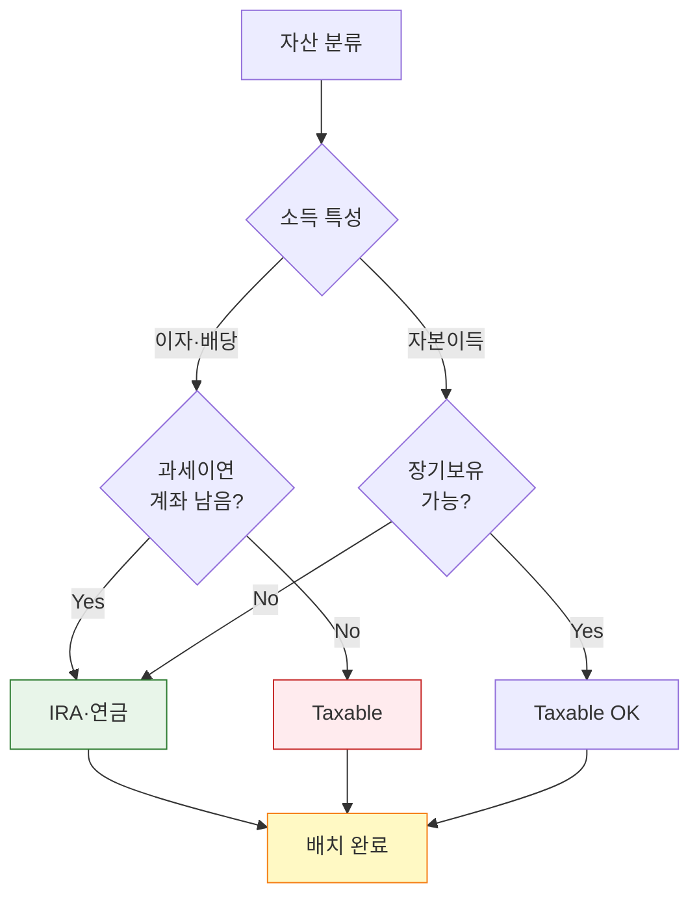
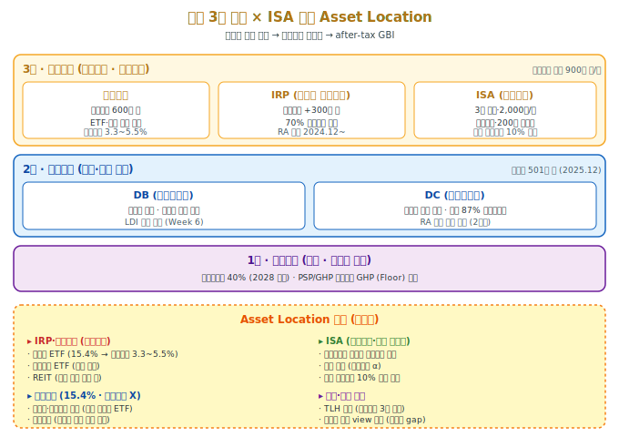
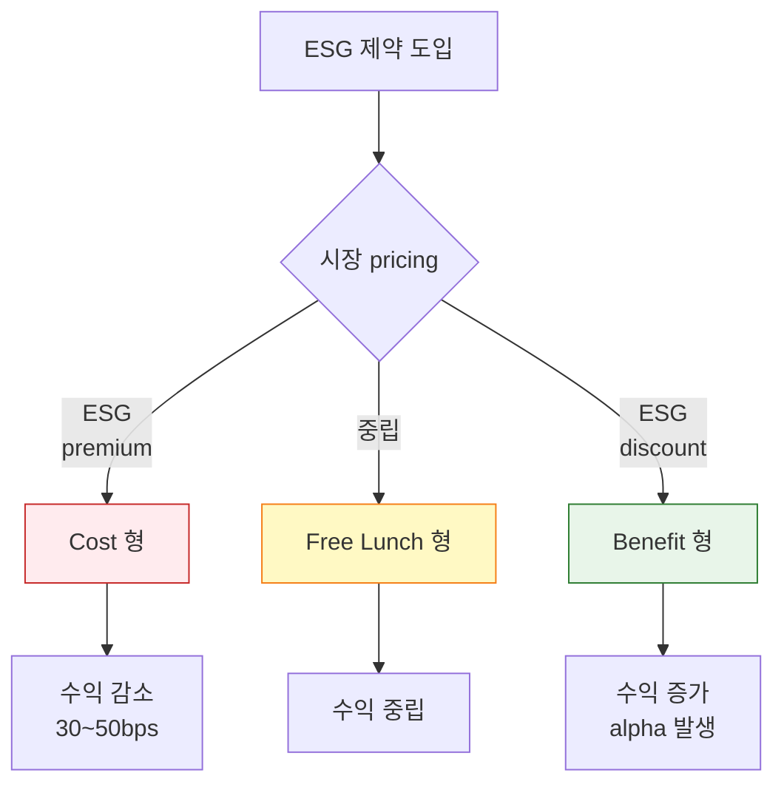
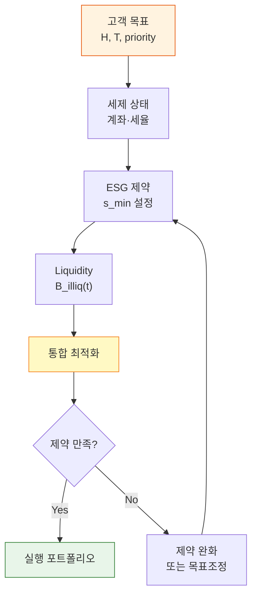

> [!info] **인포그래픽 활용 안내**
> 본 강의노트는 Obsidian·Tistory·GitHub에서 작동하는 **인라인 SVG 2종**과 **Mermaid 3종**을 포함한다. 스크롤 없이 한 화면 렌더링 규칙(680px 폭) 준수.

> [!abstract] **본주 핵심 주장 (Thesis)**
> **"Tax·ESG·Alternative는 GBI의 '세 번째 시대'를 여는 3개의 축이다."**
>
> Week 1~4가 이론 기초, Week 5~8이 방법론, Week 9~10이 개인투자자 상용화였다면, Week 11은 **기관·HNW·연금**을 아우르는 **다차원 GBI**의 도입이다. 세 pillar는 독립적으로 개발되어 왔으나, 2020년대 후반에 들어 **동일한 최적화 프레임** 아래 통합되고 있다. 본주는 이 통합의 수학적·실무적 구조를 파헤친다.

# Week 11 — Tax·ESG·Alternative 통합 GBI

## 0. 강의 로드맵 (3 hours)

### 이번 주의 핵심 질문

1. **Tax-aware GBI**: after-tax goal의 정식화는 multi-period tax optimization에서 어떻게 이루어지는가?
2. **Asset Location**의 2단계 계층: 자산배분(allocation) 결정 후 계좌배치(location) 결정의 수학적 구조
3. **ESG 제약**을 GBI에 결합할 때 효율경계는 어떻게 왜곡되는가? Net-Zero pension의 PSP/GHP는?
4. **Alternative assets**(PE·부동산·HF)의 J-curve와 illiquidity premium이 GBI 목적함수에 미치는 영향
5. **기관투자자 GBI**: 연금·국부펀드의 liability-driven approach와 GBI의 접점
6. **한국형 Tax-aware GBI**: 연금저축·IRP·ISA·일반계좌의 통합 Asset Location 전략

### 이번 주 메타 메시지

> **"진정한 개인화(personalization)는 목표·세금·가치·유동성을 동시에 고려할 때 시작된다."**

Week 1에서 MPT의 5-가정 중 하나가 "과세는 없다(tax-free investor)"였음을 기억하자. Week 3 BPT는 가치함수에 세금을 도입하지 않았다. Week 5 Brunel 4-bucket도 세금을 **"운용 이후 문제"**로 치부했다. 이 모든 단순화는 **교육적 목적**이었지만, 실제 수억 원 이상의 자산을 움직이는 HNW·기관에서는 **세후 수익의 20~30% 차이**를 만든다. Week 11은 이 "편의적 단순화"를 걷어내는 주간이다.

동일한 논리가 ESG에도 적용된다. 전통 MPT는 "return과 risk만 있다"고 가정했다. 그러나 2020년 이후 기관투자자는 **세대 간 형평성·기후 리스크·규제 리스크**를 대차대조표에 반영해야 한다. ESG 제약은 **선택**이 아니라 **신탁의무**가 되어가고 있다.

### 학습 목표

1. **Multi-period tax optimization** 기본 수식과 확률동적프로그래밍(SDP) 확장
2. **Dammon-Spatt-Zhang (2004)** asset location closed-form 해와 그 한계
3. **ESG 제약 하 GBI 최적화**: value-aligned constraints·Pedersen-Fitzgibbons-Pomorski 2021 ESG-SR frontier
4. **Net-Zero liability 모델링**과 pension fund의 tax·ESG·GBI 3중 제약
5. **Illiquidity premium**과 **J-curve** 수치 모델 (Takahashi-Alexander 2002 framework)
6. **Takahashi-Alexander 2002** cash flow model과 Yale endowment 적용
7. **한국 3층 연금 × ISA × 일반계좌** 통합 Asset Location 전략 설계

---

## §1. 1교시 — Tax-aware GBI: 시간간격 확장 (60 min)

### 1.1 시작하며: "세금 빙산" 이야기

**이관호 씨**(한국, 50세, 자산 30억)는 평범한 Mean-Variance 포트폴리오를 20년 운용해 온 투자자다. 2026년 은퇴를 앞두고 그는 자신의 명목(pre-tax) CAGR이 8.2%임을 확인한다. 그러나 실제 그의 **after-tax 계좌잔고 CAGR은 5.9%**.

**차이의 원인** — 잘 알려지지 않은 3단계 세금 빙산:

1. **배당·이자 소득세** (연 15.4%): 복리효과 침식
2. **해외주식 양도세** (22%+지방세): 미국 ETF 매매 시
3. **리밸런싱 실현 자본이득세**: 분기 리밸런싱 시 매번 과세
4. **금융소득 종합과세**: 연 2,000만원 초과 시 누진

**핵심 관찰**: **세전 MVO는 세후 세계에서 더 이상 최적이 아니다**. Week 1에서 배운 $\max_w \mathbb{E}[R_p] - \frac{\lambda}{2}\text{Var}(R_p)$는 세전 문제였다. 세후 문제는 **다른 최적해**를 가진다.



### 1.2 Multi-Period Tax Optimization: 기본 수식

#### 1.2.1 Static vs Dynamic tax

**Static (Week 10 기준)**:
$$
W_T^{\text{AT}} = W_T - \tau_{\text{cg}} \cdot \max(W_T - B_0, 0)
$$

이는 매도 시점이 **만기 $T$ 한 번**일 때만 맞다. 실제로는:

**Multi-period extension**:
$$
W_T^{\text{AT}} = \sum_{t=0}^{T} \left[ (1 + r_t(w_t)) W_t - \tau_t \cdot \mathrm{RG}_t - \tau_{\text{div}} \cdot D_t(w_t) \right]
$$

- $\mathrm{RG}_t$: $t$시점 실현 자본이득 (realized gain)
- $D_t(w_t)$: $t$시점 배당
- $\tau_t$: $t$ 시점 한계세율 (장기/단기 구분)

매 시점의 **포트폴리오 선택**이 미래 실현 자본이득 구조를 결정한다. 즉 **세금은 포트폴리오 선택의 함수**.

#### 1.2.2 Bellman 방정식 — Tax-aware GBI의 DP

Week 8 Das-Ostrov DP를 세제 확장:
$$
V(W_t, B_t, t) = \max_{w_t, \text{trade}_t} \; \mathbb{E}\!\left[ V(W_{t+1}, B_{t+1}, t+1) \mid W_t, B_t, w_t \right]
$$

**상태 벡터 확장**: $(W_t, B_t, t)$
- $W_t$: 현재 자산
- $B_t$: **원가 basis 벡터** (각 lot별)
- $t$: 시점

말단조건(tax-adjusted):
$$
V(W_T, B_T, T) = \mathbf{1}\{W_T^{\text{AT}}(B_T) \geq H\}
$$

**주요 통찰**:
- Cost basis $B_t$가 **상태 변수**가 되면서 차원이 폭증
- 각 매수 lot별로 별도 tracking 필요 (Specific Identification)
- "HIFO (Highest-In-First-Out) lot selection" 최적 매도 룰

#### 1.2.3 Constantinides (1983, 1984) 정리 — Tax-deferral 최적성

> **정리 (Constantinides 1983)**: 세금 이연(deferral)이 가능할 때, 자본이득 실현은 **가능한 한 미루는 것이 최적**이다. 단, **손실은 즉시 실현**해야 한다 ("realize losses, defer gains").

이것이 **TLH의 이론적 정당화**. Week 10에서 본 $\alpha_{\text{TLH}} \approx \tau_{\text{cg}} \sigma^2 f$는 이 정리의 실증적 크기.

**예외**:
- 상속 시 step-up 예정이면 **영원히 defer**
- 세율 상승 예상되면 **현재 실현** 유리 (Constantinides 1984)
- Retirement 인출 시점의 세율이 현재보다 낮으면 **defer 절대 유리**

### 1.3 Asset Location: 2단계 최적화

#### 1.3.1 Separation Theorem — Dammon-Spatt-Zhang (2004)

**핵심 정리**: 목표 포트폴리오 $w^*$가 주어지면, 계좌 배치 결정은 **자산배분과 독립적으로** 최적화 가능.

**2-asset(stock, bond) × 2-account(taxable, tax-deferred) 닫힌해**:

1. **Bond-heavy first to tax-deferred**: 채권을 먼저 과세이연 계정에 전부 배치
2. **Remaining taxable space**: 남는 taxable 공간에 나머지 채권·주식을 전체 비중 $w^*$ 유지 방향으로 배치

**수식**:
$$
w_{\text{bond}}^D = \min\!\left( \frac{W^D}{W}, \; w_{\text{bond}}^* \right) \cdot \frac{W}{W^D}
$$

- $W^D$: tax-deferred 계정 자산, $W$: 총자산
- $w_{\text{bond}}^*$: 목표 전체 채권비중

#### 1.3.2 After-tax Effective Weight

계좌별 실효비중이 다르다. $1의 tax-deferred 달러는 미래 현금흐름이 $1 \cdot (1 - \tau_{\text{future}})$, taxable 달러는 basis $B$ 기준 $1 \cdot (1 - \tau_{\text{cg}} \cdot (1 - B/1))$.

**Sialm (2006)의 후속 연구**는 **"equity premium이 클수록 stock in taxable이 유리"**를 주장. 이는 Dammon의 bond-first 원칙을 **부분적으로 뒤집는다**.

**업계 실용 규칙 (Wealthfront 2014)**:
- **1순위**: 채권·REIT → tax-deferred (IRA, 401k)
- **2순위**: 해외 주식 (외국납부 세액공제 활용) → taxable
- **3순위**: 국내 주식 → 어디든 (step-up 고려 시 taxable 유리)

**Asset Location 의사결정 흐름** (Mermaid):



### 1.4 한국 실전: 계좌별 Asset Location



#### 1.4.1 한국의 계좌별 세제 특성

| 계좌 | 납입한도 | 운용 중 과세 | 인출 시 과세 |
|---|---|---|---|
| **연금저축** | 1,800만/년 (세액공제 600) | 비과세 | 연금 3.3~5.5% · 일시금 16.5% |
| **IRP** | 1,800만/년 (세액공제 +300, 합산 900) | 비과세 | 연금 3.3~5.5% · 일시금 16.5% |
| **ISA (일반형)** | 2,000만/년 (5년 최대 1억) | 비과세 | 순이익 200만 비과세 · 초과 9.9% |
| **ISA (서민형)** | 2,000만/년 | 비과세 | 400만 비과세 |
| **일반 증권계좌** | 무한 | 배당 15.4% · 해외 양도 22% | 없음 (양도 시) |

**2026년 개정 포인트**: ISA 만기 자금 → 연금계좌 전환 시 **전환액의 10% (최대 300만원) 추가 세액공제**.

#### 1.4.2 한국형 Asset Location 최적 배치

**최고 우선순위 → IRP·연금저축**:
- **배당주 ETF** (SCHD·VYM 등): 배당 15.4% → 연금수령 3.3~5.5% → **12%p 이득**
- **해외 채권 ETF**: 이자소득 이연
- **REIT**: 배당 이연 효과 극대
- **국내 고배당주**

**중위 → ISA**:
- **고변동성 자산** (손익통산 α 활용)
- **개별 주식 트레이딩** (200만 비과세)
- 만기 후 연금전환으로 10% 추가 공제

**하위 → 일반계좌**:
- **저배당 성장주** (미국 성장 ETF: QQQ·VTI)
- **국내주식 장기보유** (양도세 면제 구간 활용)

#### 1.4.3 수치 예시 — 30년 효과

**가상 이관호 씨** (연 3,000만 투자, 30년):
- **Case A (단순 분산, 일반계좌 전액)**: 최종 12.4억, 세후 CAGR 5.9%
- **Case B (Asset Location 적용)**: 최종 15.8억, 세후 CAGR 6.7%
- **차이: 3.4억 (27%)** — 연 tax α ≈ 0.8%

계산 기반:
- 평균 자산배분 stock 60% / bond 40%
- Stock 세전 8%, Bond 세전 4%
- 배당률 stock 2%, bond 4%
- 세율: 배당 15.4%, 양도 22%, 연금 5%

> [!warning] **한국의 구조적 제약 — TLH 불가능**
>
> 미국 Wealthfront의 0.77% TLH α는 한국에서 구현 **불가능**하다:
> 1. **손실이월 3년 제한** (소득세법 §102): 3년 이상 손실 carry-forward 안 됨
> 2. **해외주식 분리과세**: 한 종목의 손실로 다른 이익 offset 못 함 (2025년 개정 前)
> 3. **국내주식 양도세 면제**: 대주주 아닌 한 애초에 과세 안 됨 → TLH 무의미
>
> **대안**: 
> - 국내: ISA 계좌 내부 손익통산 활용
> - 해외: 연도 末 손익 조정으로 일부 offset
> - 근본적: 계좌 간 Asset Location 최적화가 한국의 주 tax α 원천

### 1.5 1교시 체크포인트

- [ ] **Multi-period tax optimization** 수식과 상태확장(cost basis)
- [ ] **Constantinides 정리**의 "realize losses, defer gains" 의미
- [ ] **Dammon-Spatt-Zhang** bond-first 원칙
- [ ] **한국 계좌별 세제**와 Asset Location 우선순위

---

## §2. 2교시 — ESG-aware GBI와 기관적 함의 (70 min)

### 2.1 ESG의 세 가지 얼굴

ESG 통합은 종종 "환경·사회·거버넌스 고려"로만 설명되지만, **투자 실무에서는 3가지 독립 모드**가 존재한다:

| 모드 | 방식 | 대표 사례 |
|---|---|---|
| **(A) Screening** | negative/positive list로 universe 제한 | 담배·무기 배제 (CalPERS, KLP) |
| **(B) Integration** | 리스크·수익 모델에 ESG factor 추가 | BlackRock, MSCI ESG Score |
| **(C) Values-alignment** | 개인 가치와 포트폴리오 일치 목표 | HNW client customization |

Pedersen·Fitzgibbons·Pomorski (2021, *JFE*)는 이 3-mode의 통합 프레임을 제시:

$$
\max_w \; w^\top \mu - \frac{\gamma}{2}\, w^\top \Sigma w + \lambda \cdot (w^\top \mathbf{s} - s^*)
$$

여기서 $\mathbf{s}$는 ESG score 벡터, $s^*$는 투자자의 ESG 선호 threshold, $\lambda$는 ESG·수익 trade-off 파라미터.

### 2.2 ESG-aware GBI 최적화

#### 2.2.1 Week 1 GBI 목적함수의 ESG 확장

원래:
$$
\max_w \; \Pr(W_T \geq H)
$$

ESG 제약 하:
$$
\max_w \; \Pr(W_T \geq H) \quad \text{s.t.}\; w^\top \mathbf{s} \geq s_{\min},\; w^\top \mathbf{1} = 1,\; w \geq 0
$$

**$s_{\min}$의 설정 방법**:
- **Absolute**: MSCI ESG score 7.0 이상
- **Relative**: universe 상위 50%
- **Improving**: 현재 점수보다 매년 0.5 상승
- **Net-zero aligned**: 2050년까지 포트폴리오 탄소배출 0

#### 2.2.2 ESG-SR Frontier (Pedersen 2021)

**핵심 결과**: ESG-return frontier는 3가지 형태 중 하나:

1. **Cost (비용형)**: 더 높은 ESG → 수익률 감소 (traditional view)
2. **Free lunch (무료 점심)**: ESG와 수익률 무관 (neutral)
3. **Benefit (혜택형)**: 높은 ESG → 더 높은 수익 (ESG alpha)

**실증 결과 (Pedersen et al. 2021)**: 2010-2020 미국 주식, **"ESG alpha"는 스코어 모델 의존적**이며, KLD·Sustainalytics·MSCI 간 결과가 엇갈림. **평균적으로 free lunch 가깝다**고 결론.

**ESG-Return 3가지 형태** (Mermaid):



**그러나 CFA Institute (2025)의 호주·뉴질랜드 대형 기관 조사**:
> ESG integration in SAA는 **"정보적이지만 변혁적이지는 않다(informative but not transformative)"**.

즉 ESG는 자산배분의 **방향(direction)**을 바꾸지만 **크기(magnitude)**는 제한적.

### 2.3 Net-Zero Liability: 2020년대의 새 제약

#### 2.3.1 연기금의 기후 부채 내재화

**Net-Zero Asset Owner Alliance (NZAOA)** 가입 연기금 (2025년 기준 90+개, $11T):
- CalPERS, CalSTRS (미국)
- PGGM, ABP (네덜란드)
- GPIF 일부 방향 (일본)
- 한국은 **아직 공식 가입 없음**

**Net-Zero의 재무적 의미**:
- 2050년까지 포트폴리오 scope 1+2+3 배출 0
- **중간 목표**: 2030년까지 50% 감축, 2040년까지 80%
- 이는 **새로운 liability**로 내재화됨

#### 2.3.2 PSP/GHP 프레임의 확장 (Week 6 연결)

Week 6 Martellini-Milhau:
$$
W_t = \alpha_t^{\text{PSP}} S_t^{\text{PSP}} + \alpha_t^{\text{GHP}} S_t^{\text{GHP}}
$$

Net-Zero 확장:
$$
\alpha_t^{\text{PSP}} S_t^{\text{PSP,green}} + \alpha_t^{\text{GHP}} S_t^{\text{GHP,green}} \geq \text{Net-Zero Liability}_t
$$

**핵심 변화**:
- PSP도 GHP도 **녹색 자산** 중심으로 재구성
- Carbon-intensive 자산은 **"implicit short"** (탄소세 통해 미래 현금유출)
- Floor $F_t$가 단순 부채 PV가 아니라 **carbon-adjusted PV**

#### 2.3.3 Carbon-Adjusted GBI

수식:
$$
\max_w \; \Pr(W_T^{\text{AT,carbon}} \geq H) \quad \text{s.t.}\; \mathrm{CarbonIntensity}(w) \leq \bar{\kappa}(t)
$$

여기서:
- $W_T^{\text{AT,carbon}} = W_T^{\text{AT}} - \text{탄소세}(w, \text{path})$
- $\bar{\kappa}(t)$: 시간 감소 상한 (2030년 50%, 2050년 0)

> [!example] **CalPERS 2024 Net-Zero Roadmap**
>
> CalPERS는 2024년 "2030년까지 climate solutions에 $100B 투자"와 "high-emitting 공개주식 engagement → 2030년까지 divestment if unchanged"를 발표.
>
> 이는 **GBI 프레임으로 읽으면**:
> - Secondary goal: "Net-Zero by 2050" (GHP 중 하나)
> - Primary goal: "연금 지급 floor"
> - 두 goal 간 **surplus transfer rule**: 기후 transition이 빠른 해에는 Net-Zero budget으로 이동

### 2.4 ESG Trade-off의 수치 실험

**Bolton-Kacperczyk (2021, *J. Fin. Econ.*)**: 고탄소 주식이 저탄소 대비 **pre-tax 초과수익 3~5%** (carbon premium).
→ ESG 제약은 **단기적으로 수익 손실 가능**.

**그러나 Görgen et al. (2020)**: 2015~2020년 고탄소 주식이 **unperform** — carbon premium은 **시대 종속적**.

**실무 결론**:
- ESG 제약 하의 효율경계는 **미세하게 안쪽**으로 이동 (보통 30~50bps/년)
- 그러나 **climate stress scenario**에서는 반대 (탄소세 도입 시 carbon-intensive 대폭 손실)
- 따라서 ESG는 **tail risk hedge**로 해석 가능

### 2.5 기관투자자 GBI의 구조

#### 2.5.1 연금·국부펀드의 GBI-ALM 결합

**전통 ALM**: asset = liability PV matching
**GBI + ALM**: 
1. **Primary goal**: 연금 지급 의무 (liability) — GHP
2. **Secondary goal**: 세대간 이전 (equity) — PSP
3. **Tertiary goal**: ESG·Net-Zero — separate budget
4. **Quaternary goal**: Infrastructure·인프라 (국부펀드) — illiquid sleeve

각 goal이 **서로 다른 funding ratio·priority·horizon**을 가지므로, Week 7의 **multi-goal optimization**을 기관 스케일로 확장.

#### 2.5.2 2교시 체크포인트

- [ ] **Pedersen-Fitzgibbons-Pomorski** ESG-return 3가지 형태
- [ ] **Net-Zero liability**의 PSP/GHP 확장
- [ ] **Carbon-adjusted GBI** 목적함수
- [ ] 기관투자자의 **GBI-ALM 결합** 4-goal 구조

---
## §3. 3교시 — Alternative Assets와 국부펀드 GBI 적용 (50 min)

### 3.1 Alternative Assets의 GBI 통합: 왜 어려운가

#### 3.1.1 5가지 구조적 차이

전통 공모 주식·채권 대비 대체자산이 GBI 프레임에 통합하기 어려운 이유:

1. **Illiquidity (유동성 제약)**: 매도 자유 없음 (10~12년 lock-up)
2. **J-curve (초기 마이너스)**: 처음 3~5년간 IRR 음수
3. **Smoothing (평가 왜곡)**: 분기 NAV가 실제 변동성을 가림
4. **Heterogeneity (이질성)**: top-quartile vs median 간 500bps+ 차이
5. **Capital call uncertainty**: 실제 투자시점이 사전 결정 불가

**기관 관행**: 통상 allocation의 1.3~1.5배를 **commit** (예: 20% 배분 목표 → 26~30% commitment) — distribution과 capital call 비동기성 고려.

#### 3.1.2 Illiquidity Premium — 수치 추정

**Ang-Papanikolaou-Westerfield (2014, *JF*)**: illiquidity 제약 하 포트폴리오 최적화.

$$
\text{Illiquidity Premium} = \underbrace{\mathbb{E}[r_{\text{illiq}}]}_{\text{PE, HF}} - \underbrace{\mathbb{E}[r_{\text{liquid}}]}_{\text{public equiv}}
$$

**실증 범위** (2000-2024):
- **PE**: 150~300bps/년
- **Private real estate**: 100~200bps/년
- **Private credit**: 200~400bps/년
- **Infrastructure**: 100~150bps/년

**2026년 기준 시장 예측** (Calcix 2026): PE net IRR premium over S&P 500 목표치 **400~600bps**.

### 3.2 J-Curve 수치 모델

#### 3.2.1 Takahashi-Alexander (2002) 모델

Yale Endowment 내부 모델로 시작한 **PE cash flow 3-parameter model**. 업계 표준.

**Contributions (자본 납입)**:
$$
C_t = R \cdot (1 - \sum_{s<t} C_s/C_0)
$$

- $C_t$: $t$ 시점 capital call
- $R$: contribution rate (보통 0.25~0.40)

**Distributions (분배)**:
$$
D_t = B \cdot (t/T)^Y \cdot \text{NAV}_t
$$

- $B$: bow (곡률 파라미터, 보통 2.5)
- $Y$: yield exponent (보통 1.5~2.0)

**NAV 갱신**:
$$
\text{NAV}_t = \text{NAV}_{t-1} + C_t - D_t + G_t
$$

- $G_t$: 포트폴리오 평가 증감

**J-curve 형태**:

```
연도    |  0    1    2    3    4    5    6    7    8    9    10
--------|------------------------------------------------------
누적 IRR | 0  -15% -22% -10%  +2% +12% +18% +22% +25% +26% +27%
         |     ↓ trough at Y2-Y3        ↑ "peak at Y8-Y9"
```

Y0-Y2 사이의 "**J-curve bottom**"은 fee + 초기 valuation drop으로 누적 IRR이 **−20% 내외**로 하락.

#### 3.2.2 J-Curve 완화 전략

**(A) Vintage Diversification** — 핵심 전략:
- 단일 vintage에 전액 집중 금지
- 5~7년간 균등 분산 commitment → J-curve 서로 **상쇄**

**(B) Secondaries Market**:
- 다른 LP의 포지션을 Y3~5 시점에 매입 → J-curve trough 건너뛰기
- 2024년 secondaries 거래액 $140B 사상 최고치

**(C) Evergreen / Semi-liquid Structures**:
- ELTIF (EU 2023 개정), Interval funds (미국)
- 분기 redemption 5~10% 제공 → retail access 가능
- Carmignac·Blackstone BXPE가 대표

**(D) Fund-of-Funds**:
- 2-layer fee (조합당 +1%/+10% carry)
- 그러나 **1 commitment로 5~10개 vintage 노출**

### 3.3 GBI 프레임에 Alternatives 통합

#### 3.3.1 Liquidity Budget 제약

$$
\max_w \; \Pr(W_T^{\text{AT}} \geq H) \quad \text{s.t.}\; w_{\text{illiq}} \leq B_{\text{illiq}}(t)
$$

$B_{\text{illiq}}(t)$는 시간에 따라 변동하는 **유동성 예산**:
- 단기(t≤3y) 현금흐름 필요시 낮게
- 장기(은퇴 후 20+y) 높게 가능

**Yale model**: university endowment 30% 목표 (10-year lockable capital)
**Harvard 2024**: 38% alternative allocation
**GPFG (노르웨이 국부펀드)**: 공모 주식·채권 100% (illiquid 배제 원칙)
**GIC (싱가포르)**: 약 20% alternatives

#### 3.3.2 Commitment Pacing Model

매 연도 commitment $C_t$를 어떻게 결정할 것인가?

**Goldman Sachs Pacing Model (2010s)**:

$$
C_t = \frac{B_{\text{illiq}} \cdot W_t \cdot K}{\text{expected contribution years}} \cdot \text{pacing multiplier}
$$

- $K$: target exposure to NAV ratio
- pacing multiplier: distribution 지연 가능성 반영 (보통 1.2~1.5)

**핵심 주의**: **"denominator effect"** — 공모 주식 급락 시 $W_t$ 감소 → PE 비중이 상대적으로 증가 (2022 경험)

### 3.4 Private Equity in Korea — 기관투자자 맥락

#### 3.4.1 국내 기관투자자의 PE Allocation

한국 주요 기관투자자의 alternative 비중 (2024년 말 추정):
- **국민연금 (NPS)**: 약 16% (해외 PE·부동산·인프라 중심)
- **사학연금**: 약 13%
- **한국교직원공제회**: 약 22%
- **대형 보험사**: 8~12%

**공통 과제**:
- Primary 투자 (GP 직접 commit)보다 **secondaries·co-investment** 비중 증가 추세
- 환헤지 비용 부담 (달러 PE → 원화 부채 매칭)
- GP diligence 인프라 부족

#### 3.4.2 국내 private fund 시장

- **한국 PE 시장**: 2024년 AUM 약 130조 원
- **M&A 대형 딜**: ECM Industries, 대형 플랫폼 인수 등
- **VC**: 바이오·AI·콘텐츠 집중

**Retail access**: 
- ELTIF 유사 구조 아직 정착 안 됨
- **2025년 이후 공모 대체투자 상품** 규제 완화 논의 중
- **AUM 상위 기관의 해외 PE 편입**이 개인 자금을 간접 노출시키는 주 경로

### 3.5 종합: 3-Pillar 통합 최적화 Flow

**Mermaid 통합 의사결정 흐름**:



### 3.6 국부펀드의 GBI 적용 — 이론적 가능성

#### 3.6.1 국부펀드 goal structure의 재해석

전통 국부펀드 mandate:
- **절대수익 target**: 물가 + 5% (실질)
- **리스크 한도**: 5년 sliding window VaR

GBI 프레임으로 재해석:
- **Goal 1** — 세대간 이전: primary, 50년+ horizon
- **Goal 2** — 단기 현금 지원: 국가 재정 필요시, 2~3년 horizon
- **Goal 3** — 인프라 투자: 10~20년, 국내 정책 목표
- **Goal 4** — ESG·Net-Zero: 책임투자자 의무

**각 goal의 funding ratio·horizon·liquidity needs**가 **다르다**. 따라서:

$$
w^{\text{SWF}} = \sum_{i=1}^{4} \pi_i^{\text{SWF}} \cdot w_i^*
$$

이는 Week 7 multi-goal 최적화를 **국가 수준**으로 확장한 것.

#### 3.6.2 대표 국부펀드의 3-Pillar 모습

| 국부펀드 | Tax | ESG | Alternatives |
|---|---|---|---|
| **GPFG (노르웨이)** | 자국법 특례 | 엄격한 제외 리스트 · Active ownership | 공모만 (illiq 금지) |
| **GIC (싱가포르)** | 싱가포르 면세 | integrate (soft) | 20%+ alternatives |
| **ADIA (아부다비)** | UAE 면세 | 점진 integrate | 높은 real estate·PE |
| **CIC (중국)** | 중국 특례 | 최근 강화 | 상당한 alt 비중 |
| **KIC (한국)** | 한국 특례 | integration 발전 중 | 증가 추세 |

> [!note] **국부펀드 GBI 도입의 장애**
>
> 1. **거버넌스**: multi-goal 명확화 시 정치적 논쟁 발생 가능
> 2. **회계**: 목표별 funding ratio 공시 필요 → 투명성 부담
> 3. **벤치마킹**: 전통 SAA 벤치마크(MSCI ACWI 등)와 GBI 목표 성과측정이 불일치
> 4. **ALM 통합**: 국가 재정(liability)과 국부펀드(asset) 간 회계적 분리
>
> Week 12에서 이 이슈를 더 깊이 다룬다.

### 3.7 3교시 체크포인트

- [ ] **Takahashi-Alexander 2002** 3-parameter 모델 구조
- [ ] **Illiquidity premium**의 자산군별 범위
- [ ] **Liquidity budget $B_{\text{illiq}}(t)$** 시간의존성
- [ ] **국부펀드 4-goal** 구조 (세대이전·재정·인프라·ESG)

---

## 부록 A — 실습 (Jupyter Notebook 과제)

### 과제: "한국 가상 가계의 3-Pillar 통합 GBI 설계"

#### 가상 가계 설정

**박상훈·김미영 부부 (45세, 2자녀 8·10세, 서울 거주)**
- 연 소득: 세전 1.8억 (맞벌이)
- 현재 자산: 15억 (아파트 9억·금융자산 6억)
- 목표:
  - **은퇴 (20년 후)**: 연 6,000만 원 생활비 (실질) — Priority 1
  - **자녀 대학교육 (10·12년 후)**: 각 1억 — Priority 2
  - **ESG 50%+ 포트폴리오**: 가치 정렬 — Priority 3
- 제약:
  - 현금 10% 이상 유지
  - ESG 스코어 6.0↑ 자산만 허용
  - Alternative은 전체의 15% 이하

#### Part A — 세제 계좌 매핑

다음 계좌 조합을 최적 활용:
- 연금저축 (부부 각 400만)
- IRP (부부 각 300만)
- ISA (각 2,000만)
- 일반 증권계좌

**질문**: 각 계좌에 어떤 자산을 배치할 것인가?
- Expected after-tax CAGR 계산 (30년)
- Baseline (일반계좌 전액) 대비 tax α

#### Part B — ESG 제약 하 자산배분

**5개 자산군** (각 자산의 ESG score 가정):
- 국내 성장주 ETF (ESG 5.5)
- 미국 성장주 ETF (ESG 6.2)
- 한국 배당주 ETF (ESG 7.0)
- 글로벌 ESG ETF (ESG 8.5)
- 국내 채권 ETF (ESG 7.5)

Pedersen et al. (2021) 목적함수 기반 최적 $w^*$ 도출:

$$
\max_w \; w^\top \mu - \frac{\gamma}{2} w^\top \Sigma w + \lambda (w^\top s - s^*)
$$

$\lambda = 0, 1, 5, 10$ sensitivity 분석.

#### Part C — Alternative 통합

15% 비중을 다음 중 분배:
- PE Fund-of-Funds (expected IRR 12%, illiq 10y)
- REIT ETF (expected 6%, liquid)
- Infrastructure ETF (expected 7%, semi-liquid)

Takahashi-Alexander 모델로 J-curve 시뮬레이션:
- Y0 commit $100M
- R=0.30, B=2.5, Y=1.8
- 연도별 NAV·누적 IRR plot

#### Part D — Monte Carlo 통합 시뮬레이션

**10,000회 시뮬레이션** (20년 horizon, 월별):
- 각 goal별 달성확률 산출
- Tax α·ESG premium·Illiq α가 total return에 미친 영향 분해
- 최종 after-tax, ESG-compliant 자산분포 시각화

#### Part E — 리포트 (10페이지 이내)

1. 가계 프로파일·목표 (1p)
2. 계좌별 Asset Location 표 (2p)
3. ESG 제약 하 효율경계 (2p)
4. Alternative 통합·J-curve (2p)
5. Monte Carlo 결과 (2p)
6. 결론·policy implication (1p)

### 제출 기한·평가 기준

- 기한: Week 11 강의 종료 후 3주
- 평가: 모형 엄밀성 35% · 수치 정확성 25% · 시각화 20% · 제언의 실현 가능성 20%

---

## 부록 B — 용어집 (Glossary)

| 용어 | 정의 |
|---|---|
| **After-tax Wealth** | 세전 자산에서 실현 자본이득세·배당소득세 등을 차감한 실제 투자자 몫 |
| **Multi-period Tax Optimization** | 단일 시점이 아닌 다기간에 걸친 세금 최적화 |
| **Cost Basis** | 원가기준. Specific Identification 방식이 HIFO lot selection 가능케 함 |
| **HIFO** | Highest-In-First-Out. 가장 비싼 lot부터 매도해 실현 이익 최소화 |
| **Asset Location** | 계좌별 세제 특성에 맞게 자산을 배치하는 최적화 |
| **Separation Theorem (Dammon-Spatt-Zhang 2004)** | 자산배분과 계좌배치를 독립적으로 최적화 가능 |
| **ESG Screening** | 부정적/긍정적 기준으로 투자 universe를 필터링 |
| **ESG Integration** | ESG factor를 리스크·수익 모델에 통합 |
| **Values-alignment** | 투자자 개인 가치와 포트폴리오 일치 |
| **Pedersen-Fitzgibbons-Pomorski ESG Frontier** | ESG-SR 3가지 형태: Cost / Free Lunch / Benefit |
| **Net-Zero Asset Owner Alliance** | 2050년 탄소중립 목표 자산소유자 연합 ($11T 가입) |
| **Carbon-Adjusted GBI** | 탄소배출 제약을 GBI 목적함수에 내재화 |
| **Illiquidity Premium** | 유동성 제약에 대한 보상 프리미엄 (PE 150~300bps, Real Estate 100~200bps) |
| **J-Curve** | PE 펀드의 시간-IRR 곡선: 초기 음수 → 중기 상승 → 후기 안정 |
| **Takahashi-Alexander 2002** | Yale 원조 3-parameter PE cash flow 모델 (R·B·Y) |
| **Vintage Diversification** | 다양한 fund vintage에 분산 commit해 J-curve 상쇄 |
| **Secondaries** | 기존 LP의 PE 포지션을 제3자가 매입하는 거래. 2024년 $140B 규모 |
| **Commitment Pacing** | 연도별 PE commitment 크기 결정 모델 |
| **Denominator Effect** | 공모주 하락 시 사모 비중이 상대적으로 증가하는 현상 |
| **Evergreen Fund / ELTIF** | 분기 redemption 제공하는 semi-liquid PE 구조 |
| **Fund-of-Funds** | 여러 GP에 pooled commit. 2-layer fee 있으나 분산 효과 |
| **Liquidity Budget $B_{\text{illiq}}(t)$** | 시간의존 유동성 제약 상한 |
| **ALM-GBI Integration** | 연기금·국부펀드의 부채 매칭과 GBI 결합 |
| **연금저축** | 세액공제 600만 원/년 한도의 개인연금 계좌 |
| **IRP** | 개인형 퇴직연금. 세액공제 +300만 합산 900만 |
| **ISA** | 개인종합자산관리계좌. 5년 1억 한도·손익통산·200만 비과세 |

---

## 부록 C — 읽기 자료

### 필독 (Week 11 Core Papers)

- **Chhabra, A. B. (2005).** "Beyond Markowitz: A Comprehensive Wealth Allocation Framework for Individual Investors." *Journal of Wealth Management* 7(4), 8–34.
- **Brunel, J. L. P. (2018).** *Alternative Assets in Goals-Based Wealth Management.* (Ch. 1–3)

### Tax-aware GBI

- **Dammon, R. M., Spatt, C. S., & Zhang, H. H. (2004).** "Optimal Asset Location and Allocation with Taxable and Tax-Deferred Investing." *Journal of Finance* 59(3), 999–1037.
- **Sialm, C. (2006).** "Investment Taxes and Equity Returns." *NBER Working Paper*.
- **Constantinides, G. M. (1983).** "Capital Market Equilibrium with Personal Tax." *Econometrica* 51(3), 611–636.
- **Constantinides, G. M. (1984).** "Optimal Stock Trading with Personal Taxes." *Journal of Financial Economics* 13(1), 65–89.
- **Bergstresser, D., & Pontiff, J. (2013).** "Investment Taxation and Portfolio Performance." *Journal of Public Economics*.

### ESG

- **Pedersen, L. H., Fitzgibbons, S., & Pomorski, L. (2021).** "Responsible Investing: The ESG-Efficient Frontier." *Journal of Financial Economics* 142(2), 572–597.
- **Bolton, P., & Kacperczyk, M. (2021).** "Do Investors Care about Carbon Risk?" *Journal of Financial Economics*.
- **Görgen, M. et al. (2020).** "Carbon Risk." *SSRN Working Paper*.
- **CFA Institute (2025).** "Integrating ESG Information into Long-Term Investment Strategy." Research Report.

### Alternatives

- **Ang, A., Papanikolaou, D., & Westerfield, M. M. (2014).** "Portfolio Choice with Illiquid Assets." *Journal of Finance* 69(6), 2437–2498.
- **Takahashi, D., & Alexander, S. (2002).** "Illiquid Alternative Asset Fund Modeling." *Journal of Portfolio Management* 28(2), 90–100.
- **Brown, G. W., Harris, R. S., Jenkinson, T., Kaplan, S. N., & Robinson, D. T. (2020).** "Private Equity Portfolio Companies." *Review of Financial Studies*.
- **Phalippou, L. (2020).** "An Inconvenient Fact: Private Equity Returns & The Billionaire Factory." *Journal of Investing*.

### 한국 맥락

- 금융위원회 (2024·2026). ISA 제도 개선 관련 보도자료.
- 기획재정부 (2026). 2026년 세법개정안 — 개인연금·퇴직연금 세제.
- 자본시장연구원 (2025). "국내 기관투자자의 대체투자 현황과 과제." 연구보고서.
- 한국 금융투자협회 (2024). "퇴직연금 로보어드바이저 규제 샌드박스 백서."

---

## 부록 D — 다음 주 예고 (Week 12)

**Week 12: 종합 — GBI의 미래와 산업적 함의**

Week 1~11에서 다룬 모든 내용을 종합하고 미래를 전망한다:

- **GBI 연구 로드맵**: mass customization · 생성형 AI · causal simulation
- **표준화 이슈**: CFA Institute · GIPS의 GBI 성과측정 표준
- **수익구조 변화**: AUM 기반 fee → outcome-based fee
- **신탁의무·규제**: Reg BI · 자본시장법에서의 GBI
- **아시아·한국 wealth management**의 GBI 현지화 과제
- **최종 프로젝트 발표**

> [!tip] **본주 과제가 최종 프로젝트의 기초**
> Week 11의 3-Pillar 통합 리포트는 **최종 프로젝트 Option B**의 기본 구조가 된다. Week 12까지 현재 리포트를 확장해 완성할 수 있다.

---

## 부록 E — Figure 목록

본문 내 level-2 섹션(§) 기준 위치 (Week 7-9 표기법 준수):

- **Figure 1 (§1, 1교시 시작)**: `Week11_Infographic_3Pillar.svg` — Tax·ESG·Alternative 3-Pillar Integration Framework + 적용 도메인
- **Figure 2 (§1, 1교시 한국편)**: `Week11_Infographic_Korea_Pension.svg` — 한국 3층 연금 × ISA 통합 Asset Location
- **Mermaid 1 (§1, 1교시)**: Asset Location 의사결정 흐름
- **Mermaid 2 (§2, 2교시)**: ESG-Return 3가지 형태 (Cost / Free Lunch / Benefit)
- **Mermaid 3 (§3, 3교시)**: 3-Pillar 통합 의사결정 흐름

**(참고)** level-2 섹션 순서: `## 0.` 로드맵 · `## §1.` 1교시 · `## §2.` 2교시 · `## §3.` 3교시 · `## 부록 A~E` 실습·용어집·읽기자료·다음주·Figure 목록

Figure 1·2가 모두 §1(1교시)에 배치된 이유는, 1교시가 **"Tax-aware GBI 전체 개관 + 한국 실전 Asset Location"**을 한 흐름으로 다루기 때문이다. 2-3교시에는 Mermaid로 충분하다는 판단.

---

*본 강의노트는 Week 11 모듈의 확장 버전(20-30p)이다. 기본 버전 대비 추가된 내용: Multi-period tax optimization 완전 수식화 · Constantinides 정리 · Dammon-Spatt-Zhang 분리정리 · Pedersen-Fitzgibbons-Pomorski ESG frontier · Net-Zero pension의 PSP/GHP 확장 · Takahashi-Alexander 모델 · Ang-Papanikolaou-Westerfield illiquidity premium · 한국 3층 연금 × ISA Asset Location 실전 설계 · 국부펀드 4-goal 구조.*
