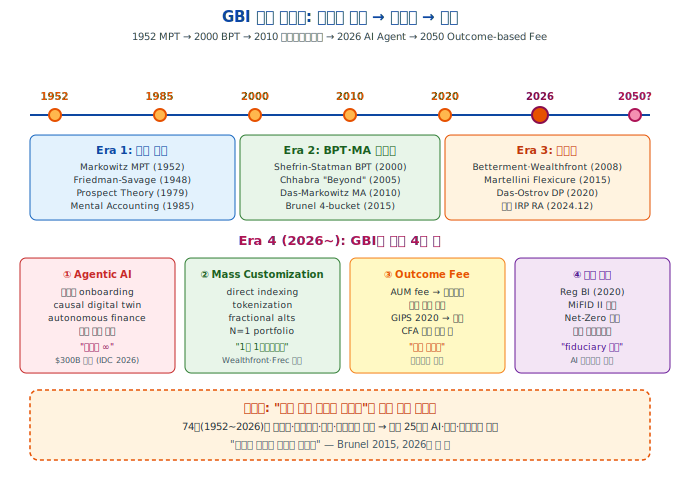
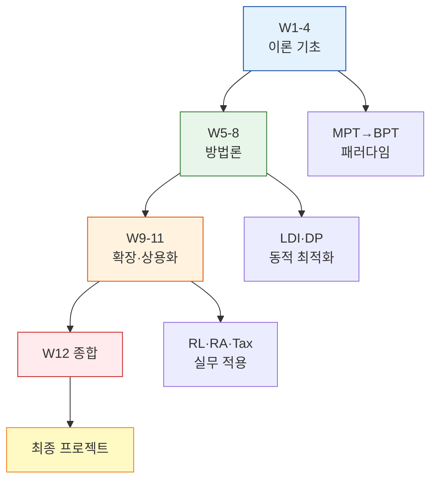
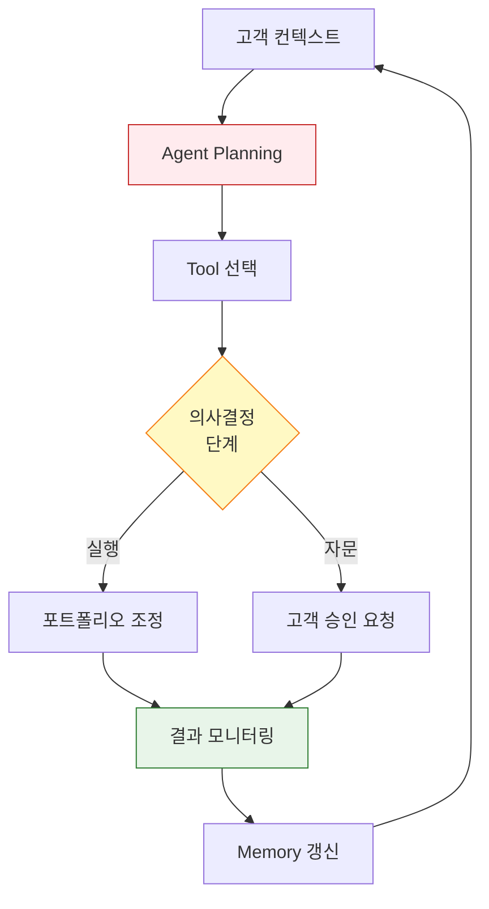
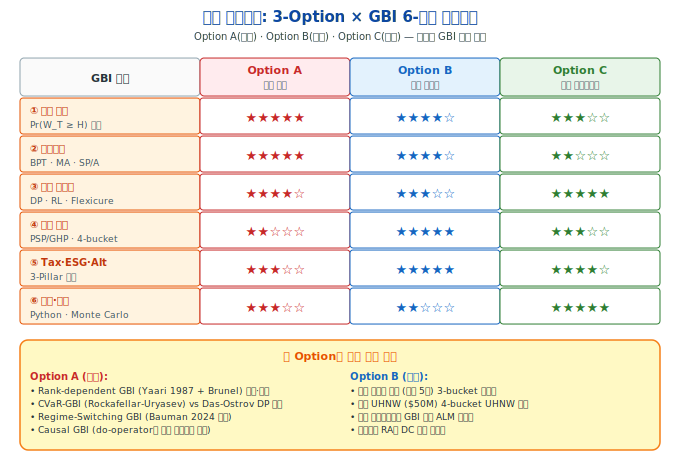
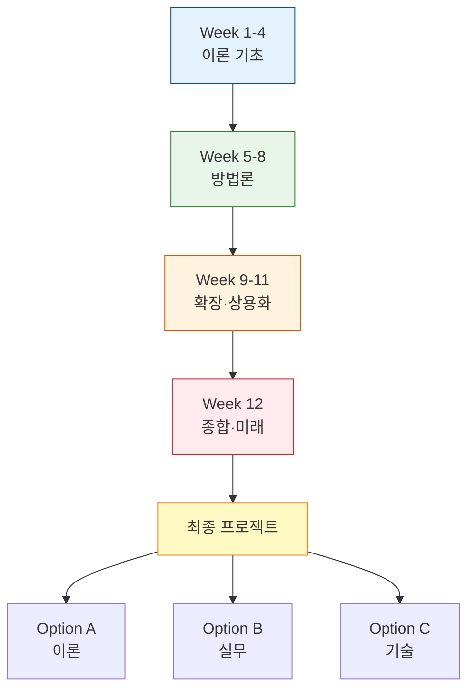

> [!info] **인포그래픽 활용 안내**
> 본 강의노트는 Obsidian·Tistory·GitHub에서 렌더링되는 **인라인 SVG 2종**과 **Mermaid 3종**을 포함한다. 스크롤 없이 한 화면 렌더링 규칙(680px 폭) 준수.

> [!abstract] **본주 핵심 주장 (Thesis)**
> **"GBI는 74년의 수학적 여정을 거쳐 '언어'가 되었다. 이제 문제는 누가 이 언어를 쓸 것인가이다."**
>
> 1952년 Markowitz MPT에서 출발한 여정이 2026년 AI Agent 기반 goal-based platforms로 수렴하고 있다. 다음 25년의 핵심 질문은 **"기술이 발전할수록 인간 advisor는 어디에 있는가?"**와 **"목표 달성 확률 극대화가 업계 표준이 된다면 fee 구조와 신탁의무는 어떻게 재편되는가?"**이다. 본주는 이 질문들에 대한 답을 **수렴(convergence) 관점**에서 제시한다.

# Week 12 — GBI의 미래와 산업적 함의 [종합·최종]

## 0. 강의 로드맵 (3 hours)

### 이번 주의 핵심 질문

1. **Week 1~11의 74년 궤적**을 어떻게 한 페이지로 요약할 수 있는가?
2. **GBI 연구 로드맵**: mass customization · 생성형 AI · causal simulation의 구체적 방향
3. **성과측정 표준화**: CFA Institute GIPS와 GBI의 충돌·수렴 지점
4. **수수료 구조 혁명**: AUM 기반 → outcome-based fee로의 전환 가능성
5. **신탁의무·규제 변화**: Reg BI(2020) · MiFID II · 자본시장법의 GBI 수용
6. **아시아·한국의 GBI 현지화** 과제: 정답은 단순 미국식 모방인가?
7. **GBI는 진정한 패러다임 전환인가, 리브랜딩인가?** — 본 과정의 메타 질문

### 이번 주 메타 메시지

> **"패러다임 전환은 학술이 완성한다. 상용화는 산업이 완성한다. 그러나 **언어 전환**은 두 세계가 함께 완성한다."**

Markowitz가 MVO 논문을 썼을 때(1952), 그는 **"리스크는 분산이다"**라는 **새 언어**를 도입했다. 이후 74년간 학계·산업은 이 언어로 의사소통해 왔다. Shefrin-Statman(2000)·Brunel(2015)·Martellini(2017)·Grealish-Kolm(2022)이 새 언어를 제안했다: **"리스크는 목표 미달 확률이다"**.

2026년 현재, 두 언어는 **공존**한다. 그러나 다음 세대(Gen Z)의 자산관리 경험은 **거의 전적으로 GBI 언어**로 이루어질 것이다. 본 과정의 12주는 이 언어를 **자유롭게 쓸 수 있도록** 훈련한 것이다.

### 학습 목표

1. **Week 1~11 전 과정의 지식 맵** 종합
2. **GBI 연구 3대 미래 축**: personalization · AI · causal inference
3. **GIPS 2020 표준**과 GBI-specific 성과측정의 격차 파악
4. **Outcome-based fee** 모델의 이론·실무·규제 쟁점
5. **글로벌 규제 수렴**: Reg BI·MiFID II·자본시장법·AI governance
6. **한국 wealth management의 GBI 현지화** 5대 과제
7. **최종 프로젝트 3 options** 심사·발표

---

## §1. 1교시 — 12주 여정의 종합과 GBI 언어의 완성 (60 min)

### 1.1 Week 1~11 지식 맵

#### 1.1.1 Part 1 (Week 1-4): 이론의 탄생

**Week 1 — MPT의 한계**: $\max \mathbb{E}[R_p] - \frac{\lambda}{2}\mathrm{Var}(R_p)$는 "개인의 구체적 목표"를 담지 못한다. 리스크를 **분산**으로 정의한 것이 근본 한계. Yale Swensen의 "spending policy 우선" 사례가 기관 GBI의 최초 실증.

**Week 2 — Prospect Theory**: Kahneman-Tversky(1979)가 확률가중함수 $w(p)$와 가치함수 $v(x)$로 **개인의 실제 행동**을 모델링. Thaler(1985) Mental Accounting은 화폐의 **비대체성(non-fungibility)**을 공식화. Lopes(1987) SP/A Theory는 **Security·Potential·Aspiration**의 3-모티브 구조 제시.

**Week 3 — Behavioral Portfolio Theory**: Shefrin-Statman(2000)이 Friedman-Savage 1948 puzzle을 해결. **피라미드 계층구조** (Downside protection → Upside potential)와 aspiration-threshold 최적화 $\max \mathbb{E}[W]$ s.t. $\Pr(W \geq A) \geq \alpha$.

**Week 4 — Mental Accounting Framework**: Das·Markowitz·Scheid·Statman(2010)이 **BPT와 MPT의 수학적 동등성** 증명. 각 mental account의 VaR 제약이 계정별 risk aversion $\lambda_i$로 변환되어 MA 최적화 = MV 최적화임을 보임. 상업적 bucket strategy의 이론적 기반.

#### 1.1.2 Part 2 (Week 5-8): 방법론 구축

**Week 5 — Brunel 4-Goal**: Personal(99%)·Market(85%)·Aspirational(50%)·Legacy(75%) 분류. "Mental accounting은 fungible하게 다루되 목표는 차별화"의 실무 통찰. UHNW wealth management의 표준 프레임.

**Week 6 — LDI의 GBI 확장**: Martellini-Milhau의 **PSP/GHP 분리**. Floor $F_t = \mathrm{PV}_t(L_T)$ 위의 risk budget $(W_t - F_t)$만큼 PSP에 투자. Fund separation theorem의 현대적 확장.

**Week 7 — Multi-Goal**: $K$개 목표 동시 최적화의 3-step 구조 (funding ratio → 계정별 최적화 → surplus transfer). AdvisorEngine·Envestnet MoneyGuide Pro·Ortec OPAL 등 상용 엔진의 알고리즘 기반.

**Week 8 — Dynamic GBWM**: Das-Ostrov(2020) DP via efficient frontier. $V(W_t, t) = \max \mathbb{E}[V(W_{t+1}, t+1)]$의 state-dependent rebalancing. TDF 대비 성공확률 **2~10%p 개선** 실증.

#### 1.1.3 Part 3 (Week 9-11): 확장과 상용화

**Week 9 — RL 기반 GBI**: DP의 차원의 저주를 우회. Das-Varma(2020) model-free RL, Bauman(2024) regime-switching PPO, Coache-Jaimungal(2024) quantile policy gradient, Halperin G-Learner IRL. CVaR·rank-dependent utility와 결합.

**Week 10 — 로보어드바이저**: Grealish-Kolm(2022) 5-stage framework. Betterment·Wealthfront·Schwab·Vanguard의 상업 모델 분기. TLH α ≈ 0.77%/년. HITL 패러다임 전환. 한국 3-레이어 생태계 (핀테크·기관·연금 샌드박스).

**Week 11 — Tax·ESG·Alternatives**: 3-Pillar 통합 GBI. Multi-period tax optimization, Constantinides 1983-1984 정리, Dammon-Spatt-Zhang 2004 separation theorem. Pedersen 2021 ESG-SR frontier. Takahashi-Alexander 2002 J-curve 모델. 한국 3층 연금 × ISA Asset Location.

### 1.2 "GBI 언어"의 6-원소

12주 여정이 만든 **공통 언어**의 핵심:

1. **목표 ≠ 벤치마크**: "S&P 500 이기기"가 아니라 "은퇴 후 월 300 확보"
2. **리스크 ≠ 분산**: $\sigma^2$가 아니라 $\Pr(W_T < H)$
3. **효용 ≠ 단일**: 목표별 다른 risk tolerance (Brunel 99%·85%·50%·75%)
4. **자산 ≠ 세전**: after-tax, after-fee, after-ESG 제약
5. **배분 ≠ 정적**: state-dependent 동적 재조정
6. **advisor ≠ 판매자**: fiduciary + behavioral coach + tax optimizer

이 6-원소는 **하나로 묶일 때**만 의미를 가진다. 단일 원소 (예: "goal만" 또는 "after-tax만")로는 **진정한 GBI가 아니다** — 본주의 중심 메시지.

**12주 커리큘럼 플로우** (Mermaid):

### 1.3 1교시 체크포인트

- [ ] Week 1~11을 자신의 언어로 한 단락씩 요약
- [ ] "GBI 언어 6-원소"를 자신이 경험한 투자 상황에 적용
- [ ] Yale Swensen의 spending policy 사례가 Brunel 4-goal에 어떻게 매핑되는가
- [ ] Grealish-Kolm 5-stage가 Das-Ostrov DP를 어떻게 상용화했는가

---

## §2. 2교시 — GBI의 미래: 5대 축 (70 min)

### 2.1 축 1 — Mass Customization의 완성

#### 2.1.1 "1인 1포트폴리오"의 기술적 가능성

전통적으로 자산운용업은 **tier 기반**이었다. Risk score 1~10, portfolio 10종, 고객 수백만. 2026년 현재 이 구조가 해체되고 있다.

**핵심 기술 3가지**:

1. **Direct Indexing**: ETF 대신 개별 주식 바스켓 보유. Wealthfront·Frec·Fidelity Direct Indexing. $100K부터 가능.
2. **Fractional Shares**: 소수점 단위 매수. $10로도 Berkshire Hathaway 가능.
3. **Tokenization**: blockchain 기반 asset fractionalization. BlackRock BUIDL (2024), 국내외 tokenized RWA 시장 $18B+ (2025).

수식적 의미:
$$
w = (w_1, w_2, \ldots, w_N), \quad N \in \{500, 3000, 10000\}
$$

가능한 포트폴리오 공간 $\mathbb{R}^N$의 차원이 고객당 **독립적**으로 정의됨 → **mass customization**.

#### 2.1.2 개인 수준 Causal Simulation

Judea Pearl의 do-calculus가 GBI에 적용될 때:

$$
\Pr(W_T \geq H \mid do(w_t), \text{individual state } s_t)
$$

전통 GBI는 **조건부 확률** $\Pr(W_T \geq H \mid w_t, s_t)$만 계산. Causal GBI는 **개입(intervention)**에 의한 확률을 추정. 즉 "고객이 현재 행동을 바꾸면 어떻게 될 것인가?"의 시뮬레이션.

**실무 함의**:
- **개인 digital twin**: 고객의 재무·행동 이력을 기반으로 가상 자아 생성
- **Counterfactual analysis**: "2020 COVID 때 리밸런싱 안 했다면?"
- **Treatment effect on the treated (TOT)**: advisor 개입 효과 측정

**기술 stack**:
- DoWhy (Microsoft, 2019~)
- EconML (Microsoft, causal ML)
- CausalForest (Athey-Wager)
- LLM + causal graph

### 2.2 축 2 — Agentic AI의 도입

#### 2.2.1 3세대 AI의 자산운용 적용

| 세대 | 기술 | 예시 | GBI 적용 |
|---|---|---|---|
| **1세대 (2010~2022)** | Rules · ML 예측 | Betterment 자동 리밸런싱 | Stage 4 monitoring |
| **2세대 (2023~2025)** | Generative AI | 대화형 onboarding | Stage 1 |
| **3세대 (2026~)** | Agentic AI | 자율 execution · 전략 수립 | 5 stages 전체 |

**Agentic AI의 특성** (Fidelity 2026 보고서):
- 독립적 계획 수립 (planning)
- 다단계 task 분해
- 도구 사용 (tool use)
- 기억 유지 (memory)
- 자기 모니터링

**GBI에서의 구체적 역할**:
1. **Life event 탐지**: 결혼·출산·이직 자동 인지 → 목표 재조정
2. **복합 최적화**: tax·ESG·liquidity 실시간 재계산
3. **Behavioral coaching**: 감정 인식 대응 (Slack·Teams 메시지에서 스트레스 감지)
4. **Counterfactual 제안**: "만약 이 결정을 바꾸면..."

**Agentic AI의 GBI 통합 흐름** (Mermaid):

#### 2.2.2 Goldman-Morgan-BlackRock의 AI 투자 경쟁

2026년 1분기 기준:
- **BlackRock Aladdin + Copilot**: ESG·risk 통합 플랫폼에 LLM 추가
- **Morgan Stanley AI @ Morgan Stanley**: advisor 업무 assist ($4.5B 매출 영향 추정)
- **Goldman GS AI**: equity research · trading 자동화
- **JPMorgan IndexGPT**: 테마 기반 지수 자동 생성

**산업 전망**: EY(2026) — "wealth 분야 AI 생산성 25~40% 향상". IDC(2026) — "2026년까지 generative AI in wealth management $300B 시장".

### 2.3 축 3 — Outcome-Based Fee의 가능성

#### 2.3.1 AUM Fee의 구조적 한계

전통 fee 구조:
$$
\text{Fee}_t = \alpha \cdot W_t, \quad \alpha \in [0.0025, 0.012]
$$

**문제점**:
1. **이익상충**: advisor의 fee는 AUM에 비례 → 고객이 은퇴 인출해도 AUM 유지 유인
2. **Passive bias**: 목표 달성보다 AUM 유지가 중요 (Bogle 비판)
3. **Goal invariance**: 고객의 목표 달성 여부가 fee에 반영되지 않음

#### 2.3.2 Outcome-Based Fee 설계

**Option A — Goal-achievement fee**:
$$
\text{Fee}_t = \beta \cdot \mathbf{1}\{\text{goal achieved}\} + \gamma \cdot W_t
$$

Goal 달성 시 보너스, 미달 시 감소.

**Option B — High water mark with threshold**:
$$
\text{Fee}_t = \max(0, W_t - H \cdot e^{-r(T-t)}) \cdot \alpha + \gamma \cdot W_t
$$

목표치 현재가 대비 초과분에만 performance fee.

**Option C — Hybrid (Wealthfront 실험중)**:
- 기본 fee: 0.15% AUM (비용 cover)
- 목표 달성 시: 0.10% 추가 bonus
- 연간 점검

#### 2.3.3 규제·회계 장애

- **SEC 규제**: performance fee는 "qualified client" (net worth $2.2M+) 대상만 허용
- **GIPS 표준 불일치**: TWR(Time-Weighted Return) 중심, goal-based 불지원
- **회계**: outcome-based fee는 공급자 recognition 타이밍 불확실
- **CFA Institute 2024~**: GBI-specific 성과측정 표준 논의 시작 (아직 초안)

### 2.4 축 4 — 규제 수렴

#### 2.4.1 Reg BI (미국, 2020~)

핵심 4대 의무 (Broker-Dealer 대상):
1. **Disclosure**: Form CRS 사전 제공
2. **Care**: best interest 고려 (suitability 이상)
3. **Conflict of Interest**: 공시·완화·제거
4. **Compliance**: 내부 정책·절차 구축

**2025년 SEC 우선순위 (Gensler 발표)**:
- High-cost / illiquid product 추천 scrutiny
- 고령자·은퇴 준비자 보호
- AI-generated advice에 대한 적용 범위
- **GBI와 정합성**: best interest 판단 시 **client goals 중심**이 기본 방향

2023년 FINRA Top 5 enforcement에 Reg BI 진입, 15건 $6M 제재 (Goldman 포함).

#### 2.4.2 MiFID II / III (유럽, 2018/2025~)

- **Product governance**: 각 상품별 target client 정의 의무
- **Suitability**: 투자 목표·지식·경험·자산 모두 고려
- **Cost transparency**: ex-ante + ex-post 공시
- **MiFID III (2025~)**: ESG preference 적극 수집, algorithm disclosure 강화

#### 2.4.3 한국 자본시장법 + 금융소비자보호법

- **적합성 원칙 (2021~)**: 투자자 유형·상품 위험도 매칭
- **설명의무**: 상품 구조·위험 공시
- **부당권유 금지**: conflict of interest 제한
- **GBI 수용 상태**: 
  - 적합성 판단에 "투자 목표" 명시적 포함 (2021 금융소비자보호법)
  - 그러나 **"목표 달성 확률"**이라는 표준 개념 아직 부재
  - 로보어드바이저 테스트베드는 알고리즘 안정성 중심, **goal-fit** 검증 안 함

#### 2.4.4 글로벌 규제 수렴 방향

**공통 트렌드 3가지**:

1. **Fiduciary standard로의 수렴**: Reg BI(미) · MiFID II(EU) · 한국 금소법 모두 **best interest 지향**
2. **AI governance 통합**: 알고리즘 조언에도 fiduciary 적용 (SEC 2025 confirm)
3. **ESG·Net-Zero 공시 의무화**: EU SFDR, SEC climate rule, 한국 ESG 공시 (2027~)

### 2.5 축 5 — 성과측정 표준 (GIPS × GBI)

#### 2.5.1 GIPS 2020의 현재 구조

CFA Institute가 운영하는 Global Investment Performance Standards:
- **Firms 편**: 전통 asset manager 대상
- **Asset Owners 편**: 연기금·국부펀드 대상
- **Verifiers 편**: 검증자 대상

**핵심 방법론**:
- Time-Weighted Return (TWR) 또는 Money-Weighted Return (MWR)
- Composite 구성 (유사 mandate grouping)
- Fair value hierarchy (3-level)
- Full disclosure

1,600개+ 기관, top 25 asset managers 모두 준수.

#### 2.5.2 GBI와 GIPS의 구조적 격차

| 측면 | GIPS 2020 | GBI 철학 |
|---|---|---|
| **측정 대상** | composite return | 개별 goal 달성 확률 |
| **단위** | portfolio | goal account |
| **비교** | benchmark relative | absolute goal threshold |
| **risk** | standard deviation | Pr(W < H) |
| **period** | calendar year | goal horizon |

**핵심 문제**: GIPS는 **"벤치마크 이기기"** 언어로 설계, GBI는 **"목표 달성"** 언어. 두 언어가 **서로 번역 불가**한 부분이 있다.

#### 2.5.3 해결 방향 — "GIPS for GBI" 제안

CFA Institute 내부에서 2024년부터 논의 중인 방향:
- **Goal-specific composite**: 유사 goal structure 포트폴리오 grouping
- **Probability-based reporting**: 주요 시점 달성확률 공시
- **MWR 기본 활용**: goal-based는 cash flow 민감 → MWR 적합
- **Glide path disclosure**: 목표 시점에 따른 자산배분 변경 경로 의무 공시

2026년 공식 표준 확정 여부는 **미지수**. 그러나 EDHEC·Yale·CFA·GIPS Council의 joint working group이 활동 중.

### 2.6 2교시 체크포인트

- [ ] Mass customization의 **3대 기술 stack** (direct indexing · fractional · tokenization)
- [ ] **Agentic AI**의 GBI 적용 5-stage 매핑
- [ ] **Outcome-based fee** 3-option과 각각의 한계
- [ ] GIPS와 GBI의 **구조적 격차** 3가지

---
## §3. 3교시 — 한국 현지화·메타 질문·최종 프로젝트 (50 min)

### 3.1 한국 Wealth Management의 GBI 현지화 5대 과제

#### 3.1.1 과제 1 — "목표 언어"의 부재

한국 자산운용업에서 advisor가 고객에게 제시하는 언어:
- "수익률 X%"
- "벤치마크 Y% 초과"
- "위험등급 1~5"
- "샤프지수 Z"

**결여된 언어**:
- "은퇴 후 월 생활비 달성 확률 85%"
- "자녀 교육자금 12년 후 1억 확보 확률 72%"
- "goal funding ratio"

**원인**:
1. **규제 승인 상품 중심**: advisor는 **상품**을 파는 역할로 제한
2. **수수료 구조**: AUM·수수료 fee → 목표 무관
3. **교육 부재**: CFP·FP 자격에 GBI 본격 채택 미흡
4. **UX 미성숙**: 한국 증권사 앱은 여전히 "포트폴리오 뷰" 중심

**처방**: CFA Korea·금융연수원의 **GBI 인증 프로그램** 신설 (본 강의가 그 시범 사례)

#### 3.1.2 과제 2 — 세제 구조의 파편화

**문제**:
- 일반계좌 (배당 15.4% · 양도 22% 해외)
- ISA (3년 · 200만 비과세)
- 연금저축 (세액공제 600)
- IRP (세액공제 +300)
- DC형 (회사 운용)
- DB형 (회사 수령 확정)

**미국과의 차이**: 미국도 taxable·IRA·401k·Roth·HSA 등 계좌 분리가 있지만, **TLH라는 단일 메커니즘**이 계좌 경계를 넘어서 적용됨. 한국은 **계좌별 세제가 완전히 독립**이라 integrated Asset Location이 구조적으로 어려움.

**처방**: 
- **통합 계좌 view** 제공 플랫폼 (Mint·YNAB 한국판)
- 금융위원회의 **세제 플랫폼 interoperability** 논의 필요

#### 3.1.3 과제 3 — Alternatives Access의 양극화

한국 investor는 **극단적 양극화**:
- **상위 1%**: 해외 PE·헤지펀드 직접 access (KIC·NPS 등 기관 병렬투자)
- **중산층**: 공모주·공모펀드 + ETF만
- **사이 공간 부재**: ELTIF·interval fund 같은 구조가 없음

**미국 비교**: Blackstone BXPE (interval fund) 개인 access, 2023년 $30B+ 모집.

**2025년 변화**: 금융위원회가 **공모 대체투자 상품** 규제 완화 논의 시작. 2027~2028년 제도 정착 예상.

#### 3.1.4 과제 4 — ESG·Net-Zero의 뒤처짐

- 한국 국민연금: 2022년 ESG integration 공식화, 그러나 **Net-Zero Asset Owner Alliance 미가입**
- 한국 자산운용사: 대부분 ESG fund 론칭했으나 **AUM 미미**
- 기업 공시: 2027년부터 K-ESG 의무 (연 2023 공시 대상 자산 2조 이상)

**주요 격차**:
- 유럽·미국 연기금 대비 **climate scenario analysis 미실시**
- **carbon footprint 공시 부재**
- Temperature score·TCFD 프레임 아직 preliminary

**처방**: 기관투자자 공동 action — **한국 AOA** 설립 검토 (2026~)

#### 3.1.5 과제 5 — 디지털·AI 격차

2026년 현재:
- **로보어드바이저**: AUM 3조 원 수준 (미국의 1/100)
- **AI Agent 서비스**: 초기 (파운트 3.0·핀트 AI coach만)
- **Direct Indexing**: 국내 제공 사실상 없음
- **Fractional ETF**: 국내 증권사 도입 시작 (삼성·미래에셋 2024~)

**정책적 기회**:
- 금융규제 샌드박스 500건 돌파 (2024) → 혁신 허브화
- 퇴직연금 RA 일임 확대 (IRP → DC, 2026~예정)
- 마이데이터 통합 → AI 개인화 기반

### 3.2 메타 질문: "GBI는 패러다임 전환인가?"

#### 3.2.1 "리브랜딩 비판"의 논거

반대 측 주장:
1. "MVO에 제약을 추가한 것뿐"
2. "BPT는 결국 aggregate level에서 MV frontier"
3. "Betterment도 뒷단은 Black-Litterman"
4. "tax-aware·ESG도 제약부 최적화의 확장"

→ **"새 언어는 있지만 새 수학은 없다"**는 비판.

#### 3.2.2 "진정한 전환" 논거

지지 측 주장:
1. **측정 대상 이동**: σ² → Pr(W<H). 단순 확장이 아닌 **categorical shift**
2. **state-dependent 최적화**: 정적 MVO는 $w^*$ 하나, 동적 GBI는 $w^*(W_t, t, B_t, \ldots)$
3. **다목표 + 행동**: single utility → multiple mental accounts
4. **상용화 효과**: 이론적 등가일지라도, **UX·advisor 언어·규제**가 바뀌면 **실제 결과가 다르다** (Week 10 Liu et al. 2023 COVID 데이터: hybrid 이탈률 2.3배 낮음)

#### 3.2.3 본 강의의 답: "실용적 패러다임 전환"

**결론**: 수학적 구조만 보면 **등가**일 수 있다. 그러나 **실무적 의미**에서는 다음 3가지 이유로 **진정한 전환**이다:

1. **Advisor-client 커뮤니케이션의 질적 변화**: "Sharpe 1.2"보다 "85% 은퇴 성공확률"이 의사결정의 근본이다
2. **규제·신탁의무의 기반 변화**: best interest를 목표 달성 확률로 측정
3. **기술 플랫폼의 언어 수렴**: Betterment·Wealthfront·파운트가 동일 프레임으로 경쟁 → 소비자 선택이 goal-based로 수렴

### 3.3 최종 프로젝트 — 3 Options

#### 3.3.1 Option A — 이론 확장

**대표 주제 예시**:

1. **Rank-dependent GBI (Yaari 1987 + Brunel 4-bucket)**
   - Yaari의 dual theory 적용
   - 확률가중함수 $w(p)$를 bucket별로 다르게 설정
   - "안전 bucket은 w(p) = p, aspirational은 overweighting"

2. **CVaR-GBI (Rockafellar-Uryasev 2000) vs Das-Ostrov DP 비교**
   - $\max \mathrm{CVaR}_\alpha(W_T)$ s.t. goal 제약
   - DP 해와의 성과·계산비용 비교
   - 10,000회 Monte Carlo 검증

3. **Regime-Switching GBI (Bauman 2024 확장)**
   - HMM으로 시장 regime 추정 (2~4 states)
   - PPO로 regime-conditional policy 학습
   - OOS 성과 검증 (2020 COVID · 2022 금리상승)

4. **Causal GBI (do-operator 기반)**
   - Pearl's do-calculus 적용
   - 개입(intervention) 효과 시뮬레이션
   - Digital twin 구축

**평가 기준**:
- 수학적 엄밀성 (35%)
- 문헌 리뷰의 깊이 (20%)
- 실증 검증 (25%)
- 확장성·통찰 (20%)

#### 3.3.2 Option B — 실무 제안서

**대표 주제 예시**:

1. **한국 중산층 가계 (자산 5억) 3-bucket 제안서**
   - 부부 45세, 자녀 1명
   - Personal·Market·Aspirational 버킷
   - 20년 glide path + 세제 최적화

2. **한국 UHNW 가계 ($50M) 4-bucket 설계**
   - 3세대·family office 구조
   - Brunel 전체 4-goal
   - Alternatives 20%+
   - ESG 제약 통합

3. **국내 기관투자자의 GBI 도입안**
   - 기관 고객사의 ALM → GBI 결합
   - PSP/GHP 구조화
   - 거버넌스·성과측정 체계

4. **퇴직연금 RA의 DC 확장 로드맵**
   - 2024.12 IRP 샌드박스 연장
   - DC 편입 단계적 설계 (2026~2028)
   - 사업자·규제·UX 3축 로드맵

**평가 기준**:
- 시장 이해도 (25%)
- 제안의 실현 가능성 (30%)
- 기관/가계 프로파일 정합성 (20%)
- 프레젠테이션 (25%)

#### 3.3.3 Option C — 기술 시뮬레이터

**대표 주제 예시**:

1. **Static·DP·RL 벤치마킹 툴킷**
   - multi-goal·multi-asset 환경
   - Jupyter/Python 전체 공개
   - Stable-Baselines3 PPO + DP 비교
   - ≥ 10,000회 Monte Carlo

2. **한국형 GBI Asset Location Optimizer**
   - 연금저축·IRP·ISA·일반 4-account
   - 세제 반영 MCMC 최적화
   - 30년 세후 성과 예측

3. **Flexicure 한국 적용 시뮬레이터**
   - Martellini PSP/GHP에 한국 세제 반영
   - 국민연금 floor 가정
   - 인출 전략 통합

4. **Causal GBI Digital Twin**
   - DoWhy·EconML 활용
   - 가상 고객 10,000명 생성
   - advisor intervention 효과 측정

**평가 기준**:
- 코드 품질·재현성 (35%)
- 이론적 기반 (20%)
- 시각화·UX (20%)
- 실무 적용 가능성 (25%)

#### 3.3.4 제출·발표 형식

- **리포트**: 15 페이지 이내 PDF
- **코드**: GitHub 공개 (Option C 필수, A·B 선택)
- **발표**: 10분 + Q&A 5분
- **평가**: 동료평가 30% + 교수평가 70%

### 3.4 강의 마무리 — "투자는 수학이 아니라 삶이다"

**Brunel (2015)**의 이 문장이 본 강의의 메타 메시지다. 이 강의를 통해 여러분이 얻기를 바라는 3가지:

1. **언어**: GBI라는 새 언어로 투자를 말할 수 있음
2. **도구**: BPT·Flexicure·DP·RL의 수학적 도구 활용
3. **관점**: 고객의 "목표"를 중심에 두는 fiduciary mindset

**12주 전 첫 강의에서 제시한 질문**:
> "Markowitz는 1952년 리스크를 분산이라 정의했다. 그러나 80세 할머니에게 리스크는 월 연금이 모자랄 확률이다. 두 정의 중 무엇이 옳은가?"

**12주 후 여러분의 답**:
둘 다 옳다. 그러나 **다른 질문에 답한다**. 분산은 포트폴리오의 수학적 속성, 목표 미달 확률은 **인생의 수학적 속성**. 자산운용업의 다음 25년은 이 두 언어를 **동시에** 구사하는 advisor·기관·알고리즘이 주도할 것이다.

### 3.5 3교시 체크포인트

- [ ] 한국 현지화 **5대 과제**를 자신의 언어로 요약
- [ ] **"GBI = 패러다임 전환"**의 3가지 근거 제시
- [ ] 최종 프로젝트 **Option 1개 선택** 및 초안 계획
- [ ] 본 강의의 **메타 메시지**를 자신의 커리어에 적용

---

## §4. 강의 전체 종합 (Mermaid)

---

## 부록 A — 용어집 (Glossary, 전 12주 통합)

| 용어 | 주차 | 정의 |
|---|---|---|
| **MPT (Mean-Variance)** | W1 | Markowitz 1952 평균-분산 최적화 |
| **Goal-Based Investing (GBI)** | W1 | 벤치마크 대신 개인 목표 달성 확률 극대화 |
| **Prospect Theory** | W2 | Kahneman-Tversky 1979 가치·확률가중 |
| **Mental Accounting** | W2 | Thaler 1985 화폐 비대체성 |
| **SP/A Theory** | W2 | Lopes 1987 Security-Potential-Aspiration |
| **BPT (Behavioral Portfolio Theory)** | W3 | Shefrin-Statman 2000 피라미드 구조 |
| **Friedman-Savage puzzle** | W3 | 보험+복권 동시 구매 현상 |
| **Telser safety-first** | W3 | Pr(R≤R_L)≤ε 제약하 기대수익 극대 |
| **Das-Markowitz MA** | W4 | MA ↔ MV 수학적 동등성 증명 |
| **Aggregate portfolio** | W4 | 전 계정 합산 최적 포트폴리오 |
| **Brunel 4-goal** | W5 | Personal·Market·Aspirational·Legacy |
| **UHNW / HNW** | W5 | Ultra/High Net Worth |
| **LDI** | W6 | Liability-Driven Investing |
| **PSP / GHP** | W6 | Performance-Seeking / Goal-Hedging Portfolio |
| **Funding ratio** | W6,W7 | $W_t / F_t$, 자산/부채 현가 비율 |
| **Floor** | W6 | 필수목표 현재가 $F_t$ |
| **Multi-goal optimization** | W7 | K개 목표 동시 최적화 |
| **Surplus transfer** | W7 | 목표간 자금이전 규칙 |
| **Dynamic GBWM** | W8 | Das-Ostrov 2020 동적 DP |
| **Bellman equation** | W8,W9 | $V(W_t,t) = \max E[V(W_{t+1}, t+1)]$ |
| **Glide path** | W8,W10 | 시간별 자산배분 변화 경로 |
| **Reinforcement Learning** | W9 | MDP 기반 policy 학습 |
| **Regime-switching** | W9 | 시장 상태 전환 모델링 |
| **CVaR** | W9,W11 | Conditional Value-at-Risk |
| **G-Learner / IRL** | W9 | Inverse RL로 투자자 선호 추정 |
| **Robo-Advisor** | W10 | 자동화 포트폴리오 플랫폼 |
| **Onboarding** | W10 | KYC·RTQ·goal discovery 과정 |
| **RTQ** | W10 | Risk Tolerance Questionnaire |
| **TLH** | W10,W11 | Tax-Loss Harvesting |
| **Wash-Sale Rule** | W10 | IRC §1091, 30일 재매수 금지 |
| **Asset Location** | W10,W11 | 계좌별 자산 배치 최적화 |
| **HITL** | W10 | Human-in-the-Loop 하이브리드 |
| **Direct Indexing** | W10,W12 | 개별 주식 바스켓 보유 |
| **Tax Alpha** | W10,W11 | 세후 수익률 개선분 |
| **Dammon-Spatt-Zhang** | W11 | Asset Location 분리 정리 (2004) |
| **Constantinides 1983** | W11 | Defer gains, realize losses |
| **ESG Screening / Integration** | W11 | 투자 범위 필터 vs factor 통합 |
| **Pedersen ESG frontier** | W11 | Cost / Free Lunch / Benefit 3-type |
| **Net-Zero Asset Owner Alliance** | W11 | 2050 탄소중립 기관 연합 |
| **Illiquidity Premium** | W11 | 유동성 제약 보상 프리미엄 |
| **J-Curve** | W11 | PE 초기 음수 → 후기 양수 곡선 |
| **Takahashi-Alexander 2002** | W11 | Yale PE cash flow 3-param 모델 |
| **Vintage Diversification** | W11 | 여러 vintage 분산 commit |
| **Agentic AI** | W12 | 자율 계획·실행 AI |
| **Mass Customization** | W12 | 1인 1포트폴리오 |
| **Tokenization** | W12 | 블록체인 기반 자산 분할 |
| **Outcome-based Fee** | W12 | 목표 달성 연동 수수료 |
| **GIPS** | W12 | Global Investment Performance Standards |
| **Reg BI** | W12 | Regulation Best Interest (SEC 2020) |
| **MiFID II/III** | W12 | EU 투자자 보호 규제 |
| **금융소비자보호법** | W12 | 한국 2021 금소법 |
| **연금저축·IRP·ISA** | W11,W12 | 한국 세제 우대 계좌 |
| **Digital Twin** | W12 | 개인 재무 가상 자아 |
| **Causal Inference** | W12 | do-calculus 기반 개입 분석 |

---

## 부록 B — 읽기 자료 (최종 종합)

### 종합·미래 전망

- **Martellini, L. (2019).** "From Asset Allocation to Goals-Based Investing." *EDHEC Working Paper*.
- **Brunel, J. L. P. (2015).** *Goals-Based Wealth Management: An Integrated Approach to Changing the Structure of Wealth Advisory Practices*. Wiley.
- **Chhabra, A. B. (2005).** "Beyond Markowitz: A Comprehensive Wealth Allocation Framework for Individual Investors." *Journal of Wealth Management* 7(4), 8–34.

### AI · Agentic · Future of Wealth

- **Fidelity Clearing & Custody (2026).** "Wealth Management Trends for 2026: Six Questions Driven by a Wave of Change."
- **EY (2026).** "Generative AI Transforming Wealth and Asset Management." Industry Report.
- **Appinventiv (2026).** "How AI is Shaping the Future of Wealth Management."
- **IDC (2026).** "Worldwide Generative AI in Wealth Management Forecast 2026-2030."

### 성과측정·GIPS

- **CFA Institute (2020/2025).** *Global Investment Performance Standards (GIPS) 2020 Edition*.
- **CFA Institute (2025).** "Overview of the Global Investment Performance Standards." Refresher Reading 2026.
- **Vincent, K. (2020).** "CFA Institute Releases 2020 GIPS." Industry Press Release.

### 규제 (Reg BI · MiFID · 한국)

- **SEC (2019/2020).** *Regulation Best Interest (Reg BI)*. 17 CFR §240.15l-1.
- **SEC (2024).** "Fiscal Year 2025 Examination Priorities." Division of Examinations.
- **ESMA (2025).** *MiFID III 예고 가이드라인*.
- **금융위원회 (2021).** 금융소비자보호법 시행령.

### 한국 현지화

- **자본시장연구원 (2025).** "한국 wealth management의 현주소와 GBI 도입 과제." 연구보고서.
- **한국금융투자협회 (2024).** "퇴직연금 로보어드바이저 규제 샌드박스 백서."
- **금융감독원 · 고용노동부 (2024~2026).** 퇴직연금 연차 보도자료.

### 1~12주 필독 논문 종합

| Week | Core Paper |
|---|---|
| 1 | Chhabra (2005) "Beyond Markowitz" |
| 2 | Thaler (1985) "Mental Accounting and Consumer Choice" |
| 3 | Shefrin & Statman (2000) "Behavioral Portfolio Theory" |
| 4 | Das et al. (2010) "Portfolio Optimization with Mental Accounts" |
| 5 | Brunel (2015) *Goals-Based Wealth Management* Ch.1-3 |
| 6 | Martellini & Milhau (2017) "Mass Customization in Retirement" |
| 7 | Deguest et al. (2015) EDHEC goal allocation |
| 8 | Das, Ostrov et al. (2020) "Dynamic GBWM" |
| 9 | Das & Varma (2020) "Dynamic GBWM using RL" |
| 10 | Grealish & Kolm (2022) "Robo-Advisory" |
| 11 | Pedersen, Fitzgibbons, Pomorski (2021) "ESG-Efficient Frontier" |
| 12 | Martellini (2019) "From Asset Allocation to GBI" |

---

## 부록 C — Figure 목록

본문 내 level-2 섹션(§) 기준 위치 (Week 7-9 표기법 준수):

- **Figure 1 (§1, 1교시)**: `Week12_Infographic_Roadmap.svg` — GBI 진화 로드맵 1952~2050
- **Figure 2 (§3, 3교시)**: `Week12_Infographic_FinalProject.svg` — 3-Option × 6-역량 평가 매트릭스
- **Mermaid 1 (§1, 1교시)**: 12주 커리큘럼 플로우
- **Mermaid 2 (§2, 2교시)**: Agentic AI의 GBI 통합 흐름
- **Mermaid 3 (§4, 강의 전체 종합)**: 강의 전체 흐름도 (W1-4 → W5-8 → W9-11 → W12 → 최종 프로젝트)

**(참고)** level-2 섹션 순서: `## 0.` 로드맵 · `## §1.` 1교시 · `## §2.` 2교시 · `## §3.` 3교시 · `## §4.` 강의 전체 종합 · `## 부록 A~D` 용어집·읽기자료·Figure 목록·Closing

---

## 부록 D — Closing

본 12주 과정을 마치며 학생들이 기억해야 할 3가지:

### 1. 언어가 사고를 만든다
GBI는 수학적 혁명이 아니라 **언어적 혁명**이다. "분산"이라는 단어 대신 "목표 미달 확률"이라는 단어를 쓰는 순간, 투자자의 결정·advisor의 조언·규제의 관점이 모두 달라진다.

### 2. 수학은 수단, 고객이 목적
Week 1~11에서 배운 모든 수학은 **고객의 실제 삶을 더 잘 이해하기 위한** 도구다. BPT·Flexicure·DP·RL 어느 것도 그 자체가 목적이 아니다.

### 3. 미래는 이미 시작되었다
2026년 로보어드바이저 AUM $3.5T, 퇴직연금 샌드박스 500건 돌파, agentic AI 상용화, outcome-based fee 실험. 여러분이 자산운용업에 종사하는 25년 동안 **모든 것이 바뀔 것**이다. 본 강의는 그 변화를 **이끄는 사람**이 되기 위한 첫 걸음이다.

> *"Investing is not about beating markets. It is about reaching goals."*
> — Adam Grealish & Petter Kolm, 2022

---

*본 강의노트는 Week 12 모듈의 확장 버전(20-30p)이며 12주 과정의 최종·종합 강의다. 기본 버전 대비 추가된 내용: 74년 진화 로드맵 · GBI 언어 6-원소 종합 · Mass customization 기술 stack · Agentic AI 3세대 · Outcome-based fee 3-option · GIPS-GBI 구조적 격차 · 글로벌 규제 수렴 · 한국 현지화 5대 과제 · 메타 질문 분석 · 최종 프로젝트 3-option 매트릭스 · 전 12주 용어집 통합.*
